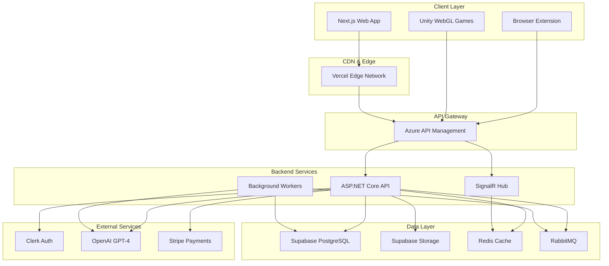
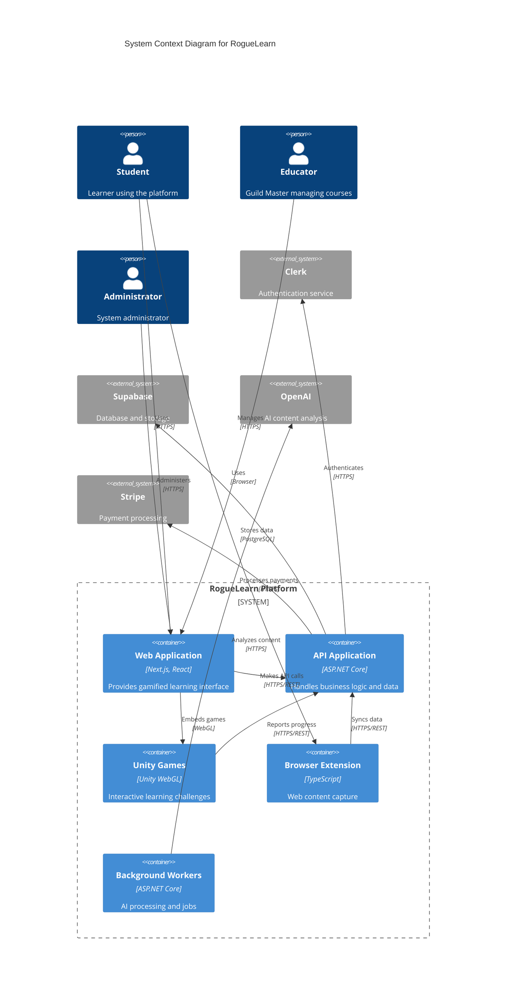
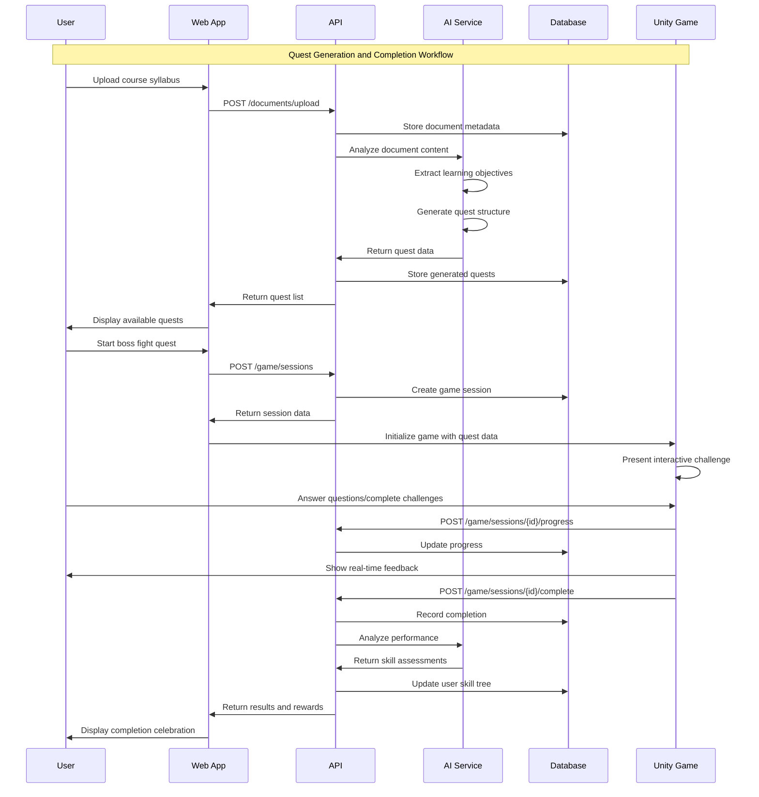
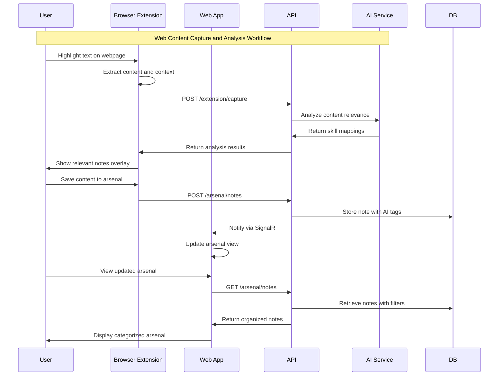

# RogueLearn Fullstack Architecture Document

This document outlines the complete fullstack architecture for RogueLearn, including backend systems, frontend implementation, and their integration. It serves as the single source of truth for AI-driven development, ensuring consistency across the entire technology stack.

This unified approach combines what would traditionally be separate backend and frontend architecture documents, streamlining the development process for modern fullstack applications where these concerns are increasingly intertwined.

## Starter Template or Existing Project

N/A - Greenfield project with specific technology requirements outlined in the PRD technical guidance.

## Change Log

| Date | Version | Description | Author |
|------|---------|-------------|--------|
| 2024-01-13 | 1.0 | Initial architecture document | Winston (Architect AI) |

## High Level Architecture

### Technical Summary

RogueLearn employs a modern fullstack architecture with Next.js frontend and .NET backend, designed to support gamified learning experiences with Unity WebGL integration. The system leverages Supabase for database and storage, Clerk for authentication, and implements a microservices-oriented approach with clear separation between core learning services, social features, and gamification components. The architecture supports real-time collaboration through SignalR, browser extension integration for seamless web capture, and AI-powered content processing for personalized learning paths. This design achieves the PRD goals of creating an engaging, scalable educational platform that transforms traditional learning into an interactive, game-like experience.

### Platform and Infrastructure Choice

**Platform:** Azure Cloud Platform with Vercel for frontend deployment
**Key Services:** 
- Frontend: Vercel (Next.js hosting)
- Backend: Azure App Service (.NET API)
- Database: Supabase (PostgreSQL)
- Authentication: Clerk
- File Storage: Supabase Storage
- Real-time: SignalR on Azure
- Message Queue: RabbitMQ on Azure Container Instances
- AI Services: OpenAI GPT-4 API

**Deployment Host and Regions:** 
- Primary: Azure East US 2
- CDN: Global edge locations via Vercel
- Database: Multi-region with Supabase

### Repository Structure

**Structure:** Monorepo with clear separation of concerns
**Monorepo Tool:** Turborepo for build optimization and caching
**Package Organization:** 
- Apps: Separate packages for web frontend, API backend, Unity projects
- Packages: Shared types, UI components, utilities, configuration
- Tools: Development scripts, deployment configurations

### High Level Architecture Diagram



### Architectural Patterns

- **Clean Architecture:** Separation of concerns with dependency inversion - _Rationale:_ Ensures testability and maintainability across complex learning domain logic
- **CQRS Pattern:** Command Query Responsibility Segregation for complex operations - _Rationale:_ Optimizes read/write operations for different learning analytics and real-time features
- **Event-Driven Architecture:** Asynchronous processing via message queues - _Rationale:_ Enables scalable processing of AI content analysis and social interactions
- **Component-Based UI:** Reusable React components with TypeScript - _Rationale:_ Maintainability and consistency across gamified learning interfaces
- **Repository Pattern:** Abstract data access logic - _Rationale:_ Enables testing and future database migration flexibility
- **API Gateway Pattern:** Single entry point for all API calls - _Rationale:_ Centralized auth, rate limiting, and monitoring for multiple client types

## Tech Stack

### Technology Stack Table

| Category | Technology | Version | Purpose | Rationale |
|----------|------------|---------|---------|----------|
| Frontend Language | TypeScript | 5.3+ | Type-safe frontend development | Strong typing reduces bugs in complex gamification logic |
| Frontend Framework | Next.js | 14+ | React-based fullstack framework | SSR/SSG capabilities, API routes, optimal performance |
| UI Component Library | Tailwind CSS + Headless UI | 3.4+ / 1.7+ | Utility-first styling with accessible components | Rapid UI development with consistent design system |
| State Management | Zustand | 4.4+ | Lightweight state management | Simple API, TypeScript support, minimal boilerplate |
| Backend Language | C# | 12+ | Strongly-typed backend development | Enterprise-grade performance, excellent tooling |
| Backend Framework | ASP.NET Core | 8+ | Cross-platform web API framework | High performance, built-in DI, excellent async support |
| API Style | REST + SignalR | - | RESTful APIs with real-time capabilities | Standard REST for CRUD, SignalR for real-time features |
| Database | PostgreSQL (Supabase) | 15+ | Relational database with real-time features | ACID compliance, JSON support, real-time subscriptions |
| Cache | Redis | 7+ | In-memory caching and session storage | High performance caching, pub/sub capabilities |
| File Storage | Supabase Storage | - | Object storage with CDN | Integrated with database, automatic optimization |
| Authentication | Clerk | - | Authentication and user management | Complete auth solution, social logins, user management |
| Frontend Testing | Jest + React Testing Library | 29+ / 14+ | Unit and integration testing | Industry standard, excellent React support |
| Backend Testing | xUnit + Moq | 2.4+ / 4.20+ | Unit testing framework | .NET standard, excellent mocking capabilities |
| E2E Testing | Playwright | 1.40+ | End-to-end testing | Cross-browser support, reliable test execution |
| Build Tool | Turborepo | 1.11+ | Monorepo build orchestration | Intelligent caching, parallel execution |
| Bundler | Next.js (Webpack) | - | Module bundling and optimization | Integrated with Next.js, automatic optimizations |
| IaC Tool | Azure Bicep | - | Infrastructure as Code | Azure-native, type-safe infrastructure definitions |
| CI/CD | GitHub Actions | - | Continuous integration and deployment | Integrated with GitHub, extensive ecosystem |
| Monitoring | Azure Application Insights | - | Application performance monitoring | Deep .NET integration, comprehensive telemetry |
| Logging | Serilog | 3.1+ | Structured logging | Rich structured logging, multiple sinks |
| CSS Framework | Tailwind CSS | 3.4+ | Utility-first CSS framework | Rapid development, consistent design system |

## Data Models

### User

**Purpose:** Core user entity representing students, educators, and administrators with their profiles and authentication details.

**Key Attributes:**
- id: string (UUID) - Unique identifier from Clerk
- email: string - User's email address
- displayName: string - User's display name
- role: UserRole - User's primary role (Student, PartyLeader, GuildMaster, Admin)
- academicProfile: AcademicProfile - Academic information and preferences
- characterSheet: CharacterSheet - Gamification profile and stats
- createdAt: DateTime - Account creation timestamp
- updatedAt: DateTime - Last profile update

#### TypeScript Interface

```typescript
interface User {
  id: string;
  email: string;
  displayName: string;
  role: UserRole;
  academicProfile: AcademicProfile;
  characterSheet: CharacterSheet;
  createdAt: Date;
  updatedAt: Date;
}

enum UserRole {
  Student = 'student',
  PartyLeader = 'party_leader',
  GuildMaster = 'guild_master',
  Admin = 'admin'
}
```

#### Relationships
- One-to-many with Party (as member or leader)
- One-to-many with Guild (as member or master)
- One-to-many with Quest (completion records)
- One-to-many with Note (arsenal items)

### Quest

**Purpose:** AI-generated learning challenges based on course materials and user progress, forming the core gamified learning experience.

**Key Attributes:**
- id: string (UUID) - Unique quest identifier
- title: string - Quest name/title
- description: string - Quest objectives and context
- difficulty: DifficultyLevel - Quest difficulty rating
- skillNodes: string[] - Associated skill tree nodes
- content: QuestContent - Questions, challenges, and materials
- rewards: QuestRewards - XP, achievements, and unlocks
- status: QuestStatus - Current completion status
- createdBy: string - AI system or Guild Master ID

#### TypeScript Interface

```typescript
interface Quest {
  id: string;
  title: string;
  description: string;
  difficulty: DifficultyLevel;
  skillNodes: string[];
  content: QuestContent;
  rewards: QuestRewards;
  status: QuestStatus;
  createdBy: string;
  createdAt: Date;
}

enum DifficultyLevel {
  Beginner = 1,
  Intermediate = 2,
  Advanced = 3,
  Expert = 4,
  Master = 5
}
```

#### Relationships
- Many-to-one with User (creator)
- Many-to-many with SkillNode
- One-to-many with QuestCompletion
- Many-to-one with Guild (optional)

### Party

**Purpose:** Study groups that enable collaborative learning, shared resources, and group challenges.

**Key Attributes:**
- id: string (UUID) - Unique party identifier
- name: string - Party name
- description: string - Party purpose and goals
- leaderId: string - Party leader user ID
- members: PartyMember[] - Party member list with roles
- sharedStash: Note[] - Shared notes and resources
- meetings: Meeting[] - Scheduled and past meetings
- isPrivate: boolean - Whether party requires invitation
- maxMembers: number - Maximum party size

#### TypeScript Interface

```typescript
interface Party {
  id: string;
  name: string;
  description: string;
  leaderId: string;
  members: PartyMember[];
  sharedStash: Note[];
  meetings: Meeting[];
  isPrivate: boolean;
  maxMembers: number;
  createdAt: Date;
}

interface PartyMember {
  userId: string;
  role: PartyRole;
  joinedAt: Date;
}
```

#### Relationships
- Many-to-one with User (leader)
- Many-to-many with User (members)
- One-to-many with Note (shared stash)
- One-to-many with Meeting

### Guild

**Purpose:** Course-based communities managed by educators, providing structured learning paths and institutional organization.

**Key Attributes:**
- id: string (UUID) - Unique guild identifier
- name: string - Course/guild name
- description: string - Course description and objectives
- masterId: string - Guild Master (educator) ID
- members: GuildMember[] - Enrolled students
- curriculum: SkillTree - Course skill tree structure
- quests: Quest[] - Course-specific quests
- isPublic: boolean - Whether guild is publicly discoverable
- institutionId: string - Associated educational institution

#### TypeScript Interface

```typescript
interface Guild {
  id: string;
  name: string;
  description: string;
  masterId: string;
  members: GuildMember[];
  curriculum: SkillTree;
  quests: Quest[];
  isPublic: boolean;
  institutionId: string;
  createdAt: Date;
}
```

#### Relationships
- Many-to-one with User (guild master)
- Many-to-many with User (members)
- One-to-many with Quest
- One-to-one with SkillTree

### Note (Arsenal Item)

**Purpose:** User-generated and imported study materials, forming the personal knowledge arsenal with AI-enhanced organization.

**Key Attributes:**
- id: string (UUID) - Unique note identifier
- title: string - Note title
- content: string - Note content (markdown)
- tags: string[] - Categorization tags
- skillRelevance: SkillRelevance[] - AI-analyzed skill connections
- source: NoteSource - Origin of the note
- isShared: boolean - Whether note is shared with party
- ownerId: string - Note owner user ID
- partyId: string - Associated party (if shared)

#### TypeScript Interface

```typescript
interface Note {
  id: string;
  title: string;
  content: string;
  tags: string[];
  skillRelevance: SkillRelevance[];
  source: NoteSource;
  isShared: boolean;
  ownerId: string;
  partyId?: string;
  createdAt: Date;
  updatedAt: Date;
}

enum NoteSource {
  Manual = 'manual',
  WebCapture = 'web_capture',
  DocumentUpload = 'document_upload',
  AIGenerated = 'ai_generated'
}
```

#### Relationships
- Many-to-one with User (owner)
- Many-to-one with Party (if shared)
- Many-to-many with SkillNode (relevance)

## API Specification

### REST API Specification

```yaml
openapi: 3.0.0
info:
  title: RogueLearn API
  version: 1.0.0
  description: Gamified learning platform API
servers:
  - url: https://api.roguelearn.com/v1
    description: Production API
  - url: https://staging-api.roguelearn.com/v1
    description: Staging API

paths:
  /auth/profile:
    get:
      summary: Get current user profile
      security:
        - BearerAuth: []
      responses:
        '200':
          description: User profile data
          content:
            application/json:
              schema:
                $ref: '#/components/schemas/User'
    
  /quests:
    get:
      summary: Get available quests for user
      security:
        - BearerAuth: []
      parameters:
        - name: difficulty
          in: query
          schema:
            type: integer
            minimum: 1
            maximum: 5
        - name: skillNode
          in: query
          schema:
            type: string
      responses:
        '200':
          description: List of quests
          content:
            application/json:
              schema:
                type: array
                items:
                  $ref: '#/components/schemas/Quest'
    
    post:
      summary: Create new quest (Guild Masters only)
      security:
        - BearerAuth: []
      requestBody:
        required: true
        content:
          application/json:
            schema:
              $ref: '#/components/schemas/CreateQuestRequest'
      responses:
        '201':
          description: Quest created successfully
          content:
            application/json:
              schema:
                $ref: '#/components/schemas/Quest'
  
  /quests/{questId}/complete:
    post:
      summary: Submit quest completion
      security:
        - BearerAuth: []
      parameters:
        - name: questId
          in: path
          required: true
          schema:
            type: string
      requestBody:
        required: true
        content:
          application/json:
            schema:
              $ref: '#/components/schemas/QuestSubmission'
      responses:
        '200':
          description: Quest completion processed
          content:
            application/json:
              schema:
                $ref: '#/components/schemas/QuestResult'
  
  /parties:
    get:
      summary: Get user's parties
      security:
        - BearerAuth: []
      responses:
        '200':
          description: List of parties
          content:
            application/json:
              schema:
                type: array
                items:
                  $ref: '#/components/schemas/Party'
    
    post:
      summary: Create new party
      security:
        - BearerAuth: []
      requestBody:
        required: true
        content:
          application/json:
            schema:
              $ref: '#/components/schemas/CreatePartyRequest'
      responses:
        '201':
          description: Party created successfully
  
  /parties/{partyId}/invite:
    post:
      summary: Invite user to party
      security:
        - BearerAuth: []
      parameters:
        - name: partyId
          in: path
          required: true
          schema:
            type: string
      requestBody:
        required: true
        content:
          application/json:
            schema:
              type: object
              properties:
                userEmail:
                  type: string
                  format: email
      responses:
        '200':
          description: Invitation sent
  
  /arsenal/notes:
    get:
      summary: Get user's notes
      security:
        - BearerAuth: []
      parameters:
        - name: tags
          in: query
          schema:
            type: array
            items:
              type: string
        - name: skillNode
          in: query
          schema:
            type: string
      responses:
        '200':
          description: List of notes
          content:
            application/json:
              schema:
                type: array
                items:
                  $ref: '#/components/schemas/Note'
    
    post:
      summary: Create new note
      security:
        - BearerAuth: []
      requestBody:
        required: true
        content:
          application/json:
            schema:
              $ref: '#/components/schemas/CreateNoteRequest'
      responses:
        '201':
          description: Note created successfully
  
  /game/sessions:
    post:
      summary: Start Unity game session
      security:
        - BearerAuth: []
      requestBody:
        required: true
        content:
          application/json:
            schema:
              type: object
              properties:
                questId:
                  type: string
                gameType:
                  type: string
                  enum: [boss_fight, knowledge_duel]
      responses:
        '201':
          description: Game session started
          content:
            application/json:
              schema:
                $ref: '#/components/schemas/GameSession'
  
  /ai/analyze-content:
    post:
      summary: Analyze content for skill relevance
      security:
        - BearerAuth: []
      requestBody:
        required: true
        content:
          application/json:
            schema:
              type: object
              properties:
                content:
                  type: string
                contentType:
                  type: string
                  enum: [text, pdf, webpage]
      responses:
        '200':
          description: Content analysis results
          content:
            application/json:
              schema:
                $ref: '#/components/schemas/ContentAnalysis'

components:
  securitySchemes:
    BearerAuth:
      type: http
      scheme: bearer
      bearerFormat: JWT
  
  schemas:
    User:
      type: object
      properties:
        id:
          type: string
        email:
          type: string
        displayName:
          type: string
        role:
          type: string
          enum: [student, party_leader, guild_master, admin]
        academicProfile:
          $ref: '#/components/schemas/AcademicProfile'
        characterSheet:
          $ref: '#/components/schemas/CharacterSheet'
    
    Quest:
      type: object
      properties:
        id:
          type: string
        title:
          type: string
        description:
          type: string
        difficulty:
          type: integer
          minimum: 1
          maximum: 5
        skillNodes:
          type: array
          items:
            type: string
        rewards:
          $ref: '#/components/schemas/QuestRewards'
        status:
          type: string
          enum: [available, in_progress, completed, locked]
    
    Party:
      type: object
      properties:
        id:
          type: string
        name:
          type: string
        description:
          type: string
        leaderId:
          type: string
        memberCount:
          type: integer
        isPrivate:
          type: boolean
    
    Note:
      type: object
      properties:
        id:
          type: string
        title:
          type: string
        content:
          type: string
        tags:
          type: array
          items:
            type: string
        skillRelevance:
          type: array
          items:
            $ref: '#/components/schemas/SkillRelevance'
        source:
          type: string
          enum: [manual, web_capture, document_upload, ai_generated]
```

## Components

### Frontend Application (Next.js)

**Responsibility:** User interface, client-side logic, and Unity WebGL integration for the gamified learning experience.

**Key Interfaces:**
- REST API client for backend communication
- SignalR client for real-time updates
- Unity WebGL bridge for game integration
- Browser extension messaging API

**Dependencies:** Backend API, Clerk authentication, Supabase real-time subscriptions

**Technology Stack:** Next.js 14, TypeScript, Tailwind CSS, Zustand state management, React Query for API caching

### Backend API (ASP.NET Core)

**Responsibility:** Business logic, data persistence, AI integration, and API endpoints for all client applications.

**Key Interfaces:**
- RESTful API endpoints
- SignalR hubs for real-time communication
- Background job processing
- External service integrations (OpenAI, Stripe, Clerk)

**Dependencies:** Supabase database, Redis cache, RabbitMQ message broker, external APIs

**Technology Stack:** ASP.NET Core 8, Entity Framework Core, MediatR for CQRS, Hangfire for background jobs

### Unity Game Engine Integration

**Responsibility:** Interactive 2D boss fight challenges and gamified assessment experiences.

**Key Interfaces:**
- JavaScript-Unity communication bridge
- Game state synchronization with backend
- Progress tracking and results reporting

**Dependencies:** Frontend application, Backend API for game sessions

**Technology Stack:** Unity 2022.3 LTS, WebGL build target, C# scripting

### Browser Extension

**Responsibility:** Web content capture, contextual note access, and seamless integration with university portals.

**Key Interfaces:**
- Content extraction APIs
- Background script for web monitoring
- Popup interface for quick actions
- Content script for page interaction

**Dependencies:** Backend API, Chrome/Firefox extension APIs

**Technology Stack:** TypeScript, Webpack, Chrome Extension Manifest V3

### AI Content Processing Service

**Responsibility:** Analyze uploaded documents, generate quests, and provide personalized learning recommendations.

**Key Interfaces:**
- Document analysis pipeline
- Quest generation algorithms
- Skill mapping and relevance scoring
- Content quality assessment

**Dependencies:** OpenAI GPT-4 API, document storage, skill tree database

**Technology Stack:** ASP.NET Core background services, OpenAI SDK, PDF processing libraries

## Component Diagrams



## External APIs

### OpenAI GPT-4 API

- **Purpose:** Content analysis, quest generation, and personalized learning recommendations
- **Documentation:** https://platform.openai.com/docs/api-reference
- **Base URL(s):** https://api.openai.com/v1
- **Authentication:** Bearer token (API key)
- **Rate Limits:** 10,000 requests per minute (tier dependent)

**Key Endpoints Used:**
- `POST /chat/completions` - Generate quests and analyze content
- `POST /embeddings` - Create content embeddings for similarity matching

**Integration Notes:** Implement retry logic with exponential backoff, token usage monitoring, and fallback to cached responses for common queries.

### Clerk Authentication API

- **Purpose:** User authentication, session management, and user profile data
- **Documentation:** https://clerk.com/docs/reference/backend-api
- **Base URL(s):** https://api.clerk.com/v1
- **Authentication:** Bearer token (secret key)
- **Rate Limits:** 1000 requests per minute

**Key Endpoints Used:**
- `GET /users/{user_id}` - Retrieve user profile information
- `POST /users/{user_id}/metadata` - Update user metadata
- `GET /sessions/{session_id}/verify` - Verify session tokens

**Integration Notes:** Use Clerk SDKs for frontend and backend, implement webhook handlers for user events.

### Stripe Payment API

- **Purpose:** Subscription management, payment processing, and billing
- **Documentation:** https://stripe.com/docs/api
- **Base URL(s):** https://api.stripe.com/v1
- **Authentication:** Bearer token (secret key)
- **Rate Limits:** 100 requests per second

**Key Endpoints Used:**
- `POST /subscriptions` - Create subscription for premium features
- `POST /checkout/sessions` - Create checkout sessions
- `GET /invoices` - Retrieve billing information

**Integration Notes:** Implement webhook handlers for payment events, use Stripe Elements for secure payment forms.

## Core Workflows





## Database Schema

```sql
-- Users table (synced with Clerk)
CREATE TABLE users (
    id UUID PRIMARY KEY,
    clerk_id VARCHAR(255) UNIQUE NOT NULL,
    email VARCHAR(255) UNIQUE NOT NULL,
    display_name VARCHAR(255) NOT NULL,
    role VARCHAR(50) NOT NULL DEFAULT 'student',
    academic_profile JSONB,
    character_sheet JSONB,
    created_at TIMESTAMP WITH TIME ZONE DEFAULT NOW(),
    updated_at TIMESTAMP WITH TIME ZONE DEFAULT NOW()
);

-- Skill trees and nodes
CREATE TABLE skill_trees (
    id UUID PRIMARY KEY,
    name VARCHAR(255) NOT NULL,
    description TEXT,
    owner_id UUID REFERENCES users(id),
    is_template BOOLEAN DEFAULT FALSE,
    created_at TIMESTAMP WITH TIME ZONE DEFAULT NOW()
);

CREATE TABLE skill_nodes (
    id UUID PRIMARY KEY,
    skill_tree_id UUID REFERENCES skill_trees(id) ON DELETE CASCADE,
    name VARCHAR(255) NOT NULL,
    description TEXT,
    prerequisites JSONB DEFAULT '[]',
    position JSONB, -- x, y coordinates for visualization
    metadata JSONB,
    created_at TIMESTAMP WITH TIME ZONE DEFAULT NOW()
);

-- User skill progress
CREATE TABLE user_skill_progress (
    id UUID PRIMARY KEY,
    user_id UUID REFERENCES users(id) ON DELETE CASCADE,
    skill_node_id UUID REFERENCES skill_nodes(id) ON DELETE CASCADE,
    progress_percentage INTEGER DEFAULT 0 CHECK (progress_percentage >= 0 AND progress_percentage <= 100),
    is_unlocked BOOLEAN DEFAULT FALSE,
    is_completed BOOLEAN DEFAULT FALSE,
    last_activity TIMESTAMP WITH TIME ZONE DEFAULT NOW(),
    UNIQUE(user_id, skill_node_id)
);

-- Quests
CREATE TABLE quests (
    id UUID PRIMARY KEY,
    title VARCHAR(255) NOT NULL,
    description TEXT,
    difficulty INTEGER CHECK (difficulty >= 1 AND difficulty <= 5),
    content JSONB NOT NULL, -- questions, challenges, materials
    rewards JSONB, -- XP, achievements, unlocks
    skill_nodes UUID[] DEFAULT '{}',
    created_by UUID REFERENCES users(id),
    guild_id UUID, -- References guilds table
    is_active BOOLEAN DEFAULT TRUE,
    created_at TIMESTAMP WITH TIME ZONE DEFAULT NOW(),
    updated_at TIMESTAMP WITH TIME ZONE DEFAULT NOW()
);

-- Quest completions
CREATE TABLE quest_completions (
    id UUID PRIMARY KEY,
    user_id UUID REFERENCES users(id) ON DELETE CASCADE,
    quest_id UUID REFERENCES quests(id) ON DELETE CASCADE,
    score INTEGER,
    max_score INTEGER,
    completion_data JSONB, -- detailed answers and performance
    completed_at TIMESTAMP WITH TIME ZONE DEFAULT NOW(),
    UNIQUE(user_id, quest_id)
);

-- Parties (study groups)
CREATE TABLE parties (
    id UUID PRIMARY KEY,
    name VARCHAR(255) NOT NULL,
    description TEXT,
    leader_id UUID REFERENCES users(id) ON DELETE CASCADE,
    is_private BOOLEAN DEFAULT FALSE,
    max_members INTEGER DEFAULT 10,
    created_at TIMESTAMP WITH TIME ZONE DEFAULT NOW(),
    updated_at TIMESTAMP WITH TIME ZONE DEFAULT NOW()
);

CREATE TABLE party_members (
    id UUID PRIMARY KEY,
    party_id UUID REFERENCES parties(id) ON DELETE CASCADE,
    user_id UUID REFERENCES users(id) ON DELETE CASCADE,
    role VARCHAR(50) DEFAULT 'member',
    joined_at TIMESTAMP WITH TIME ZONE DEFAULT NOW(),
    UNIQUE(party_id, user_id)
);

-- Guilds (courses)
CREATE TABLE guilds (
    id UUID PRIMARY KEY,
    name VARCHAR(255) NOT NULL,
    description TEXT,
    master_id UUID REFERENCES users(id) ON DELETE CASCADE,
    skill_tree_id UUID REFERENCES skill_trees(id),
    institution_id UUID,
    is_public BOOLEAN DEFAULT TRUE,
    created_at TIMESTAMP WITH TIME ZONE DEFAULT NOW(),
    updated_at TIMESTAMP WITH TIME ZONE DEFAULT NOW()
);

CREATE TABLE guild_members (
    id UUID PRIMARY KEY,
    guild_id UUID REFERENCES guilds(id) ON DELETE CASCADE,
    user_id UUID REFERENCES users(id) ON DELETE CASCADE,
    role VARCHAR(50) DEFAULT 'student',
    joined_at TIMESTAMP WITH TIME ZONE DEFAULT NOW(),
    UNIQUE(guild_id, user_id)
);

-- Notes (Arsenal)
CREATE TABLE notes (
    id UUID PRIMARY KEY,
    title VARCHAR(255) NOT NULL,
    content TEXT NOT NULL,
    tags TEXT[] DEFAULT '{}',
    skill_relevance JSONB DEFAULT '[]',
    source VARCHAR(50) NOT NULL,
    owner_id UUID REFERENCES users(id) ON DELETE CASCADE,
    party_id UUID REFERENCES parties(id) ON DELETE SET NULL,
    is_shared BOOLEAN DEFAULT FALSE,
    created_at TIMESTAMP WITH TIME ZONE DEFAULT NOW(),
    updated_at TIMESTAMP WITH TIME ZONE DEFAULT NOW()
);

-- Game sessions
CREATE TABLE game_sessions (
    id UUID PRIMARY KEY,
    user_id UUID REFERENCES users(id) ON DELETE CASCADE,
    quest_id UUID REFERENCES quests(id) ON DELETE CASCADE,
    game_type VARCHAR(50) NOT NULL,
    session_data JSONB,
    status VARCHAR(50) DEFAULT 'active',
    started_at TIMESTAMP WITH TIME ZONE DEFAULT NOW(),
    completed_at TIMESTAMP WITH TIME ZONE
);

-- Meetings
CREATE TABLE meetings (
    id UUID PRIMARY KEY,
    party_id UUID REFERENCES parties(id) ON DELETE CASCADE,
    title VARCHAR(255) NOT NULL,
    description TEXT,
    scheduled_at TIMESTAMP WITH TIME ZONE NOT NULL,
    duration_minutes INTEGER DEFAULT 60,
    meeting_type VARCHAR(50) DEFAULT 'study_session',
    status VARCHAR(50) DEFAULT 'scheduled',
    created_by UUID REFERENCES users(id),
    created_at TIMESTAMP WITH TIME ZONE DEFAULT NOW()
);

CREATE TABLE meeting_attendees (
    id UUID PRIMARY KEY,
    meeting_id UUID REFERENCES meetings(id) ON DELETE CASCADE,
    user_id UUID REFERENCES users(id) ON DELETE CASCADE,
    response VARCHAR(50) DEFAULT 'pending', -- accepted, declined, tentative
    attended BOOLEAN DEFAULT FALSE,
    UNIQUE(meeting_id, user_id)
);

-- Indexes for performance
CREATE INDEX idx_users_clerk_id ON users(clerk_id);
CREATE INDEX idx_users_email ON users(email);
CREATE INDEX idx_skill_nodes_tree_id ON skill_nodes(skill_tree_id);
CREATE INDEX idx_user_skill_progress_user_id ON user_skill_progress(user_id);
CREATE INDEX idx_quest_completions_user_id ON quest_completions(user_id);
CREATE INDEX idx_quest_completions_quest_id ON quest_completions(quest_id);
CREATE INDEX idx_notes_owner_id ON notes(owner_id);
CREATE INDEX idx_notes_party_id ON notes(party_id);
CREATE INDEX idx_notes_tags ON notes USING GIN(tags);
CREATE INDEX idx_game_sessions_user_id ON game_sessions(user_id);
CREATE INDEX idx_meetings_party_id ON meetings(party_id);
CREATE INDEX idx_meetings_scheduled_at ON meetings(scheduled_at);

-- Full-text search indexes
CREATE INDEX idx_notes_content_fts ON notes USING GIN(to_tsvector('english', content));
CREATE INDEX idx_quests_title_description_fts ON quests USING GIN(to_tsvector('english', title || ' ' || description));
```

## Frontend Architecture

### Technology Stack

- **Framework:** Next.js 14 with App Router
- **Language:** TypeScript for type safety
- **Styling:** Tailwind CSS with custom design system
- **State Management:** Zustand for global state, React Query for server state
- **Authentication:** Clerk React SDK
- **Real-time:** SignalR client for live updates
- **Game Integration:** Unity WebGL runtime
- **Build Tool:** Next.js built-in bundler with Turbopack

### Application Structure

```
src/
├── app/                    # Next.js App Router pages
│   ├── (auth)/            # Authentication routes
│   ├── dashboard/         # Main application dashboard
│   ├── quests/           # Quest management and gameplay
│   ├── arsenal/          # Note management interface
│   ├── parties/          # Study group management
│   ├── guilds/           # Course/guild management
│   └── api/              # API route handlers
├── components/            # Reusable UI components
│   ├── ui/               # Base UI components (buttons, inputs)
│   ├── game/             # Unity integration components
│   ├── forms/            # Form components with validation
│   └── layout/           # Layout and navigation components
├── hooks/                # Custom React hooks
├── lib/                  # Utility functions and configurations
│   ├── api.ts           # API client configuration
│   ├── auth.ts          # Authentication utilities
│   ├── unity.ts         # Unity WebGL integration
│   └── utils.ts         # General utilities
├── stores/               # Zustand state stores
├── types/                # TypeScript type definitions
└── styles/               # Global styles and Tailwind config
```

### Key Frontend Components

**Unity Game Container**
```typescript
interface UnityGameProps {
  questId: string;
  gameConfig: GameConfiguration;
  onGameComplete: (results: GameResults) => void;
}

export function UnityGameContainer({ questId, gameConfig, onGameComplete }: UnityGameProps) {
  const unityContext = useUnityContext({
    loaderUrl: '/unity/Build.loader.js',
    dataUrl: '/unity/Build.data',
    frameworkUrl: '/unity/Build.framework.js',
    codeUrl: '/unity/Build.wasm',
  });

  useEffect(() => {
    if (unityContext.isLoaded) {
      unityContext.sendMessage('GameManager', 'InitializeQuest', JSON.stringify(gameConfig));
    }
  }, [unityContext.isLoaded, gameConfig]);

  return (
    <div className="unity-container">
      <Unity unityContext={unityContext} className="unity-canvas" />
    </div>
  );
}
```

**Real-time Updates Hook**
```typescript
export function useRealtimeUpdates() {
  const [connection, setConnection] = useState<HubConnection | null>(null);
  const { user } = useAuth();

  useEffect(() => {
    if (user) {
      const newConnection = new HubConnectionBuilder()
        .withUrl('/api/hubs/updates', {
          accessTokenFactory: () => user.getToken()
        })
        .build();

      setConnection(newConnection);
      newConnection.start();

      return () => {
        newConnection.stop();
      };
    }
  }, [user]);

  return connection;
}
```

### State Management Strategy

**Global State (Zustand)**
- User preferences and settings
- UI state (modals, sidebars, themes)
- Game session state
- Real-time notification state

**Server State (React Query)**
- API data fetching and caching
- Optimistic updates for user actions
- Background synchronization
- Error handling and retry logic

## Backend Architecture

### Technology Stack

- **Framework:** ASP.NET Core 8
- **Language:** C# 12
- **Database:** Entity Framework Core with PostgreSQL
- **Caching:** Redis for distributed caching
- **Message Queue:** RabbitMQ for background processing
- **Real-time:** SignalR for WebSocket connections
- **Background Jobs:** Hangfire for scheduled tasks
- **API Documentation:** Swagger/OpenAPI

### Application Structure

```
src/
├── RogueLearn.API/              # Web API project
│   ├── Controllers/             # API controllers
│   ├── Hubs/                   # SignalR hubs
│   ├── Middleware/             # Custom middleware
│   └── Program.cs              # Application entry point
├── RogueLearn.Application/      # Application layer
│   ├── Commands/               # CQRS command handlers
│   ├── Queries/                # CQRS query handlers
│   ├── Services/               # Application services
│   └── Interfaces/             # Service contracts
├── RogueLearn.Domain/           # Domain layer
│   ├── Entities/               # Domain entities
│   ├── ValueObjects/           # Value objects
│   ├── Events/                 # Domain events
│   └── Interfaces/             # Repository contracts
├── RogueLearn.Infrastructure/   # Infrastructure layer
│   ├── Data/                   # Entity Framework context
│   ├── Repositories/           # Data access implementations
│   ├── Services/               # External service integrations
│   └── BackgroundJobs/         # Hangfire job implementations
└── RogueLearn.Shared/           # Shared utilities and DTOs
    ├── DTOs/                   # Data transfer objects
    ├── Extensions/             # Extension methods
    └── Constants/              # Application constants
```

### CQRS Implementation

**Command Example - Create Quest**
```csharp
public class CreateQuestCommand : IRequest<QuestDto>
{
    public string Title { get; set; }
    public string Description { get; set; }
    public int Difficulty { get; set; }
    public QuestContent Content { get; set; }
    public Guid CreatedBy { get; set; }
    public Guid? GuildId { get; set; }
}

public class CreateQuestCommandHandler : IRequestHandler<CreateQuestCommand, QuestDto>
{
    private readonly IQuestRepository _questRepository;
    private readonly IAIContentService _aiService;
    private readonly IMapper _mapper;

    public async Task<QuestDto> Handle(CreateQuestCommand request, CancellationToken cancellationToken)
    {
        // Validate quest content with AI
        var validation = await _aiService.ValidateQuestContent(request.Content);
        if (!validation.IsValid)
            throw new ValidationException(validation.Errors);

        var quest = new Quest
        {
            Title = request.Title,
            Description = request.Description,
            Difficulty = request.Difficulty,
            Content = request.Content,
            CreatedBy = request.CreatedBy,
            GuildId = request.GuildId
        };

        await _questRepository.AddAsync(quest);
        return _mapper.Map<QuestDto>(quest);
    }
}
```

**Query Example - Get User Progress**
```csharp
public class GetUserProgressQuery : IRequest<UserProgressDto>
{
    public Guid UserId { get; set; }
    public Guid? SkillTreeId { get; set; }
}

public class GetUserProgressQueryHandler : IRequestHandler<GetUserProgressQuery, UserProgressDto>
{
    private readonly IUserProgressRepository _progressRepository;
    private readonly IMemoryCache _cache;

    public async Task<UserProgressDto> Handle(GetUserProgressQuery request, CancellationToken cancellationToken)
    {
        var cacheKey = $"user_progress_{request.UserId}_{request.SkillTreeId}";
        
        if (_cache.TryGetValue(cacheKey, out UserProgressDto cachedProgress))
            return cachedProgress;

        var progress = await _progressRepository.GetUserProgressAsync(request.UserId, request.SkillTreeId);
        var dto = _mapper.Map<UserProgressDto>(progress);
        
        _cache.Set(cacheKey, dto, TimeSpan.FromMinutes(15));
        return dto;
    }
}
```

### Background Job Processing

**AI Content Analysis Job**
```csharp
[AutomaticRetry(Attempts = 3)]
public class AIContentAnalysisJob
{
    private readonly IAIContentService _aiService;
    private readonly IQuestRepository _questRepository;
    private readonly IHubContext<UpdatesHub> _hubContext;

    public async Task ProcessDocumentAsync(Guid documentId, Guid userId)
    {
        try
        {
            var document = await _documentRepository.GetByIdAsync(documentId);
            var analysis = await _aiService.AnalyzeDocumentAsync(document.Content);
            
            var quests = await _aiService.GenerateQuestsAsync(analysis);
            await _questRepository.AddRangeAsync(quests);
            
            // Notify user via SignalR
            await _hubContext.Clients.User(userId.ToString())
                .SendAsync("QuestsGenerated", new { DocumentId = documentId, QuestCount = quests.Count });
        }
        catch (Exception ex)
        {
            // Log error and potentially retry
            throw new JobExecutionException("Failed to process document", ex);
        }
    }
}
```

## Database Architecture

### Database Design Principles

1. **Normalization:** 3NF with selective denormalization for performance
2. **Indexing Strategy:** Comprehensive indexes for query optimization
3. **Partitioning:** Time-based partitioning for large tables (game_sessions, quest_completions)
4. **Archival:** Automated archival of old data to maintain performance
5. **Backup Strategy:** Daily full backups with point-in-time recovery

### Performance Optimization

**Connection Pooling**
```csharp
services.AddDbContext<RogueLearnContext>(options =>
    options.UseNpgsql(connectionString, npgsqlOptions =>
    {
        npgsqlOptions.EnableRetryOnFailure(3);
        npgsqlOptions.CommandTimeout(30);
    })
    .EnableSensitiveDataLogging(isDevelopment)
    .EnableDetailedErrors(isDevelopment));
```

**Query Optimization**
```csharp
// Efficient quest loading with related data
public async Task<IEnumerable<Quest>> GetActiveQuestsForUserAsync(Guid userId)
{
    return await _context.Quests
        .Include(q => q.SkillNodes)
        .Where(q => q.IsActive && 
               (q.GuildId == null || 
                _context.GuildMembers.Any(gm => gm.UserId == userId && gm.GuildId == q.GuildId)))
        .OrderBy(q => q.Difficulty)
        .ToListAsync();
}
```

### Caching Strategy

**Redis Configuration**
```csharp
services.AddStackExchangeRedisCache(options =>
{
    options.Configuration = configuration.GetConnectionString("Redis");
    options.InstanceName = "RogueLearn";
});

// Distributed caching for frequently accessed data
public async Task<UserProgressDto> GetUserProgressAsync(Guid userId)
{
    var cacheKey = $"user_progress_{userId}";
    var cachedData = await _distributedCache.GetStringAsync(cacheKey);
    
    if (cachedData != null)
        return JsonSerializer.Deserialize<UserProgressDto>(cachedData);
    
    var progress = await _repository.GetUserProgressAsync(userId);
    var serialized = JsonSerializer.Serialize(progress);
    
    await _distributedCache.SetStringAsync(cacheKey, serialized, new DistributedCacheEntryOptions
    {
        AbsoluteExpirationRelativeToNow = TimeSpan.FromMinutes(30)
    });
    
    return progress;
}
```

## Authentication Architecture

### Clerk Integration

**Frontend Authentication**
```typescript
// app/layout.tsx
import { ClerkProvider } from '@clerk/nextjs';

export default function RootLayout({ children }: { children: React.ReactNode }) {
  return (
    <ClerkProvider>
      <html lang="en">
        <body>{children}</body>
      </html>
    </ClerkProvider>
  );
}

// Protected route component
export function ProtectedRoute({ children }: { children: React.ReactNode }) {
  const { isLoaded, isSignedIn } = useAuth();
  
  if (!isLoaded) return <LoadingSpinner />;
  if (!isSignedIn) return <SignInPage />;
  
  return <>{children}</>;
}
```

**Backend Authentication**
```csharp
// Program.cs
builder.Services.AddAuthentication(JwtBearerDefaults.AuthenticationScheme)
    .AddJwtBearer(options =>
    {
        options.Authority = "https://clerk.dev";
        options.Audience = builder.Configuration["Clerk:Audience"];
        options.TokenValidationParameters = new TokenValidationParameters
        {
            ValidateIssuer = true,
            ValidateAudience = true,
            ValidateLifetime = true,
            ValidateIssuerSigningKey = true
        };
    });

// Custom authorization policies
builder.Services.AddAuthorization(options =>
{
    options.AddPolicy("StudentOnly", policy => 
        policy.RequireClaim("role", "student"));
    options.AddPolicy("GuildMasterOnly", policy => 
        policy.RequireClaim("role", "guild_master"));
    options.AddPolicy("AdminOnly", policy => 
        policy.RequireClaim("role", "admin"));
});
```

### User Synchronization

**Clerk Webhook Handler**
```csharp
[ApiController]
[Route("api/webhooks/clerk")]
public class ClerkWebhookController : ControllerBase
{
    private readonly IUserService _userService;
    private readonly IConfiguration _configuration;

    [HttpPost]
    public async Task<IActionResult> HandleWebhook([FromBody] ClerkWebhookEvent webhookEvent)
    {
        // Verify webhook signature
        if (!VerifyWebhookSignature(Request.Headers, webhookEvent))
            return Unauthorized();

        switch (webhookEvent.Type)
        {
            case "user.created":
                await _userService.CreateUserAsync(webhookEvent.Data);
                break;
            case "user.updated":
                await _userService.UpdateUserAsync(webhookEvent.Data);
                break;
            case "user.deleted":
                await _userService.DeleteUserAsync(webhookEvent.Data.Id);
                break;
        }

        return Ok();
     }
 }
 ```

## Deployment Architecture

### Infrastructure Overview

**Production Environment**
- **Cloud Provider:** Azure (primary) with AWS as backup
- **Container Orchestration:** Azure Container Instances (ACI) or Azure Kubernetes Service (AKS)
- **Database:** Azure Database for PostgreSQL (Flexible Server)
- **Caching:** Azure Cache for Redis
- **File Storage:** Azure Blob Storage
- **CDN:** Azure CDN for static assets and Unity builds
- **Load Balancer:** Azure Application Gateway

**Development Environment**
- **Local Development:** Docker Compose for full stack
- **Staging:** Scaled-down version of production infrastructure
- **Testing:** Isolated environments for automated testing

### Container Configuration

**Frontend Dockerfile**
```dockerfile
FROM node:18-alpine AS base
WORKDIR /app
COPY package*.json ./
RUN npm ci --only=production

FROM node:18-alpine AS build
WORKDIR /app
COPY package*.json ./
RUN npm ci
COPY . .
RUN npm run build

FROM node:18-alpine AS runtime
WORKDIR /app
COPY --from=base /app/node_modules ./node_modules
COPY --from=build /app/.next ./.next
COPY --from=build /app/public ./public
COPY --from=build /app/package.json ./package.json

EXPOSE 3000
CMD ["npm", "start"]
```

**Backend Dockerfile**
```dockerfile
FROM mcr.microsoft.com/dotnet/aspnet:8.0 AS base
WORKDIR /app
EXPOSE 80
EXPOSE 443

FROM mcr.microsoft.com/dotnet/sdk:8.0 AS build
WORKDIR /src
COPY ["RogueLearn.API/RogueLearn.API.csproj", "RogueLearn.API/"]
COPY ["RogueLearn.Application/RogueLearn.Application.csproj", "RogueLearn.Application/"]
COPY ["RogueLearn.Domain/RogueLearn.Domain.csproj", "RogueLearn.Domain/"]
COPY ["RogueLearn.Infrastructure/RogueLearn.Infrastructure.csproj", "RogueLearn.Infrastructure/"]
RUN dotnet restore "RogueLearn.API/RogueLearn.API.csproj"
COPY . .
WORKDIR "/src/RogueLearn.API"
RUN dotnet build "RogueLearn.API.csproj" -c Release -o /app/build

FROM build AS publish
RUN dotnet publish "RogueLearn.API.csproj" -c Release -o /app/publish

FROM base AS final
WORKDIR /app
COPY --from=publish /app/publish .
ENTRYPOINT ["dotnet", "RogueLearn.API.dll"]
```

### CI/CD Pipeline

**GitHub Actions Workflow**
```yaml
name: Deploy to Production

on:
  push:
    branches: [main]
  pull_request:
    branches: [main]

jobs:
  test:
    runs-on: ubuntu-latest
    steps:
      - uses: actions/checkout@v3
      - name: Setup .NET
        uses: actions/setup-dotnet@v3
        with:
          dotnet-version: '8.0.x'
      - name: Run tests
        run: |
          dotnet test --configuration Release --logger trx --collect:"XPlat Code Coverage"
      - name: Upload coverage reports
        uses: codecov/codecov-action@v3

  build-and-deploy:
    needs: test
    runs-on: ubuntu-latest
    if: github.ref == 'refs/heads/main'
    steps:
      - uses: actions/checkout@v3
      - name: Login to Azure Container Registry
        uses: azure/docker-login@v1
        with:
          login-server: roguelearn.azurecr.io
          username: ${{ secrets.ACR_USERNAME }}
          password: ${{ secrets.ACR_PASSWORD }}
      
      - name: Build and push backend
        run: |
          docker build -t roguelearn.azurecr.io/backend:${{ github.sha }} -f backend/Dockerfile .
          docker push roguelearn.azurecr.io/backend:${{ github.sha }}
      
      - name: Build and push frontend
        run: |
          docker build -t roguelearn.azurecr.io/frontend:${{ github.sha }} -f frontend/Dockerfile .
          docker push roguelearn.azurecr.io/frontend:${{ github.sha }}
      
      - name: Deploy to Azure Container Instances
        uses: azure/aci-deploy@v1
        with:
          resource-group: rg-roguelearn-prod
          dns-name-label: roguelearn-prod
          image: roguelearn.azurecr.io/backend:${{ github.sha }}
          registry-login-server: roguelearn.azurecr.io
          registry-username: ${{ secrets.ACR_USERNAME }}
          registry-password: ${{ secrets.ACR_PASSWORD }}
          name: roguelearn-backend
          location: 'East US'
```

### Environment Configuration

**Production Configuration**
```json
{
  "ConnectionStrings": {
    "DefaultConnection": "Server=roguelearn-db.postgres.database.azure.com;Database=roguelearn_prod;Port=5432;User Id=roguelearn_admin;Password=${DB_PASSWORD};Ssl Mode=Require;",
    "Redis": "roguelearn-cache.redis.cache.windows.net:6380,password=${REDIS_PASSWORD},ssl=True,abortConnect=False"
  },
  "Clerk": {
    "SecretKey": "${CLERK_SECRET_KEY}",
    "PublishableKey": "${CLERK_PUBLISHABLE_KEY}",
    "Audience": "https://api.roguelearn.com"
  },
  "OpenAI": {
    "ApiKey": "${OPENAI_API_KEY}",
    "Model": "gpt-4",
    "MaxTokens": 4000
  },
  "Stripe": {
    "SecretKey": "${STRIPE_SECRET_KEY}",
    "PublishableKey": "${STRIPE_PUBLISHABLE_KEY}",
    "WebhookSecret": "${STRIPE_WEBHOOK_SECRET}"
  },
  "Logging": {
    "LogLevel": {
      "Default": "Information",
      "Microsoft.AspNetCore": "Warning"
    },
    "ApplicationInsights": {
      "InstrumentationKey": "${APPINSIGHTS_INSTRUMENTATIONKEY}"
    }
  }
}
```

## Security Architecture

### Security Principles

1. **Defense in Depth:** Multiple layers of security controls
2. **Least Privilege:** Minimal access rights for users and services
3. **Zero Trust:** Verify every request regardless of source
4. **Data Protection:** Encryption at rest and in transit
5. **Audit Trail:** Comprehensive logging of security events

### Authentication & Authorization

**JWT Token Validation**
```csharp
public class JwtSecurityMiddleware
{
    private readonly RequestDelegate _next;
    private readonly ILogger<JwtSecurityMiddleware> _logger;

    public async Task InvokeAsync(HttpContext context)
    {
        var token = ExtractTokenFromHeader(context.Request.Headers);
        
        if (!string.IsNullOrEmpty(token))
        {
            try
            {
                var claimsPrincipal = ValidateToken(token);
                context.User = claimsPrincipal;
                
                // Log successful authentication
                _logger.LogInformation("User {UserId} authenticated successfully", 
                    claimsPrincipal.FindFirst("sub")?.Value);
            }
            catch (SecurityTokenException ex)
            {
                _logger.LogWarning("Invalid token: {Error}", ex.Message);
                context.Response.StatusCode = 401;
                return;
            }
        }

        await _next(context);
    }
}
```

**Role-Based Access Control**
```csharp
[Authorize(Policy = "GuildMasterOnly")]
[HttpPost("guilds/{guildId}/quests")]
public async Task<IActionResult> CreateQuest(Guid guildId, CreateQuestRequest request)
{
    // Verify user is guild master of this specific guild
    var userId = User.FindFirst("sub")?.Value;
    var isGuildMaster = await _guildService.IsUserGuildMasterAsync(userId, guildId);
    
    if (!isGuildMaster)
    {
        _logger.LogWarning("User {UserId} attempted unauthorized quest creation for guild {GuildId}", 
            userId, guildId);
        return Forbid();
    }

    var quest = await _questService.CreateQuestAsync(request);
    return Ok(quest);
}
```

### Data Protection

**Encryption Configuration**
```csharp
// Data protection for sensitive data
services.AddDataProtection()
    .PersistKeysToAzureBlobStorage(connectionString, containerName, blobName)
    .ProtectKeysWithAzureKeyVault(keyVaultUri, credential)
    .SetApplicationName("RogueLearn");

// Database encryption
services.AddDbContext<RogueLearnContext>(options =>
    options.UseNpgsql(connectionString, npgsqlOptions =>
    {
        npgsqlOptions.EnableSensitiveDataLogging(false); // Never log sensitive data in production
    }));
```

**Input Validation & Sanitization**
```csharp
public class CreateQuestRequest
{
    [Required]
    [StringLength(255, MinimumLength = 3)]
    [RegularExpression(@"^[a-zA-Z0-9\s\-_.,!?]+$", ErrorMessage = "Invalid characters in title")]
    public string Title { get; set; }

    [Required]
    [StringLength(2000, MinimumLength = 10)]
    public string Description { get; set; }

    [Range(1, 5)]
    public int Difficulty { get; set; }

    [Required]
    public QuestContent Content { get; set; }
}

// Custom validation attribute for quest content
public class ValidQuestContentAttribute : ValidationAttribute
{
    public override bool IsValid(object value)
    {
        if (value is QuestContent content)
        {
            // Validate content structure and sanitize inputs
            return ValidateQuestStructure(content) && SanitizeContent(content);
        }
        return false;
    }
}
```

### Security Headers & CORS

```csharp
// Security headers middleware
app.Use(async (context, next) =>
{
    context.Response.Headers.Add("X-Content-Type-Options", "nosniff");
    context.Response.Headers.Add("X-Frame-Options", "DENY");
    context.Response.Headers.Add("X-XSS-Protection", "1; mode=block");
    context.Response.Headers.Add("Referrer-Policy", "strict-origin-when-cross-origin");
    context.Response.Headers.Add("Content-Security-Policy", 
        "default-src 'self'; script-src 'self' 'unsafe-inline' https://clerk.dev; style-src 'self' 'unsafe-inline'; img-src 'self' data: https:; connect-src 'self' https://api.openai.com https://clerk.dev;");
    
    await next();
});

// CORS configuration
services.AddCors(options =>
{
    options.AddPolicy("AllowedOrigins", builder =>
    {
        builder.WithOrigins("https://roguelearn.com", "https://www.roguelearn.com")
               .AllowAnyMethod()
               .AllowAnyHeader()
               .AllowCredentials();
    });
});
```

## Performance & Scalability

### Performance Optimization Strategies

1. **Database Optimization**
   - Query optimization with proper indexing
   - Connection pooling and prepared statements
   - Read replicas for query distribution
   - Database partitioning for large tables

2. **Caching Strategy**
   - Redis for distributed caching
   - Application-level caching for frequently accessed data
   - CDN for static assets and Unity builds
   - Browser caching with appropriate cache headers

3. **API Performance**
   - Response compression (Gzip/Brotli)
   - Pagination for large result sets
   - Async/await patterns throughout
   - Background job processing for heavy operations

**Performance Monitoring**
```csharp
// Custom performance monitoring middleware
public class PerformanceMonitoringMiddleware
{
    private readonly RequestDelegate _next;
    private readonly ILogger<PerformanceMonitoringMiddleware> _logger;
    private readonly DiagnosticSource _diagnosticSource;

    public async Task InvokeAsync(HttpContext context)
    {
        var stopwatch = Stopwatch.StartNew();
        var requestId = Guid.NewGuid().ToString();
        
        context.Items["RequestId"] = requestId;
        
        try
        {
            await _next(context);
        }
        finally
        {
            stopwatch.Stop();
            var elapsed = stopwatch.ElapsedMilliseconds;
            
            if (elapsed > 1000) // Log slow requests
            {
                _logger.LogWarning("Slow request detected: {RequestId} {Method} {Path} took {ElapsedMs}ms",
                    requestId, context.Request.Method, context.Request.Path, elapsed);
            }
            
            // Send metrics to Application Insights
            _diagnosticSource.Write("RequestPerformance", new
            {
                RequestId = requestId,
                Method = context.Request.Method,
                Path = context.Request.Path.Value,
                StatusCode = context.Response.StatusCode,
                ElapsedMilliseconds = elapsed
            });
        }
    }
}
```

### Scalability Architecture

**Horizontal Scaling**
- Stateless application design
- Load balancing across multiple instances
- Database read replicas
- Microservices architecture for future expansion

**Auto-scaling Configuration**
```yaml
# Azure Container Instances scaling
apiVersion: 2021-03-01
kind: containerGroup
properties:
  containers:
    - name: roguelearn-api
      properties:
        image: roguelearn.azurecr.io/backend:latest
        resources:
          requests:
            cpu: 1
            memoryInGb: 2
          limits:
            cpu: 2
            memoryInGb: 4
  restartPolicy: Always
  osType: Linux
  scaling:
    minReplicas: 2
    maxReplicas: 10
    rules:
      - name: cpu-scaling
        type: cpu
        metadata:
          type: Utilization
          value: "70"
      - name: memory-scaling
        type: memory
        metadata:
          type: Utilization
          value: "80"
```

## Testing Strategy

### Testing Pyramid

1. **Unit Tests (70%)**
   - Domain logic testing
   - Service layer testing
   - Utility function testing
   - Mock external dependencies

2. **Integration Tests (20%)**
   - API endpoint testing
   - Database integration testing
   - External service integration testing
   - SignalR hub testing

3. **End-to-End Tests (10%)**
   - Critical user journey testing
   - Cross-browser compatibility
   - Performance testing
   - Security testing

### Test Implementation Examples

**Unit Test Example**
```csharp
[TestFixture]
public class QuestServiceTests
{
    private Mock<IQuestRepository> _questRepositoryMock;
    private Mock<IAIContentService> _aiServiceMock;
    private QuestService _questService;

    [SetUp]
    public void Setup()
    {
        _questRepositoryMock = new Mock<IQuestRepository>();
        _aiServiceMock = new Mock<IAIContentService>();
        _questService = new QuestService(_questRepositoryMock.Object, _aiServiceMock.Object);
    }

    [Test]
    public async Task CreateQuest_ValidInput_ReturnsQuestDto()
    {
        // Arrange
        var command = new CreateQuestCommand
        {
            Title = "Test Quest",
            Description = "Test Description",
            Difficulty = 3,
            Content = new QuestContent { /* test data */ },
            CreatedBy = Guid.NewGuid()
        };

        _aiServiceMock.Setup(x => x.ValidateQuestContent(It.IsAny<QuestContent>()))
                     .ReturnsAsync(new ValidationResult { IsValid = true });
        
        _questRepositoryMock.Setup(x => x.AddAsync(It.IsAny<Quest>()))
                           .Returns(Task.CompletedTask);

        // Act
        var result = await _questService.CreateQuestAsync(command);

        // Assert
        Assert.That(result, Is.Not.Null);
        Assert.That(result.Title, Is.EqualTo(command.Title));
        _questRepositoryMock.Verify(x => x.AddAsync(It.IsAny<Quest>()), Times.Once);
    }
}
```

**Integration Test Example**
```csharp
[TestFixture]
public class QuestControllerIntegrationTests : IntegrationTestBase
{
    [Test]
    public async Task CreateQuest_AuthenticatedUser_ReturnsCreatedQuest()
    {
        // Arrange
        var client = CreateAuthenticatedClient("guild_master");
        var request = new CreateQuestRequest
        {
            Title = "Integration Test Quest",
            Description = "Test quest for integration testing",
            Difficulty = 2,
            Content = CreateValidQuestContent()
        };

        // Act
        var response = await client.PostAsJsonAsync("/api/quests", request);

        // Assert
        Assert.That(response.StatusCode, Is.EqualTo(HttpStatusCode.Created));
        var quest = await response.Content.ReadFromJsonAsync<QuestDto>();
        Assert.That(quest.Title, Is.EqualTo(request.Title));
        
        // Verify quest was saved to database
        var savedQuest = await DbContext.Quests.FirstOrDefaultAsync(q => q.Id == quest.Id);
        Assert.That(savedQuest, Is.Not.Null);
    }
}
```

## Monitoring & Observability

### Application Monitoring

**Azure Application Insights Integration**
```csharp
// Program.cs
builder.Services.AddApplicationInsightsTelemetry(options =>
{
    options.ConnectionString = builder.Configuration.GetConnectionString("ApplicationInsights");
    options.EnableAdaptiveSampling = true;
    options.EnableQuickPulseMetricStream = true;
});

// Custom telemetry
public class CustomTelemetryService
{
    private readonly TelemetryClient _telemetryClient;

    public void TrackQuestCompletion(Guid userId, Guid questId, int score, TimeSpan duration)
    {
        _telemetryClient.TrackEvent("QuestCompleted", new Dictionary<string, string>
        {
            ["UserId"] = userId.ToString(),
            ["QuestId"] = questId.ToString(),
            ["Score"] = score.ToString(),
            ["Duration"] = duration.TotalSeconds.ToString()
        });
    }

    public void TrackAIProcessingTime(string operation, TimeSpan duration, bool success)
    {
        _telemetryClient.TrackDependency("OpenAI", operation, DateTime.UtcNow.Subtract(duration), duration, success);
    }
}
```

### Health Checks

```csharp
// Health check configuration
services.AddHealthChecks()
    .AddNpgSql(connectionString, name: "database")
    .AddRedis(redisConnectionString, name: "redis")
    .AddUrlGroup(new Uri("https://api.openai.com/v1/models"), name: "openai")
    .AddCheck<ClerkHealthCheck>("clerk")
    .AddCheck<UnityBuildHealthCheck>("unity-builds");

// Custom health check
public class ClerkHealthCheck : IHealthCheck
{
    private readonly HttpClient _httpClient;
    private readonly IConfiguration _configuration;

    public async Task<HealthCheckResult> CheckHealthAsync(HealthCheckContext context, CancellationToken cancellationToken = default)
    {
        try
        {
            var response = await _httpClient.GetAsync("https://api.clerk.com/v1/health", cancellationToken);
            return response.IsSuccessStatusCode 
                ? HealthCheckResult.Healthy("Clerk API is responsive")
                : HealthCheckResult.Unhealthy("Clerk API is not responding");
        }
        catch (Exception ex)
        {
            return HealthCheckResult.Unhealthy("Clerk API check failed", ex);
        }
    }
}
```

### Logging Strategy

```csharp
// Structured logging configuration
builder.Host.UseSerilog((context, configuration) =>
    configuration
        .ReadFrom.Configuration(context.Configuration)
        .Enrich.FromLogContext()
        .Enrich.WithProperty("ApplicationName", "RogueLearn")
        .WriteTo.Console()
        .WriteTo.ApplicationInsights(TelemetryConfiguration.CreateDefault(), TelemetryConverter.Traces)
        .WriteTo.File("logs/roguelearn-.txt", rollingInterval: RollingInterval.Day));

// Usage in services
public class QuestService
{
    private readonly ILogger<QuestService> _logger;

    public async Task<QuestDto> CreateQuestAsync(CreateQuestCommand command)
    {
        using var scope = _logger.BeginScope(new Dictionary<string, object>
        {
            ["UserId"] = command.CreatedBy,
            ["QuestTitle"] = command.Title,
            ["Operation"] = "CreateQuest"
        });

        _logger.LogInformation("Starting quest creation for user {UserId}", command.CreatedBy);
        
        try
        {
            var quest = await ProcessQuestCreation(command);
            _logger.LogInformation("Quest {QuestId} created successfully", quest.Id);
            return quest;
        }
        catch (Exception ex)
        {
            _logger.LogError(ex, "Failed to create quest for user {UserId}", command.CreatedBy);
            throw;
        }
    }
}
```

---

## Implementation Checklist

### Phase 1: Core Infrastructure (Weeks 1-2)
- [ ] Set up development environment with Docker Compose
- [ ] Configure Supabase database with initial schema
- [ ] Implement basic ASP.NET Core API structure
- [ ] Set up Next.js frontend with Clerk authentication
- [ ] Configure CI/CD pipeline with GitHub Actions
- [ ] Implement basic health checks and monitoring

### Phase 2: Core Features (Weeks 3-6)
- [ ] Implement user management and profile system
- [ ] Build skill tree visualization and management
- [ ] Create quest system with CRUD operations
- [ ] Develop Unity WebGL integration
- [ ] Implement party (study group) functionality
- [ ] Build note-taking and arsenal features

### Phase 3: Advanced Features (Weeks 7-10)
- [ ] Integrate OpenAI for content analysis and quest generation
- [ ] Develop browser extension for web content capture
- [ ] Implement real-time features with SignalR
- [ ] Build guild (course) management system
- [ ] Add gamification elements and progress tracking
- [ ] Implement meeting scheduling and management

### Phase 4: Polish & Production (Weeks 11-12)
- [ ] Performance optimization and load testing
- [ ] Security audit and penetration testing
- [ ] Complete end-to-end testing suite
- [ ] Production deployment and monitoring setup
- [ ] User acceptance testing and feedback integration
- [ ] Documentation and training materials

### Success Metrics
- [ ] System handles 1000+ concurrent users
- [ ] API response times < 200ms for 95% of requests
- [ ] 99.9% uptime in production
- [ ] Zero critical security vulnerabilities
- [ ] Complete test coverage > 80%
- [ ] All user acceptance criteria met

---

*This technical architecture document serves as the comprehensive blueprint for the RogueLearn platform development. It should be reviewed and updated regularly as the project evolves and new requirements emerge.*