# **Detailed Use Cases**

This document provides comprehensive use case specifications for the RogueLearn platform, covering all major user interactions and system functionalities. Each use case includes detailed scenarios, requirement mappings, and visual flowcharts to support development, testing, and stakeholder communication.

---

## UC-001: User Registration and Curriculum-Career Onboarding

| **Field** | **Details** |
|-----------|-------------|
| **Use Case Name** | User Registration and Route/Class Character Creation |
| **Description** | New users create accounts and complete the curriculum-first character creation process to establish their academic-career gaming profile with Route (curriculum) and Class (career specialization) integration |
| **Actor(s)** | Primary: **New Player** Secondary: AI System, Supabase Authentication, Roadmap.sh Integration |
| **Preconditions** | User has access to the platform and curriculum information |
| **Postconditions (Success Guarantee)** | User account created with curriculum-based character profile, gap analysis completed, and integrated skill tree with career enhancement |
| **Related Requirements** | **FRs:** FR1 (Route-Class Creation), FR2 (Curriculum Processing), FR4 (Gap Analysis), FR4A (Roadmap.sh Integration), FR10 (Character Dashboard) **NFRs:** NFR2 (Supabase Auth), NFR13 (Security), NFR14 (Data Privacy) |
| **Main Success Scenario** | 1. User navigates to registration page 2. System presents curriculum-first character creation flow 3. User selects Route (academic curriculum) from available programs 4. User chooses Class (career specialization) from roadmap.sh options 5. System performs gap analysis between curriculum and career requirements 6. AI generates curriculum-based quest lines with roadmap.sh supplements 7. User optionally uploads academic documents for skill tree enhancement 8. System creates account via Supabase Authentication 9. User accesses personalized dashboard with Route/Class integration |
| **Alternative Flows** | **A1:** Social login - User authenticates via Google/GitHub **A2:** Skip document upload - System uses curriculum and roadmap.sh data only **A3:** Gap analysis review - User reviews and approves curriculum-career integration plan |
| **Exception Flows** | **E1:** Authentication failure - System provides alternative registration methods **E2:** Gap analysis error - System uses default roadmap.sh integration **E3:** Network interruption - System saves Route/Class selection and allows resumption |

### **Main Success Scenario Flowchart**

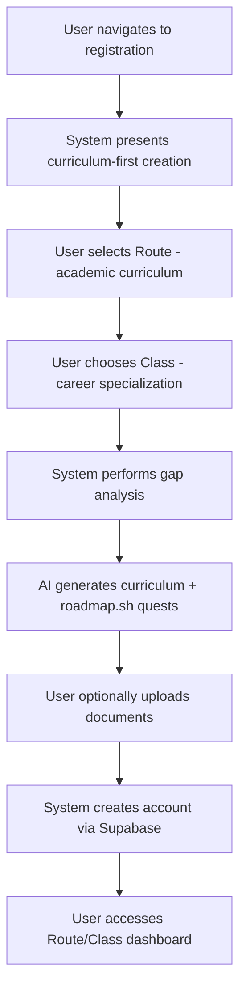

---

## UC-002: Academic Document Enhancement and Skill Tree Integration

| **Field** | **Details** |
|-----------|-------------|
| **Use Case Name** | Academic Document Upload for Skill Tree Enhancement |
| **Description** | Students optionally upload academic documents to enhance their curriculum-based skill tree visualization and arsenal management, not for quest generation |
| **Actor(s)** | Primary: **Player** Secondary: AI Processing System |
| **Preconditions** | User has completed Route/Class setup and has academic documents available |
| **Postconditions (Success Guarantee)** | Document processed and integrated to enhance skill tree visualization and arsenal organization |
| **Related Requirements** | **FRs:** FR2 (Document Enhancement), FR8 (Skill Tree Enhancement), FR16 (Arsenal Management) **NFRs:** NFR6 (Supabase Storage), NFR9 (Performance), NFR20 (Content Management) |
| **Main Success Scenario** | 1. Player selects "Enhance Skill Tree" from dashboard 2. Player uploads academic document (PDF, DOCX, TXT) for skill tree enhancement 3. System validates file format, size, and academic content relevance 4. AI analyzes document to identify skill connections and knowledge areas 5. Player monitors processing progress via real-time updates 6. AI enhances existing curriculum-based skill tree with document insights 7. System improves skill tree visualization with document-derived connections 8. Document content is organized in Arsenal for enhanced knowledge management 9. Skill tree displays enhanced visualization with academic document integration |
| **Alternative Flows** | **A1:** Multiple document enhancement - System processes documents to improve skill tree comprehensively **A2:** Document categorization - System organizes documents by curriculum topics and career areas **A3:** Skill connection mapping - AI identifies and visualizes connections between document content and curriculum skills |
| **Exception Flows** | **E1:** Irrelevant document content - System provides feedback on document relevance to curriculum **E2:** Enhancement processing fails - System maintains original curriculum-based skill tree **E3:** Document too large - System suggests content extraction for skill tree enhancement |

### **Main Success Scenario Flowchart**

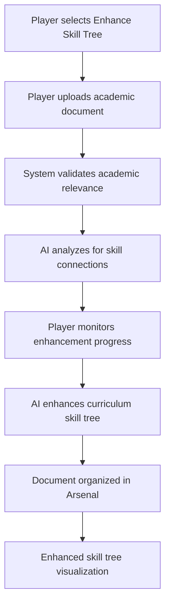

---

## UC-003: Curriculum-Based Skill Tree Visualization and Career Navigation

| **Field** | **Details** |
|-----------|-------------|
| **Use Case Name** | Curriculum-Career Skill Tree Visualization and Navigation |
| **Description** | Students interact with their curriculum-based skill tree enhanced with career specialization to track academic progress and navigate Route/Class learning pathways |
| **Actor(s)** | Primary: **Player** Secondary: System, Gap Analysis Engine |
| **Preconditions** | User has completed Route/Class setup and has curriculum-based skill tree data |
| **Postconditions (Success Guarantee)** | User successfully navigates curriculum-career integrated skill tree and understands academic-career progression |
| **Related Requirements** | **FRs:** FR8 (Curriculum Skill Tree), FR4A (Career Integration), FR10 (Route/Class Dashboard) **NFRs:** NFR1 (Responsiveness), NFR5 (Next.js Frontend) |
| **Main Success Scenario** | 1. User accesses skill tree from Route/Class dashboard 2. System displays curriculum-based skill tree with career enhancement visualization 3. User explores curriculum branches and career specialization pathways 4. System shows academic progress, completed curriculum skills, and career development areas 5. User selects specific skills to view curriculum requirements and career relevance 6. System displays skill prerequisites, learning resources, and related curriculum/career quests 7. User identifies next academic objectives and career enhancement opportunities from gap analysis |
| **Alternative Flows** | **A1:** Filter by Route/Class - User focuses on curriculum requirements vs. career specialization **A2:** Gap analysis view - User explores curriculum-career gaps and roadmap.sh supplements **A3:** Progress comparison - User compares academic progress with career readiness metrics |
| **Exception Flows** | **E1:** Skill tree loading error - System provides cached curriculum version with sync notification **E2:** Large curriculum tree performance - System implements progressive loading by academic year/semester |

### **Main Success Scenario Flowchart**

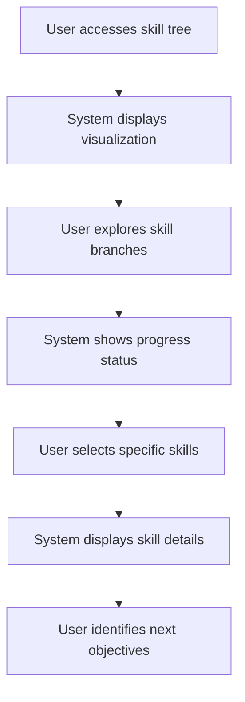

---

## UC-004: AI-Powered Curriculum Quest Generation and Career Enhancement

| **Field** | **Details** |
|-----------|-------------|
| **Use Case Name** | AI-Powered Curriculum Quest Generation and Career Enhancement |
| **Description** | System uses AI to analyze selected curriculum (Route) and career specialization (Class) to generate personalized learning quests with gap analysis and roadmap.sh integration for comprehensive academic and career development |
| **Actor(s)** | Primary: AI Quest Engine Secondary: **Player**, System, Roadmap.sh API |
| **Preconditions** | User has completed curriculum-career onboarding with Route/Class selection |
| **Postconditions (Success Guarantee)** | Curriculum-based quests generated with career enhancement integration, gap analysis completed, and progress tracking enabled for both academic and career tracks |
| **Related Requirements** | **FRs:** FR9 (Quest Generation), FR11 (Quest Completion), FR20 (Quest Modification), FR4 (Gap Analysis), FR4A (Roadmap.sh Integration) **NFRs:** NFR8 (Golang Backend), NFR9 (Performance) |
| **Main Success Scenario** | 1. AI analyzes selected Route (curriculum) and Class (career specialization) 2. System performs gap analysis between curriculum requirements and career goals 3. AI integrates roadmap.sh data for career-specific skill requirements 4. System generates curriculum-based primary quests aligned with academic objectives 5. AI creates career enhancement quests based on gap analysis and roadmap.sh 6. System presents integrated quest sequences in dashboard with clear academic/career distinctions 7. User engages with curriculum and career quests 8. AI evaluates responses and provides feedback for both tracks 9. System updates progress for academic curriculum and career specialization 10. AI adapts future quests based on performance in both domains |
| **Alternative Flows** | **A1:** Curriculum-only focus - User temporarily disables career enhancement quests **A2:** Career-priority mode - System emphasizes gap-filling and roadmap.sh quests **A3:** Document-enhanced quests - Optional academic documents provide additional context for quest generation |
| **Exception Flows** | **E1:** Roadmap.sh API failure - System uses cached career data and continues with curriculum quests **E2:** Gap analysis incomplete - System generates basic curriculum quests while processing continues **E3:** Quest completion error - System saves progress separately for academic and career tracks |

### **Main Success Scenario Flowchart**

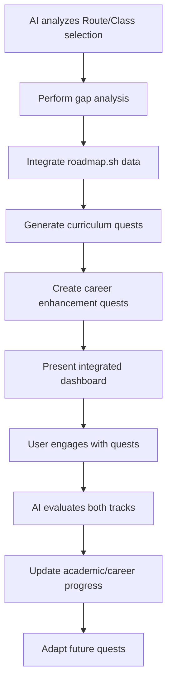

---

## UC-005: Curriculum-Based Party Creation and Career Collaboration

| **Field** | **Details** |
|-----------|-------------|
| **Use Case Name** | Curriculum-Based Party Creation and Career Collaboration |
| **Description** | Students form learning parties based on shared curriculum (Route) and complementary career specializations (Class) for collaborative academic and career development |
| **Actor(s)** | Primary: **Player** (Party Leader) Secondary: **Players** (Party Members), Party Management System |
| **Preconditions** | User has completed curriculum-career onboarding and has active quest progression |
| **Postconditions (Success Guarantee)** | Learning party created with curriculum alignment, career diversity, shared resources, and collaborative progress tracking |
| **Related Requirements** | **FRs:** FR12 (Party Creation), FR13 (Party Stash), FR14 (Meeting Management), FR15 (Collaborative Learning) **NFRs:** NFR11 (Real-time Updates), NFR12 (Social Features) |
| **Main Success Scenario** | 1. Player accesses party creation interface from curriculum dashboard 2. System suggests potential party members based on Route compatibility and Class diversity 3. User sets party parameters (curriculum focus, career goals, collaboration preferences) 4. System sends invitations to selected players with curriculum/career alignment details 5. Invited players review party goals and curriculum-career fit 6. System creates party with shared curriculum quests and career enhancement activities 7. Party establishes shared Party Stash for curriculum resources and career development materials 8. System enables collaborative features for both academic and career progression tracking |
| **Alternative Flows** | **A1:** Cross-curriculum parties - Players from different Routes collaborate on interdisciplinary projects **A2:** Career-focused parties - Emphasis on Class-based skill development and industry preparation **A3:** Study group conversion - Existing study groups upgrade to full party status with gamification |
| **Exception Flows** | **E1:** No compatible members - System suggests broader search criteria or solo progression options **E2:** Party size limits - System manages waiting lists and suggests alternative parties **E3:** Curriculum conflicts - System provides mediation tools for different academic schedules |

### **Main Success Scenario Flowchart**

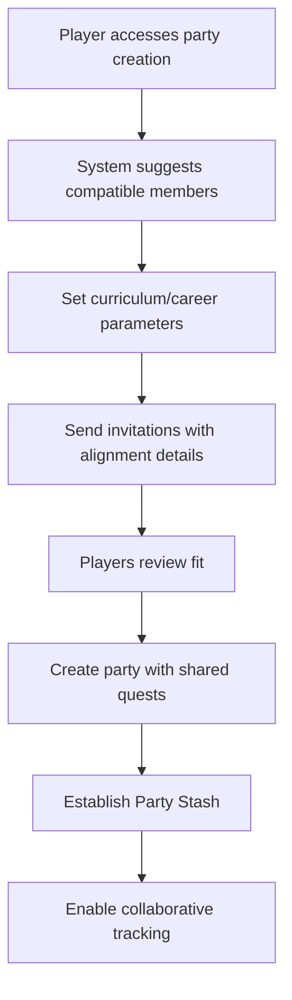

---

## UC-006: Meeting Scheduling and Management

| **Field** | **Details** |
|-----------|-------------|
| **Use Case Name** | Enhanced Meeting Scheduling and Management |
| **Description** | Party Leaders schedule, conduct, and manage study meetings with AI-powered content capture and summary generation |
| **Actor(s)** | Primary: **Party Leader** Secondary: **Party Members**, AI Processing System |
| **Preconditions** | User is Party Leader with active party members |
| **Postconditions (Success Guarantee)** | Meeting scheduled, conducted, and comprehensive summary generated with actionable insights |
| **Related Requirements** | **FRs:** FR14 (Meeting Management), FR15 (Meeting Recording) **NFRs:** NFR17 (Real-time Communication), NFR11 (Real-time Updates) |
| **Main Success Scenario** | 1. Party Leader accesses meeting scheduling interface 2. User sets meeting details (title, description, type, participants) 3. System sends invitations and manages RSVPs 4. Party Leader conducts meeting with content capture options 5. System records meeting content via multiple methods (manual, audio, browser extension) 6. AI processes captured content and generates comprehensive summary 7. System provides structured summary options (executive summary, action items, key points) 8. Party Leader shares results with party members |
| **Alternative Flows** | **A1:** Recurring meetings - System schedules series with templates **A2:** External participant invites - System manages non-party member access **A3:** Meeting recording - System provides playback and transcript features |
| **Exception Flows** | **E1:** Audio processing failure - System falls back to manual summary tools **E2:** Network interruption - System saves partial content with recovery options **E3:** AI summary error - System provides manual editing tools |

### **Main Success Scenario Flowchart**

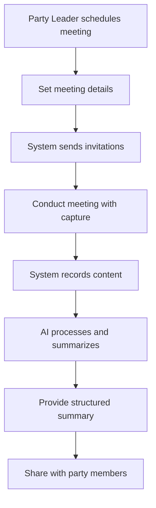

---

## UC-007: Browser Extension Integration

| **Field** | **Details** |
|-----------|-------------|
| **Use Case Name** | Browser Extension Content Extraction |
| **Description** | Students use browser extension to extract and organize academic content from web pages into their Arsenal knowledge base |
| **Actor(s)** | Primary: **Player** Secondary: Browser Extension, System |
| **Preconditions** | User has browser extension installed and is authenticated |
| **Postconditions (Success Guarantee)** | Web content extracted, organized in Arsenal, and available for contextual assistance |
| **Related Requirements** | **FRs:** FR22 (Browser Extension), FR23 (Content Organization), FR24 (Contextual Notes) **NFRs:** NFR19 (Integration Capabilities), NFR20 (Content Management) |
| **Main Success Scenario** | 1. User browses academic content on university portals or educational websites 2. Extension automatically scans page for relevant academic information 3. User highlights specific text or content sections 4. Extension extracts highlighted content and metadata 5. System automatically organizes content in user's Arsenal by category 6. Extension displays relevant existing notes based on highlighted keywords 7. User saves content with tags and links to existing knowledge base |
| **Alternative Flows** | **A1:** Bulk content extraction - Extension processes entire page or document **A2:** Manual categorization - User overrides automatic organization **A3:** Offline extraction - Extension queues content for later synchronization |
| **Exception Flows** | **E1:** Content blocked - Extension provides manual text input option **E2:** Sync failure - Extension stores locally with retry mechanism **E3:** Duplicate content - System merges with existing Arsenal entries |

### **Main Success Scenario Flowchart**

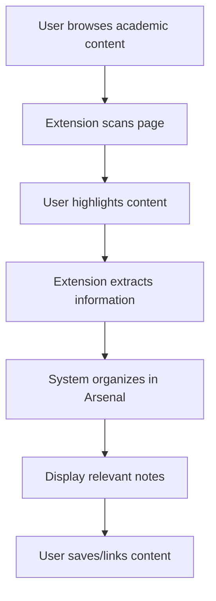

---

## UC-008: Guild Management System

| **Field** | **Details** |
|-----------|-------------|
| **Use Case Name** | Guild Management and Educational Content Delivery |
| **Description** | Guild Masters manage educational guilds with member oversight, content sharing, and progress monitoring capabilities |
| **Actor(s)** | Primary: **Guild Master** Secondary: **Players** (Guild Members), **Verified Lecturers** |
| **Preconditions** | User has guild creation privileges or verified lecturer status |
| **Postconditions (Success Guarantee)** | Guild created with active member management, content sharing, and educational oversight |
| **Related Requirements** | **FRs:** FR35 (Guild Creation), FR36 (Verified Lecturer Process), FR37 (Guild Materials), FR38 (Guild Dashboard) **NFRs:** NFR15 (Microservices), NFR13 (Security) |
| **Main Success Scenario** | 1. User creates guild through standard process or verified lecturer streamlined flow 2. Guild Master configures guild settings, rules, and member permissions 3. System provides member invitation and management tools 4. Guild Master uploads reference materials and educational resources 5. System enables content sharing with guild members 6. Guild Master accesses dashboard showing aggregated, anonymized member progress 7. System highlights topics where significant percentage of members struggle 8. Guild Master creates announcements and communications for guild |
| **Alternative Flows** | **A1:** Verified Lecturer privileges - Enhanced guild creation with institutional validation **A2:** Guild collaboration - Multiple Guild Masters for large courses **A3:** Guild events - Specialized competitions and collaborative activities |
| **Exception Flows** | **E1:** Member limit exceeded - System provides upgrade options or waiting list **E2:** Content moderation - System flags inappropriate materials for review **E3:** Inactive guild - System suggests revival strategies or archival |

### **Main Success Scenario Flowchart**

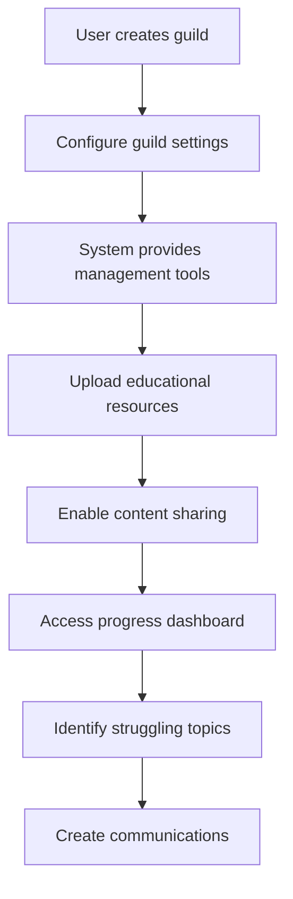

---

## UC-009: Curriculum-Career Boss Fight Assessment System

| **Field** | **Details** |
|-----------|-------------|
| **Use Case Name** | Curriculum-Career Boss Fight Assessment System |
| **Description** | Students engage in gamified assessments through Unity WebGL boss fight experiences that evaluate both curriculum mastery and career readiness with adaptive difficulty and integrated progression tracking |
| **Actor(s)** | Primary: **Player** Secondary: Unity WebGL System, Assessment Engine, Career Evaluation System |
| **Preconditions** | User has completed prerequisite curriculum quests and career enhancement activities |
| **Postconditions (Success Guarantee)** | Assessment completed with performance evaluation for both academic curriculum and career specialization progression |
| **Related Requirements** | **FRs:** FR16 (Boss Fight System), FR17 (Unity WebGL Integration), FR18 (Career Assessment) **NFRs:** NFR10 (Unity WebGL), NFR9 (Performance) |
| **Main Success Scenario** | 1. Player encounters boss fight trigger based on curriculum milestone or career checkpoint 2. System launches Unity WebGL boss fight interface with Route/Class-specific challenges 3. Player engages with curriculum-based questions and career scenario challenges 4. System provides real-time visual feedback for both academic and career performance 5. Boss fight adapts difficulty based on Route requirements and Class specialization 6. Player completes assessment demonstrating curriculum mastery and career readiness 7. System updates character stats for both academic progression and career specialization 8. Player receives rewards aligned with Route advancement and Class development |
| **Alternative Flows** | **A1:** Curriculum-focused boss fights - Emphasis on academic content mastery **A2:** Career-specialized challenges - Industry-specific scenarios based on Class selection **A3:** Collaborative boss fights - Party members tackle curriculum and career challenges together |
| **Exception Flows** | **E1:** Unity WebGL loading failure - System provides alternative assessment format maintaining Route/Class evaluation **E2:** Performance issues - System adjusts graphics while preserving curriculum-career assessment integrity **E3:** Network interruption - System saves progress separately for academic and career tracks |

### **Main Success Scenario Flowchart**

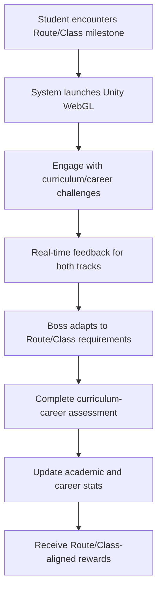

---

## UC-010: Collaborative Study Sessions

| **Field** | **Details** |
|-----------|-------------|
| **Use Case Name** | Real-time Collaborative Study Sessions |
| **Description** | Party members engage in synchronized study sessions with shared resources, real-time communication, and collaborative learning activities |
| **Actor(s)** | Primary: **Party Members** Secondary: **Party Leader**, System |
| **Preconditions** | User is party member with access to collaborative features |
| **Postconditions (Success Guarantee)** | Study session completed with shared learning outcomes and progress tracking |
| **Related Requirements** | **FRs:** FR13 (Party Stash), FR14 (Meeting Management), FR18 (Collaborative Features) **NFRs:** NFR17 (Real-time Communication), NFR4 (RESTful Communication) |
| **Main Success Scenario** | 1. Party Leader initiates collaborative study session 2. System notifies party members and provides session access 3. Members join shared virtual study space with real-time synchronization 4. System enables collaborative tools (shared whiteboard, document editing, screen sharing) 5. Party members work together on learning objectives and assignments 6. System tracks individual and group progress during session 7. Members share resources from Party Stash and personal Arsenal 8. Session concludes with summary and individual progress updates |
| **Alternative Flows** | **A1:** Asynchronous collaboration - Members contribute at different times **A2:** Study group rotation - Different members lead sessions **A3:** Cross-party collaboration - Multiple parties work together on projects |
| **Exception Flows** | **E1:** Connection issues - System provides offline mode with later synchronization **E2:** Resource conflicts - System manages concurrent access with version control **E3:** Member unavailability - System records session for later review |

### **Main Success Scenario Flowchart**

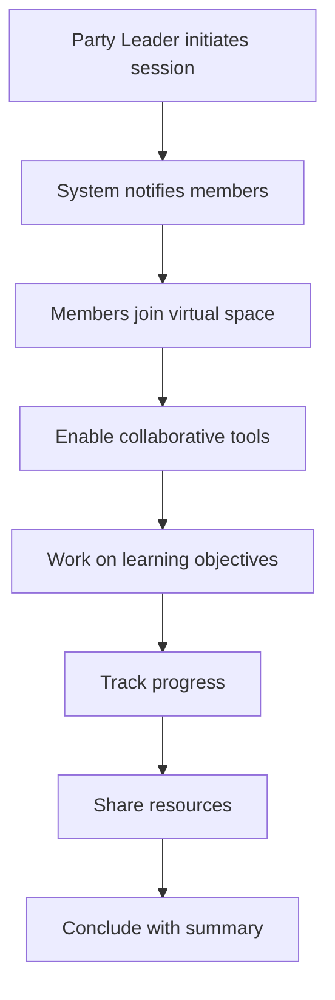

---

## UC-011: Event Management with Game Master Approval

| **Field** | **Details** |
|-----------|-------------|
| **Use Case Name** | Event Management with Game Master Authority |
| **Description** | Game Masters have the highest administrative authority for creating, managing, and executing platform-wide events, with Guild Masters able to create event requests that require Game Master approval for quality assurance and educational oversight |
| **Actor(s)** | Primary: **Game Master**, **Guild Master** Secondary: **Students**, **Verified Lecturers**, Room Assignment Service, Quality Assurance System |
| **Preconditions** | User has appropriate role-based event creation privileges and system access |
| **Postconditions (Success Guarantee)** | Event created through proper approval workflow, quality assured, guilds registered, room assignments completed, and activities conducted with full audit trail |
| **Related Requirements** | **FRs:** FR43 (Event Management), FR44 (Code Battle System), FR47 (Enhanced Approval Workflow), FR47A (Game Master Event Creation) **NFRs:** NFR15 (Microservices), NFR21 (Scalability), NFR13 (Security) |
| **Main Success Scenario** | 1. **Event Creation Phase**: Game Master accesses event creation wizard with enhanced toolkit 2. **Event Configuration**: User selects event type and configures parameters (standard events auto-approved, custom events flagged for review) 3. **Quality Assurance**: System performs automated quality checks and content validation 4. **Approval Workflow**: Event follows streamlined approval (Guild Master requests require Game Master approval for quality assurance) 5. **Event Setup**: Approved event configured with room assignments, participation criteria, and guild requirements 6. **Registration Phase**: System opens guild registration with prerequisite checking and capacity management 7. **Event Execution**: Event proceeds with real-time monitoring, guild ranking, and performance tracking 8. **Post-Event**: System generates comprehensive analytics, audit trail, and distributes rewards 9. **Review Dashboard**: All stakeholders access review dashboard for event performance and feedback |
| **Alternative Flows** | **A1:** Game Master Direct Creation - Game Masters can create and activate events directly with their administrative authority **A2:** Guild Master Event Request - Guild Masters submit event requests that require Game Master approval for quality assurance **A3:** Custom Event Review - Manual peer review process for innovative or complex event designs **A4:** Cross-guild Collaborative Events - Multi-guild events requiring enhanced coordination and approval **A5:** Recurring Event Series - Streamlined approval for recurring educational event patterns |
| **Exception Flows** | **E1:** Approval rejection - System provides detailed feedback and revision guidance for resubmission **E2:** Quality assurance failure - System flags content issues and provides improvement recommendations **E3:** Capacity overflow - System manages waiting lists and provides alternative event scheduling **E4:** Technical issues during approval - System maintains approval state and provides recovery mechanisms |

### **Main Success Scenario Flowchart**

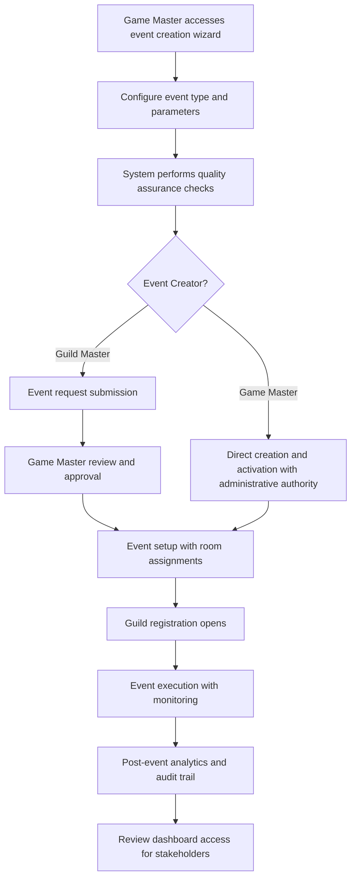

---

## UC-012: Code Battle Participation

| **Field** | **Details** |
|-----------|-------------|
| **Use Case Name** | Real-time Code Battle Participation |
| **Description** | Students participate in competitive coding challenges within guild events featuring live evaluation, spectator mode, and skill assessment |
| **Actor(s)** | Primary: **Student** Secondary: **Spectators**, Code Battle System |
| **Preconditions** | User is registered for code battle event and has access to coding environment |
| **Postconditions (Success Guarantee)** | Code battle completed with performance evaluation, skill assessment, and leaderboard updates |
| **Related Requirements** | **FRs:** FR43 (Code Battle System), FR44 (Real-time Execution Environment) **NFRs:** NFR8 (Golang Backend), NFR17 (Real-time Communication) |
| **Main Success Scenario** | 1. Student joins code battle at scheduled time within assigned room 2. System provides secure coding environment with multiple language support 3. Student receives problem statement, test cases, and time constraints 4. Student writes and tests solution in real-time development environment 5. System provides live compilation feedback and automated test results 6. Spectators can view progress through spectator mode with live updates 7. System evaluates solution for correctness, efficiency, and code quality 8. Student submits final solution before time limit 9. System updates guild rankings and individual performance metrics |
| **Alternative Flows** | **A1:** Team-based battles - Multiple students collaborate on solutions **A2:** Progressive challenges - Battles with increasing difficulty levels **A3:** Educational mode - Battles focused on learning rather than competition |
| **Exception Flows** | **E1:** Technical issues - System provides backup submission methods **E2:** Network problems - System offers offline coding with delayed submission **E3:** Time extension - System handles exceptional circumstances with fair adjustments |

### **Main Success Scenario Flowchart**

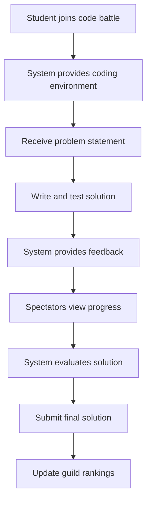

---

## UC-013: Real-time Notifications and Updates

| **Field** | **Details** |
|-----------|-------------|
| **Use Case Name** | Comprehensive Notification System |
| **Description** | System delivers real-time notifications across multiple channels to keep users engaged and informed of relevant platform activities |
| **Actor(s)** | Primary: Notification System Secondary: **Students**, **Guild Masters** |
| **Preconditions** | User has active account with configured notification preferences |
| **Postconditions (Success Guarantee)** | Users receive timely, relevant notifications through preferred channels |
| **Related Requirements** | **FRs:** FR39 (In-app Notifications), FR21 (Notification System) **NFRs:** NFR11 (Real-time Updates), NFR17 (Real-time Communication) |
| **Main Success Scenario** | 1. System detects trigger event (quest update, party invitation, event notification, guild announcement) 2. System checks user notification preferences and delivery channels 3. System generates appropriate notification content based on event type 4. System delivers notification via configured channels (in-app, email, push notifications) 5. User receives notification and can interact with actionable content 6. System tracks notification delivery status and user engagement 7. System adjusts future notification timing and content based on user behavior |
| **Alternative Flows** | **A1:** Batch notifications - System groups related notifications for better user experience **A2:** Priority notifications - Critical events bypass normal delivery schedules **A3:** Notification history - Users can review past notifications and missed updates |
| **Exception Flows** | **E1:** Delivery failure - System retries with alternative channels **E2:** Service unavailable - System queues notifications for later delivery **E3:** User preferences conflict - System uses default settings with user notification |

### **Main Success Scenario Flowchart**

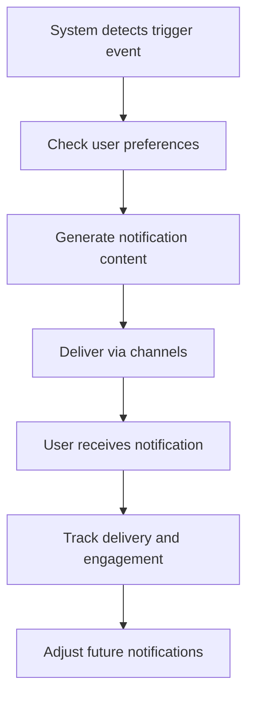

---

## UC-014: Performance Analytics and Monitoring

| **Field** | **Details** |
|-----------|-------------|
| **Use Case Name** | Comprehensive Analytics and Performance Monitoring |
| **Description** | Game Masters (Admins) and Guild Masters access detailed analytics to monitor platform health, user engagement, and educational outcomes |
| **Actor(s)** | Primary: **Game Master (Admin)**, **Guild Master** Secondary: **Verified Lecturers**, Analytics System |
| **Preconditions** | User has appropriate administrative privileges and analytics data is available |
| **Postconditions (Success Guarantee)** | Analytics dashboard provides actionable insights with comprehensive reporting and monitoring capabilities |
| **Related Requirements** | **FRs:** FR40 (Performance Monitoring), FR41 (Data Architecture), FR42 (Content Delivery) **NFRs:** NFR23 (Analytics & Monitoring), NFR9 (Performance) |
| **Main Success Scenario** | 1. Administrator accesses comprehensive analytics dashboard 2. System displays real-time performance metrics, user engagement data, and educational outcomes 3. User selects specific time periods, user segments, and performance indicators 4. System generates detailed reports on platform health and learning effectiveness 5. Administrator identifies trends, performance bottlenecks, and improvement opportunities 6. System provides automated recommendations and alerts for critical thresholds 7. Administrator exports reports for stakeholder communication and decision-making 8. System schedules automated monitoring and alerting for continuous oversight |
| **Alternative Flows** | **A1:** Guild-specific analytics - Guild Masters view community-focused metrics **A2:** Custom report creation - Users build specialized reports for specific needs **A3:** Predictive analytics - System provides forecasting and trend analysis |
| **Exception Flows** | **E1:** Data processing delays - System provides estimated completion times **E2:** Report generation failure - System offers alternative data export formats **E3:** Analytics service unavailable - System provides cached data with timestamps |

### **Main Success Scenario Flowchart**

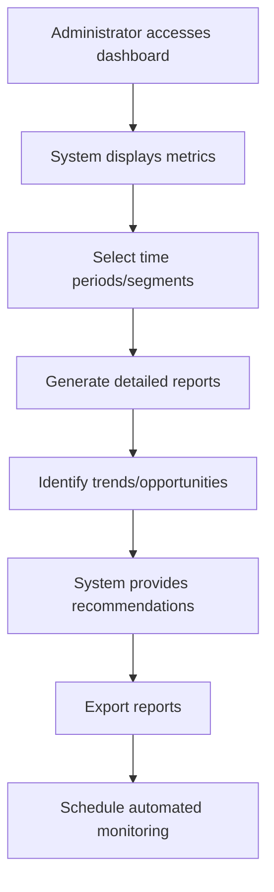

---

## UC-015: System Integration and API Management

| **Field** | **Details** |
|-----------|-------------|
| **Use Case Name** | External System Integration and API Management |
| **Description** | Game Masters (Admins) manage external integrations, API access controls, and system configurations to ensure platform functionality and security |
| **Actor(s)** | Primary: **Game Master (Admin)** Secondary: External Systems, API Clients |
| **Preconditions** | Game Master has system-level access and integration requirements are defined |
| **Postconditions (Success Guarantee)** | Integrations configured and functional with proper security controls and monitoring |
| **Related Requirements** | **FRs:** FR42 (Content Delivery), FR41 (Data Architecture) **NFRs:** NFR13 (Security), NFR21 (Integration Capabilities), NFR19 (Integration Capabilities) |
| **Main Success Scenario** | 1. Game Master accesses system integration management dashboard 2. Game Master configures external service connections (LMS, calendar systems, university portals) 3. System validates integration credentials, permissions, and security requirements 4. Game Master sets up API access controls, rate limiting, and usage monitoring 5. System tests integration functionality and reports connection status 6. Game Master monitors integration health, performance metrics, and error rates 7. System logs all integration activities for security audit and compliance 8. Game Master receives automated alerts for integration issues and performance degradation |
| **Alternative Flows** | **A1:** Bulk integration setup - Game Master configures multiple services simultaneously **A2:** Custom API development - Game Master creates specialized integration endpoints **A3:** Integration migration - Game Master updates existing integrations to new versions |
| **Exception Flows** | **E1:** Authentication failure - System provides troubleshooting guidance and fallback options **E2:** Rate limits exceeded - System implements intelligent queuing and retry logic **E3:** External service unavailable - System activates fallback procedures and user notifications |

### **Main Success Scenario Flowchart**

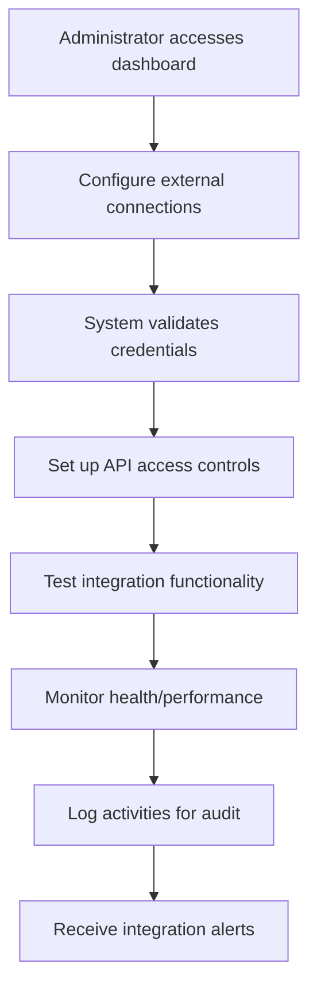

---

## Summary

This restructured use case document provides comprehensive coverage for the RogueLearn platform with eliminated duplicates and proper alignment to current requirements. The use cases now reflect:

- **Guild-based event system** instead of tournament brackets
- **Current functional requirements** from the updated PRD
- **Proper numbering** without duplicates (UC-001 through UC-015)
- **Comprehensive coverage** of all major user interactions
- **Updated technical specifications** aligned with the current architecture

Each use case includes detailed scenarios, requirement mappings, and visual flowcharts to support development, testing, and stakeholder communication throughout the platform development lifecycle.