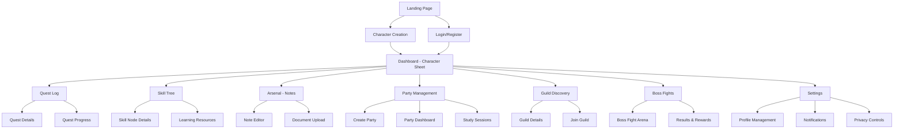

# Information Architecture (IA)

## Site Map / Screen Inventory

## Navigation Structure

**Primary Navigation:** 
- Fixed top navigation bar with RogueLearn logo, notification bell, user avatar, and settings gear
- Main dashboard accessible from logo click
- Quick access to core features: Quest Log, Skill Tree, Arsenal, Party, Guilds

**Secondary Navigation:**
- Contextual navigation within each major section
- Breadcrumb navigation for deep content areas
- Quick action buttons for common tasks (Continue Quest, Create Party, etc.)

**Mobile Navigation:**
- Collapsible hamburger menu for primary navigation
- Bottom tab bar for core features on mobile
- Swipe gestures for quest progression and skill tree navigation