# User Flows & Wireframes

## 1. Core User Journey: New Student Onboarding

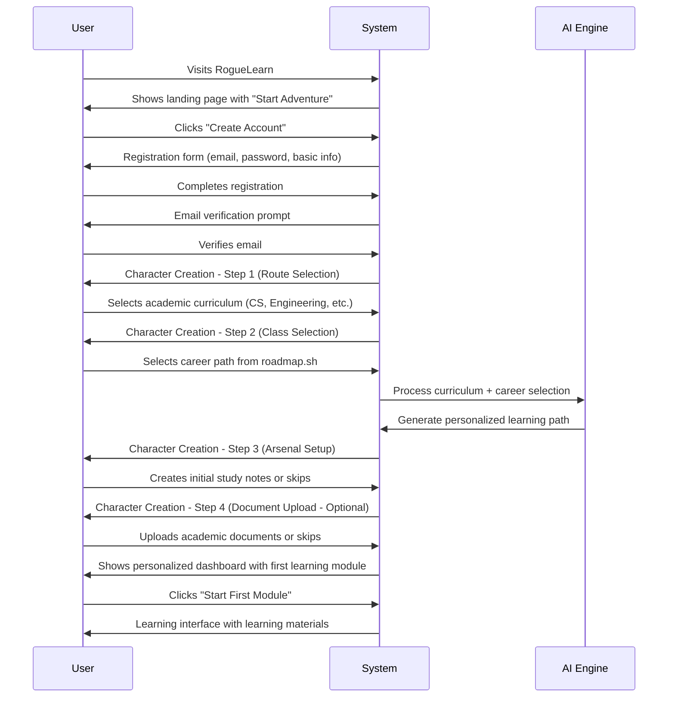
```mermaid
sequenceDiagram
    participant U as User
    participant S as System
    participant AI as AI Engine
    
    U->>S: Visits RogueLearn
    S->>U: Shows landing page with "Start Adventure"
    U->>S: Clicks "Create Account"
    S->>U: Registration form (email, password, basic info)
    U->>S: Completes registration
    S->>U: Email verification prompt
    U->>S: Verifies email
    S->>U: Character Creation - Step 1 (Route Selection)
    U->>S: Selects academic curriculum (CS, Engineering, etc.)
    S->>U: Character Creation - Step 2 (Class Selection)
    U->>S: Selects career path from roadmap.sh
    S->>AI: Process curriculum + career selection
    AI->>S: Generate personalized learning path
    S->>U: Character Creation - Step 3 (Arsenal Setup)
    U->>S: Creates initial study notes or skips
    S->>U: Character Creation - Step 4 (Document Upload - Optional)
    U->>S: Uploads academic documents or skips
    S->>U: Shows personalized dashboard with first learning module
    U->>S: Clicks "Start First Module"
    S->>U: Learning interface with learning materials
```

## 2. Learning System Flows

### 2.1 Learning Module Completion Flow

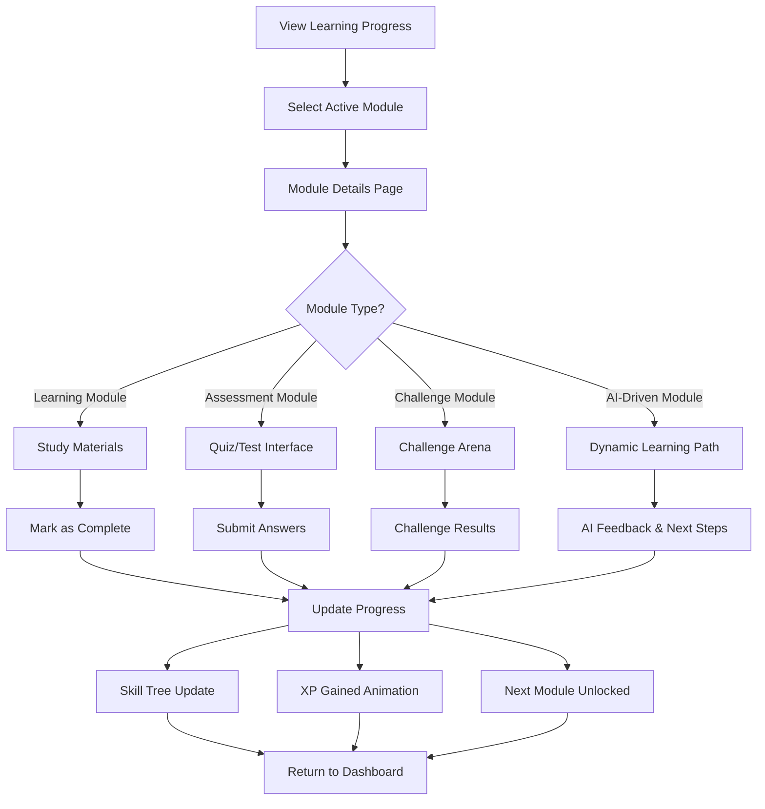
```mermaid
graph TD
    A[View Learning Progress] --> B[Select Active Module]
    B --> C[Module Details Page]
    C --> D{Module Type?}
    
    D -->|Learning Module| E[Study Materials]
    D -->|Assessment Module| F[Quiz/Test Interface]
    D -->|Challenge Module| G[Challenge Arena]
    D -->|AI-Driven Module| H[Dynamic Learning Path]
    
    E --> I[Mark as Complete]
    F --> J[Submit Answers]
    G --> K[Challenge Results]
    H --> L[AI Feedback & Next Steps]
    
    I --> M[Update Progress]
    J --> M
    K --> M
    L --> M
    
    M --> N[Skill Tree Update]
    M --> O[XP Gained Animation]
    M --> P[Next Module Unlocked]
    
    N --> Q[Return to Dashboard]
    O --> Q
    P --> Q
```

### 2.2 AI-Driven Learning Path Flow

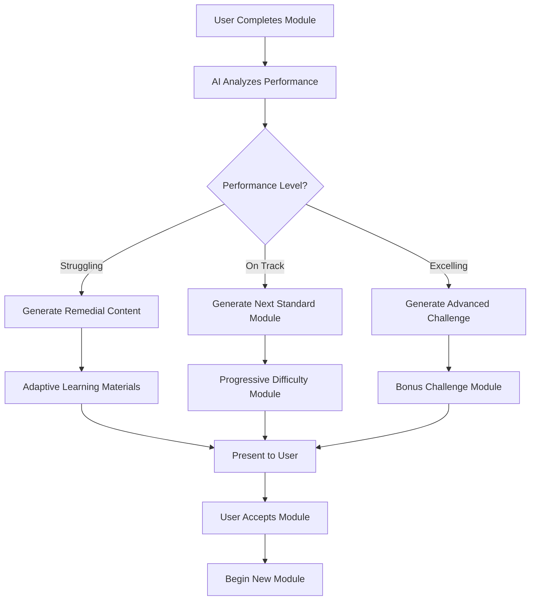
```mermaid
graph TD
    A[User Completes Module] --> B[AI Analyzes Performance]
    B --> C{Performance Level?}
    
    C -->|Struggling| D[Generate Remedial Content]
    C -->|On Track| E[Generate Next Standard Module]
    C -->|Excelling| F[Generate Advanced Challenge]
    
    D --> G[Adaptive Learning Materials]
    E --> H[Progressive Difficulty Module]
    F --> I[Bonus Challenge Module]
    
    G --> J[Present to User]
    H --> J
    I --> J
    
    J --> K[User Accepts Module]
    K --> L[Begin New Module]
```

## 3. Arsenal Management System Flows

### 3.1 Note Creation & Management Flow

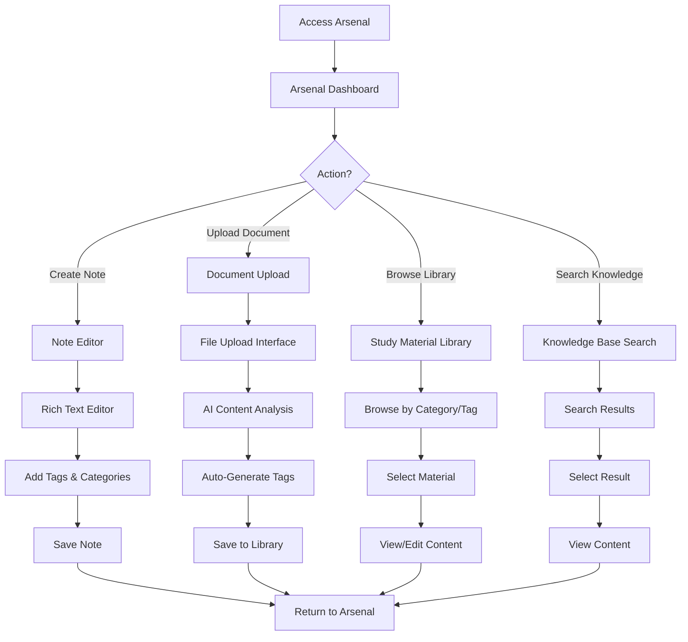
```mermaid
graph TD
    A[Access Arsenal] --> B[Arsenal Dashboard]
    B --> C{Action?}
    
    C -->|Create Note| D[Note Editor]
    C -->|Upload Document| E[Document Upload]
    C -->|Browse Library| F[Study Material Library]
    C -->|Search Knowledge| G[Knowledge Base Search]
    
    D --> H[Rich Text Editor]
    H --> I[Add Tags & Categories]
    I --> J[Save Note]
    J --> K[Return to Arsenal]
    
    E --> L[File Upload Interface]
    L --> M[AI Content Analysis]
    M --> N[Auto-Generate Tags]
    N --> O[Save to Library]
    O --> K
    
    F --> P[Browse by Category/Tag]
    P --> Q[Select Material]
    Q --> R[View/Edit Content]
    R --> K
    
    G --> S[Search Results]
    S --> T[Select Result]
    T --> U[View Content]
    U --> K
```

### 3.2 Document Processing Flow

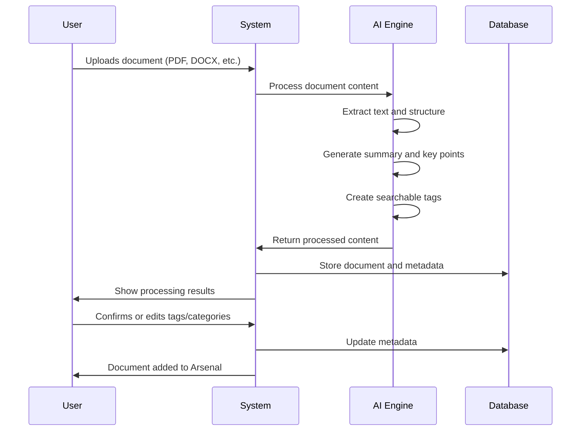
```mermaid
sequenceDiagram
    participant U as User
    participant S as System
    participant AI as AI Engine
    participant DB as Database
    
    U->>S: Uploads document (PDF, DOCX, etc.)
    S->>AI: Process document content
    AI->>AI: Extract text and structure
    AI->>AI: Generate summary and key points
    AI->>AI: Create searchable tags
    AI->>S: Return processed content
    S->>DB: Store document and metadata
    S->>U: Show processing results
    U->>S: Confirms or edits tags/categories
    S->>DB: Update metadata
    S->>U: Document added to Arsenal
```

## 4. Code Battle System Flows

### 4.1 Free-for-All Event Participation Flow

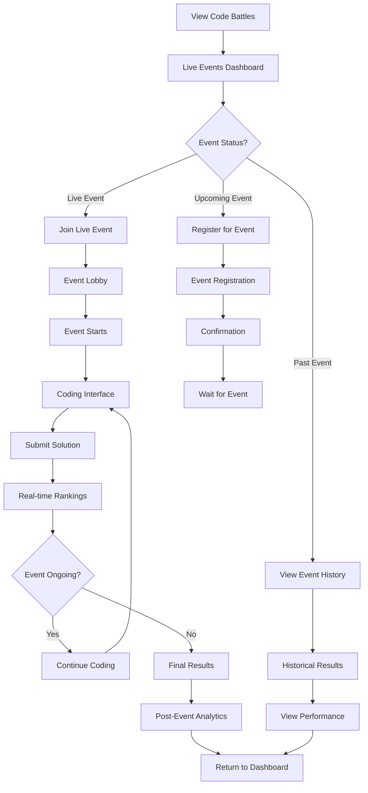
```mermaid
graph TD
    A[View Code Battles] --> B[Live Events Dashboard]
    B --> C{Event Status?}
    
    C -->|Live Event| D[Join Live Event]
    C -->|Upcoming Event| E[Register for Event]
    C -->|Past Event| F[View Event History]
    
    D --> G[Event Lobby]
    G --> H[Event Starts]
    H --> I[Coding Interface]
    I --> J[Submit Solution]
    J --> K[Real-time Rankings]
    K --> L{Event Ongoing?}
    
    L -->|Yes| M[Continue Coding]
    L -->|No| N[Final Results]
    
    M --> I
    N --> O[Post-Event Analytics]
    O --> P[Return to Dashboard]
    
    E --> Q[Event Registration]
    Q --> R[Confirmation]
    R --> S[Wait for Event]
    
    F --> T[Historical Results]
    T --> U[View Performance]
    U --> P
```

### 4.2 Leaderboard Navigation Flow

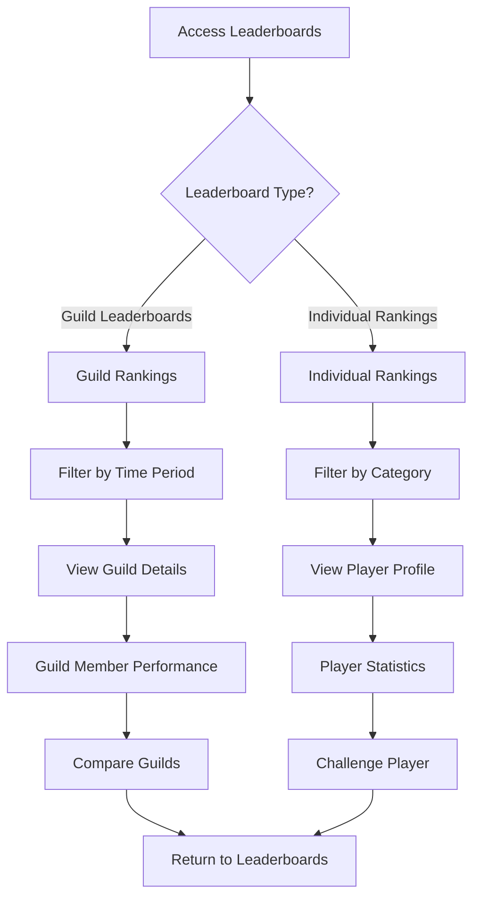
```mermaid
graph TD
    A[Access Leaderboards] --> B{Leaderboard Type?}
    
    B -->|Guild Leaderboards| C[Guild Rankings]
    B -->|Individual Rankings| D[Individual Rankings]
    
    C --> E[Filter by Time Period]
    E --> F[View Guild Details]
    F --> G[Guild Member Performance]
    G --> H[Compare Guilds]
    
    D --> I[Filter by Category]
    I --> J[View Player Profile]
    J --> K[Player Statistics]
    K --> L[Challenge Player]
    
    H --> M[Return to Leaderboards]
    L --> M
```

## 5. Guild System Flows

### 5.1 Guild Discovery & Joining Flow

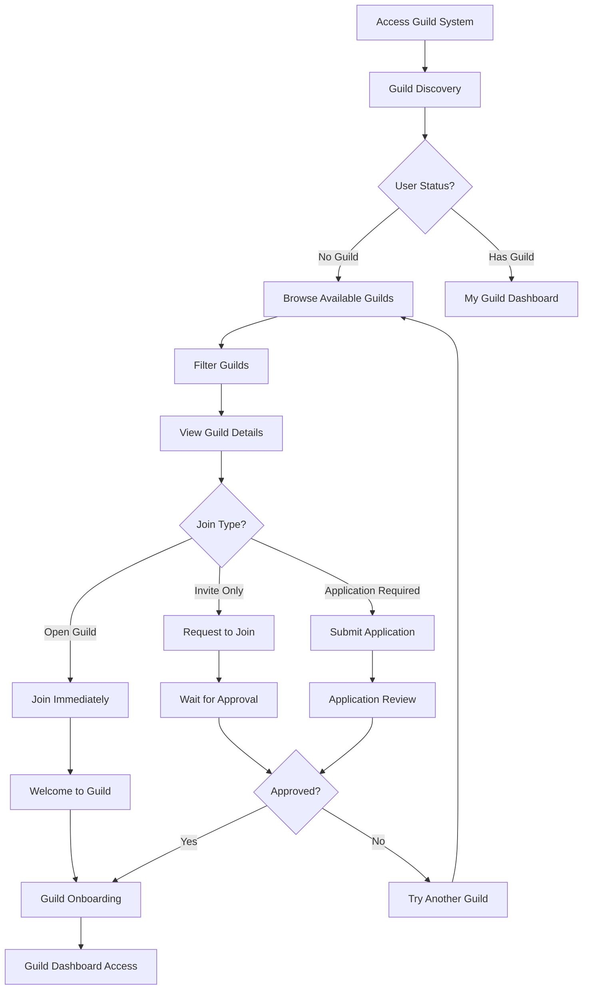
```mermaid
graph TD
    A[Access Guild System] --> B[Guild Discovery]
    B --> C{User Status?}
    
    C -->|No Guild| D[Browse Available Guilds]
    C -->|Has Guild| E[My Guild Dashboard]
    
    D --> F[Filter Guilds]
    F --> G[View Guild Details]
    G --> H{Join Type?}
    
    H -->|Open Guild| I[Join Immediately]
    H -->|Invite Only| J[Request to Join]
    H -->|Application Required| K[Submit Application]
    
    I --> L[Welcome to Guild]
    J --> M[Wait for Approval]
    K --> N[Application Review]
    
    L --> O[Guild Onboarding]
    M --> P{Approved?}
    N --> P
    
    P -->|Yes| O
    P -->|No| Q[Try Another Guild]
    
    O --> R[Guild Dashboard Access]
    Q --> D
```

### 5.2 Guild Management Flow (Leaders)

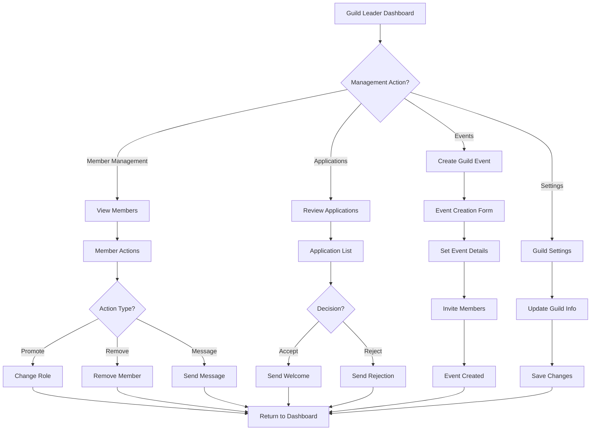
```mermaid
graph TD
    A[Guild Leader Dashboard] --> B{Management Action?}
    
    B -->|Member Management| C[View Members]
    B -->|Applications| D[Review Applications]
    B -->|Events| E[Create Guild Event]
    B -->|Settings| F[Guild Settings]
    
    C --> G[Member Actions]
    G --> H{Action Type?}
    H -->|Promote| I[Change Role]
    H -->|Remove| J[Remove Member]
    H -->|Message| K[Send Message]
    
    D --> L[Application List]
    L --> M{Decision?}
    M -->|Accept| N[Send Welcome]
    M -->|Reject| O[Send Rejection]
    
    E --> P[Event Creation Form]
    P --> Q[Set Event Details]
    Q --> R[Invite Members]
    R --> S[Event Created]
    
    F --> T[Update Guild Info]
    T --> U[Save Changes]
    
    I --> V[Return to Dashboard]
    J --> V
    K --> V
    N --> V
    O --> V
    S --> V
    U --> V
```

## 6. Party System Flows

### 6.1 Party Creation & Management Flow

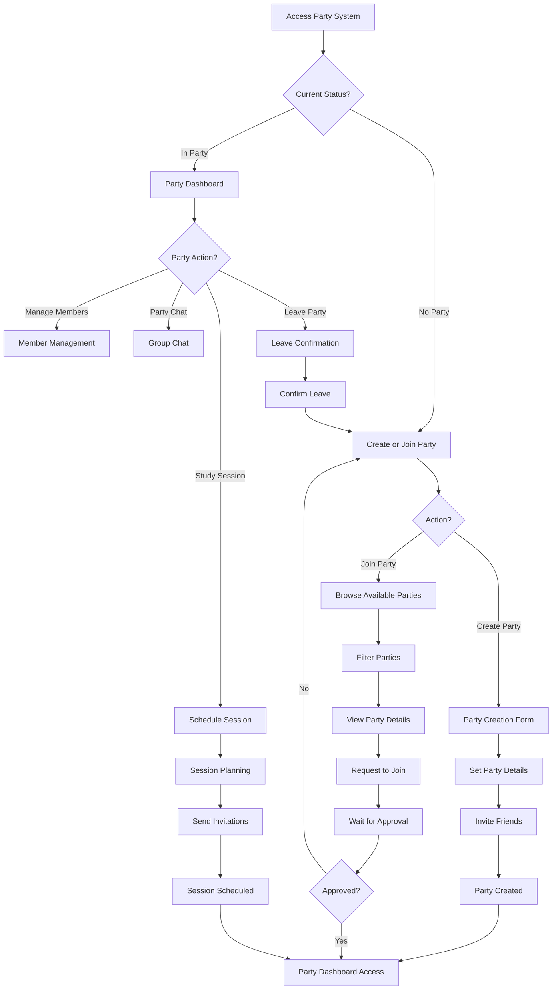
```mermaid
graph TD
    A[Access Party System] --> B{Current Status?}
    
    B -->|No Party| C[Create or Join Party]
    B -->|In Party| D[Party Dashboard]
    
    C --> E{Action?}
    E -->|Create Party| F[Party Creation Form]
    E -->|Join Party| G[Browse Available Parties]
    
    F --> H[Set Party Details]
    H --> I[Invite Friends]
    I --> J[Party Created]
    
    G --> K[Filter Parties]
    K --> L[View Party Details]
    L --> M[Request to Join]
    M --> N[Wait for Approval]
    
    D --> O{Party Action?}
    O -->|Study Session| P[Schedule Session]
    O -->|Manage Members| Q[Member Management]
    O -->|Party Chat| R[Group Chat]
    O -->|Leave Party| S[Leave Confirmation]
    
    P --> T[Session Planning]
    T --> U[Send Invitations]
    U --> V[Session Scheduled]
    
    J --> W[Party Dashboard Access]
    N --> X{Approved?}
    X -->|Yes| W
    X -->|No| C
    
    V --> W
    S --> Y[Confirm Leave]
    Y --> C
```

### 6.2 Study Session Flow

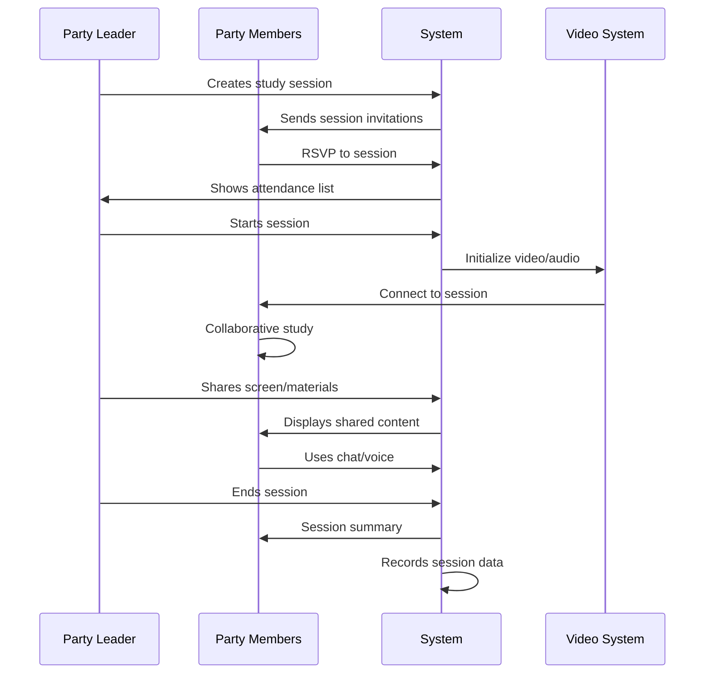
```mermaid
sequenceDiagram
    participant L as Party Leader
    participant M as Party Members
    participant S as System
    participant V as Video System
    
    L->>S: Creates study session
    S->>M: Sends session invitations
    M->>S: RSVP to session
    S->>L: Shows attendance list
    L->>S: Starts session
    S->>V: Initialize video/audio
    V->>M: Connect to session
    M->>M: Collaborative study
    L->>S: Shares screen/materials
    S->>M: Displays shared content
    M->>S: Uses chat/voice
    L->>S: Ends session
    S->>M: Session summary
    S->>S: Records session data
```

## 7. Social Features Flows

### 7.1 Mentorship Pairing Flow

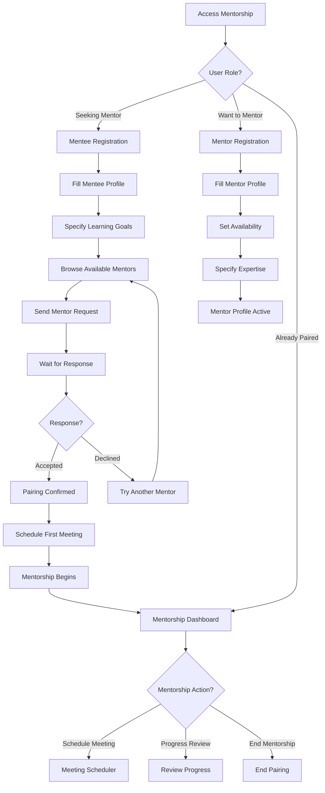
```mermaid
graph TD
    A[Access Mentorship] --> B{User Role?}
    
    B -->|Seeking Mentor| C[Mentee Registration]
    B -->|Want to Mentor| D[Mentor Registration]
    B -->|Already Paired| E[Mentorship Dashboard]
    
    C --> F[Fill Mentee Profile]
    F --> G[Specify Learning Goals]
    G --> H[Browse Available Mentors]
    H --> I[Send Mentor Request]
    I --> J[Wait for Response]
    
    D --> K[Fill Mentor Profile]
    K --> L[Set Availability]
    L --> M[Specify Expertise]
    M --> N[Mentor Profile Active]
    
    J --> O{Response?}
    O -->|Accepted| P[Pairing Confirmed]
    O -->|Declined| Q[Try Another Mentor]
    
    P --> R[Schedule First Meeting]
    R --> S[Mentorship Begins]
    
    E --> T{Mentorship Action?}
    T -->|Schedule Meeting| U[Meeting Scheduler]
    T -->|Progress Review| V[Review Progress]
    T -->|End Mentorship| W[End Pairing]
    
    Q --> H
    S --> E
```

### 7.2 Peer Challenge Flow

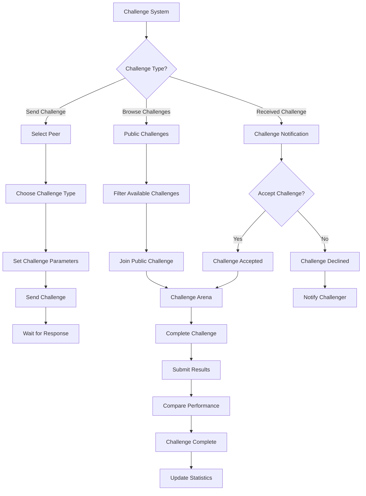
```mermaid
graph TD
    A[Challenge System] --> B{Challenge Type?}
    
    B -->|Send Challenge| C[Select Peer]
    B -->|Received Challenge| D[Challenge Notification]
    B -->|Browse Challenges| E[Public Challenges]
    
    C --> F[Choose Challenge Type]
    F --> G[Set Challenge Parameters]
    G --> H[Send Challenge]
    H --> I[Wait for Response]
    
    D --> J{Accept Challenge?}
    J -->|Yes| K[Challenge Accepted]
    J -->|No| L[Challenge Declined]
    
    E --> M[Filter Available Challenges]
    M --> N[Join Public Challenge]
    
    K --> O[Challenge Arena]
    O --> P[Complete Challenge]
    P --> Q[Submit Results]
    Q --> R[Compare Performance]
    R --> S[Challenge Complete]
    
    N --> O
    L --> T[Notify Challenger]
    S --> U[Update Statistics]
```

## 8. Knowledge Sharing Hub Flow

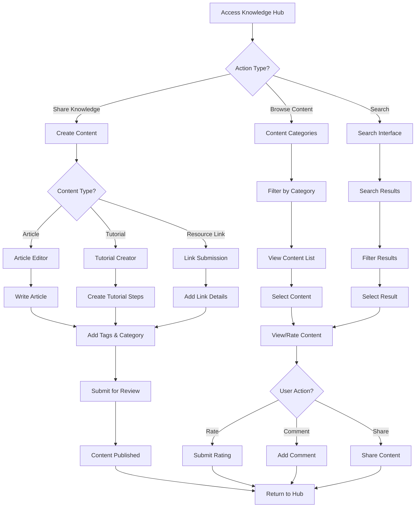
```mermaid
graph TD
    A[Access Knowledge Hub] --> B{Action Type?}
    
    B -->|Browse Content| C[Content Categories]
    B -->|Share Knowledge| D[Create Content]
    B -->|Search| E[Search Interface]
    
    C --> F[Filter by Category]
    F --> G[View Content List]
    G --> H[Select Content]
    H --> I[View/Rate Content]
    
    D --> J{Content Type?}
    J -->|Article| K[Article Editor]
    J -->|Tutorial| L[Tutorial Creator]
    J -->|Resource Link| M[Link Submission]
    
    K --> N[Write Article]
    L --> O[Create Tutorial Steps]
    M --> P[Add Link Details]
    
    N --> Q[Add Tags & Category]
    O --> Q
    P --> Q
    
    Q --> R[Submit for Review]
    R --> S[Content Published]
    
    E --> T[Search Results]
    T --> U[Filter Results]
    U --> V[Select Result]
    V --> I
    
    I --> W{User Action?}
    W -->|Rate| X[Submit Rating]
    W -->|Comment| Y[Add Comment]
    W -->|Share| Z[Share Content]
    
    S --> AA[Return to Hub]
    X --> AA
    Y --> AA
    Z --> AA
```

## 9. Event Management Flow

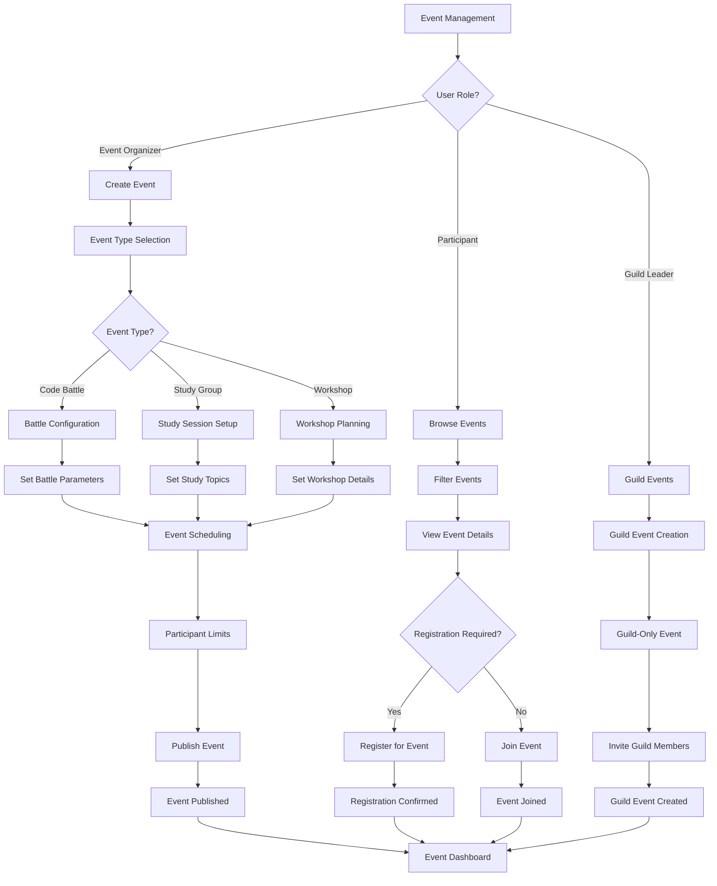
```mermaid
graph TD
    A[Event Management] --> B{User Role?}
    
    B -->|Event Organizer| C[Create Event]
    B -->|Participant| D[Browse Events]
    B -->|Guild Leader| E[Guild Events]
    
    C --> F[Event Type Selection]
    F --> G{Event Type?}
    G -->|Code Battle| H[Battle Configuration]
    G -->|Study Group| I[Study Session Setup]
    G -->|Workshop| J[Workshop Planning]
    
    H --> K[Set Battle Parameters]
    I --> L[Set Study Topics]
    J --> M[Set Workshop Details]
    
    K --> N[Event Scheduling]
    L --> N
    M --> N
    
    N --> O[Participant Limits]
    O --> P[Publish Event]
    P --> Q[Event Published]
    
    D --> R[Filter Events]
    R --> S[View Event Details]
    S --> T{Registration Required?}
    T -->|Yes| U[Register for Event]
    T -->|No| V[Join Event]
    
    E --> W[Guild Event Creation]
    W --> X[Guild-Only Event]
    X --> Y[Invite Guild Members]
    
    U --> Z[Registration Confirmed]
    V --> AA[Event Joined]
    Y --> BB[Guild Event Created]
    
    Q --> CC[Event Dashboard]
    Z --> CC
    AA --> CC
    BB --> CC
```

## 10. Mobile Navigation Flow

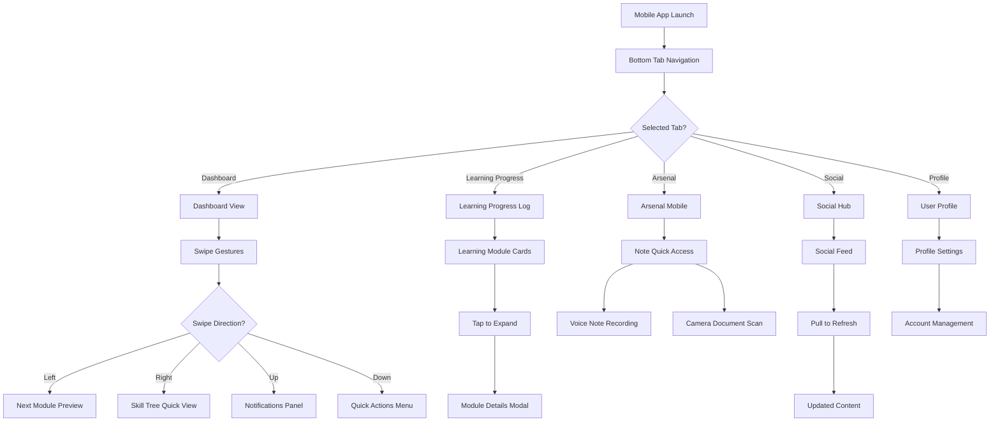
```mermaid
graph TD
    A[Mobile App Launch] --> B[Bottom Tab Navigation]
    
    B --> C{Selected Tab?}
    C -->|Dashboard| D[Dashboard View]
    C -->|Learning Progress| E[Learning Progress Log]
    C -->|Arsenal| F[Arsenal Mobile]
    C -->|Social| G[Social Hub]
    C -->|Profile| H[User Profile]
    
    D --> I[Swipe Gestures]
    I --> J{Swipe Direction?}
    J -->|Left| K[Next Module Preview]
    J -->|Right| L[Skill Tree Quick View]
    J -->|Up| M[Notifications Panel]
    J -->|Down| N[Quick Actions Menu]
    
    E --> O[Learning Module Cards]
    O --> P[Tap to Expand]
    P --> Q[Module Details Modal]
    
    F --> R[Note Quick Access]
    R --> S[Voice Note Recording]
    R --> T[Camera Document Scan]
    
    G --> U[Social Feed]
    U --> V[Pull to Refresh]
    V --> W[Updated Content]
    
    H --> X[Profile Settings]
    X --> Y[Account Management]
```

This comprehensive user flow documentation covers all major features and screens in the RogueLearn platform, providing clear navigation paths and interaction patterns for users across different roles and use cases.