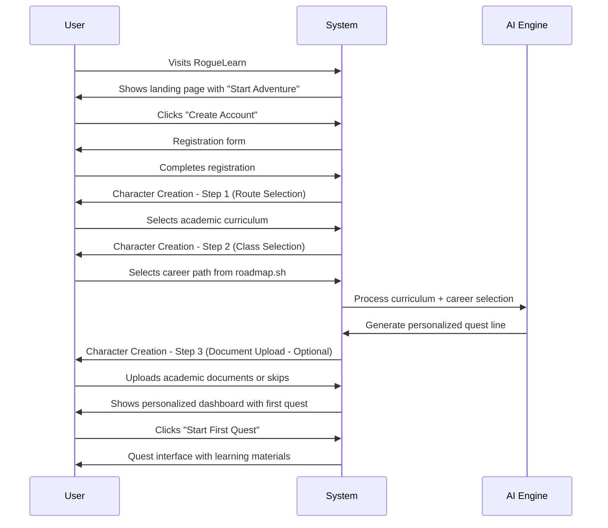
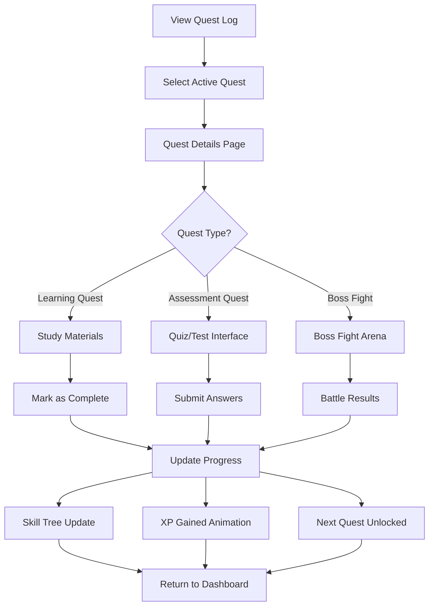

# User Flows & Wireframes

## Core User Journey: New Student Onboarding

```mermaid
sequenceDiagram
    participant U as User
    participant S as System
    participant AI as AI Engine
    
    U->>S: Visits RogueLearn
    S->>U: Shows landing page with "Start Adventure"
    U->>S: Clicks "Create Account"
    S->>U: Registration form
    U->>S: Completes registration
    S->>U: Character Creation - Step 1 (Route Selection)
    U->>S: Selects academic curriculum
    S->>U: Character Creation - Step 2 (Class Selection)
    U->>S: Selects career path from roadmap.sh
    S->>AI: Process curriculum + career selection
    AI->>S: Generate personalized quest line
    S->>U: Character Creation - Step 3 (Document Upload - Optional)
    U->>S: Uploads academic documents or skips
    S->>U: Shows personalized dashboard with first quest
    U->>S: Clicks "Start First Quest"
    S->>U: Quest interface with learning materials
```

## Quest Completion Flow

```mermaid
graph TD
    A[View Quest Log] --> B[Select Active Quest]
    B --> C[Quest Details Page]
    C --> D{Quest Type?}
    
    D -->|Learning Quest| E[Study Materials]
    D -->|Assessment Quest| F[Quiz/Test Interface]
    D -->|Boss Fight| G[Boss Fight Arena]
    
    E --> H[Mark as Complete]
    F --> I[Submit Answers]
    G --> J[Battle Results]
    
    H --> K[Update Progress]
    I --> K
    J --> K
    
    K --> L[Skill Tree Update]
    K --> M[XP Gained Animation]
    K --> N[Next Quest Unlocked]
    
    L --> O[Return to Dashboard]
    M --> O
    N --> O
```