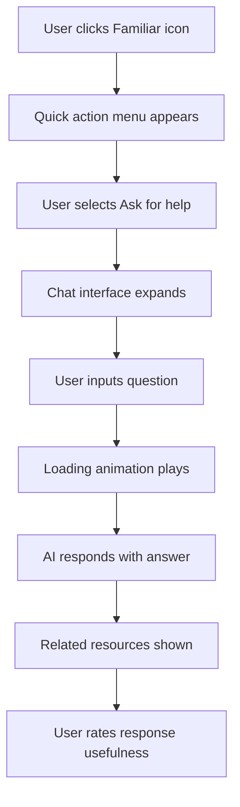
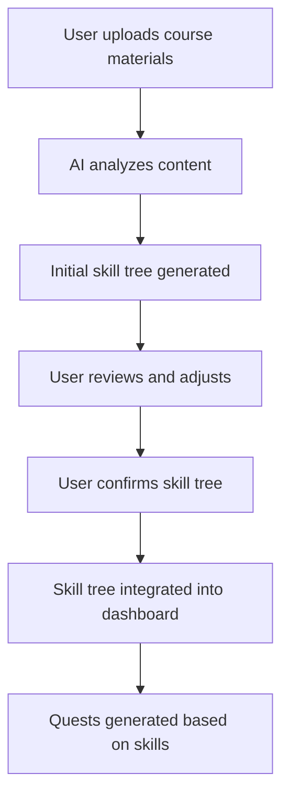
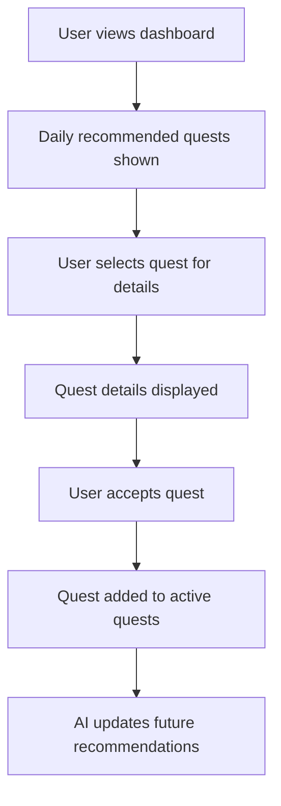
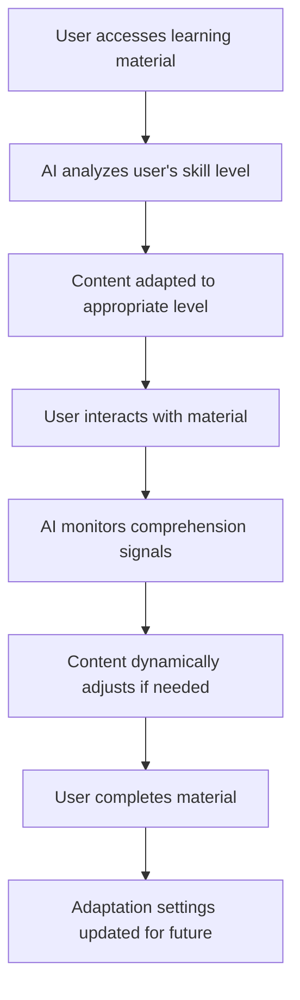

# AI-Driven Feature Interfaces

## Overview

RogueLearn incorporates several AI-powered features to enhance the learning experience. This document outlines the user interfaces for these AI-driven features, ensuring they are intuitive, transparent, and aligned with the RPG theme.

## AI Companion ("Familiar")

### Description

An AI assistant that helps students navigate their learning journey, provides contextual hints, and offers personalized guidance.

### Interface Components

- **Familiar Avatar:** Animated character that represents the AI companion
  - Customizable appearance based on user's class and progress
  - Expressive animations that reflect the AI's "mood" and response type

- **Chat Interface:**
  - Persistent chat bubble accessible from any screen
  - Expandable to full conversation view
  - Support for text, voice, and image inputs
  - Typing indicators and response animations

- **Contextual Help Panel:**
  - Slides in from the side when activated
  - Shows relevant resources based on current activity
  - Includes dismiss and "tell me more" options

### User Flow

### AI Transparency Features

- **Confidence Indicators:** Visual representation of AI's confidence in its response
- **Source Citations:** References to learning materials used in responses
- **Clarification Requests:** AI proactively asks for clarification when needed
- **Feedback Mechanism:** Users can rate and improve AI responses

## Skill Tree Generator

### Description

AI system that analyzes course materials and student progress to generate personalized skill trees that map learning pathways.

### Interface Components

- **Generation Interface:**
  - Wizard-style flow for initial setup
  - Document upload area with drag-and-drop support
  - Progress indicator for analysis process
  - Preview and confirmation screens

- **Skill Tree Visualization:**
  - Interactive graph with nodes (skills) and edges (prerequisites)
  - Color-coding based on mastery level
  - Zoom and pan controls
  - Search and filter options

- **Skill Node Details:**
  - Expandable cards with skill descriptions
  - Required and recommended resources
  - Estimated time to master
  - Related skills and dependencies

### User Flow

### AI Customization Controls

- **Complexity Slider:** Adjusts the granularity of the skill breakdown
- **Focus Areas:** Allows users to emphasize certain topics or skills
- **Learning Style Adaptation:** Tailors the tree based on preferred learning approaches
- **Manual Override:** Options to add, remove, or modify AI-generated skills

## Smart Quest Recommender

### Description

AI system that suggests appropriate learning activities ("quests") based on the student's progress, goals, and learning patterns.

### Interface Components

- **Quest Board:**
  - Visual display of available quests with difficulty ratings
  - Categorized by skill area and quest type
  - Special highlighting for recommended quests
  - Filter and sort controls

- **Quest Card:**
  - Title and description with RPG-themed framing
  - Difficulty indicator (1-5 stars)
  - Estimated completion time
  - Skill points and rewards
  - "Why recommended" expandable section

- **Daily Recommendations:**
  - Featured section on dashboard
  - 3-5 quests selected for today's focus
  - Quick accept/decline actions
  - Refresh option for new recommendations

### User Flow

### Recommendation Transparency

- **Recommendation Basis:** Clear explanation of why each quest was recommended
- **Learning Pattern Insights:** Visualizations of detected learning patterns
- **Feedback Loop:** Options to indicate if recommendations were helpful
- **Manual Exploration:** Alternative browsing methods for self-directed learning

## Content Adaptation Engine

### Description

AI system that dynamically adjusts the presentation and difficulty of learning materials based on the student's performance and preferences.

### Interface Components

- **Adaptation Controls:**
  - Difficulty slider with visual feedback
  - Learning style preference toggles
  - Pace adjustment controls
  - Reset to default option

- **Content View:**
  - Adaptive text with expandable sections
  - Interactive elements that adjust to skill level
  - Visual indicators for adapted content
  - Side-by-side comparison with original content (optional)

- **Performance Dashboard:**
  - Visualizations of performance across different topics
  - Adaptation history timeline
  - Mastery progression charts
  - Recommendations for optimal settings

### User Flow

### Adaptation Transparency

- **Adaptation Indicators:** Visual cues showing where and how content has been adapted
- **Complexity Levels:** Clear labeling of current complexity level for content
- **Manual Override:** Options to view original content or adjust adaptation level
- **Learning Insights:** Feedback on how adaptations have impacted learning outcomes

## Technical Implementation Considerations

### Performance Optimization

- Client-side caching of AI responses for similar queries
- Progressive loading of AI-generated visualizations
- Optimized asset delivery for AI-generated content
- Background processing for complex AI tasks

### Accessibility Considerations

- Screen reader compatibility for AI-generated content
- Alternative text for AI-visualizations
- Keyboard navigation for all AI interfaces
- Reduced motion options for AI animations

### Error Handling

- Graceful fallbacks when AI services are unavailable
- Clear error messages with RPG theming
- Cached responses for offline functionality
- Manual alternatives for all AI-dependent features

## User Testing Plan

### Key Test Scenarios

1. First-time interaction with AI Familiar
2. Skill tree generation from sample course materials
3. Quest recommendation acceptance and completion
4. Content adaptation for different skill levels

### Success Metrics

- Time to complete AI-assisted vs. non-assisted tasks
- User satisfaction ratings for AI features
- Accuracy of AI recommendations (as rated by users)
- Frequency of AI feature usage over time

## Implementation Timeline

| Feature | Development Phase | Estimated Timeline |
|---------|-------------------|--------------------|
| AI Familiar | Phase 1 | 3 weeks |
| Skill Tree Generator | Phase 1 | 4 weeks |
| Smart Quest Recommender | Phase 2 | 3 weeks |
| Content Adaptation Engine | Phase 2 | 5 weeks |