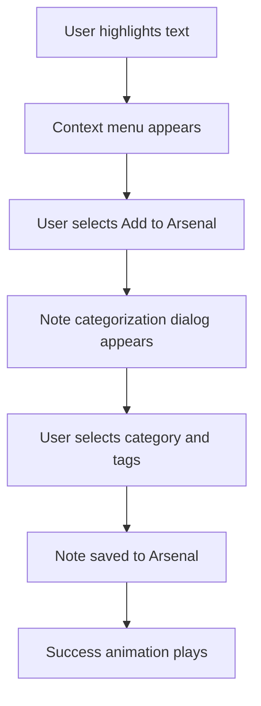
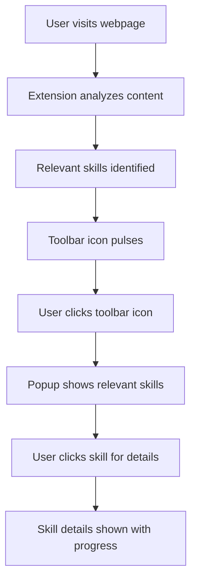

# RogueLearn Browser Extension UI Specification

## Overview

The RogueLearn browser extension provides a seamless way for students to interact with learning materials across the web, capture notes, and track their progress without leaving their current browsing context.

## Extension Components

### Toolbar Icon

- **Default State:** Gray icon with RogueLearn logo
- **Active State:** Glowing icon indicating the extension is actively processing content
- **Badge:** Numerical indicator showing unread notifications or pending quests

### Popup Panel

- **Dimensions:** 360px width × 480px height
- **Header:** User avatar, level indicator, and quick actions
- **Main Content Area:** Tabbed interface with the following sections:
  - **Current Quest:** Shows active learning objectives
  - **Notes Arsenal:** Quick note-taking interface
  - **Skill Tree:** Mini-view of relevant skills for current content
  - **Settings:** Extension configuration options

### Content Scripts

- **Text Highlighter:** Allows users to highlight and save important content
- **Skill Detector:** Identifies relevant skills on the current page
- **Quest Tracker:** Tracks progress toward learning objectives

## User Flows

### Capturing Notes

### Skill Detection

## Visual Design

### Color Palette

- Follows main application palette with slightly muted tones for browser context
- Background uses a semi-transparent dark theme to work across various websites

### Typography

- Uses system fonts for optimal performance
- Size hierarchy:
  - Headers: 16px
  - Body: 14px
  - Labels: 12px

### Iconography

- Consistent with main application
- Optimized for small display areas
- High contrast for visibility

## Interaction Design

### Animations

- Subtle entrance/exit animations for popup (150ms duration)
- Success animations for completed actions (300ms duration)
- Pulsing effects for notifications (infinite loop with 2s cycle)

### Keyboard Shortcuts

- **Alt+R:** Open extension popup
- **Alt+N:** Quick note capture
- **Alt+H:** Highlight text and save
- **Esc:** Close popup

## Technical Considerations

### Browser Compatibility

- Chrome (primary support)
- Firefox
- Edge

### Performance Optimization

- Lazy loading of popup content
- Throttled content analysis
- Local storage for frequently accessed data

### Security Considerations

- Content script isolation
- Secure authentication with main application
- Data encryption for sensitive information

## Error Handling

### Common Error States

- **Authentication Failure:** Prompt user to log in to main application
- **Connection Loss:** Queue actions for sync when connection restored
- **Permission Denied:** Guide user to grant necessary permissions

## Implementation Timeline

| Phase | Features | Timeline |
|-------|----------|----------|
| MVP | Basic toolbar, popup, highlighting | 2 weeks |
| Phase 2 | Skill detection, quest integration | 3 weeks |
| Phase 3 | Advanced features, performance optimization | 2 weeks |

## Testing Plan

- **Unit Testing:** Component-level tests for all UI elements
- **Integration Testing:** End-to-end flows across different websites
- **User Testing:** 5-7 students using think-aloud protocol
- **Performance Testing:** Load time and memory usage benchmarks