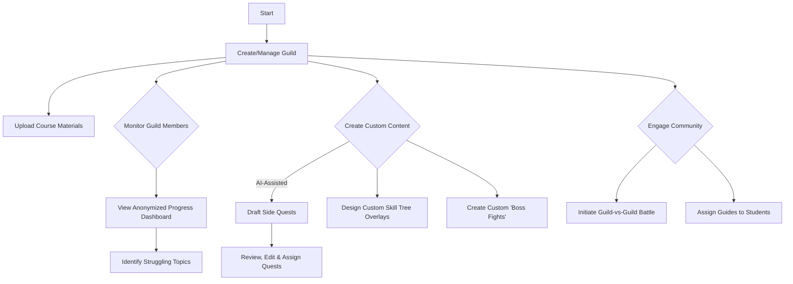

# Guild Master (Lecturer) Flows

## Guild Management

**User Goal:** Create and manage a guild for a course, upload materials, and monitor student progress

**Entry Points:** From Dashboard, Guild Management section

**Success Criteria:** Lecturer can successfully create a guild, add course materials, and view anonymized student progress data

### Flow Diagram

### Edge Cases & Error Handling:
- Large course material uploads
- Privacy concerns with student data
- AI-generated content requires significant editing
- Schedule conflicts for guild events

**Notes:** The Guild Management interface should balance powerful tools with ease of use, allowing lecturers to focus on teaching rather than technical complexity.