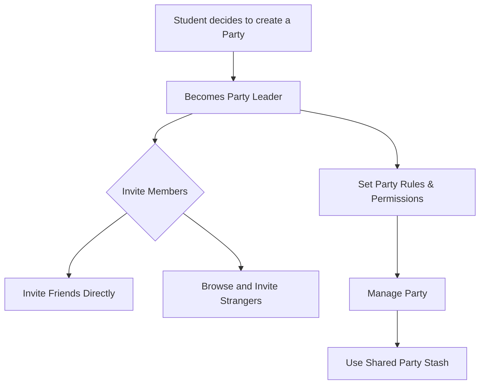

# Party Leader Flows

## Party Management

**User Goal:** Create and manage a study group with specific rules and members

**Entry Points:** From Dashboard, Party Management section

**Success Criteria:** Student can create a party, set rules, invite members, and manage group activities

### Flow Diagram

### Edge Cases & Error Handling:
- Member leaves party unexpectedly
- Rule disputes among members
- Inactive members affecting group progress
- Shared resource conflicts

**Notes:** The Party Management interface should balance group cohesion with individual autonomy, providing clear benefits for collaborative study.