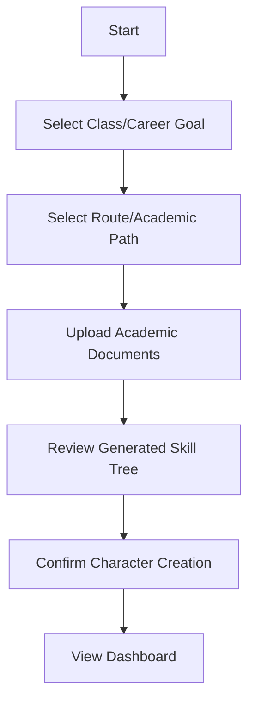
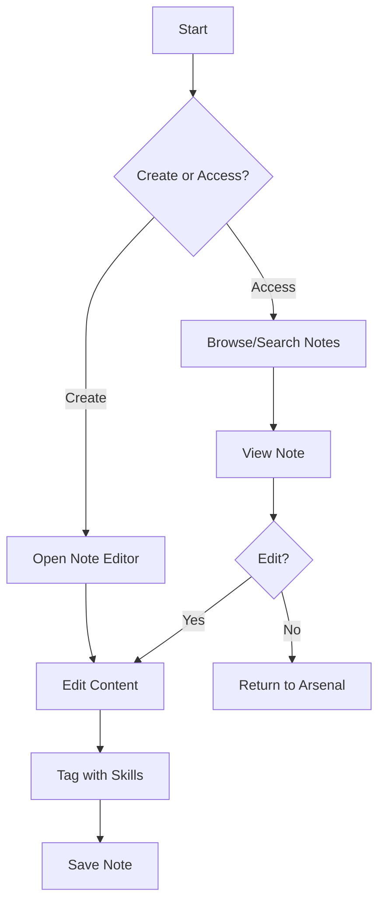
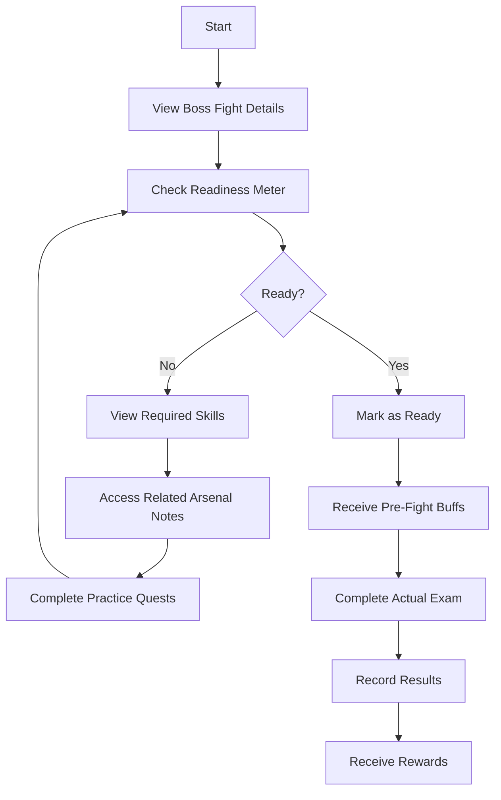
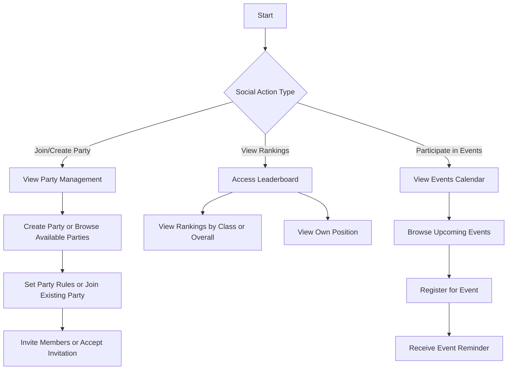

# Student (Player) Flows

## Character Creation

**User Goal:** Create a new character by selecting a Class (career goal) and Route (academic path)

**Entry Points:** After registration or from Dashboard for existing users wanting to change path

**Success Criteria:** User has selected Class and Route, uploaded academic documents, and can view their personalized Skill Tree and Quest Line

### Flow Diagram

### Edge Cases & Error Handling:
- Invalid document format uploaded
- Unsupported academic institution
- User wants to change Class/Route after creation
- Incomplete document information

**Notes:** The character creation process should feel magical but efficient. Use progressive disclosure to explain each step's importance.

## Managing Arsenal/Notes

**User Goal:** Create, organize, and access study notes and materials

**Entry Points:** From Dashboard, Skill Tree nodes, or browser extension

**Success Criteria:** User can create, edit, organize, and easily retrieve notes when needed

### Flow Diagram

### Edge Cases & Error Handling:
- Offline access needs
- Large file uploads
- Conflicting tags or categories
- Browser extension compatibility issues

**Notes:** The Arsenal should feel like a magical journal that intelligently organizes itself while giving users control over their content.

## Facing a Boss Fight (Exam)

**User Goal:** Prepare for and track progress through an academic exam or test

**Entry Points:** From Quest Line, Calendar notification, or Dashboard

**Success Criteria:** User understands their readiness level, required skills, and has access to relevant study materials

### Flow Diagram

### Edge Cases & Error Handling:
- Exam date changes
- User fails the exam
- Incomplete skill tree data
- Missing required materials

**Notes:** The Boss Fight metaphor should reduce anxiety by framing exams as conquerable challenges with clear preparation paths.

## Social & Community Interaction

**User Goal:** Engage with other students, join parties, and participate in community events

**Entry Points:** From Dashboard, Party Management, Guild Hall, or Leaderboard

**Success Criteria:** User can successfully connect with peers, join or create study groups, and participate in collaborative learning activities

### Flow Diagram

### Edge Cases & Error Handling:
- Party is full when trying to join
- User lacks required level/skills for certain events
- Scheduling conflicts with events
- Connection issues during collaborative sessions

**Notes:** Social interactions should feel rewarding and supportive, with clear indicators of mutual benefit from collaboration.