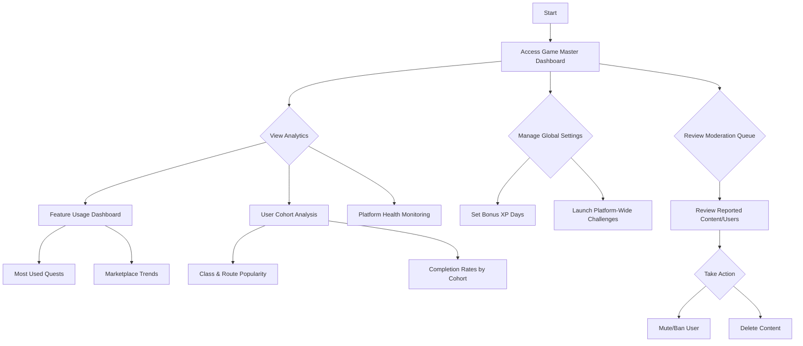

# System Admin (Game Master) Flows

## Platform Management

**User Goal:** Monitor and maintain the platform, access analytics, and manage system settings

**Entry Points:** Admin dashboard, accessible only to authorized personnel

**Success Criteria:** Admin can view system health, user analytics, and manage global settings

### Flow Diagram

### Edge Cases & Error Handling:
- System performance degradation
- Data privacy concerns or breaches
- Conflicting global settings
- Complex moderation cases requiring escalation

**Notes:** The Admin interface should prioritize clarity and efficiency, with critical alerts prominently displayed and powerful tools accessible but protected from accidental misuse.