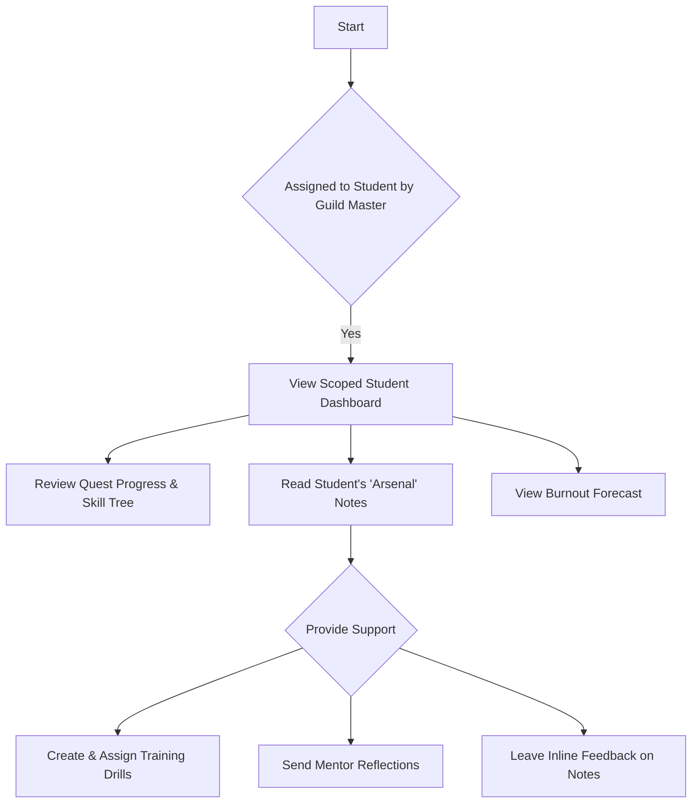

# Tutor (The Guide) Flows

## Student Support

**User Goal:** Provide targeted assistance to assigned students

**Entry Points:** From Dashboard, Guide Assignment section

**Success Criteria:** Tutor can view student progress, provide feedback, and assign practice materials

### Flow Diagram

### Edge Cases & Error Handling:
- Student revokes access to notes
- Conflicting advice between tutor and lecturer
- Tutor assignment changes mid-course
- Communication barriers with student

**Notes:** The Tutor interface should emphasize the mentorship relationship, with tools that facilitate personalized guidance rather than generic feedback.