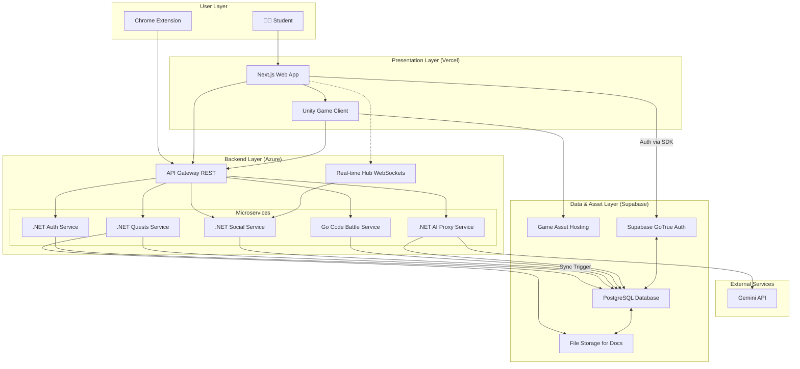
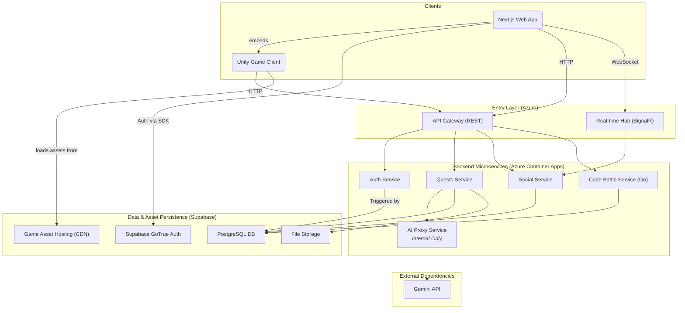
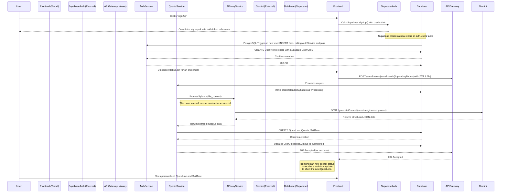

# **RogueLearn Fullstack Architecture Document**

## Table of Contents

- [RogueLearn Fullstack Architecture Document](#roguelearn-fullstack-architecture-document)
  - [Introduction](#introduction)
  - [High Level Architecture](#high-level-architecture)
  - [Tech Stack](#tech-stack)
  - [Data Models](#data-models)
  - [API Specification](#api-specification)
  - [Components](#components)
  - [External APIs](#external-apis)
  - [Core Workflows](#core-workflows)
  - [Database Schema](#database-schema)
  - [Frontend Architecture](#frontend-architecture)
  - [Backend Architecture](#backend-architecture)
  - [Unified Project Structure](#unified-project-structure)

## **Introduction**

This document outlines the complete fullstack architecture for RogueLearn, including backend systems, frontend implementation, and their integration. It serves as the single source of truth for AI-driven development, ensuring consistency across the entire technology stack.

This unified approach combines what would traditionally be separate backend and frontend architecture documents, streamlining the development process for modern fullstack applications where these concerns are increasingly intertwined.

### **Starter Template or Existing Project**

The project will be built **from scratch** following a **multi-repo, microservices architecture**. No overarching starter template will be used, allowing for a custom structure tailored to the project's specific needs.

*   **Frontend**: A standalone Next.js 14+ application using Tailwind CSS and Shadcn/UI.
*   **Game Client**: A standalone Unity 2022.3 LTS project for interactive "Boss Fights".
*   **Backend**: A series of independent microservices built with **.NET 8** and **Go**.

This approach provides maximum flexibility, clear separation of concerns, and allows us to use the best language for each service's specific task.

### **Change Log**

| Date          | Version | Description                                                                    | Author             |
| :------------ | :------ | :----------------------------------------------------------------------------- | :----------------- |
| Sep 13, 2025  | 1.7     | Replaced Clerk with Supabase Authentication across the entire architecture.      | Winston, Architect |
| Sep 12, 2025  | 1.6     | Integrated Unity WebGL feature for "Boss Fights" across the architecture.        | Winston, Architect |
| Sep 12, 2025  | 1.5     | Removed Marketplace feature per user request to focus on core learning experience. | Winston, Architect |
| Sep 12, 2025  | 1.4     | Aligned architecture with expanded PRD. Added Marketplace, Duels, and Real-Time features. | Winston, Architect |
| Sep 11, 2025  | 1.3     | Corrected Introduction to include Go as a backend technology.                  | Winston, Architect |
| Sep 11, 2025  | 1.2     | Replaced TanStack Router with native Next.js App Router per user feedback.     | Winston, Architect |
| Sep 11, 2025  | 1.1     | Noted TanStack Router as the selected routing library.                         | Winston, Architect |
| Sep 11, 2025  | 1.0     | Initial document creation and multi-repo decision.                             | Winston, Architect |

## **High Level Architecture**

### **Technical Summary**

RogueLearn will be implemented as a cloud-native, multi-repository application. It features a decoupled frontend built with Next.js, interactive "Boss Fights" built with **Unity WebGL**, and a microservices-based backend using **.NET 8** and **Go**. The system is deployed on Vercel and Azure Container Apps. Communication is handled by a RESTful API Gateway and a real-time SignalR hub for interactive features. The architecture supports AI-powered quest generation, social collaboration, competitive Duels, and code-grading battles. Data, storage, and authentication are consolidated and managed within a **Supabase** project.

### **Platform and Infrastructure Choice**

To best support our technology stack and scalability goals, I recommend the following platform configuration:

*   **Platform:** A hybrid-cloud approach leveraging best-in-class services.
    *   **Frontend Hosting:** **Vercel**. It is purpose-built for Next.js, providing seamless deployments, global CDN, and serverless functions out-of-the-box.
    *   **Backend Hosting:** **Azure Container Apps**. This is a serverless container platform that is ideal for running our .NET and Go microservices.
    *   **Database, Storage & Auth:** **Supabase**. Provides a managed PostgreSQL instance, user authentication, real-time capabilities, and file storage which will be used for both user documents and hosting Unity game assets.
*   **Key Services:**
    *   **Vercel:** Next.js Hosting, Edge Network (CDN)
    *   **Azure:** Container Apps, API Management (for the API Gateway)
    *   **Supabase:** PostgreSQL Database, Storage (for documents and game assets), **Authentication**
    *   **Internal AI Proxy Service:** A dedicated backend service to securely manage communication with the Gemini API.

### **Repository Structure**

As established, we will use a **Multi-Repo Strategy**. This provides the best separation of concerns and allows for independent development lifecycles. The initial repository structure will be:

*   **`roguelearn-web`**: The Next.js frontend application.
*   **`roguelearn-unity-games`**: The Unity project containing the "Boss Fight" game client.
*   **`roguelearn-auth-service`**: .NET microservice for user identity and profile synchronization with Supabase Auth.
*   **`roguelearn-quests-service`**: .NET microservice for syllabi, quests, skill trees, and game session logic.
*   **`roguelearn-social-service`**: .NET microservice for Parties, Guilds, Events, and real-time features like Duels.
*   **`roguelearn-code-battle-service`**: **Go** microservice for compiling, running, and scoring user-submitted code.
*   **`roguelearn-shared-types`**: A private NPM package for shared TypeScript interfaces.

### **High Level Architecture Diagram**

This diagram illustrates the primary components and data flow of the RogueLearn platform, now reflecting the use of Supabase Authentication.



### **Architectural and Design Patterns**

*   **Microservices Architecture:** The backend will be composed of small, independent services. *Rationale:* This allows for independent development, deployment, and scaling.
*   **API Gateway:** A single entry point for synchronous requests. *Rationale:* Simplifies the client, centralizes cross-cutting concerns like auth and rate limiting.
*   **Clean Architecture (.NET):** Each microservice will separate domain logic, application logic, and infrastructure. *Rationale:* Produces highly testable and maintainable services.
*   **Component-Based UI (Next.js):** The frontend will be built as a collection of reusable components. *Rationale:* Promotes reusability and faster development.
*   **Repository Pattern (.NET):** Data access within each microservice will be abstracted. *Rationale:* Decouples business logic from data access implementation.
*   **Database Triggers:** A PostgreSQL trigger will be used to sync new users from Supabase's `auth.users` table to our application's `UserProfiles` table. *Rationale:* Provides a reliable, event-driven way to create user profiles without webhooks.

## **Tech Stack**

This table is the single source of truth for all technologies, frameworks, and libraries to be used in the RogueLearn project.

### **Technology Stack Table**

| Category               | Technology                  | Version       | Purpose                                           | Rationale                                                                                                                                                    |
| :--------------------- | :-------------------------- | :------------ | :------------------------------------------------ | :----------------------------------------------------------------------------------------------------------------------------------------------------------- |
| **Frontend Language**    | TypeScript                | `5.4.x`       | Primary language for frontend development         | Ensures type safety and scalability.                                                                                                                         |
| **Frontend Framework**   | Next.js                   | `14.2.x`      | Web framework for the user-facing application     | Provides a robust foundation with SSR, SSG, and a powerful App Router.                                                                                       |
| **Game Engine**          | Unity                     | `2022.3 LTS`  | For interactive "Boss Fight" challenges           | Industry-standard game engine with a robust WebGL build target for web integration.                                                                        |
| **UI Component Library** | Shadcn/UI                 | `latest`      | A collection of re-usable components              | Offers maximum control and customizability by installing components directly into the codebase.                                                                |
| **Frontend Routing**     | **Next.js App Router**      | `14.2.x`      | Native file-system based routing for Next.js      | The built-in, officially supported router for Next.js.                                                                                                       |
| **State Management**     | React Query / Zustand       | `5.x` / `4.x` | Server state caching and global client state      | Efficient and modern state management solution for React applications.                                                                                     |
| **Styling**              | Tailwind CSS                | `3.4.x`       | Utility-first CSS framework                     | Enables rapid development of custom designs.                                                                                                                 |
| **Backend Language**     | C# / **Go**               | `12` / `1.22.x` | Primary languages for backend microservices     | C# for core services; Go for the high-performance Code Battle service.                                                                                       |
| **Backend Framework**    | .NET                        | `8.0`         | Framework for building core backend microservices | The latest LTS version of .NET, offering high performance and a rich ecosystem.                                                                              |
| **API Style**            | RESTful API                 | `v1`          | Standard for communication between services       | A well-understood, stateless, and scalable approach for our APIs.                                                                                            |
| **Real-time Comms**      | SignalR                     | `8.0`         | For real-time features like duels and notifications | Simplifies adding real-time web functionality in a .NET ecosystem.                                                                                         |
| **Database**             | PostgreSQL                  | `15.x`        | Primary relational database                       | Powerful, reliable open-source database provided by Supabase.                                                                                                |
| **Authentication**       | **Supabase Auth**           | `latest SDK`  | Managed user authentication service               | Consolidates our stack by leveraging the auth service built into our database provider, simplifying architecture.                                           |
| **File Storage**         | Supabase Storage            | `latest SDK`  | Storing user-uploaded documents (syllabi)         | Simple, S3-compatible object storage that integrates directly with our database.                                                                             |
| **Game Asset Hosting**   | Supabase Storage            | `latest SDK`  | To host and serve Unity WebGL builds              | Leverages the same storage solution and its CDN capabilities for fast game loading.                                                                        |
| **Frontend Testing**     | Jest & React Testing Library | `latest`      | For unit and component testing of the frontend    | The industry standard for testing React applications.                                                                                                        |
| **Backend Testing**      | xUnit & Moq                 | `latest`      | For unit and integration testing of .NET services | The standard, modern testing framework for .NET.                                                                                                             |
| **E2E Testing**          | Playwright                  | `1.4x.x`      | For end-to-end testing of the entire application  | A modern and reliable E2E testing framework from Microsoft.                                                                                                  |
| **CI/CD**                | GitHub Actions              | `latest`      | For automating build, test, and deployment        | Tightly integrated with our source code repositories.                                                                                                        |
| **Containerization**     | Docker                      | `latest`      | For packaging services for deployment             | Ensures consistency between development and production environments.                                                                                       |
| **AI Service**           | Gemini API                  | `latest`      | For syllabus parsing and other AI-driven features | Google's powerful LLM, accessed securely via our backend proxy.                                                                                              |

## **Data Models**

This section defines the core data models and entities for the platform, aligned with the PostgreSQL database schema.

### **User & Profile Core**

#### **UserProfile**

**Purpose:** Represents an authenticated user and their extended, game-specific profile information. The core identity is managed by **Supabase Auth**, with the `Id` directly referencing `auth.users.id`.

**Key Attributes:**
- `id`: `string` - The unique identifier, a **UUID** from Supabase's `auth.users` table.
- `username`: `string` - The user's public name.
- `email`: `string` - The user's email address.
- `classId`: `string` - Foreign key to the selected class.
- `curriculumId`: `string` - Foreign key to the selected curriculum.
- `level`: `number` - The character's current level.
- `experiencePoints`: `number` - The character's current XP.
- `stats`: `object` - Game-specific statistics stored as JSONB.

#### **TypeScript Interface**
```typescript
// In @roguelearn/shared-types
export interface UserProfile {
  id: string; // Direct reference to auth.users.id
  username: string;
  email: string;
  classId?: string;
  curriculumId?: string;
  level: number;
  experiencePoints: number;
  stats?: Record<string, any>;
  onboardingCompleted: boolean;
  createdAt: string; // ISO 8601 timestamp
  updatedAt: string; // ISO 8601 timestamp
}
```

#### **Role & UserRole**

**Purpose:** Implements Role-Based Access Control (RBAC) for the platform.

#### **TypeScript Interface**
```typescript
export interface Role {
  id: number;
  roleName: string;
}

export interface UserRole {
  userProfileId: string;
  roleId: number;
}
```

### **Academic & Content Management**

#### **Class & Curriculum**

**Purpose:** Represents academic organizational structures.

#### **TypeScript Interface**
```typescript
export interface Class {
  id: string;
  name: string;
  description?: string;
}

export interface Curriculum {
  id: string;
  name: string;
  description?: string;
}
```

#### **Syllabus & Enrollment**

**Purpose:** Represents course syllabuses and user enrollments with AI processing capabilities.

**Key Attributes:**
- `syllabusId`: `string` - Unique identifier for the syllabus.
- `curriculumId`: `string` - Foreign key to the curriculum.
- `courseCode`: `string` - The course code (e.g., "CS101").
- `courseTitle`: `string` - The full course title.
- `processingStatus`: `string` - Enum (`Pending`, `Processing`, `Completed`, `Failed`).

#### **TypeScript Interface**
```typescript
// In @roguelearn/shared-types
export type SyllabusProcessingStatus = 'Pending' | 'Processing' | 'Completed' | 'Failed';

export interface Syllabus {
  id: string;
  curriculumId: string;
  courseCode: string;
  courseTitle: string;
  description?: string;
  credits?: number;
}

export interface UserSyllabusEnrollment {
  id: string;
  userProfileId: string;
  syllabusId: string;
  enrollmentDate: string;
}

export interface UserUploadedSyllabus {
  id: string;
  enrollmentId: string;
  fileUrl: string;
  processingStatus: SyllabusProcessingStatus;
  structuredContent?: Record<string, any>;
  uploadedAt: string;
}
```

### **Quest & Skill Management**

#### **QuestLine & Quest**

**Purpose:** The `QuestLine` represents the entire learning path for a specific syllabus. Each `QuestLine` contains individual `Quests`.

**Key Attributes:**
- `questLineId`: `string` - The unique identifier for the entire quest line.
- `questId`: `string` - The unique identifier for a single quest.
- `title`: `string` - The name of the quest (e.g., "Master Big O Notation").
- `description`: `string` - Details of the task to be completed.
- `type`: `string` - Enum (`Main`, `Side`, `Daily`, `Assignment`, `Exam`, `BossFight`).
- `status`: `string` - Enum (`Not Started`, `In Progress`, `Completed`).
- `dueDate`: `string` - Optional ISO 8601 timestamp.
- `experiencePoints`: `number` - XP awarded upon completion.

#### **TypeScript Interface**
```typescript
// In @roguelearn/shared-types
export type QuestType = 'Main' | 'Side' | 'Daily' | 'Assignment' | 'Exam' | 'BossFight';
export type QuestStatus = 'Not Started' | 'In Progress' | 'Completed';

export interface Quest {
  id: string;
  questLineId: string;
  title: string;
  description?: string;
  type: QuestType;
  status: QuestStatus;
  dueDate?: string;
  experiencePoints: number;
  createdAt: string;
  updatedAt: string;
}

export interface QuestLine {
  id: string;
  syllabusId: string;
  title: string;
  createdAt: string;
}

export interface QuestPrerequisite {
  questId: string;
  prerequisiteQuestId: string;
}
```

#### **SkillTree & Skill**

**Purpose:** Visual representation of knowledge mastery for a curriculum.

**Key Attributes:**
- `skillTreeId`: `string` - The unique identifier for the entire skill tree.
- `skillId`: `string` - The unique identifier for a single skill node.
- `name`: `string` - The name of the skill (e.g., "Data Structures").
- `maxLevel`: `number` - The maximum level for this skill.
- `positionX`, `positionY`: `number` - Coordinates for rendering the node in the mind map visualization.

#### **TypeScript Interface**
```typescript
// In @roguelearn/shared-types
export interface Skill {
  id: string;
  skillTreeId: string;
  name: string;
  description?: string;
  maxLevel: number;
  positionX?: number;
  positionY?: number;
  createdAt: string;
}

export interface SkillTree {
  id: string;
  curriculumId: string;
  name: string;
  createdAt: string;
}

export interface UserSkill {
  userProfileId: string;
  skillId: string;
  level: number;
}

export interface SkillDependency {
  skillId: string;
  prerequisiteSkillId: string;
}
```

#### **Note (Arsenal Item)**

**Purpose:** Represents a single piece of user-generated knowledge stored in their "Arsenal." These notes are the primary study materials created by the user and can be linked to various other entities.

**Key Attributes:**
- `noteId`: `string` - Unique identifier for the note.
- `userProfileId`: `string` - The owner of the note.
- `title`: `string` - The title of the note.
- `content`: `jsonb` - Rich text content stored as JSONB.
- `syllabusId`, `questId`, `skillId`: `string | null` - Optional foreign keys to link the note to other entities.
- `tags`: `string[]` - Array of tags for categorization.

#### **TypeScript Interface**
```typescript
// In @roguelearn/shared-types
export interface Note {
  id: string;
  userProfileId: string;
  title: string;
  content?: Record<string, any>;
  syllabusId?: string;
  questId?: string;
  skillId?: string;
  tags?: string[];
  createdAt: string;
  updatedAt: string;
}
```

#### **Party & PartyMembership**

**Purpose:** A `Party` is a small, private study group created by a user (the Party Leader). It's designed for focused collaboration among a few members.

**Key Attributes:**
- `partyId`: `string` - Unique identifier for the party.
- `name`: `string` - The name of the study group.
- `description`: `string` - A brief description of the party's goals.
- `joinType`: `string` - Enum (`Invite Only`, `Open`).
- `leaderId`: `string` - The `userProfileId` of the creator.

#### **TypeScript Interface**
```typescript
// In @roguelearn/shared-types
export type PartyJoinType = 'Invite Only' | 'Open';

export interface Party {
  id: string;
  name: string;
  description?: string;
  joinType: PartyJoinType;
  leaderId: string;
  createdAt: string;
}

export interface PartyMembership {
  partyId: string;
  userProfileId: string;
  joinedAt: string;
}
```

#### **Guild & GuildMembership**

**Purpose:** A `Guild` is a larger, community-focused group, similar to a subreddit or Facebook Group, created by a Guild Master. It's a hub for knowledge sharing, discussions, and hosting competitive `Events`.

**Key Attributes:**
- `guildId`: `string` - Unique identifier for the guild.
- `name`: `string` - The name of the community.
- `description`: `string` - Description of the guild's topic or purpose.
- `masterId`: `string` - The `userProfileId` of the creator.
- `isVerified`: `boolean` - Indicates if the Guild Master has the "Verified Lecturer" status.

#### **TypeScript Interface**
```typescript
// In @roguelearn/shared-types
export interface Guild {
  id: string;
  name: string;
  description?: string;
  masterId: string;
  isVerified: boolean;
  createdAt: string;
}

export interface GuildMembership {
  guildId: string;
  userProfileId: string;
  joinedAt: string;
}
```

#### **Event & Competition System**

**Purpose:** An `Event` is a competition hosted by a `Guild`. The system supports various event types including code battles with comprehensive submission tracking.

**Key Attributes:**
- `eventId`: `string` - Unique identifier for the event.
- `guildId`: `string` - The `Guild` hosting the event (optional for platform-wide events).
- `title`: `string` - Name of the event.
- `type`: `string` - Enum (`Quiz`, `CodeBattle`, `Tournament`, `Duel`).
- `startDate`, `endDate`: `string` - ISO 8601 timestamps.

#### **TypeScript Interface**
```typescript
// In @roguelearn/shared-types
export type EventType = 'Quiz' | 'CodeBattle' | 'Tournament' | 'Duel';
export type CodeSubmissionStatus = 'Pending' | 'Accepted' | 'WrongAnswer' | 'TimeLimitExceeded' | 'CompilationError';

export interface Event {
  id: string;
  guildId?: string;
  title: string;
  description?: string;
  type: EventType;
  startDate?: string;
  endDate?: string;
}

export interface CodeProblem {
  id: string;
  title: string;
  problemStatement: string;
  testCases: Record<string, any>;
}

export interface CodeSubmission {
  id: string;
  eventId: string;
  problemId: string;
  userProfileId: string;
  guildId: string;
  code: string;
  language: string;
  status: CodeSubmissionStatus;
  submittedAt: string;
}

export interface LeaderboardEntry {
  id: string;
  userProfileId: string;
  eventId?: string;
  rank: number;
  score: number;
  snapshotDate: string;
}
```

#### **GameSession & Notifications**

**Purpose:** Tracks the state of an individual user's attempt at a "Boss Fight" or other interactive game event, plus system notifications.

**Key Attributes:**
- `sessionId`: `string` - Unique identifier for the session.
- `userProfileId`: `string` - The user playing the game.
- `questId`: `string` - The "Boss Fight" quest this session is for.
- `status`: `string` - Enum (`InProgress`, `Completed`, `Abandoned`).
- `score`: `number` - The final score achieved.
- `progressData`: `jsonb` - Flexible JSON field to store game-specific state.
- `startedAt`: `string` - ISO 8601 timestamp when the session began.
- `completedAt`: `string | null` - ISO 8601 timestamp when the session ended.

#### **TypeScript Interface**
```typescript
// In @roguelearn/shared-types
export type GameSessionStatus = 'InProgress' | 'Completed' | 'Abandoned';
export type VerificationStatus = 'Pending' | 'Approved' | 'Rejected' | 'MoreInfoRequired';

export interface GameSession {
  id: string;
  userProfileId: string;
  questId: string;
  status: GameSessionStatus;
  score: number;
  progressData?: Record<string, any>;
  startedAt: string;
  completedAt?: string;
}

export interface Notification {
  id: string;
  userProfileId: string;
  message: string;
  isRead: boolean;
  link?: string;
  createdAt: string;
}

export interface LecturerVerificationRequest {
  id: string;
  userProfileId: string;
  status: VerificationStatus;
  submittedAt: string;
  reviewedAt?: string;
  reviewerNotes?: string;
}
```

## **API Specification**

This section defines the RESTful API for the RogueLearn platform using the OpenAPI 3.0 standard.

### **REST API Specification**

```yaml
openapi: 3.0.0
info:
  title: RogueLearn API
  version: v1.0.0
  description: The official API for the RogueLearn platform, providing services for gamified learning.
servers:
  - url: https://api.roguelearn.com/v1
    description: Production Server

security:
  - BearerAuth: []

components:
  securitySchemes:
    BearerAuth:
      type: http
      scheme: bearer
      bearerFormat: JWT
      description: "JWT token obtained from Supabase after login."

  schemas:
    UserProfile:
      type: object
      properties:
        id: { type: string, format: uuid }
        userId: { type: string }
        username: { type: string }
        email: { type: string }
        classId: { type: string, format: uuid }
        routeId: { type: string, format: uuid, nullable: true }
        level: { type: integer }
        experiencePoints: { type: integer }
        profileImageUrl: { type: string, nullable: true }
        onboardingCompleted: { type: boolean }
        createdAt: { type: string, format: date-time }
        updatedAt: { type: string, format: date-time }
    Course:
      type: object
      properties:
        id: { type: string, format: uuid }
        userId: { type: string }
        name: { type: string }
        courseCode: { type: string, nullable: true }
        processingStatus: { type: string, enum: [Pending, Processing, Completed, Failed] }
        createdAt: { type: string, format: date-time }
        updatedAt: { type: string, format: date-time }
    GameSession:
      type: object
      properties:
        id: { type: string, format: uuid }
        questId: { type: string, format: uuid }
        status: { type: string, enum: [InProgress, Completed, Abandoned] }
        score: { type: integer }
        startedAt: { type: string, format: date-time }
        completedAt: { type: string, format: date-time, nullable: true }
    Error:
      type: object
      properties:
        code: { type: string }
        message: { type: string }

paths:
  # User Profile Endpoints
  /profiles/me:
    get:
      summary: Get Current User's Profile
      tags: [Profiles]
      security:
        - BearerAuth: []
      responses:
        '200':
          description: Successful retrieval of user profile.
          content:
            application/json:
              schema:
                $ref: '#/components/schemas/UserProfile'
          
  # Course Management Endpoints
  /courses:
    get:
      summary: Get All Courses for Current User
      tags: [Courses]
      security:
        - BearerAuth: []
      responses:
        '200':
          description: A list of the user's courses.
          content:
            application/json:
              schema:
                type: array
                items:
                  $ref: '#/components/schemas/Course'

  /courses/{courseId}/syllabus:
    post:
      summary: Upload a Syllabus for a Course
      tags: [Courses]
      security:
        - BearerAuth: []
      parameters:
        - name: courseId
          in: path
          required: true
          schema: { type: string, format: uuid }
      requestBody:
        required: true
        content:
          multipart/form-data:
            schema:
              type: object
              properties:
                file:
                  type: string
                  format: binary
      responses:
        '202':
          description: Syllabus accepted for processing.
  
  # Duel Endpoints
  /duels/challenge:
    post:
      summary: Challenge a User to a Duel
      tags: [Duels]
      security:
        - BearerAuth: []
      requestBody:
        content:
          application/json:
            schema:
              type: object
              properties:
                opponentId:
                  type: string
      responses:
        '202':
          description: Challenge sent.

  # Browser Extension Endpoints
  /extension/analyze:
    post:
      summary: Analyze content from browser extension
      tags: [Extension]
      security:
        - BearerAuth: []
      requestBody:
        content:
          application/json:
            schema:
              type: object
              properties:
                content:
                  type: string
                url:
                  type: string
      responses:
        '200':
          description: Analysis results.

  # Game Session Endpoints (for Unity Client)
  /game/sessions:
    post:
      summary: Start a new game session (e.g., a Boss Fight)
      tags: [Game]
      security:
        - BearerAuth: []
      requestBody:
        content:
          application/json:
            schema:
              type: object
              properties:
                questId:
                  type: string
                  format: uuid
      responses:
        '201':
          description: Game session created.
          content:
            application/json:
              schema:
                $ref: '#/components/schemas/GameSession'

  /game/sessions/{sessionId}/complete:
    post:
      summary: Complete a game session and submit results
      tags: [Game]
      security:
        - BearerAuth: []
      parameters:
        - name: sessionId
          in: path
          required: true
          schema: { type: string, format: uuid }
      requestBody:
        content:
          application/json:
            schema:
              type: object
              properties:
                score:
                  type: integer
                progressData:
                  type: object
      responses:
        '200':
          description: Session results submitted successfully.
```

## **Components**

This section details the major logical components of the platform.

### **Frontend Application (`roguelearn-web`)**

*   **Responsibility:** Provides the entire user-facing experience, including embedding the Unity Game Client.
*   **Technology Stack:** Next.js, TypeScript, React, Tailwind CSS.

### **Unity Game Client (`roguelearn-unity-games`)**

*   **Responsibility:** Renders and manages the interactive "Boss Fight" experiences.
*   **Key Interfaces:** Communicates with the backend via the API Gateway to start sessions and submit results.
*   **Technology Stack:** Unity 2022.3 LTS, C#, WebGL.

### **Auth Service (`roguelearn-auth-service`)**

*   **Responsibility:** Manages user profile synchronization. It is triggered by new sign-ups in Supabase Auth to create a corresponding application profile in the `UserProfiles` table.
*   **Technology Stack:** .NET 8, C#.

### **Quests Service (`roguelearn-quests-service`)**

*   **Responsibility:** Owns the core learning loop, including Courses, Quests, SkillTrees, and **Game Sessions**.
*   **Technology Stack:** .NET 8, C#.

### **Social Service (`roguelearn-social-service`)**

*   **Responsibility:** Manages all multi-user features like Parties, Guilds, Events, and real-time Duels.
*   **Technology Stack:** .NET 8, C#, SignalR.

### **AI Proxy Service (`roguelearn-ai-proxy-service`)**

*   **Responsibility:** Acts as a secure, internal gateway for all communications with the Gemini API.
*   **Technology Stack:** .NET 8, C#.

### **Code Battle Service (`roguelearn-code-battle-service`)**

*   **Responsibility:** Compiles and scores user-submitted code in a secure sandbox.
*   **Technology Stack:** Go, Docker.

### **Component Interaction Diagram**

This diagram shows how the components interact.



## **External APIs**

*   **Gemini API:** For LLM capabilities, used only by the internal `AI Proxy Service`.

## **Core Workflows**

### **Workflow 1: New User Onboarding & First QuestLine Generation**



## **Database Schema**

This section provides the SQL DDL for the PostgreSQL database.

```sql
-- ========= Enums =========
CREATE TYPE "SyllabusProcessingStatus" AS ENUM ('Pending', 'Processing', 'Completed', 'Failed');
CREATE TYPE "QuestType" AS ENUM ('Main', 'Side', 'Daily', 'Assignment', 'Exam', 'BossFight');
CREATE TYPE "QuestStatus" AS ENUM ('Not Started', 'In Progress', 'Completed');
CREATE TYPE "GameSessionStatus" AS ENUM ('InProgress', 'Completed', 'Abandoned');
CREATE TYPE "PartyJoinType" AS ENUM ('Invite Only', 'Open');
CREATE TYPE "EventType" AS ENUM ('Quiz', 'CodeBattle', 'Tournament', 'Duel');

-- ========= User Management (Managed by Auth Service) =========

CREATE TABLE "UserProfiles" (
    "Id" UUID PRIMARY KEY DEFAULT gen_random_uuid(),
    "UserId" UUID NOT NULL UNIQUE, -- Corresponds to the UUID from Supabase auth.users table
    "Username" TEXT NOT NULL,
    "Email" TEXT NOT NULL,
    "ClassId" UUID, -- FK to "Classes" table
    "CurriculumId" UUID, -- FK to "Curriculums" table
    "Level" INTEGER NOT NULL DEFAULT 1,
    "ExperiencePoints" INTEGER NOT NULL DEFAULT 0,
    "Stats" JSONB,
    "ProfileImageUrl" TEXT,
    "OnboardingCompleted" BOOLEAN NOT NULL DEFAULT false,
    "CreatedAt" TIMESTAMPTZ NOT NULL DEFAULT now(),
    "UpdatedAt" TIMESTAMPTZ NOT NULL DEFAULT now()
);

-- ========= Social Features (Managed by Social Service) =========

CREATE TABLE "Parties" (
    "Id" UUID PRIMARY KEY DEFAULT gen_random_uuid(),
    "Name" TEXT NOT NULL,
    "Description" TEXT,
    "JoinType" "PartyJoinType" NOT NULL DEFAULT 'Invite Only',
    "MaxMembers" INTEGER NOT NULL DEFAULT 4,
    "CreatedAt" TIMESTAMPTZ NOT NULL DEFAULT now()
);

CREATE TABLE "PartyMemberships" (
    "PartyId" UUID NOT NULL REFERENCES "Parties"("Id") ON DELETE CASCADE,
    "UserProfileId" UUID NOT NULL REFERENCES "UserProfiles"("Id") ON DELETE CASCADE,
    "IsLeader" BOOLEAN NOT NULL DEFAULT false,
    "JoinedAt" TIMESTAMPTZ NOT NULL DEFAULT now(),
    PRIMARY KEY ("PartyId", "UserProfileId")
);

CREATE TABLE "Guilds" (
    "Id" UUID PRIMARY KEY DEFAULT gen_random_uuid(),
    "Name" TEXT UNIQUE NOT NULL,
    "Description" TEXT,
    "MaxMembers" INTEGER NOT NULL DEFAULT 50,
    "CreatedAt" TIMESTAMPTZ NOT NULL DEFAULT now()
);

CREATE TABLE "GuildMemberships" (
    "GuildId" UUID NOT NULL REFERENCES "Guilds"("Id") ON DELETE CASCADE,
    "UserProfileId" UUID NOT NULL REFERENCES "UserProfiles"("Id") ON DELETE CASCADE,
    "IsLeader" BOOLEAN NOT NULL DEFAULT false,
    "JoinedAt" TIMESTAMPTZ NOT NULL DEFAULT now(),
    PRIMARY KEY ("GuildId", "UserProfileId")
);

CREATE TABLE "Events" (
    "Id" UUID PRIMARY KEY DEFAULT gen_random_uuid(),
    "Title" TEXT NOT NULL,
    "Description" TEXT,
    "Type" "EventType" NOT NULL,
    "StartTime" TIMESTAMPTZ NOT NULL,
    "EndTime" TIMESTAMPTZ,
    "MaxParticipants" INTEGER,
    "CreatedAt" TIMESTAMPTZ NOT NULL DEFAULT now()
);

CREATE TABLE "CodeBattles" (
    "Id" UUID PRIMARY KEY DEFAULT gen_random_uuid(),
    "EventId" UUID REFERENCES "Events"("Id") ON DELETE SET NULL,
    "Player1Id" UUID NOT NULL REFERENCES "UserProfiles"("Id") ON DELETE CASCADE,
    "Player2Id" UUID REFERENCES "UserProfiles"("Id") ON DELETE SET NULL,
    "WinnerId" UUID REFERENCES "UserProfiles"("Id") ON DELETE SET NULL,
    "ProblemStatement" TEXT NOT NULL,
    "StartTime" TIMESTAMPTZ NOT NULL DEFAULT now(),
    "EndTime" TIMESTAMPTZ,
    "Status" TEXT NOT NULL DEFAULT 'Waiting',
    "CreatedAt" TIMESTAMPTZ NOT NULL DEFAULT now()
);

-- ========= Performance Indexes =========

-- User Profile indexes
CREATE INDEX "idx_userprofiles_userid" ON "UserProfiles"("UserId");
CREATE INDEX "idx_userprofiles_classid" ON "UserProfiles"("ClassId");
CREATE INDEX "idx_userprofiles_curriculumid" ON "UserProfiles"("CurriculumId");

-- Academic Management indexes
CREATE INDEX "idx_syllabuses_curriculumid" ON "Syllabuses"("CurriculumId");
CREATE INDEX "idx_userenrollments_userprofileid" ON "UserSyllabusEnrollments"("UserProfileId");
CREATE INDEX "idx_userenrollments_syllabusid" ON "UserSyllabusEnrollments"("SyllabusId");
CREATE INDEX "idx_useruploadedsyllabuses_enrollmentid" ON "UserUploadedSyllabuses"("EnrollmentId");

-- Quest Management indexes
CREATE INDEX "idx_questlines_syllabusid" ON "QuestLines"("SyllabusId");
CREATE INDEX "idx_quests_questlineid" ON "Quests"("QuestLineId");
CREATE INDEX "idx_quests_status" ON "Quests"("Status");
CREATE INDEX "idx_quests_type" ON "Quests"("Type");

-- Skill Tree indexes
CREATE INDEX "idx_skilltrees_curriculumid" ON "SkillTrees"("CurriculumId");
CREATE INDEX "idx_skills_skilltreeid" ON "Skills"("SkillTreeId");
CREATE INDEX "idx_userskills_userprofileid" ON "UserSkills"("UserProfileId");
CREATE INDEX "idx_userskills_skillid" ON "UserSkills"("SkillId");

-- Game Session indexes
CREATE INDEX "idx_gamesessions_userprofileid" ON "GameSessions"("UserProfileId");
CREATE INDEX "idx_gamesessions_questid" ON "GameSessions"("QuestId");
CREATE INDEX "idx_gamesessions_status" ON "GameSessions"("Status");

-- Notes indexes
CREATE INDEX "idx_notes_userprofileid" ON "Notes"("UserProfileId");
CREATE INDEX "idx_notes_syllabusid" ON "Notes"("SyllabusId");
CREATE INDEX "idx_notes_questid" ON "Notes"("QuestId");
CREATE INDEX "idx_notes_skillid" ON "Notes"("SkillId");

-- Social Features indexes
CREATE INDEX "idx_partymemberships_partyid" ON "PartyMemberships"("PartyId");
CREATE INDEX "idx_partymemberships_userprofileid" ON "PartyMemberships"("UserProfileId");
CREATE INDEX "idx_guildmemberships_guildid" ON "GuildMemberships"("GuildId");
CREATE INDEX "idx_guildmemberships_userprofileid" ON "GuildMemberships"("UserProfileId");
CREATE INDEX "idx_codebattles_player1id" ON "CodeBattles"("Player1Id");
CREATE INDEX "idx_codebattles_player2id" ON "CodeBattles"("Player2Id");
CREATE INDEX "idx_codebattles_eventid" ON "CodeBattles"("EventId");
```

-- ========= Role-Based Access Control =========

CREATE TABLE "Roles" (
    "Id" SERIAL PRIMARY KEY,
    "RoleName" TEXT UNIQUE NOT NULL
);

CREATE TABLE "UserRoles" (
    "UserProfileId" UUID NOT NULL REFERENCES "UserProfiles"("Id") ON DELETE CASCADE,
    "RoleId" INTEGER NOT NULL REFERENCES "Roles"("Id") ON DELETE CASCADE,
    PRIMARY KEY ("UserProfileId", "RoleId")
);

-- ========= Academic & Content Management =========

CREATE TABLE "Classes" (
    "Id" UUID PRIMARY KEY DEFAULT gen_random_uuid(),
    "Name" TEXT UNIQUE NOT NULL,
    "Description" TEXT
);

CREATE TABLE "Curriculums" (
    "Id" UUID PRIMARY KEY DEFAULT gen_random_uuid(),
    "Name" TEXT UNIQUE NOT NULL,
    "Description" TEXT
);

CREATE TABLE "Syllabuses" (
    "Id" UUID PRIMARY KEY DEFAULT gen_random_uuid(),
    "CurriculumId" UUID NOT NULL REFERENCES "Curriculums"("Id") ON DELETE CASCADE,
    "CourseCode" TEXT NOT NULL,
    "CourseTitle" TEXT NOT NULL,
    "Description" TEXT,
    "Credits" INTEGER
); 

-- Junction table to track which users are enrolled in which syllabuses 
CREATE TABLE "UserSyllabusEnrollments" ( 
    "Id" UUID PRIMARY KEY DEFAULT gen_random_uuid(), 
    "UserProfileId" UUID NOT NULL REFERENCES "UserProfiles"("Id") ON DELETE CASCADE, 
    "SyllabusId" UUID NOT NULL REFERENCES "Syllabuses"("Id") ON DELETE CASCADE, 
    "EnrollmentDate" TIMESTAMPTZ NOT NULL DEFAULT now(), 
    UNIQUE ("UserProfileId", "SyllabusId") 
); 

-- Tracks the processing of a user's uploaded syllabus file for a specific enrollment 
CREATE TABLE "UserUploadedSyllabuses" ( 
    "Id" UUID PRIMARY KEY DEFAULT gen_random_uuid(), 
    "EnrollmentId" UUID NOT NULL REFERENCES "UserSyllabusEnrollments"("Id") ON DELETE CASCADE, 
    "FileUrl" TEXT NOT NULL, 
    "ProcessingStatus" "SyllabusProcessingStatus" NOT NULL DEFAULT 'Pending', 
    "StructuredContent" JSONB, 
    "UploadedAt" TIMESTAMPTZ NOT NULL DEFAULT now() 
);

-- ========= Quest Management (Managed by Quests Service) =========

CREATE TABLE "QuestLines" (
    "Id" UUID PRIMARY KEY DEFAULT gen_random_uuid(),
    "SyllabusId" UUID NOT NULL REFERENCES "Syllabuses"("Id") ON DELETE CASCADE,
    "Title" TEXT NOT NULL,
    "CreatedAt" TIMESTAMPTZ NOT NULL DEFAULT now()
);

CREATE TABLE "Quests" (
    "Id" UUID PRIMARY KEY DEFAULT gen_random_uuid(),
    "QuestLineId" UUID NOT NULL REFERENCES "QuestLines"("Id") ON DELETE CASCADE,
    "Title" TEXT NOT NULL,
    "Description" TEXT,
    "Type" "QuestType" NOT NULL,
    "Status" "QuestStatus" NOT NULL DEFAULT 'Not Started',
    "DueDate" TIMESTAMPTZ,
    "ExperiencePoints" INTEGER NOT NULL DEFAULT 10,
    "Prerequisites" UUID[], -- Array of Quest IDs
    "CreatedAt" TIMESTAMPTZ NOT NULL DEFAULT now(),
    "UpdatedAt" TIMESTAMPTZ NOT NULL DEFAULT now()
);

-- ========= Skill Tree Management (Managed by Quests Service) =========

CREATE TABLE "SkillTrees" (
    "Id" UUID PRIMARY KEY DEFAULT gen_random_uuid(),
    "CurriculumId" UUID NOT NULL REFERENCES "Curriculums"("Id") ON DELETE CASCADE,
    "Name" TEXT NOT NULL,
    "CreatedAt" TIMESTAMPTZ NOT NULL DEFAULT now()
);

CREATE TABLE "Skills" (
    "Id" UUID PRIMARY KEY DEFAULT gen_random_uuid(),
    "SkillTreeId" UUID NOT NULL REFERENCES "SkillTrees"("Id") ON DELETE CASCADE,
    "Name" TEXT NOT NULL,
    "Description" TEXT,
    "MaxLevel" INTEGER NOT NULL DEFAULT 10,
    "Prerequisites" UUID[], -- Array of Skill IDs
    "PositionX" INTEGER,
    "PositionY" INTEGER,
    "CreatedAt" TIMESTAMPTZ NOT NULL DEFAULT now()
);

CREATE TABLE "UserSkills" (
    "UserProfileId" UUID NOT NULL REFERENCES "UserProfiles"("Id") ON DELETE CASCADE,
    "SkillId" UUID NOT NULL REFERENCES "Skills"("Id") ON DELETE CASCADE,
    "Level" INTEGER NOT NULL DEFAULT 0,
    PRIMARY KEY ("UserProfileId", "SkillId")
);

-- ========= Game Session Management (Managed by Quests Service) =========

CREATE TABLE "GameSessions" (
    "Id" UUID PRIMARY KEY DEFAULT gen_random_uuid(),
    "UserProfileId" UUID NOT NULL REFERENCES "UserProfiles"("Id") ON DELETE CASCADE,
    "QuestId" UUID NOT NULL REFERENCES "Quests"("Id") ON DELETE CASCADE,
    "Status" "GameSessionStatus" NOT NULL DEFAULT 'InProgress',
    "Score" INTEGER NOT NULL DEFAULT 0,
    "ProgressData" JSONB, -- To store game-specific state
    "StartedAt" TIMESTAMPTZ NOT NULL DEFAULT now(),
    "CompletedAt" TIMESTAMPTZ,
    "UpdatedAt" TIMESTAMPTZ NOT NULL DEFAULT now()
);

-- ========= Arsenal (Notes) Management (Managed by Quests Service) =========

CREATE TABLE "Notes" (
    "Id" UUID PRIMARY KEY DEFAULT gen_random_uuid(),
    "UserProfileId" UUID NOT NULL REFERENCES "UserProfiles"("Id") ON DELETE CASCADE,
    "Title" TEXT NOT NULL,
    "Content" JSONB,
    "SyllabusId" UUID REFERENCES "Syllabuses"("Id") ON DELETE SET NULL,
    "QuestId" UUID REFERENCES "Quests"("Id") ON DELETE SET NULL,
    "SkillId" UUID REFERENCES "Skills"("Id") ON DELETE SET NULL,
    "Tags" TEXT[],
    "CreatedAt" TIMESTAMPTZ NOT NULL DEFAULT now(),
    "UpdatedAt" TIMESTAMPTZ NOT NULL DEFAULT now()
);

-- ========= Social Features (Managed by Social Service) =========

CREATE TYPE "PartyJoinType" AS ENUM ('Invite Only', 'Open');

CREATE TABLE "Parties" (
    "Id" uuid PRIMARY KEY DEFAULT gen_random_uuid(),
    "Name" text NOT NULL,
    "Description" text,
    "JoinType" "PartyJoinType" NOT NULL DEFAULT 'Invite Only',
    "LeaderId" uuid NOT NULL REFERENCES "UserProfiles"("Id") ON DELETE CASCADE,
    "CreatedAt" timestamp with time zone NOT NULL DEFAULT now(),
    "UpdatedAt" timestamp with time zone NOT NULL DEFAULT now()
);

CREATE TABLE "PartyMemberships" (
    "PartyId" uuid NOT NULL REFERENCES "Parties"("Id") ON DELETE CASCADE,
    "UserProfileId" uuid NOT NULL REFERENCES "UserProfiles"("Id") ON DELETE CASCADE,
    "JoinedAt" timestamp with time zone NOT NULL DEFAULT now(),
    PRIMARY KEY ("PartyId", "UserProfileId")
);

CREATE TABLE "Guilds" (
    "Id" uuid PRIMARY KEY DEFAULT gen_random_uuid(),
    "Name" text NOT NULL,
    "Description" text,
    "MasterId" uuid NOT NULL REFERENCES "UserProfiles"("Id") ON DELETE CASCADE,
    "IsVerified" boolean NOT NULL DEFAULT false,
    "CreatedAt" timestamp with time zone NOT NULL DEFAULT now(),
    "UpdatedAt" timestamp with time zone NOT NULL DEFAULT now()
);

CREATE TABLE "GuildMemberships" (
    "GuildId" uuid NOT NULL REFERENCES "Guilds"("Id") ON DELETE CASCADE,
    "UserProfileId" uuid NOT NULL REFERENCES "UserProfiles"("Id") ON DELETE CASCADE,
    "JoinedAt" timestamp with time zone NOT NULL DEFAULT now(),
    PRIMARY KEY ("GuildId", "UserProfileId")
);

CREATE TYPE "EventType" AS ENUM ('Quiz', 'CodeBattle', 'Tournament', 'Duel');

CREATE TABLE "Events" (
    "Id" uuid PRIMARY KEY DEFAULT gen_random_uuid(),
    "GuildId" uuid NOT NULL REFERENCES "Guilds"("Id") ON DELETE CASCADE,
    "Title" text NOT NULL,
    "Description" text,
    "Type" "EventType" NOT NULL,
    "StartDate" timestamp with time zone,
    "EndDate" timestamp with time zone,
    "CreatedAt" timestamp with time zone NOT NULL DEFAULT now(),
    "UpdatedAt" timestamp with time zone NOT NULL DEFAULT now()
);

CREATE TABLE "CodeBattles" (
    "EventId" uuid PRIMARY KEY REFERENCES "Events"("Id") ON DELETE CASCADE,
    "ProblemStatement" text NOT NULL,
    "TestCases" jsonb
);

-- ========= Indexes for Performance =========
CREATE INDEX "idx_userprofiles_email" ON "UserProfiles"("Email");
CREATE INDEX "idx_enrollments_user_id" ON "UserSyllabusEnrollments"("UserProfileId");
CREATE INDEX "idx_enrollments_syllabus_id" ON "UserSyllabusEnrollments"("SyllabusId");
CREATE INDEX "idx_notes_user_id" ON "Notes"("UserProfileId");
CREATE INDEX "idx_quests_questline_id" ON "Quests"("QuestLineId");
CREATE INDEX "idx_skills_skilltree_id" ON "Skills"("SkillTreeId");
CREATE INDEX "idx_userskills_user_id" ON "UserSkills"("UserProfileId");
CREATE INDEX "idx_gamesessions_user_id" ON "GameSessions"("UserProfileId");
CREATE INDEX "idx_guildmemberships_user_id" ON "GuildMemberships"("UserProfileId");
CREATE INDEX idx_notes_user_profile_id ON "Notes"("UserProfileId");
CREATE INDEX idx_parties_leader_id ON "Parties"("LeaderId");
CREATE INDEX idx_guilds_master_id ON "Guilds"("MasterId");
CREATE INDEX idx_events_guild_id ON "Events"("GuildId");
```

## **Frontend Architecture**

### **Component Architecture**

```plaintext
roguelearn-web/
└── src/
    ├── app/
    ├── components/
    │   ├── ui/
    │   ├── icons/
    │   ├── layout/
    │   ├── features/
    │   │   ├── quests/
    │   │   ├── skill-tree/
    │   │   └── boss-fight/
    │   │       └── UnityGameEmbed.tsx
    │   └── auth/
    ├── lib/
    └── hooks/
```

#### **Component Template**
```typescript
// Example: src/components/features/quests/QuestItem.tsx
import * as React from 'react';
import { Card, CardContent, CardHeader, CardTitle } from '@/components/ui/card';
import { Quest } from '@roguelearn/shared-types';

interface QuestItemProps {
  quest: Quest;
}

const QuestItem: React.FC<QuestItemProps> = ({ quest }) => {
  return (
    <Card>
      <CardHeader>
        <CardTitle>{quest.title}</CardTitle>
      </CardHeader>
      <CardContent>
        <p>{quest.description}</p>
      </CardContent>
    </Card>
  );
};

export default QuestItem;
```

### **State Management Architecture**

*   **Server State:** **React Query** (`@tanstack/react-query`) will be the default for all data fetching and caching.
*   **Client State:** **Zustand** will be used for any necessary global client-side state.

### **Routing Architecture**

*   **Library:** **Next.js App Router** will be used for all routing.
*   **Protected Routes:** A `src/middleware.ts` file will be used to protect routes, integrating with the **Supabase Auth Helpers SDK**.

### **Unity WebGL Integration**

*   **Strategy:** The Unity game builds will be hosted on Supabase Storage. The Next.js application will embed the game within a dedicated React component.
*   **Communication:** A JavaScript bridge will be used. The React component will send initialization data (like a JWT) to the Unity instance. The Unity game will use `Application.ExternalCall` to send messages back to the React component (e.g., to report the final score), which then calls the backend API.

```typescript
// src/components/features/boss-fight/UnityGameEmbed.tsx
import React, { useEffect } from 'react';
import { Unity, useUnityContext } from 'react-unity-webgl';

interface UnityGameEmbedProps {
  gameBuildUrl: string;
  onGameComplete: (score: number) => void;
}

const UnityGameEmbed: React.FC<UnityGameEmbedProps> = ({ gameBuildUrl, onGameComplete }) => {
  const { unityProvider, addEventListener, removeEventListener } = useUnityContext({
    loaderUrl: `${gameBuildUrl}/Build.loader.js`,
    dataUrl: `${gameBuildUrl}/Build.data`,
    frameworkUrl: `${gameBuildUrl}/Build.framework.js`,
    codeUrl: `${gameBuildUrl}/Build.wasm`,
  });

  useEffect(() => {
    const handleGameOver = (score: number) => {
      onGameComplete(score);
    };
    addEventListener('GameOver', handleGameOver);
    return () => {
      removeEventListener('GameOver', handleGameOver);
    };
  }, [addEventListener, removeEventListener, onGameComplete]);

  return <Unity unityProvider={unityProvider} style={{ width: '100%', height: '100%' }} />;
};

export default UnityGameEmbed;
```

### **Frontend Services Layer**

*   **API Client:** An `axios` instance will be configured with interceptors to automatically attach the JWT Bearer token from **Supabase** to all outgoing requests.

```typescript
// src/lib/api-client.ts
import axios from 'axios';
import { createClient } from '@/utils/supabase/client';

const apiClient = axios.create({
  baseURL: process.env.NEXT_PUBLIC_API_URL,
});

apiClient.interceptors.request.use(async (config) => {
  const supabase = createClient();
  const { data: { session } } = await supabase.auth.getSession();
  
  if (session?.access_token) {
    config.headers.Authorization = `Bearer ${session.access_token}`;
  }
  return config;
});

export default apiClient;
```

## **Backend Architecture**

### **Service Architecture**

*   **Pattern:** **Clean Architecture** will be strictly followed in all .NET services.
*   **Function Organization:** Services will be deployed as standard ASP.NET Core Web API projects to Azure Container Apps.

### **Database Architecture**

*   **Data Access:** **Entity Framework Core (EF Core)** will be used as the ORM.
*   **Data Access Layer:** The **Repository Pattern** will be used to abstract all data access logic.

```csharp
// Example: IQuestRepository.cs
public interface IQuestRepository
{
    Task<Quest?> GetByIdAsync(Guid id);
    Task<IEnumerable<Quest>> GetByQuestLineIdAsync(Guid questLineId);
    Task AddAsync(Quest quest);
    // ... other methods
}
```

### **Authentication and Authorization**

*   **Authentication:** The API Gateway will validate JWTs issued by **Supabase**.
*   **Authorization:** Each microservice will implement its own authorization logic using .NET's `[Authorize]` attributes and custom policies.

## **Unified Project Structure**

As defined, we will use a **Multi-Repo Strategy**. Each component in the architecture diagram will have its own Git repository. The `@roguelearn/shared-types` package will be managed in its own repository and published to a private NPM registry (like GitHub Packages) to be consumed by the frontend and backend projects that need it.