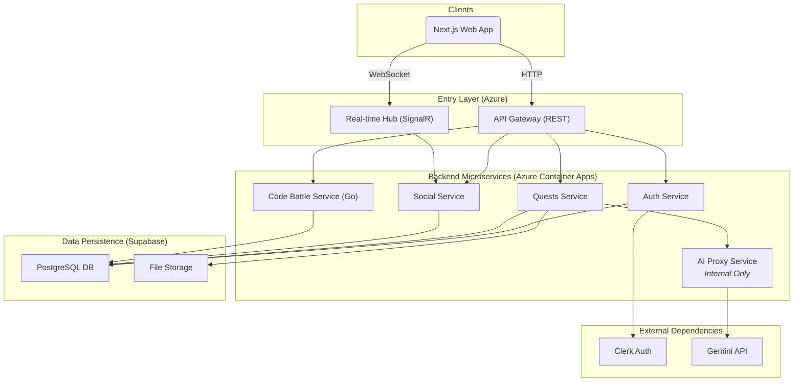
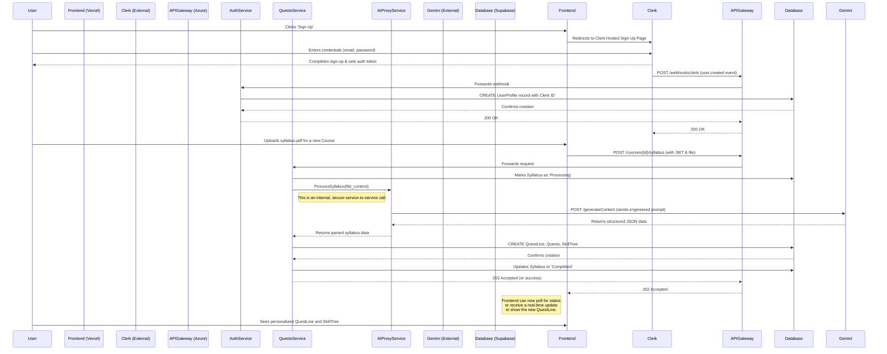

# **RogueLearn Fullstack Architecture Document**

## **Introduction**

This document outlines the complete fullstack architecture for RogueLearn, including backend systems, frontend implementation, and their integration. It serves as the single source of truth for AI-driven development, ensuring consistency across the entire technology stack.

This unified approach combines what would traditionally be separate backend and frontend architecture documents, streamlining the development process for modern fullstack applications where these concerns are increasingly intertwined.

### **Starter Template or Existing Project**

The project will be built **from scratch** following a **multi-repo, microservices architecture**. No overarching starter template will be used, allowing for a custom structure tailored to the project's specific needs.

*   **Frontend**: A standalone Next.js 14+ application using Tailwind CSS and Shadcn/UI.
*   **Backend**: A series of independent microservices, each in its own repository. The core services will be built with **.NET 8**, and the specialized, high-performance code grading service will be built with **Go**.

This approach provides maximum flexibility, clear separation of concerns, and allows us to use the best language for each service's specific task.

### **Change Log**

| Date          | Version | Description                                                                    | Author             |
| :------------ | :------ | :----------------------------------------------------------------------------- | :----------------- |
| Sep 12, 2025  | 1.5     | Removed Marketplace feature per user request to focus on core learning experience. | Winston, Architect |
| Sep 12, 2025  | 1.4     | Aligned architecture with expanded PRD. Added Marketplace, Duels, and Real-Time features. | Winston, Architect |
| Sep 11, 2025  | 1.3     | Corrected Introduction to include Go as a backend technology.                  | Winston, Architect |
| Sep 11, 2025  | 1.2     | Replaced TanStack Router with native Next.js App Router per user feedback.     | Winston, Architect |
| Sep 11, 2025  | 1.1     | Noted TanStack Router as the selected routing library.                         | Winston, Architect |
| Sep 11, 2025  | 1.0     | Initial document creation and multi-repo decision.                             | Winston, Architect |

## **High Level Architecture**

### **Technical Summary**

RogueLearn will be implemented as a cloud-native, multi-repository application featuring a decoupled frontend and a microservices-based backend. The frontend will be a server-rendered Next.js application hosted on Vercel. The backend will consist of independent microservices built with **.NET 8** and **Go**, deployed on Azure Container Apps, communicating via a centralized API Gateway for RESTful requests and a real-time layer for interactive features. This architecture supports core learning features, social collaboration, and competitive "Knowledge Duels," including a specialized service for scoring code submissions. Data will be persisted in a Supabase PostgreSQL database, with user authentication managed by Clerk.

### **Platform and Infrastructure Choice**

To best support our technology stack and scalability goals, I recommend the following platform configuration:

*   **Platform:** A hybrid-cloud approach leveraging best-in-class services.
    *   **Frontend Hosting:** **Vercel**. It is purpose-built for Next.js, providing seamless deployments, global CDN, and serverless functions out-of-the-box.
    *   **Backend Hosting:** **Azure Container Apps**. This is a serverless container platform that is ideal for running our .NET and Go microservices. It handles scaling, networking, and ingress automatically, allowing us to focus on code.
    *   **Database:** **Supabase**. Provides a managed PostgreSQL instance with excellent real-time capabilities, file storage, and a straightforward API, which aligns perfectly with the PRD requirements.
*   **Key Services:**
    *   **Vercel:** Next.js Hosting, Edge Network (CDN)
    *   **Azure:** Container Apps, API Management (for the API Gateway)
    *   **Supabase:** PostgreSQL Database, Storage
    *   **Clerk:** External Authentication Service
    *   **Internal AI Proxy Service:** A dedicated backend service to securely manage communication with the Gemini API.

### **Repository Structure**

As established, we will use a **Multi-Repo Strategy** to support our microservices architecture. This provides the best separation of concerns and allows for independent development lifecycles. The initial repository structure will be:

*   **`roguelearn-web`**: The Next.js frontend application.
*   **`roguelearn-auth-service`**: .NET microservice for user identity, profiles, and Clerk integration.
*   **`roguelearn-quests-service`**: .NET microservice for syllabi, quests, skill trees, and game logic.
*   **`roguelearn-social-service`**: .NET microservice for Parties, Guilds, Events, and real-time features like Duels.
*   **`roguelearn-code-battle-service`**: **Go** microservice for compiling, running, and scoring user-submitted code.
*   **`roguelearn-shared-types`**: A private NPM package for shared TypeScript interfaces between frontend and backend services.

### **High Level Architecture Diagram**

This diagram illustrates the primary components and data flow of the RogueLearn platform.

```mermaid
graph TD
    subgraph "User Layer"
        User[👩‍🎓 Student]
        BrowserExtension[Chrome Extension]
    end

    subgraph "Presentation Layer (Vercel)"
        Frontend[Next.js Web App]
    end

    subgraph "External Services"
        Clerk[Clerk Authentication]
        Gemini[Gemini API]
    end

    subgraph "Backend Layer (Azure)"
        APIGateway[API Gateway (REST)]
        RealtimeHub[Real-time Hub (WebSockets)]
        
        subgraph "Microservices"
            AuthService[.NET Auth Service]
            QuestService[.NET Quests Service]
            SocialService[.NET Social Service]
            CodeBattleService[Go Code Battle Service]
            AIProxyService[.NET AI Proxy Service]
        end
    end

    subgraph "Data Layer (Supabase)"
        Database[PostgreSQL Database]
        FileStorage[File Storage]
    end

    User --> Frontend
    BrowserExtension --> APIGateway

    Frontend --> APIGateway
    Frontend -- WebSockets --> RealtimeHub
    
    APIGateway --> AuthService
    APIGateway --> QuestService
    APIGateway --> SocialService
    APIGateway --> CodeBattleService
    APIGateway --> AIProxyService
    
    RealtimeHub --> SocialService

    AuthService --> Clerk
    AuthService --> Database

    QuestService --> Database
    QuestService --> FileStorage
    
    SocialService --> Database
    
    CodeBattleService --> Database
    
    AIProxyService --> Gemini
    AIProxyService --> Database

    Database <--> FileStorage
```

### **Architectural and Design Patterns**

The following patterns will be foundational to our implementation. Adhering to them will ensure consistency, quality, and maintainability.

*   **Microservices Architecture:** The backend will be composed of small, independent services. *Rationale:* This allows for independent development, deployment, and scaling of different parts of the application (e.g., social features can be updated without affecting the core quest system).
*   **API Gateway:** The frontend will communicate with the backend through a single entry point for synchronous requests. *Rationale:* This simplifies the frontend code, centralizes cross-cutting concerns like authentication and rate limiting, and hides the complexity of the microservices from the client.
*   **Clean Architecture (.NET):** Each microservice will be structured with a clear separation between domain logic, application logic, and infrastructure concerns. *Rationale:* This produces highly testable, maintainable, and loosely-coupled services that are independent of external frameworks or databases.
*   **Component-Based UI (Next.js):** The frontend will be built as a collection of reusable, self-contained components. *Rationale:* This is the standard for modern frontend development and promotes reusability, maintainability, and faster development cycles.
*   **Repository Pattern (.NET):** Data access within each microservice will be abstracted behind a repository interface. *Rationale:* This decouples our business logic from the specific data access implementation (Entity Framework Core), making the code easier to test and allowing for future changes to the data layer.

## **Tech Stack**

This table is the single source of truth for all technologies, frameworks, and libraries to be used in the RogueLearn project. All development must adhere to these specific choices and versions.

### **Technology Stack Table**

| Category            | Technology                  | Version   | Purpose                                           | Rationale                                                                                                                                                    |
| :------------------ | :-------------------------- | :-------- | :------------------------------------------------ | :----------------------------------------------------------------------------------------------------------------------------------------------------------- |
| **Frontend Language** | TypeScript                | `5.4.x`   | Primary language for frontend development         | Ensures type safety, scalability, and improved developer experience in a large application.                                                                  |
| **Frontend Framework**  | Next.js                   | `14.2.x`  | Web framework for the user-facing application     | Provides a robust foundation with server-side rendering (SSR), static site generation (SSG), and a powerful App Router.                                     |
| **UI Component Library** | Shadcn/UI                 | `latest`  | A collection of re-usable components              | Not a typical component library, but a set of scripts to install best-in-class components directly into our codebase, offering maximum control and customizability. |
| **Frontend Routing**| **Next.js App Router**      | `14.2.x`  | Native file-system based routing for Next.js      | The built-in, officially supported router. It's deeply integrated with Next.js features like Server Components, Layouts, and data fetching.                    |
| **State Management**  | React Query / Zustand       | `5.x` / `4.x` | For server state caching and global client state  | React Query is the standard for managing server state (API data). Zustand provides a minimal, boilerplate-free solution for any necessary global client state.   |
| **Styling**         | Tailwind CSS                | `3.4.x`   | Utility-first CSS framework                     | Enables rapid development of custom designs without writing custom CSS. Works perfectly with Next.js and Shadcn/UI.                                        |
| **Backend Language**  | C# / **Go**               | `12` / `1.22.x` | Primary languages for backend microservices     | C# with .NET is the primary choice for core services. Go is used for the high-performance, specialized Code Battle Scorer service.                             |
| **Backend Framework**| .NET                        | `8.0`     | Framework for building core backend microservices | The latest Long-Term Support (LTS) version of .NET, offering high performance, cross-platform support, and a rich ecosystem.                                   |
| **API Style**       | RESTful API                 | `v1`      | Standard for communication between services       | A well-understood, stateless, and scalable approach for our APIs. The API Gateway will expose a unified REST API.                                            |
| **Real-time Comms** | SignalR                     | `8.0`     | For real-time features like duels and notifications | A library for .NET that simplifies adding real-time web functionality. It handles connection management and supports WebSockets with fallbacks.                  |
| **Database**        | PostgreSQL                  | `15.x`    | Primary relational database                       | A powerful, open-source object-relational database system known for its reliability, feature robustness, and performance. Provided by Supabase.                 |
| **Authentication**  | Clerk                       | `latest SDK` | Managed user authentication service               | Offloads the complexity of secure authentication, session management, and user profiles, allowing us to focus on core features.                                |
| **File Storage**    | Supabase Storage            | `latest SDK` | For storing user-uploaded documents (syllabi, etc.) | Provides a simple, S3-compatible object storage solution with fine-grained access controls that integrates directly with our database.                           |
| **Frontend Testing**  | Jest & React Testing Library | `latest`  | For unit and component testing of the frontend    | The industry standard for testing React applications, focusing on user behavior rather than implementation details.                                            |
| **Backend Testing** | xUnit & Moq                 | `latest`  | For unit and integration testing of .NET services | xUnit is the standard, modern testing framework for .NET. Moq is a popular and powerful mocking library.                                                      |
| **E2E Testing**     | Playwright                  | `1.4x.x`  | For end-to-end testing of the entire application  | A modern and reliable E2E testing framework from Microsoft that allows us to test user flows across the full stack.                                            |
| **CI/CD**           | GitHub Actions              | `latest`  | For automating our build, test, and deployment pipelines | Tightly integrated with our source code repositories, providing a powerful and configurable automation platform.                                               |
| **Containerization**| Docker                      | `latest`  | For packaging services for deployment             | Ensures consistency between development and production environments. Essential for running microservices on Azure Container Apps.                               |
| **AI Service**      | Gemini API                  | `latest`  | For syllabus parsing and other AI-driven features | Google's powerful large language model, which will be accessed securely via our backend proxy service.                                                         |

## **Data Models**

This section defines the core data models and entities that will be shared between the frontend and backend services. These conceptual models are derived from the detailed specifications in `docs/prd/data-requirements.md`.

### **User / UserProfile**

**Purpose:** Represents an authenticated user and their extended, game-specific profile information. The core `User` identity is managed by Clerk, while the `UserProfile` stores application-specific data related to their academic and gamified journey.

**Key Attributes:**
- `userId`: `string` - The unique identifier, typically from Clerk.
- `username`: `string` - The user's public name.
- `email`: `string` - The user's email address.
- `classId`: `string` - Foreign key to the selected career goal (Class).
- `routeId`: `string` - Foreign key to the selected academic path (Route).
- `level`: `number` - The character's current level.
- `experiencePoints`: `number` - The character's current XP.
- `profileImageUrl`: `string` - URL for the user's avatar.

#### **TypeScript Interface**
```typescript
// In @roguelearn/shared-types

export interface UserProfile {
  id: string; // Our internal profile ID
  userId: string; // Clerk's user ID
  username: string;
  email: string;
  classId: string;
  routeId: string | null;
  level: number;
  experiencePoints: number;
  profileImageUrl: string | null;
  onboardingCompleted: boolean;
  createdAt: string; // ISO 8601 timestamp
  updatedAt: string; // ISO 8601 timestamp
}
```

**Relationships:**
- A `User` has one `UserProfile`.
- A `UserProfile` belongs to one `Class` and one `Route`.
- A `UserProfile` is associated with multiple `Courses`, `QuestLines`, and `SkillTrees`.

### **Course & Syllabus**

**Purpose:** Represents an academic course a user is taking. The `Course` is the high-level container, while the `Syllabus` holds the specific, AI-processed content from the user's uploaded document.

**Key Attributes:**
- `courseId`: `string` - Unique identifier for the course.
- `userId`: `string` - The owner of the course.
- `name`: `string` - The name of the course (e.g., "Introduction to Algorithms").
- `syllabusContent`: `jsonb` - The structured JSON content extracted by the AI from the uploaded syllabus file.
- `processingStatus`: `string` - Enum (`Pending`, `Processing`, `Completed`, `Failed`).
- `schemaVersion`: `string` - The version of the JSON schema used in `structuredContent` (e.g., "1.0").

#### **TypeScript Interface**```typescript
// In @roguelearn/shared-types

export type SyllabusProcessingStatus = 'Pending' | 'Processing' | 'Completed' | 'Failed';

export interface Course {
  id: string;
  userId: string;
  name: string;
  courseCode: string | null;
  // The full syllabus data is large and likely not needed on every request
  // We'll have a separate endpoint to fetch it.
  processingStatus: SyllabusProcessingStatus;
  createdAt: string; // ISO 8601 timestamp
  updatedAt: string; // ISO 8601 timestamp
}

export interface Syllabus {
  id: string;
  courseId: string;
  rawContent: string; // or reference to file
  structuredContent: Record<string, any>; // The AI-parsed JSON
  schemaVersion: string; // e.g., "1.0", "1.1"
  // ... other metadata
}
```

**Relationships:**
- A `Course` belongs to one `UserProfile`.
- A `Course` has one `Syllabus`.
- A `Course` is the source for one or more `QuestLines` and `SkillTrees`.

### **QuestLine & Quest**

**Purpose:** The `QuestLine` represents the entire learning path for a specific course, generated by the AI. Each `QuestLine` is composed of individual `Quests`, which are the actionable learning tasks, assignments, or events a student needs to complete.

**Key Attributes:**
- `questLineId`: `string` - The unique identifier for the entire quest line.
- `questId`: `string` - The unique identifier for a single quest.
- `title`: `string` - The name of the quest (e.g., "Master Big O Notation").
- `description`: `string` - Details of the task to be completed.
- `questType`: `string` - Enum (`Learning`, `Assignment`, `Exam`, `BossFight`).
- `progressStatus`: `string` - Enum (`Not Started`, `In Progress`, `Completed`).
- `dueDate`: `string` - Optional ISO 8601 timestamp.
- `experiencePoints`: `number` - XP awarded upon completion.

#### **TypeScript Interface**
```typescript
// In @roguelearn/shared-types

export type QuestType = 'Learning' | 'Assignment' | 'Exam' | 'BossFight';
export type ProgressStatus = 'Not Started' | 'In Progress' | 'Completed';

export interface Quest {
  id: string;
  questLineId: string;
  title: string;
  description: string;
  questType: QuestType;
  status: ProgressStatus;
  dueDate: string | null; // ISO 8601 timestamp
  experiencePoints: number;
  prerequisites: string[]; // Array of Quest IDs
  createdAt: string; // ISO 8601 timestamp
  updatedAt: string; // ISO 8601 timestamp
}

export interface QuestLine {
    id: string;
    userId: string;
    courseId: string;
    title: string;
    quests: Quest[]; // Can be a separate fetch
    createdAt: string; // ISO 8601 timestamp
}
```

**Relationships:**
- A `QuestLine` is generated from one `Course`.
- A `QuestLine` contains many `Quests`.
- A `Quest` can have prerequisites of other `Quests`.

### **SkillTree & Skill**

**Purpose:** The `SkillTree` is the visual representation of a user's knowledge for a given course. It contains individual `Skills` as nodes, showing how concepts are interconnected and tracking the user's mastery level.

**Key Attributes:**
- `skillTreeId`: `string` - The unique identifier for the entire skill tree.
- `skillId`: `string` - The unique identifier for a single skill node.
- `name`: `string` - The name of the skill (e.g., "Data Structures").
- `level`: `number` - The user's current proficiency level in that skill.
- `prerequisites`: `string[]` - An array of `skillId`s required to unlock this skill.
- `positionX`, `positionY`: `number` - Coordinates for rendering the node in the mind map visualization.

#### **TypeScript Interface**
```typescript
// In @roguelearn/shared-types

export interface Skill {
  id: string;
  skillTreeId: string;
  name: string;
  description: string;
  level: number;
  maxLevel: number;
  prerequisites: string[]; // Array of Skill IDs
  position: { x: number; y: number };
  createdAt: string; // ISO 8601 timestamp
  updatedAt: string; // ISO 8601 timestamp
}

export interface SkillTree {
    id: string;
    userId: string;
    courseId: string;
    name: string;
    skills: Skill[]; // Can be a separate fetch
    createdAt: string; // ISO 8601 timestamp
}
```

**Relationships:**
- A `SkillTree` is generated from one `Course`.
- A `SkillTree` contains many `Skills`.
- A `Skill` can have many prerequisite `Skills`.

### **Note (Arsenal Item)**

**Purpose:** Represents a single piece of user-generated knowledge stored in their "Arsenal." These notes are the primary study materials created by the user and can be linked to various other entities.

**Key Attributes:**
- `noteId`: `string` - Unique identifier for the note.
- `userId`: `string` - The owner of the note.
- `title`: `string` - The title of the note.
- `content`: `jsonb` - Rich text content (e.g., TipTap/ProseMirror JSON format).
- `courseId`, `questId`, `skillId`: `string | null` - Optional foreign keys to link the note to other entities.

#### **TypeScript Interface**
```typescript
// In @roguelearn/shared-types

export interface Note {
  id: string;
  userId: string;
  title: string;
  content: Record<string, any>; // Represents the rich text JSON
  // Optional associations
  courseId?: string;
  questId?: string;
  skillId?: string;
  tags: string[];
  createdAt: string; // ISO 8601 timestamp
  updatedAt: string; // ISO 8601 timestamp
}
```

**Relationships:**
- A `Note` belongs to one `UserProfile`.
- A `Note` can be optionally linked to one `Course`, one `Quest`, and/or one `Skill`.

### **Party & PartyMembership**

**Purpose:** A `Party` is a small, private study group created by a user (the Party Leader). It's designed for focused collaboration among a few members.

**Key Attributes:**
- `partyId`: `string` - Unique identifier for the party.
- `name`: `string` - The name of the study group.
- `description`: `string` - A brief description of the party's goals.
- `joinType`: `string` - Enum (`Invite Only`, `Open`).
- `partyLeaderId`: `string` - The `userId` of the creator.

#### **TypeScript Interface**
```typescript
// In @roguelearn/shared-types

export type PartyJoinType = 'Invite Only' | 'Open';

export interface PartyMember {
    userId: string;
    username: string;
    // ... other relevant public user data
}

export interface Party {
    id: string;
    name: string;
    description: string;
    joinType: PartyJoinType;
    leaderId: string;
    members: PartyMember[]; // Can be a separate fetch
    createdAt: string; // ISO 8601 timestamp
}
```

**Relationships:**
- A `Party` has one `Party Leader` (`UserProfile`).
- A `Party` has many `Members` (`UserProfile`), managed through a `PartyMembership` join table.
- A `Party` has a shared resource space (`Party Stash`).

### **Guild & GuildMembership**

**Purpose:** A `Guild` is a larger, community-focused group, similar to a subreddit or Facebook Group, created by a Guild Master. It's a hub for knowledge sharing, discussions, and hosting competitive `Events`.

**Key Attributes:**
- `guildId`: `string` - Unique identifier for the guild.
- `name`: `string` - The name of the community.
- `description`: `string` - Description of the guild's topic or purpose.
- `guildMasterId`: `string` - The `userId` of the creator.
- `isVerified`: `boolean` - Indicates if the Guild Master has the "Verified Lecturer" status.

#### **TypeScript Interface**
```typescript
// In @roguelearn/shared-types

export interface GuildMember {
    userId: string;
    username: string;
    // ... other relevant public user data
}
export interface Guild {
    id: string;
    name: string;
    description: string;
    masterId: string;
    isVerified: boolean;
    memberCount: number;
    createdAt: string; // ISO 8601 timestamp
}
```

**Relationships:**
- A `Guild` has one `Guild Master` (`UserProfile`).
- A `Guild` has many `Members` (`UserProfile`), managed through a `GuildMembership` join table.
- A `Guild` is the host for many `Events`.

### **Event & CodeBattle & Duel**

**Purpose:** An `Event` is a competition hosted by a `Guild`. `CodeBattle` and `Duel` are specific event types. A `Duel` is a real-time, 1v1 knowledge challenge.

**Key Attributes:**
- `eventId`: `string` - Unique identifier for the event.
- `guildId`: `string` - The `Guild` hosting the event.
- `title`: `string` - Name of the event.
- `eventType`: `string` - Enum (`Quiz`, `CodeBattle`, `Tournament`, `Duel`).
- `startDate`, `endDate`: `string` - ISO 8601 timestamps.

#### **TypeScript Interface**
```typescript
// In @roguelearn/shared-types

export type EventType = 'Quiz' | 'CodeBattle' | 'Tournament' | 'Duel';

export interface Event {
    id: string;
    guildId: string;
    title: string;
    description: string;
    eventType: EventType;
    startDate: string; // ISO 8601 timestamp
    endDate: string; // ISO 8601 timestamp
    detailsUrl?: string;
    createdAt: string; // ISO 8601 timestamp
}

export interface Duel {
    id: string;
    eventId: string; // Optional foreign key to an Event
    challengerId: string; // UserProfile ID
    opponentId: string; // UserProfile ID
    status: 'Pending' | 'Active' | 'Completed';
    winnerId: string | null;
    questions: { question: string; answer: string; }[];
}
```

**Relationships:**
- An `Event` belongs to one `Guild`.
- A `Duel` involves two `UserProfiles`.

## **API Specification**

This section defines the RESTful API for the RogueLearn platform using the OpenAPI 3.0 standard. All communication between the frontend and the API Gateway will adhere to this contract.

### **REST API Specification**

```yaml
openapi: 3.0.0
info:
  title: RogueLearn API
  version: v1.0.0
  description: The official API for the RogueLearn platform, providing services for gamified learning.
servers:
  - url: https://api.roguelearn.com/v1
    description: Production Server
  - url: https://staging-api.roguelearn.com/v1
    description: Staging Server

# 1. Define Security Scheme for JWT from Clerk
security:
  - BearerAuth: []

components:
  securitySchemes:
    BearerAuth:
      type: http
      scheme: bearer
      bearerFormat: JWT
      description: "JWT token obtained from Clerk after login."

  schemas:
    # Based on our shared TypeScript interfaces
    UserProfile:
      type: object
      properties:
        id:
          type: string
          format: uuid
        userId:
          type: string
        username:
          type: string
        email:
          type: string
        classId:
          type: string
          format: uuid
        routeId:
          type: string
          format: uuid
          nullable: true
        level:
          type: integer
        experiencePoints:
          type: integer
        profileImageUrl:
          type: string
          nullable: true
        onboardingCompleted:
          type: boolean
        createdAt:
          type: string
          format: date-time
        updatedAt:
          type: string
          format: date-time
          
    Course:
      type: object
      properties:
        id:
          type: string
          format: uuid
        userId:
          type: string
        name:
          type: string
        courseCode:
          type: string
          nullable: true
        processingStatus:
          type: string
          enum: [Pending, Processing, Completed, Failed]
        createdAt:
          type: string
          format: date-time
        updatedAt:
          type: string
          format: date-time
          
    Error:
      type: object
      properties:
        code:
          type: string
        message:
          type: string
        details:
          type: object

paths:
  # 2. Endpoints for User Profile Management (Auth Service)
  /profiles/me:
    get:
      summary: Get Current User's Profile
      tags: [Profiles]
      security:
        - BearerAuth: []
      responses:
        '200':
          description: Successful retrieval of user profile.
          content:
            application/json:
              schema:
                $ref: '#/components/schemas/UserProfile'
        '401':
          description: Unauthorized.
          
  # 3. Endpoints for Course Management (Quests Service)
  /courses:
    get:
      summary: Get All Courses for Current User
      tags: [Courses]
      security:
        - BearerAuth: []
      responses:
        '200':
          description: A list of the user's courses.
          content:
            application/json:
              schema:
                type: array
                items:
                  $ref: '#/components/schemas/Course'
        '401':
          description: Unauthorized.

    post:
      summary: Create a New Course
      tags: [Courses]
      security:
        - BearerAuth: []
      requestBody:
        required: true
        content:
          application/json:
            schema:
              type: object
              properties:
                name:
                  type: string
                courseCode:
                  type: string
      responses:
        '201':
          description: Course created successfully.
          content:
            application/json:
              schema:
                $ref: '#/components/schemas/Course'
        '400':
          description: Bad request (e.g., validation error).

  /courses/{courseId}/syllabus:
    post:
      summary: Upload a Syllabus for a Course
      tags: [Courses]
      security:
        - BearerAuth: []
      parameters:
        - name: courseId
          in: path
          required: true
          schema:
            type: string
            format: uuid
      requestBody:
        required: true
        content:
          multipart/form-data:
            schema:
              type: object
              properties:
                file:
                  type: string
                  format: binary
      responses:
        '202':
          description: Syllabus accepted for processing.
        '400':
          description: Bad request (e.g., invalid file type).

  # 4. Endpoints for Duels (Social Service)
  /duels/challenge:
    post:
      summary: Challenge a User to a Duel
      tags: [Duels]
      security: [{ BearerAuth: [] }]
      requestBody:
        content:
          application/json:
            schema: { type: object, properties: { opponentId: { type: string } } }
      responses:
        '202':
          description: Challenge sent.

  # 5. Endpoints for Browser Extension (AI Proxy Service)
  /extension/analyze:
    post:
      summary: Analyze content from browser extension
      tags: [Extension]
      security: [{ BearerAuth: [] }]
      requestBody:
        content:
          application/json:
            schema: { type: object, properties: { content: { type: string }, url: { type: string } } }
      responses:
        '200':
          description: Analysis results.
```

## **Components**

Based on our architectural patterns and the defined data models, the RogueLearn platform will be composed of the following major logical components. Each backend service is a distinct, independently deployable microservice.

### **Frontend Application (`roguelearn-web`)**

*   **Responsibility:** To provide the entire user-facing experience. This includes rendering the UI, managing client-side state, handling user interactions, and communicating with the backend via the API Gateway and the Real-time Hub.
*   **Key Interfaces:** The web-based GUI.
*   **Dependencies:** API Gateway, Real-time Hub, Clerk.
*   **Technology Stack:** Next.js, TypeScript, React, Tailwind CSS, Shadcn/UI.

### **Auth Service (`roguelearn-auth-service`)**

*   **Responsibility:** Manages all aspects of user identity. This includes user profile creation and management, handling webhooks from Clerk, and issuing JWTs.
*   **Key Interfaces:** REST endpoints for profile management (e.g., `GET /profiles/me`).
*   **Dependencies:** Supabase Database, Clerk.
*   **Technology Stack:** .NET 8, C#, Clean Architecture.

### **Quests Service (`roguelearn-quests-service`)**

*   **Responsibility:** Owns the core single-player learning loop. It manages Courses, Syllabi, QuestLines, Quests, and SkillTrees.
*   **Key Interfaces:** REST endpoints for all course and quest-related activities (e.g., `GET /courses`).
*   **Dependencies:** Supabase Database, Supabase File Storage, AI Proxy Service.
*   **Technology Stack:** .NET 8, C#, Clean Architecture.

### **Social Service (`roguelearn-social-service`)**

*   **Responsibility:** Manages all multi-user and community features. This includes Parties, Guilds, Events, and the real-time logic for Knowledge Duels.
*   **Key Interfaces:** REST endpoints for social activities and a SignalR hub for real-time communication.
*   **Dependencies:** Supabase Database.
*   **Technology Stack:** .NET 8, C#, SignalR.

### **AI Proxy Service (`roguelearn-ai-proxy-service`)**

*   **Responsibility:** To act as a secure, centralized gateway for all communications with the Gemini API. It manages API keys, handles prompt engineering for syllabus processing and advanced extension analysis. This service is **internal only**.
*   **Key Interfaces:** An internal API for other services to call.
*   **Dependencies:** Gemini API.
*   **Technology Stack:** .NET 8, C#.

### **Code Battle Service (`roguelearn-code-battle-service`)**

*   **Responsibility:** To compile, execute, and score user-submitted code in a secure, sandboxed environment for CodeBattle events.
*   **Key Interfaces:** REST endpoints for submitting code and retrieving results.
*   **Dependencies:** Supabase Database.
*   **Technology Stack:** Go, Docker.

### **Component Interaction Diagram**

This diagram shows how the components interact, with the API Gateway and Real-time Hub as the central mediators.



## **External APIs**

This section details the third-party APIs that the RogueLearn backend services will integrate with.

### **Clerk API**

*   **Purpose:** To manage user identities, sign-in/sign-up flows, and user sessions. Our `Auth Service` will be the primary consumer of this API.
*   **Documentation:** [https://clerk.com/docs](https://clerk.com/docs)
*   **Integration Notes:** We will primarily rely on Clerk's backend SDK for .NET. The most critical integration will be handling webhooks from Clerk to create corresponding `UserProfile` records in our own database.

### **Gemini API**

*   **Purpose:** To provide the Large Language Model (LLM) capabilities for parsing syllabi and other AI-driven features. This API will **only** be called by our internal `AI Proxy Service`.
*   **Documentation:** [https://ai.google.dev/docs](https://ai.google.dev/docs)
*   **Integration Notes:** The `AI Proxy Service` will be responsible for all prompt engineering. It will construct the detailed prompts required for syllabus analysis and other tasks, then parse the JSON responses from the Gemini API.

## **Core Workflows**

This section illustrates key system workflows using Mermaid sequence diagrams.

### **Workflow 1: New User Onboarding & First QuestLine Generation**



## **Database Schema**

This section provides the SQL DDL for creating the tables in our PostgreSQL database. This schema is derived from our conceptual data models and is designed to be managed via Entity Framework Core migrations in our .NET services.

```sql
-- ========= User Management (Managed by Auth Service) =========

CREATE TABLE "UserProfiles" (
    "Id" uuid PRIMARY KEY DEFAULT gen_random_uuid(),
    "UserId" text NOT NULL UNIQUE, -- Clerk User ID
    "Username" text NOT NULL,
    "Email" text NOT NULL,
    "ClassId" uuid, -- FK to a future "Classes" table
    "RouteId" uuid, -- FK to a future "Routes" table
    "Level" integer NOT NULL DEFAULT 1,
    "ExperiencePoints" integer NOT NULL DEFAULT 0,
    "ProfileImageUrl" text,
    "OnboardingCompleted" boolean NOT NULL DEFAULT false,
    "CreatedAt" timestamp with time zone NOT NULL DEFAULT now(),
    "UpdatedAt" timestamp with time zone NOT NULL DEFAULT now()
);

-- ========= Course & Syllabus Management (Managed by Quests Service) =========

CREATE TABLE "Courses" (
    "Id" uuid PRIMARY KEY DEFAULT gen_random_uuid(),
    "UserProfileId" uuid NOT NULL REFERENCES "UserProfiles"("Id") ON DELETE CASCADE,
    "Name" text NOT NULL,
    "CourseCode" text,
    "CreatedAt" timestamp with time zone NOT NULL DEFAULT now(),
    "UpdatedAt" timestamp with time zone NOT NULL DEFAULT now()
);

CREATE TYPE "SyllabusStatus" AS ENUM ('Pending', 'Processing', 'Completed', 'Failed');

CREATE TABLE "Syllabi" (
    "Id" uuid PRIMARY KEY DEFAULT gen_random_uuid(),
    "CourseId" uuid NOT NULL REFERENCES "Courses"("Id") ON DELETE CASCADE,
    "FileUrl" text NOT NULL, -- Link to file in Supabase Storage
    "ProcessingStatus" "SyllabusStatus" NOT NULL DEFAULT 'Pending',
    "StructuredContent" jsonb, -- The AI-parsed JSON output
    "SchemaVersion" text NOT NULL DEFAULT '1.0', -- Version of the StructuredContent schema
    "UploadedAt" timestamp with time zone NOT NULL DEFAULT now()
);

-- ========= Quest Management (Managed by Quests Service) =========

CREATE TABLE "QuestLines" (
    "Id" uuid PRIMARY KEY DEFAULT gen_random_uuid(),
    "CourseId" uuid NOT NULL REFERENCES "Courses"("Id") ON DELETE CASCADE,
    "Title" text NOT NULL,
    "CreatedAt" timestamp with time zone NOT NULL DEFAULT now()
);

CREATE TYPE "QuestType" AS ENUM ('Learning', 'Assignment', 'Exam', 'BossFight');
CREATE TYPE "ProgressStatus" AS ENUM ('Not Started', 'In Progress', 'Completed');

CREATE TABLE "Quests" (
    "Id" uuid PRIMARY KEY DEFAULT gen_random_uuid(),
    "QuestLineId" uuid NOT NULL REFERENCES "QuestLines"("Id") ON DELETE CASCADE,
    "Title" text NOT NULL,
    "Description" text,
    "Type" "QuestType" NOT NULL,
    "Status" "ProgressStatus" NOT NULL DEFAULT 'Not Started',
    "DueDate" timestamp with time zone,
    "ExperiencePoints" integer NOT NULL DEFAULT 10,
    "Prerequisites" uuid[], -- Array of Quest IDs
    "CreatedAt" timestamp with time zone NOT NULL DEFAULT now(),
    "UpdatedAt" timestamp with time zone NOT NULL DEFAULT now()
);

-- ========= Skill Tree Management (Managed by Quests Service) =========

CREATE TABLE "SkillTrees" (
    "Id" uuid PRIMARY KEY DEFAULT gen_random_uuid(),
    "CourseId" uuid NOT NULL REFERENCES "Courses"("Id") ON DELETE CASCADE,
    "Name" text NOT NULL,
    "CreatedAt" timestamp with time zone NOT NULL DEFAULT now()
);

CREATE TABLE "Skills" (
    "Id" uuid PRIMARY KEY DEFAULT gen_random_uuid(),
    "SkillTreeId" uuid NOT NULL REFERENCES "SkillTrees"("Id") ON DELETE CASCADE,
    "Name" text NOT NULL,
    "Description" text,
    "Level" integer NOT NULL DEFAULT 0,
    "MaxLevel" integer NOT NULL DEFAULT 10,
    "Prerequisites" uuid[], -- Array of Skill IDs
    "PositionX" integer,
    "PositionY" integer,
    "CreatedAt" timestamp with time zone NOT NULL DEFAULT now(),
    "UpdatedAt" timestamp with time zone NOT NULL DEFAULT now()
);

-- ========= Indexes for Performance =========
CREATE INDEX idx_courses_user_profile_id ON "Courses"("UserProfileId");
CREATE INDEX idx_syllabi_course_id ON "Syllabi"("CourseId");
CREATE INDEX idx_questlines_course_id ON "QuestLines"("CourseId");
CREATE INDEX idx_quests_questline_id ON "Quests"("QuestLineId");
CREATE INDEX idx_skilltrees_course_id ON "SkillTrees"("CourseId");
CREATE INDEX idx_skills_skilltree_id ON "Skills"("SkillTreeId");

-- ========= Arsenal (Notes) Management (Managed by Quests Service) =========

CREATE TABLE "Notes" (
    "Id" uuid PRIMARY KEY DEFAULT gen_random_uuid(),
    "UserProfileId" uuid NOT NULL REFERENCES "UserProfiles"("Id") ON DELETE CASCADE,
    "Title" text NOT NULL,
    "Content" jsonb,
    "CourseId" uuid REFERENCES "Courses"("Id") ON DELETE SET NULL,
    "QuestId" uuid REFERENCES "Quests"("Id") ON DELETE SET NULL,
    "SkillId" uuid REFERENCES "Skills"("Id") ON DELETE SET NULL,
    "Tags" text[],
    "CreatedAt" timestamp with time zone NOT NULL DEFAULT now(),
    "UpdatedAt" timestamp with time zone NOT NULL DEFAULT now()
);

CREATE INDEX idx_notes_user_profile_id ON "Notes"("UserProfileId");

-- ========= Social Features (Managed by Social Service) =========

CREATE TYPE "PartyJoinType" AS ENUM ('Invite Only', 'Open');

CREATE TABLE "Parties" (
    "Id" uuid PRIMARY KEY DEFAULT gen_random_uuid(),
    "Name" text NOT NULL,
    "Description" text,
    "JoinType" "PartyJoinType" NOT NULL DEFAULT 'Invite Only',
    "LeaderId" uuid NOT NULL REFERENCES "UserProfiles"("Id") ON DELETE CASCADE,
    "CreatedAt" timestamp with time zone NOT NULL DEFAULT now(),
    "UpdatedAt" timestamp with time zone NOT NULL DEFAULT now()
);

CREATE TABLE "PartyMemberships" (
    "PartyId" uuid NOT NULL REFERENCES "Parties"("Id") ON DELETE CASCADE,
    "UserProfileId" uuid NOT NULL REFERENCES "UserProfiles"("Id") ON DELETE CASCADE,
    "JoinedAt" timestamp with time zone NOT NULL DEFAULT now(),
    PRIMARY KEY ("PartyId", "UserProfileId")
);

CREATE INDEX idx_parties_leader_id ON "Parties"("LeaderId");

CREATE TABLE "Guilds" (
    "Id" uuid PRIMARY KEY DEFAULT gen_random_uuid(),
    "Name" text NOT NULL,
    "Description" text,
    "MasterId" uuid NOT NULL REFERENCES "UserProfiles"("Id") ON DELETE CASCADE,
    "IsVerified" boolean NOT NULL DEFAULT false,
    "CreatedAt" timestamp with time zone NOT NULL DEFAULT now(),
    "UpdatedAt" timestamp with time zone NOT NULL DEFAULT now()
);

CREATE TABLE "GuildMemberships" (
    "GuildId" uuid NOT NULL REFERENCES "Guilds"("Id") ON DELETE CASCADE,
    "UserProfileId" uuid NOT NULL REFERENCES "UserProfiles"("Id") ON DELETE CASCADE,
    "JoinedAt" timestamp with time zone NOT NULL DEFAULT now(),
    PRIMARY KEY ("GuildId", "UserProfileId")
);

CREATE INDEX idx_guilds_master_id ON "Guilds"("MasterId");

CREATE TYPE "EventType" AS ENUM ('Quiz', 'CodeBattle', 'Tournament', 'Duel');

CREATE TABLE "Events" (
    "Id" uuid PRIMARY KEY DEFAULT gen_random_uuid(),
    "GuildId" uuid NOT NULL REFERENCES "Guilds"("Id") ON DELETE CASCADE,
    "Title" text NOT NULL,
    "Description" text,
    "Type" "EventType" NOT NULL,
    "StartDate" timestamp with time zone,
    "EndDate" timestamp with time zone,
    "CreatedAt" timestamp with time zone NOT NULL DEFAULT now(),
    "UpdatedAt" timestamp with time zone NOT NULL DEFAULT now()
);

CREATE TABLE "CodeBattles" (
    "EventId" uuid PRIMARY KEY REFERENCES "Events"("Id") ON DELETE CASCADE,
    "ProblemStatement" text NOT NULL,
    "TestCases" jsonb -- Array of { "input": "...", "expectedOutput": "..." }
);

CREATE INDEX idx_events_guild_id ON "Events"("GuildId");
```

## **Frontend Architecture**

This section defines the specific architectural patterns and standards for the `roguelearn-web` Next.js application. All frontend development must adhere to these guidelines.

### **Component Architecture**

#### **Component Organization**
We will follow a feature-based folder structure inside `src/components/`. Core, reusable components will live in a `ui/` subfolder (aligned with Shadcn/UI), while feature-specific components will be grouped by the feature they belong to.

```plaintext
roguelearn-web/
└── src/
    ├── app/                # Next.js App Router
    ├── components/
    │   ├── ui/             # Shadcn UI components (e.g., button.tsx, card.tsx)
    │   ├── icons/          # Custom icon components
    │   ├── layout/         # Global layout components (Navbar, Sidebar)
    │   ├── features/
    │   │   ├── quests/     # Components related to the Quest Line
    │   │   │   ├── QuestList.tsx
    │   │   │   └── QuestItem.tsx
    │   │   └── skill-tree/ # Components for the Skill Tree
    │   │       └── SkillTreeGraph.tsx
    │   └── auth/           # Components for authentication
    │       └── UserProfileButton.tsx
    ├── lib/                # Utility functions, API clients
    └── hooks/              # Custom React hooks
```

#### **Component Template**
All new components should follow this basic structure for consistency.

```typescript
// Example: src/components/features/quests/QuestItem.tsx
import * as React from 'react';
import { Card, CardContent, CardHeader, CardTitle } from '@/components/ui/card';
import { Quest } from '@roguelearn/shared-types'; // Assumes shared types package

interface QuestItemProps {
  quest: Quest;
}

const QuestItem: React.FC<QuestItemProps> = ({ quest }) => {
  return (
    <Card>
      <CardHeader>
        <CardTitle>{quest.title}</CardTitle>
      </CardHeader>
      <CardContent>
        <p>{quest.description}</p>
        {/* Additional details */}
      </CardContent>
    </Card>
  );
};

export default QuestItem;
```

### **State Management Architecture**

*   **Server State:** **React Query** (`@tanstack/react-query`) will be the default for all data fetching, caching, and server-side state management. It handles loading states, errors, retries, and caching out-of-the-box.
*   **Client State:** **Zustand** will be used for any necessary global client-side state that is not tied to the server, such as UI theme, notification toasts, or complex form state.

### **Routing Architecture**

*   **Library:** **Next.js App Router** will be used for all routing. This is the native, file-system based router provided by Next.js.
*   **Route Definitions:** Routes are defined by creating folders and `page.tsx` files within the `src/app/` directory. Dynamic routes will use bracket syntax (e.g., `src/app/quests/[questId]/page.tsx`).
*   **Protected Routes:** A **middleware** file (`src/middleware.ts`) will be used to protect routes. This middleware will integrate with the Clerk SDK to check the user's authentication state on incoming requests and redirect unauthenticated users to the `/sign-in` page.

### **Frontend Services Layer**

*   **API Client:** A type-safe API client will be created using `axios`. A single instance will be configured with interceptors to automatically attach the JWT Bearer token from Clerk to all outgoing requests.
*   **Service Example:**

```typescript
// src/lib/api-client.ts
import axios from 'axios';
import { clerk } from './clerk'; // Your Clerk initialization

const apiClient = axios.create({
  baseURL: process.env.NEXT_PUBLIC_API_URL,
});

apiClient.interceptors.request.use(async (config) => {
  const token = await clerk.session?.getToken();
  if (token) {
    config.headers.Authorization = `Bearer ${token}`;
  }
  return config;
});

export default apiClient;
```

## **Backend Architecture**

This section defines the architecture for all .NET microservices.

### **Service Architecture**

*   **Pattern:** **Clean Architecture** will be strictly followed. Each service will have distinct layers for Domain, Application, and Infrastructure.
*   **Function Organization:** For services deployed to Azure Container Apps, the entry point will be a standard ASP.NET Core Web API project.

### **Database Architecture**

*   **Data Access:** **Entity Framework Core (EF Core)** will be used as the Object-Relational Mapper (ORM).
*   **Data Access Layer:** The **Repository Pattern** will be used to abstract all data access logic, ensuring the Application layer is ignorant of the persistence mechanism.

```csharp
// Example: IQuestRepository.cs
public interface IQuestRepository
{
    Task<Quest?> GetByIdAsync(Guid id);
    Task<IEnumerable<Quest>> GetByQuestLineIdAsync(Guid questLineId);
    Task AddAsync(Quest quest);
    // ... other methods
}
```

### **Authentication and Authorization**

*   **Authentication:** The API Gateway will be the primary validator of JWTs issued by Clerk. It will pass user identity information in a request header to the downstream microservices.
*   **Authorization:** Each microservice will implement its own authorization logic using .NET's built-in `[Authorize]` attributes and custom policies to check user roles or claims.

## **Unified Project Structure**

As defined, we will use a **Multi-Repo Strategy**. Each component in the architecture diagram will have its own Git repository. The `@roguelearn/shared-types` package will be managed in its own repository and published to a private NPM registry (like GitHub Packages) to be consumed by the frontend and backend projects that need it.