# **RogueLearn Fullstack Architecture Document**

## **Introduction**

This document outlines the complete fullstack architecture for RogueLearn, including backend systems, frontend implementation, and their integration. It serves as the single source of truth for AI-driven development, ensuring consistency across the entire technology stack.

This unified approach combines what would traditionally be separate backend and frontend architecture documents, streamlining the development process for modern fullstack applications where these concerns are increasingly intertwined.

### **Starter Template or Existing Project**

The project will be built **from scratch** following a **multi-repo, microservices architecture**. No overarching starter template will be used, allowing for a custom structure tailored to the project's specific needs.

*   **Frontend**: A standalone Next.js 14+ application using Tailwind CSS and Shadcn/UI.
*   **Game Client**: A standalone Unity 2022.3 LTS project for interactive "Boss Fights".
*   **Backend**: A series of independent microservices built with **.NET 8** and **Go**.

This approach provides maximum flexibility, clear separation of concerns, and allows us to use the best language for each service's specific task.

### **Change Log**

| Date          | Version | Description                                                                    | Author             |
| :------------ | :------ | :----------------------------------------------------------------------------- | :----------------- |
| Sep 12, 2025  | 1.6     | Integrated Unity WebGL feature for "Boss Fights" across the architecture.        | Winston, Architect |
| Sep 12, 2025  | 1.5     | Removed Marketplace feature per user request to focus on core learning experience. | Winston, Architect |
| Sep 12, 2025  | 1.4     | Aligned architecture with expanded PRD. Added Marketplace, Duels, and Real-Time features. | Winston, Architect |
| Sep 11, 2025  | 1.3     | Corrected Introduction to include Go as a backend technology.                  | Winston, Architect |
| Sep 11, 2025  | 1.2     | Replaced TanStack Router with native Next.js App Router per user feedback.     | Winston, Architect |
| Sep 11, 2025  | 1.1     | Noted TanStack Router as the selected routing library.                         | Winston, Architect |
| Sep 11, 2025  | 1.0     | Initial document creation and multi-repo decision.                             | Winston, Architect |

## **High Level Architecture**

### **Technical Summary**

RogueLearn will be implemented as a cloud-native, multi-repository application. It features a decoupled frontend built with Next.js, interactive "Boss Fights" built with **Unity WebGL**, and a microservices-based backend using **.NET 8** and **Go**. The system is deployed on Vercel and Azure Container Apps. Communication is handled by a RESTful API Gateway and a real-time SignalR hub for interactive features. The architecture supports AI-powered quest generation, social collaboration, competitive Duels, and code-grading battles. Data is persisted in a Supabase PostgreSQL database, with authentication managed by Clerk.

### **Platform and Infrastructure Choice**

To best support our technology stack and scalability goals, I recommend the following platform configuration:

*   **Platform:** A hybrid-cloud approach leveraging best-in-class services.
    *   **Frontend Hosting:** **Vercel**. It is purpose-built for Next.js, providing seamless deployments, global CDN, and serverless functions out-of-the-box.
    *   **Backend Hosting:** **Azure Container Apps**. This is a serverless container platform that is ideal for running our .NET and Go microservices.
    *   **Database & Storage:** **Supabase**. Provides a managed PostgreSQL instance, real-time capabilities, and file storage which will be used for both user documents and hosting Unity game assets.
*   **Key Services:**
    *   **Vercel:** Next.js Hosting, Edge Network (CDN)
    *   **Azure:** Container Apps, API Management (for the API Gateway)
    *   **Supabase:** PostgreSQL Database, Storage (for documents and game assets)
    *   **Clerk:** External Authentication Service
    *   **Internal AI Proxy Service:** A dedicated backend service to securely manage communication with the Gemini API.

### **Repository Structure**

As established, we will use a **Multi-Repo Strategy**. This provides the best separation of concerns and allows for independent development lifecycles. The initial repository structure will be:

*   **`roguelearn-web`**: The Next.js frontend application.
*   **`roguelearn-unity-games`**: The Unity project containing the "Boss Fight" game client.
*   **`roguelearn-auth-service`**: .NET microservice for user identity, profiles, and Clerk integration.
*   **`roguelearn-quests-service`**: .NET microservice for syllabi, quests, skill trees, and game session logic.
*   **`roguelearn-social-service`**: .NET microservice for Parties, Guilds, Events, and real-time features like Duels.
*   **`roguelearn-code-battle-service`**: **Go** microservice for compiling, running, and scoring user-submitted code.
*   **`roguelearn-shared-types`**: A private NPM package for shared TypeScript interfaces.

### **High Level Architecture Diagram**

This diagram illustrates the primary components and data flow of the RogueLearn platform, now including the Unity game client.

```mermaid
graph TD
    subgraph "User Layer"
        User[👩‍🎓 Student]
        BrowserExtension[Chrome Extension]
    end

    subgraph "Presentation Layer (Vercel)"
        Frontend[Next.js Web App]
        UnityClient[Unity Game Client]
        Frontend --> UnityClient
    end

    subgraph "External Services"
        Clerk[Clerk Authentication]
        Gemini[Gemini API]
    end

    subgraph "Backend Layer (Azure)"
        APIGateway[API Gateway REST]
        RealtimeHub[Real-time Hub WebSockets]
        
        subgraph "Microservices"
            AuthService[.NET Auth Service]
            QuestService[.NET Quests Service]
            SocialService[.NET Social Service]
            CodeBattleService[Go Code Battle Service]
            AIProxyService[.NET AI Proxy Service]
        end
    end

    subgraph "Data & Asset Layer (Supabase)"
        Database[PostgreSQL Database]
        FileStorage[File Storage for Docs]
        GameAssetHosting[Game Asset Hosting]
    end

    User --> Frontend
    BrowserExtension --> APIGateway

    Frontend --> APIGateway
    Frontend -.-> RealtimeHub
    UnityClient --> GameAssetHosting
    UnityClient --> APIGateway
    
    APIGateway --> AuthService
    APIGateway --> QuestService
    APIGateway --> SocialService
    APIGateway --> CodeBattleService
    APIGateway --> AIProxyService
    
    RealtimeHub --> SocialService

    AuthService --> Clerk
    AuthService --> Database

    QuestService --> Database
    QuestService --> FileStorage
    
    SocialService --> Database
    
    CodeBattleService --> Database
    
    AIProxyService --> Gemini
    AIProxyService --> Database

    Database <--> FileStorage
```



### **Architectural and Design Patterns**

*   **Microservices Architecture:** The backend will be composed of small, independent services. *Rationale:* This allows for independent development, deployment, and scaling.
*   **API Gateway:** A single entry point for synchronous requests. *Rationale:* Simplifies the client, centralizes cross-cutting concerns like auth and rate limiting.
*   **Clean Architecture (.NET):** Each microservice will separate domain logic, application logic, and infrastructure. *Rationale:* Produces highly testable and maintainable services.
*   **Component-Based UI (Next.js):** The frontend will be built as a collection of reusable components. *Rationale:* Promotes reusability and faster development.
*   **Repository Pattern (.NET):** Data access within each microservice will be abstracted. *Rationale:* Decouples business logic from data access implementation.

## **Tech Stack**

This table is the single source of truth for all technologies, frameworks, and libraries to be used in the RogueLearn project.

### **Technology Stack Table**

| Category               | Technology                  | Version       | Purpose                                           | Rationale                                                                                                                                                    |
| :--------------------- | :-------------------------- | :------------ | :------------------------------------------------ | :----------------------------------------------------------------------------------------------------------------------------------------------------------- |
| **Frontend Language**    | TypeScript                | `5.4.x`       | Primary language for frontend development         | Ensures type safety and scalability.                                                                                                                         |
| **Frontend Framework**   | Next.js                   | `14.2.x`      | Web framework for the user-facing application     | Provides a robust foundation with SSR, SSG, and a powerful App Router.                                                                                       |
| **Game Engine**          | Unity                     | `2022.3 LTS`  | For interactive "Boss Fight" challenges           | Industry-standard game engine with a robust WebGL build target for web integration.                                                                        |
| **UI Component Library** | Shadcn/UI                 | `latest`      | A collection of re-usable components              | Offers maximum control and customizability by installing components directly into the codebase.                                                                |
| **Frontend Routing**     | **Next.js App Router**      | `14.2.x`      | Native file-system based routing for Next.js      | The built-in, officially supported router for Next.js.                                                                                                       |
| **State Management**     | React Query / Zustand       | `5.x` / `4.x` | Server state caching and global client state      | Efficient and modern state management solution for React applications.                                                                                     |
| **Styling**              | Tailwind CSS                | `3.4.x`       | Utility-first CSS framework                     | Enables rapid development of custom designs.                                                                                                                 |
| **Backend Language**     | C# / **Go**               | `12` / `1.22.x` | Primary languages for backend microservices     | C# for core services; Go for the high-performance Code Battle service.                                                                                       |
| **Backend Framework**    | .NET                        | `8.0`         | Framework for building core backend microservices | The latest LTS version of .NET, offering high performance and a rich ecosystem.                                                                              |
| **API Style**            | RESTful API                 | `v1`          | Standard for communication between services       | A well-understood, stateless, and scalable approach for our APIs.                                                                                            |
| **Real-time Comms**      | SignalR                     | `8.0`         | For real-time features like duels and notifications | Simplifies adding real-time web functionality in a .NET ecosystem.                                                                                         |
| **Database**             | PostgreSQL                  | `15.x`        | Primary relational database                       | Powerful, reliable open-source database provided by Supabase.                                                                                                |
| **Authentication**       | Clerk                       | `latest SDK`  | Managed user authentication service               | Offloads the complexity of secure authentication and user management.                                                                                      |
| **File Storage**         | Supabase Storage            | `latest SDK`  | Storing user-uploaded documents (syllabi)         | Simple, S3-compatible object storage that integrates directly with our database.                                                                             |
| **Game Asset Hosting**   | Supabase Storage            | `latest SDK`  | To host and serve Unity WebGL builds              | Leverages the same storage solution and its CDN capabilities for fast game loading.                                                                        |
| **Frontend Testing**     | Jest & React Testing Library | `latest`      | For unit and component testing of the frontend    | The industry standard for testing React applications.                                                                                                        |
| **Backend Testing**      | xUnit & Moq                 | `latest`      | For unit and integration testing of .NET services | The standard, modern testing framework for .NET.                                                                                                             |
| **E2E Testing**          | Playwright                  | `1.4x.x`      | For end-to-end testing of the entire application  | A modern and reliable E2E testing framework from Microsoft.                                                                                                  |
| **CI/CD**                | GitHub Actions              | `latest`      | For automating build, test, and deployment        | Tightly integrated with our source code repositories.                                                                                                        |
| **Containerization**     | Docker                      | `latest`      | For packaging services for deployment             | Ensures consistency between development and production environments.                                                                                       |
| **AI Service**           | Gemini API                  | `latest`      | For syllabus parsing and other AI-driven features | Google's powerful LLM, accessed securely via our backend proxy.                                                                                              |

## **Data Models**

This section defines the core data models and entities for the platform.

### **User / UserProfile**

**Purpose:** Represents an authenticated user and their extended, game-specific profile information. The core `User` identity is managed by Clerk, while the `UserProfile` stores application-specific data related to their academic and gamified journey.

**Key Attributes:**
- `userId`: `string` - The unique identifier, typically from Clerk.
- `username`: `string` - The user's public name.
- `email`: `string` - The user's email address.
- `classId`: `string` - Foreign key to the selected career goal (Class).
- `routeId`: `string` - Foreign key to the selected academic path (Route).
- `level`: `number` - The character's current level.
- `experiencePoints`: `number` - The character's current XP.
- `profileImageUrl`: `string` - URL for the user's avatar.

#### **TypeScript Interface**
```typescript
// In @roguelearn/shared-types
export interface UserProfile {
  id: string; // Our internal profile ID
  userId: string; // Clerk's user ID
  username: string;
  email: string;
  classId: string;
  routeId: string | null;
  level: number;
  experiencePoints: number;
  profileImageUrl: string | null;
  onboardingCompleted: boolean;
  createdAt: string; // ISO 8601 timestamp
  updatedAt: string; // ISO 8601 timestamp
}
```

### **Course & Syllabus**

**Purpose:** Represents an academic course a user is taking. The `Course` is the high-level container, while the `Syllabus` holds the specific, AI-processed content from the user's uploaded document.

**Key Attributes:**
- `courseId`: `string` - Unique identifier for the course.
- `userId`: `string` - The owner of the course.
- `name`: `string` - The name of the course (e.g., "Introduction to Algorithms").
- `syllabusContent`: `jsonb` - The structured JSON content extracted by the AI from the uploaded syllabus file.
- `processingStatus`: `string` - Enum (`Pending`, `Processing`, `Completed`, `Failed`).
- `schemaVersion`: `string` - The version of the JSON schema used in `structuredContent` (e.g., "1.0").

#### **TypeScript Interface**
```typescript
// In @roguelearn/shared-types
export type SyllabusProcessingStatus = 'Pending' | 'Processing' | 'Completed' | 'Failed';

export interface Course {
  id: string;
  userId: string;
  name: string;
  courseCode: string | null;
  processingStatus: SyllabusProcessingStatus;
  createdAt: string; // ISO 8601 timestamp
  updatedAt: string; // ISO 8601 timestamp
}

export interface Syllabus {
  id: string;
  courseId: string;
  rawContent: string; // or reference to file
  structuredContent: Record<string, any>; // The AI-parsed JSON
  schemaVersion: string; // e.g., "1.0", "1.1"
}
```

### **QuestLine & Quest**

**Purpose:** The `QuestLine` represents the entire learning path for a specific course, generated by the AI. Each `QuestLine` is composed of individual `Quests`, which are the actionable learning tasks, assignments, or events a student needs to complete.

**Key Attributes:**
- `questLineId`: `string` - The unique identifier for the entire quest line.
- `questId`: `string` - The unique identifier for a single quest.
- `title`: `string` - The name of the quest (e.g., "Master Big O Notation").
- `description`: `string` - Details of the task to be completed.
- `questType`: `string` - Enum (`Learning`, `Assignment`, `Exam`, `BossFight`).
- `progressStatus`: `string` - Enum (`Not Started`, `In Progress`, `Completed`).
- `dueDate`: `string` - Optional ISO 8601 timestamp.
- `experiencePoints`: `number` - XP awarded upon completion.

#### **TypeScript Interface**
```typescript
// In @roguelearn/shared-types
export type QuestType = 'Learning' | 'Assignment' | 'Exam' | 'BossFight';
export type ProgressStatus = 'Not Started' | 'In Progress' | 'Completed';

export interface Quest {
  id: string;
  questLineId: string;
  title: string;
  description: string;
  questType: QuestType;
  status: ProgressStatus;
  dueDate: string | null; // ISO 8601 timestamp
  experiencePoints: number;
  prerequisites: string[]; // Array of Quest IDs
  createdAt: string; // ISO 8601 timestamp
  updatedAt: string; // ISO 8601 timestamp
}

export interface QuestLine {
    id: string;
    userId: string;
    courseId: string;
    title: string;
    quests: Quest[]; // Can be a separate fetch
    createdAt: string; // ISO 8601 timestamp
}
```

### **SkillTree & Skill**

**Purpose:** The `SkillTree` is the visual representation of a user's knowledge for a given course. It contains individual `Skills` as nodes, showing how concepts are interconnected and tracking the user's mastery level.

**Key Attributes:**
- `skillTreeId`: `string` - The unique identifier for the entire skill tree.
- `skillId`: `string` - The unique identifier for a single skill node.
- `name`: `string` - The name of the skill (e.g., "Data Structures").
- `level`: `number` - The user's current proficiency level in that skill.
- `prerequisites`: `string[]` - An array of `skillId`s required to unlock this skill.
- `positionX`, `positionY`: `number` - Coordinates for rendering the node in the mind map visualization.

#### **TypeScript Interface**```typescript
// In @roguelearn/shared-types
export interface Skill {
  id: string;
  skillTreeId: string;
  name: string;
  description: string;
  level: number;
  maxLevel: number;
  prerequisites: string[]; // Array of Skill IDs
  position: { x: number; y: number };
  createdAt: string; // ISO 8601 timestamp
  updatedAt: string; // ISO 8601 timestamp
}

export interface SkillTree {
    id: string;
    userId: string;
    courseId: string;
    name: string;
    skills: Skill[]; // Can be a separate fetch
    createdAt: string; // ISO 8601 timestamp
}
```

### **Note (Arsenal Item)**

**Purpose:** Represents a single piece of user-generated knowledge stored in their "Arsenal." These notes are the primary study materials created by the user and can be linked to various other entities.

**Key Attributes:**
- `noteId`: `string` - Unique identifier for the note.
- `userId`: `string` - The owner of the note.
- `title`: `string` - The title of the note.
- `content`: `jsonb` - Rich text content (e.g., TipTap/ProseMirror JSON format).
- `courseId`, `questId`, `skillId`: `string | null` - Optional foreign keys to link the note to other entities.

#### **TypeScript Interface**
```typescript
// In @roguelearn/shared-types
export interface Note {
  id: string;
  userId: string;
  title: string;
  content: Record<string, any>; // Represents the rich text JSON
  courseId?: string;
  questId?: string;
  skillId?: string;
  tags: string[];
  createdAt: string; // ISO 8601 timestamp
  updatedAt: string; // ISO 8601 timestamp
}
```

### **Party & PartyMembership**

**Purpose:** A `Party` is a small, private study group created by a user (the Party Leader). It's designed for focused collaboration among a few members.

**Key Attributes:**
- `partyId`: `string` - Unique identifier for the party.
- `name`: `string` - The name of the study group.
- `description`: `string` - A brief description of the party's goals.
- `joinType`: `string` - Enum (`Invite Only`, `Open`).
- `partyLeaderId`: `string` - The `userId` of the creator.

#### **TypeScript Interface**```typescript
// In @roguelearn/shared-types
export type PartyJoinType = 'Invite Only' | 'Open';

export interface PartyMember {
    userId: string;
    username: string;
}

export interface Party {
    id: string;
    name: string;
    description: string;
    joinType: PartyJoinType;
    leaderId: string;
    members: PartyMember[]; // Can be a separate fetch
    createdAt: string; // ISO 8601 timestamp
}
```

### **Guild & GuildMembership**

**Purpose:** A `Guild` is a larger, community-focused group, similar to a subreddit or Facebook Group, created by a Guild Master. It's a hub for knowledge sharing, discussions, and hosting competitive `Events`.

**Key Attributes:**
- `guildId`: `string` - Unique identifier for the guild.
- `name`: `string` - The name of the community.
- `description`: `string` - Description of the guild's topic or purpose.
- `guildMasterId`: `string` - The `userId` of the creator.
- `isVerified`: `boolean` - Indicates if the Guild Master has the "Verified Lecturer" status.

#### **TypeScript Interface**
```typescript
// In @roguelearn/shared-types
export interface GuildMember {
    userId: string;
    username: string;
}
export interface Guild {
    id: string;
    name: string;
    description: string;
    masterId: string;
    isVerified: boolean;
    memberCount: number;
    createdAt: string; // ISO 8601 timestamp
}
```

### **Event & CodeBattle & Duel**

**Purpose:** An `Event` is a competition hosted by a `Guild`. `CodeBattle` and `Duel` are specific event types. A `Duel` is a real-time, 1v1 knowledge challenge.

**Key Attributes:**
- `eventId`: `string` - Unique identifier for the event.
- `guildId`: `string` - The `Guild` hosting the event.
- `title`: `string` - Name of the event.
- `eventType`: `string` - Enum (`Quiz`, `CodeBattle`, `Tournament`, `Duel`).
- `startDate`, `endDate`: `string` - ISO 8601 timestamps.

#### **TypeScript Interface**
```typescript
// In @roguelearn/shared-types
export type EventType = 'Quiz' | 'CodeBattle' | 'Tournament' | 'Duel';

export interface Event {
    id: string;
    guildId: string;
    title: string;
    description: string;
    eventType: EventType;
    startDate: string; // ISO 8601 timestamp
    endDate: string; // ISO 8601 timestamp
    detailsUrl?: string;
    createdAt: string; // ISO 8601 timestamp
}

export interface Duel {
    id: string;
    eventId: string | null;
    challengerId: string;
    opponentId: string;
    status: 'Pending' | 'Active' | 'Completed';
    winnerId: string | null;
    questions: { question: string; answer: string; }[];
}
```

### **GameSession**

**Purpose:** Tracks the state of an individual user's attempt at a "Boss Fight" or other interactive game event.

**Key Attributes:**
- `sessionId`: `string` - Unique identifier for the session.
- `userId`: `string` - The user playing the game.
- `questId`: `string` - The "Boss Fight" quest this session is for.
- `status`: `string` - Enum (`InProgress`, `Completed`, `Abandoned`).
- `score`: `number` - The final score achieved.
- `progressData`: `jsonb` - Flexible JSON field to store game-specific state (e.g., health, items).
- `startedAt`: `string` - ISO 8601 timestamp when the session began.
- `completedAt`: `string | null` - ISO 8601 timestamp when the session ended.

#### **TypeScript Interface**
```typescript
// In @roguelearn/shared-types

export type GameSessionStatus = 'InProgress' | 'Completed' | 'Abandoned';

export interface GameSession {
  id: string;
  userId: string;
  questId: string; // The "Boss Fight" quest
  status: GameSessionStatus;
  score: number;
  progressData: Record<string, any>; // Game-specific state
  startedAt: string;
  completedAt: string | null;
}
```

## **API Specification**

This section defines the RESTful API for the RogueLearn platform using the OpenAPI 3.0 standard.

### **REST API Specification**

```yaml
openapi: 3.0.0
info:
  title: RogueLearn API
  version: v1.0.0
  description: The official API for the RogueLearn platform, providing services for gamified learning.
servers:
  - url: https://api.roguelearn.com/v1
    description: Production Server

security:
  - BearerAuth: []

components:
  securitySchemes:
    BearerAuth:
      type: http
      scheme: bearer
      bearerFormat: JWT
      description: "JWT token obtained from Clerk after login."

  schemas:
    UserProfile:
      type: object
      properties:
        id: { type: string, format: uuid }
        userId: { type: string }
        username: { type: string }
        email: { type: string }
        classId: { type: string, format: uuid }
        routeId: { type: string, format: uuid, nullable: true }
        level: { type: integer }
        experiencePoints: { type: integer }
        profileImageUrl: { type: string, nullable: true }
        onboardingCompleted: { type: boolean }
        createdAt: { type: string, format: date-time }
        updatedAt: { type: string, format: date-time }
    Course:
      type: object
      properties:
        id: { type: string, format: uuid }
        userId: { type: string }
        name: { type: string }
        courseCode: { type: string, nullable: true }
        processingStatus: { type: string, enum: [Pending, Processing, Completed, Failed] }
        createdAt: { type: string, format: date-time }
        updatedAt: { type: string, format: date-time }
    GameSession:
      type: object
      properties:
        id: { type: string, format: uuid }
        questId: { type: string, format: uuid }
        status: { type: string, enum: [InProgress, Completed, Abandoned] }
        score: { type: integer }
        startedAt: { type: string, format: date-time }
        completedAt: { type: string, format: date-time, nullable: true }
    Error:
      type: object
      properties:
        code: { type: string }
        message: { type: string }

paths:
  # User Profile Endpoints
  /profiles/me:
    get:
      summary: Get Current User's Profile
      tags: [Profiles]
      security:
        - BearerAuth: []
      responses:
        '200':
          description: Successful retrieval of user profile.
          content:
            application/json:
              schema:
                $ref: '#/components/schemas/UserProfile'
          
  # Course Management Endpoints
  /courses:
    get:
      summary: Get All Courses for Current User
      tags: [Courses]
      security:
        - BearerAuth: []
      responses:
        '200':
          description: A list of the user's courses.
          content:
            application/json:
              schema:
                type: array
                items:
                  $ref: '#/components/schemas/Course'

  /courses/{courseId}/syllabus:
    post:
      summary: Upload a Syllabus for a Course
      tags: [Courses]
      security:
        - BearerAuth: []
      parameters:
        - name: courseId
          in: path
          required: true
          schema: { type: string, format: uuid }
      requestBody:
        required: true
        content:
          multipart/form-data:
            schema:
              type: object
              properties:
                file:
                  type: string
                  format: binary
      responses:
        '202':
          description: Syllabus accepted for processing.
  
  # Duel Endpoints
  /duels/challenge:
    post:
      summary: Challenge a User to a Duel
      tags: [Duels]
      security:
        - BearerAuth: []
      requestBody:
        content:
          application/json:
            schema:
              type: object
              properties:
                opponentId:
                  type: string
      responses:
        '202':
          description: Challenge sent.

  # Browser Extension Endpoints
  /extension/analyze:
    post:
      summary: Analyze content from browser extension
      tags: [Extension]
      security:
        - BearerAuth: []
      requestBody:
        content:
          application/json:
            schema:
              type: object
              properties:
                content:
                  type: string
                url:
                  type: string
      responses:
        '200':
          description: Analysis results.

  # Game Session Endpoints (for Unity Client)
  /game/sessions:
    post:
      summary: Start a new game session (e.g., a Boss Fight)
      tags: [Game]
      security:
        - BearerAuth: []
      requestBody:
        content:
          application/json:
            schema:
              type: object
              properties:
                questId:
                  type: string
                  format: uuid
      responses:
        '201':
          description: Game session created.
          content:
            application/json:
              schema:
                $ref: '#/components/schemas/GameSession'

  /game/sessions/{sessionId}/complete:
    post:
      summary: Complete a game session and submit results
      tags: [Game]
      security:
        - BearerAuth: []
      parameters:
        - name: sessionId
          in: path
          required: true
          schema: { type: string, format: uuid }
      requestBody:
        content:
          application/json:
            schema:
              type: object
              properties:
                score:
                  type: integer
                progressData:
                  type: object
      responses:
        '200':
          description: Session results submitted successfully.
```

## **Components**

This section details the major logical components of the platform.

### **Frontend Application (`roguelearn-web`)**

*   **Responsibility:** Provides the entire user-facing experience, including embedding the Unity Game Client.
*   **Technology Stack:** Next.js, TypeScript, React, Tailwind CSS.

### **Unity Game Client (`roguelearn-unity-games`)**

*   **Responsibility:** Renders and manages the interactive "Boss Fight" experiences.
*   **Key Interfaces:** Communicates with the backend via the API Gateway to start sessions and submit results.
*   **Technology Stack:** Unity 2022.3 LTS, C#, WebGL.

### **Auth Service (`roguelearn-auth-service`)**

*   **Responsibility:** Manages user identity, profiles, and Clerk integration.
*   **Technology Stack:** .NET 8, C#.

### **Quests Service (`roguelearn-quests-service`)**

*   **Responsibility:** Owns the core learning loop, including Courses, Quests, SkillTrees, and **Game Sessions**.
*   **Technology Stack:** .NET 8, C#.

### **Social Service (`roguelearn-social-service`)**

*   **Responsibility:** Manages all multi-user features like Parties, Guilds, Events, and real-time Duels.
*   **Technology Stack:** .NET 8, C#, SignalR.

### **AI Proxy Service (`roguelearn-ai-proxy-service`)**

*   **Responsibility:** Acts as a secure, internal gateway for all communications with the Gemini API.
*   **Technology Stack:** .NET 8, C#.

### **Code Battle Service (`roguelearn-code-battle-service`)**

*   **Responsibility:** Compiles and scores user-submitted code in a secure sandbox.
*   **Technology Stack:** Go, Docker.

### **Component Interaction Diagram**

This diagram shows how the components interact.


## **External APIs**

*   **Clerk API:** For user identity management.
*   **Gemini API:** For LLM capabilities, used only by the internal `AI Proxy Service`.

## **Core Workflows**

### **Workflow 1: New User Onboarding & First QuestLine Generation**


## **Database Schema**

This section provides the SQL DDL for the PostgreSQL database.

```sql
-- ========= User Management (Managed by Auth Service) =========

CREATE TABLE "UserProfiles" (
    "Id" uuid PRIMARY KEY DEFAULT gen_random_uuid(),
    "UserId" text NOT NULL UNIQUE, -- Clerk User ID
    "Username" text NOT NULL,
    "Email" text NOT NULL,
    "ClassId" uuid, -- FK to a future "Classes" table
    "RouteId" uuid, -- FK to a future "Routes" table
    "Level" integer NOT NULL DEFAULT 1,
    "ExperiencePoints" integer NOT NULL DEFAULT 0,
    "ProfileImageUrl" text,
    "OnboardingCompleted" boolean NOT NULL DEFAULT false,
    "CreatedAt" timestamp with time zone NOT NULL DEFAULT now(),
    "UpdatedAt" timestamp with time zone NOT NULL DEFAULT now()
);

-- ========= Course & Syllabus Management (Managed by Quests Service) =========

CREATE TABLE "Courses" (
    "Id" uuid PRIMARY KEY DEFAULT gen_random_uuid(),
    "UserProfileId" uuid NOT NULL REFERENCES "UserProfiles"("Id") ON DELETE CASCADE,
    "Name" text NOT NULL,
    "CourseCode" text,
    "CreatedAt" timestamp with time zone NOT NULL DEFAULT now(),
    "UpdatedAt" timestamp with time zone NOT NULL DEFAULT now()
);

CREATE TYPE "SyllabusStatus" AS ENUM ('Pending', 'Processing', 'Completed', 'Failed');

CREATE TABLE "Syllabi" (
    "Id" uuid PRIMARY KEY DEFAULT gen_random_uuid(),
    "CourseId" uuid NOT NULL REFERENCES "Courses"("Id") ON DELETE CASCADE,
    "FileUrl" text NOT NULL, -- Link to file in Supabase Storage
    "ProcessingStatus" "SyllabusStatus" NOT NULL DEFAULT 'Pending',
    "StructuredContent" jsonb, -- The AI-parsed JSON output
    "SchemaVersion" text NOT NULL DEFAULT '1.0',
    "UploadedAt" timestamp with time zone NOT NULL DEFAULT now()
);

-- ========= Quest Management (Managed by Quests Service) =========

CREATE TABLE "QuestLines" (
    "Id" uuid PRIMARY KEY DEFAULT gen_random_uuid(),
    "CourseId" uuid NOT NULL REFERENCES "Courses"("Id") ON DELETE CASCADE,
    "Title" text NOT NULL,
    "CreatedAt" timestamp with time zone NOT NULL DEFAULT now()
);

CREATE TYPE "QuestType" AS ENUM ('Learning', 'Assignment', 'Exam', 'BossFight');
CREATE TYPE "ProgressStatus" AS ENUM ('Not Started', 'In Progress', 'Completed');

CREATE TABLE "Quests" (
    "Id" uuid PRIMARY KEY DEFAULT gen_random_uuid(),
    "QuestLineId" uuid NOT NULL REFERENCES "QuestLines"("Id") ON DELETE CASCADE,
    "Title" text NOT NULL,
    "Description" text,
    "Type" "QuestType" NOT NULL,
    "Status" "ProgressStatus" NOT NULL DEFAULT 'Not Started',
    "DueDate" timestamp with time zone,
    "ExperiencePoints" integer NOT NULL DEFAULT 10,
    "Prerequisites" uuid[], -- Array of Quest IDs
    "CreatedAt" timestamp with time zone NOT NULL DEFAULT now(),
    "UpdatedAt" timestamp with time zone NOT NULL DEFAULT now()
);

-- ========= Skill Tree Management (Managed by Quests Service) =========

CREATE TABLE "SkillTrees" (
    "Id" uuid PRIMARY KEY DEFAULT gen_random_uuid(),
    "CourseId" uuid NOT NULL REFERENCES "Courses"("Id") ON DELETE CASCADE,
    "Name" text NOT NULL,
    "CreatedAt" timestamp with time zone NOT NULL DEFAULT now()
);

CREATE TABLE "Skills" (
    "Id" uuid PRIMARY KEY DEFAULT gen_random_uuid(),
    "SkillTreeId" uuid NOT NULL REFERENCES "SkillTrees"("Id") ON DELETE CASCADE,
    "Name" text NOT NULL,
    "Description" text,
    "Level" integer NOT NULL DEFAULT 0,
    "MaxLevel" integer NOT NULL DEFAULT 10,
    "Prerequisites" uuid[], -- Array of Skill IDs
    "PositionX" integer,
    "PositionY" integer,
    "CreatedAt" timestamp with time zone NOT NULL DEFAULT now(),
    "UpdatedAt" timestamp with time zone NOT NULL DEFAULT now()
);

-- ========= Game Session Management (Managed by Quests Service) =========

CREATE TYPE "GameSessionStatus" AS ENUM ('InProgress', 'Completed', 'Abandoned');

CREATE TABLE "GameSessions" (
    "Id" uuid PRIMARY KEY DEFAULT gen_random_uuid(),
    "UserProfileId" uuid NOT NULL REFERENCES "UserProfiles"("Id") ON DELETE CASCADE,
    "QuestId" uuid NOT NULL REFERENCES "Quests"("Id") ON DELETE CASCADE,
    "Status" "GameSessionStatus" NOT NULL DEFAULT 'InProgress',
    "Score" integer NOT NULL DEFAULT 0,
    "ProgressData" jsonb, -- To store game-specific state
    "StartedAt" timestamp with time zone NOT NULL DEFAULT now(),
    "CompletedAt" timestamp with time zone,
    "UpdatedAt" timestamp with time zone NOT NULL DEFAULT now()
);

-- ========= Arsenal (Notes) Management (Managed by Quests Service) =========

CREATE TABLE "Notes" (
    "Id" uuid PRIMARY KEY DEFAULT gen_random_uuid(),
    "UserProfileId" uuid NOT NULL REFERENCES "UserProfiles"("Id") ON DELETE CASCADE,
    "Title" text NOT NULL,
    "Content" jsonb,
    "CourseId" uuid REFERENCES "Courses"("Id") ON DELETE SET NULL,
    "QuestId" uuid REFERENCES "Quests"("Id") ON DELETE SET NULL,
    "SkillId" uuid REFERENCES "Skills"("Id") ON DELETE SET NULL,
    "Tags" text[],
    "CreatedAt" timestamp with time zone NOT NULL DEFAULT now(),
    "UpdatedAt" timestamp with time zone NOT NULL DEFAULT now()
);

-- ========= Social Features (Managed by Social Service) =========

CREATE TYPE "PartyJoinType" AS ENUM ('Invite Only', 'Open');

CREATE TABLE "Parties" (
    "Id" uuid PRIMARY KEY DEFAULT gen_random_uuid(),
    "Name" text NOT NULL,
    "Description" text,
    "JoinType" "PartyJoinType" NOT NULL DEFAULT 'Invite Only',
    "LeaderId" uuid NOT NULL REFERENCES "UserProfiles"("Id") ON DELETE CASCADE,
    "CreatedAt" timestamp with time zone NOT NULL DEFAULT now(),
    "UpdatedAt" timestamp with time zone NOT NULL DEFAULT now()
);

CREATE TABLE "PartyMemberships" (
    "PartyId" uuid NOT NULL REFERENCES "Parties"("Id") ON DELETE CASCADE,
    "UserProfileId" uuid NOT NULL REFERENCES "UserProfiles"("Id") ON DELETE CASCADE,
    "JoinedAt" timestamp with time zone NOT NULL DEFAULT now(),
    PRIMARY KEY ("PartyId", "UserProfileId")
);

CREATE TABLE "Guilds" (
    "Id" uuid PRIMARY KEY DEFAULT gen_random_uuid(),
    "Name" text NOT NULL,
    "Description" text,
    "MasterId" uuid NOT NULL REFERENCES "UserProfiles"("Id") ON DELETE CASCADE,
    "IsVerified" boolean NOT NULL DEFAULT false,
    "CreatedAt" timestamp with time zone NOT NULL DEFAULT now(),
    "UpdatedAt" timestamp with time zone NOT NULL DEFAULT now()
);

CREATE TABLE "GuildMemberships" (
    "GuildId" uuid NOT NULL REFERENCES "Guilds"("Id") ON DELETE CASCADE,
    "UserProfileId" uuid NOT NULL REFERENCES "UserProfiles"("Id") ON DELETE CASCADE,
    "JoinedAt" timestamp with time zone NOT NULL DEFAULT now(),
    PRIMARY KEY ("GuildId", "UserProfileId")
);

CREATE TYPE "EventType" AS ENUM ('Quiz', 'CodeBattle', 'Tournament', 'Duel');

CREATE TABLE "Events" (
    "Id" uuid PRIMARY KEY DEFAULT gen_random_uuid(),
    "GuildId" uuid NOT NULL REFERENCES "Guilds"("Id") ON DELETE CASCADE,
    "Title" text NOT NULL,
    "Description" text,
    "Type" "EventType" NOT NULL,
    "StartDate" timestamp with time zone,
    "EndDate" timestamp with time zone,
    "CreatedAt" timestamp with time zone NOT NULL DEFAULT now(),
    "UpdatedAt" timestamp with time zone NOT NULL DEFAULT now()
);

CREATE TABLE "CodeBattles" (
    "EventId" uuid PRIMARY KEY REFERENCES "Events"("Id") ON DELETE CASCADE,
    "ProblemStatement" text NOT NULL,
    "TestCases" jsonb
);

-- ========= Indexes for Performance =========
CREATE INDEX idx_courses_user_profile_id ON "Courses"("UserProfileId");
CREATE INDEX idx_syllabi_course_id ON "Syllabi"("CourseId");
CREATE INDEX idx_questlines_course_id ON "QuestLines"("CourseId");
CREATE INDEX idx_quests_questline_id ON "Quests"("QuestLineId");
CREATE INDEX idx_skilltrees_course_id ON "SkillTrees"("CourseId");
CREATE INDEX idx_skills_skilltree_id ON "Skills"("SkillTreeId");
CREATE INDEX idx_gamesessions_user_profile_id ON "GameSessions"("UserProfileId");
CREATE INDEX idx_gamesessions_quest_id ON "GameSessions"("QuestId");
CREATE INDEX idx_notes_user_profile_id ON "Notes"("UserProfileId");
CREATE INDEX idx_parties_leader_id ON "Parties"("LeaderId");
CREATE INDEX idx_guilds_master_id ON "Guilds"("MasterId");
CREATE INDEX idx_events_guild_id ON "Events"("GuildId");
```

## **Frontend Architecture**

### **Component Architecture**

```plaintext
roguelearn-web/
└── src/
    ├── app/
    ├── components/
    │   ├── ui/
    │   ├── icons/
    │   ├── layout/
    │   ├── features/
    │   │   ├── quests/
    │   │   ├── skill-tree/
    │   │   └── boss-fight/
    │   │       └── UnityGameEmbed.tsx
    │   └── auth/
    ├── lib/
    └── hooks/
```

#### **Component Template**
```typescript
// Example: src/components/features/quests/QuestItem.tsx
import * as React from 'react';
import { Card, CardContent, CardHeader, CardTitle } from '@/components/ui/card';
import { Quest } from '@roguelearn/shared-types';

interface QuestItemProps {
  quest: Quest;
}

const QuestItem: React.FC<QuestItemProps> = ({ quest }) => {
  return (
    <Card>
      <CardHeader>
        <CardTitle>{quest.title}</CardTitle>
      </CardHeader>
      <CardContent>
        <p>{quest.description}</p>
      </CardContent>
    </Card>
  );
};

export default QuestItem;
```

### **State Management Architecture**

*   **Server State:** **React Query** (`@tanstack/react-query`) will be the default for all data fetching and caching.
*   **Client State:** **Zustand** will be used for any necessary global client-side state.

### **Routing Architecture**

*   **Library:** **Next.js App Router** will be used for all routing.
*   **Protected Routes:** A `src/middleware.ts` file will be used to protect routes, integrating with the Clerk SDK.

### **Unity WebGL Integration**

*   **Strategy:** The Unity game builds will be hosted on Supabase Storage. The Next.js application will embed the game within a dedicated React component.
*   **Communication:** A JavaScript bridge will be used. The React component will send initialization data (like a JWT) to the Unity instance. The Unity game will use `Application.ExternalCall` to send messages back to the React component (e.g., to report the final score), which then calls the backend API.

```typescript
// src/components/features/boss-fight/UnityGameEmbed.tsx
import React, { useEffect } from 'react';
import { Unity, useUnityContext } from 'react-unity-webgl';

interface UnityGameEmbedProps {
  gameBuildUrl: string;
  onGameComplete: (score: number) => void;
}

const UnityGameEmbed: React.FC<UnityGameEmbedProps> = ({ gameBuildUrl, onGameComplete }) => {
  const { unityProvider, addEventListener, removeEventListener } = useUnityContext({
    loaderUrl: `${gameBuildUrl}/Build.loader.js`,
    dataUrl: `${gameBuildUrl}/Build.data`,
    frameworkUrl: `${gameBuildUrl}/Build.framework.js`,
    codeUrl: `${gameBuildUrl}/Build.wasm`,
  });

  useEffect(() => {
    const handleGameOver = (score: number) => {
      onGameComplete(score);
    };
    addEventListener('GameOver', handleGameOver);
    return () => {
      removeEventListener('GameOver', handleGameOver);
    };
  }, [addEventListener, removeEventListener, onGameComplete]);

  return <Unity unityProvider={unityProvider} style={{ width: '100%', height: '100%' }} />;
};

export default UnityGameEmbed;
```

### **Frontend Services Layer**

*   **API Client:** An `axios` instance will be configured with interceptors to automatically attach the JWT Bearer token from Clerk to all outgoing requests.

```typescript
// src/lib/api-client.ts
import axios from 'axios';
import { clerk } from './clerk';

const apiClient = axios.create({
  baseURL: process.env.NEXT_PUBLIC_API_URL,
});

apiClient.interceptors.request.use(async (config) => {
  const token = await clerk.session?.getToken();
  if (token) {
    config.headers.Authorization = `Bearer ${token}`;
  }
  return config;
});

export default apiClient;
```

## **Backend Architecture**

### **Service Architecture**

*   **Pattern:** **Clean Architecture** will be strictly followed in all .NET services.
*   **Function Organization:** Services will be deployed as standard ASP.NET Core Web API projects to Azure Container Apps.

### **Database Architecture**

*   **Data Access:** **Entity Framework Core (EF Core)** will be used as the ORM.
*   **Data Access Layer:** The **Repository Pattern** will be used to abstract all data access logic.

```csharp
// Example: IQuestRepository.cs
public interface IQuestRepository
{
    Task<Quest?> GetByIdAsync(Guid id);
    Task<IEnumerable<Quest>> GetByQuestLineIdAsync(Guid questLineId);
    Task AddAsync(Quest quest);
    // ... other methods
}
```

### **Authentication and Authorization**

*   **Authentication:** The API Gateway will validate JWTs issued by Clerk.
*   **Authorization:** Each microservice will implement its own authorization logic using .NET's `[Authorize]` attributes and custom policies.

## **Unified Project Structure**

As defined, we will use a **Multi-Repo Strategy**. Each component in the architecture diagram will have its own Git repository. The `@roguelearn/shared-types` package will be managed in its own repository and published to a private NPM registry (like GitHub Packages) to be consumed by the frontend and backend projects that need it.