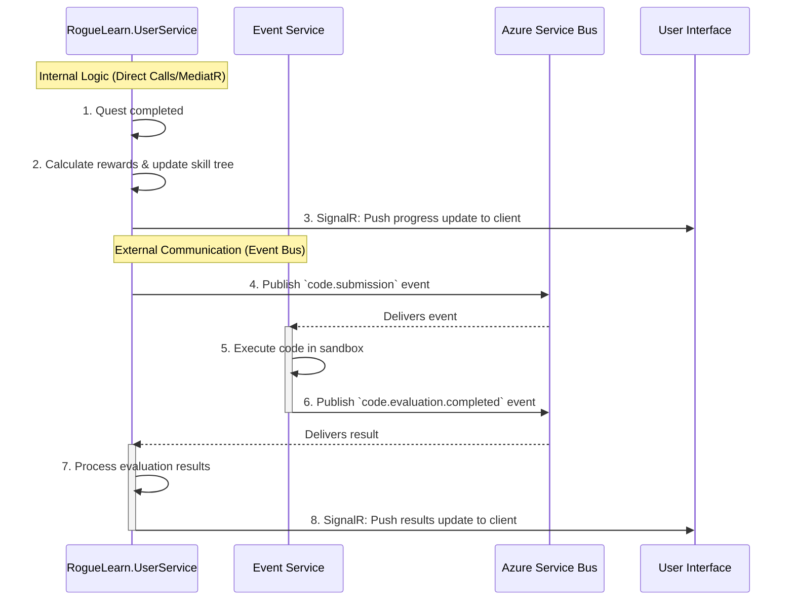

# **Backend Architecture**

### **Service Architecture**

*   **Pattern:** The backend is composed of a **consolidated .NET Core Service** (`RogueLearn.UserService`) and several specialized, isolated microservices. The `RogueLearn.UserService` will strictly follow **Clean Architecture** internally to maintain a clear separation of concerns between its logical domains (User, Quest, Social, Meeting, etc.).
*   **Deployment:** All services will be deployed as standard containerized applications to Azure Container Apps.

### **Service Overview**

The backend consists of the following services:

#### **Consolidated Core Service**
*   **`RogueLearn.UserService` (.NET 9):** This is the primary backend service, managing the majority of the platform's business logic. It contains the following integrated domains:
    *   **User Domain:** Manages user profiles, preferences, authentication, and verification.
    *   **Quests Domain:** Manages syllabus, quests, skill trees, and game session logic.
    *   **Social Domain:** Manages parties, guilds, social interactions, and real-time duels.
    *   **Meeting Domain Persistence:** Handles all database operations for meetings.
    *   **AI Proxy:** Securely communicates with the Gemini API.

#### **Specialized, Isolated Services**
*   **`RogueLearn.EventService` (Go):** Compiles, executes, and scores user-submitted code in secure sandboxes for competitive events. It has its own isolated database.
*   **`RogueLearn.MeetingService` (Go):** A stateless service that manages the real-time aspects of meetings (e.g., WebSocket communication). It calls the `RogueLearn.UserService` API to persist all meeting-related data.
*   **`RogueLearn.Scraper` (Python):** A stateless, internal-only service for fetching raw HTML content from external URLs.

### **Service Communication Patterns**

#### **Synchronous Communication**
*   **API Gateway Pattern:** All external requests from clients route through Azure API Management.
*   **Internal Communication:**
    *   Within `RogueLearn.UserService`, domains communicate via direct method calls or an in-memory mediator (e.g., MediatR).
    *   Between isolated services (e.g., `EventService` to `RogueLearn.UserService`), direct, secure HTTP/REST calls are used.
*   **Authentication:** JWT tokens from Supabase are validated at the gateway level and propagated to services.

#### **Asynchronous Communication**
*   **Real-time Features:** SignalR hubs within the `RogueLearn.UserService` handle live updates for quests, social interactions, and meetings.
*   **Event-Driven (Inter-Service):** For decoupled workflows between isolated services, an event bus (Azure Service Bus) is used (e.g., for code evaluation).

### **`RogueLearn.UserService` Consolidated Architecture**

The `RogueLearn.UserService` handles all primary business domains using .NET and Clean Architecture.

```csharp
// Domain Models from different domains coexist within the same service
// User Domain
public class UserProfile { /* ... */ }

// Quest Domain
public class Quest { /* ... */ }

// Social Domain
public class Party { /* ... */ }

// Meeting Domain (Persistence Model)
public class Meeting { /* ... */ }

// A single DbContext can manage tables from all consolidated domains
public class ApplicationDbContext : DbContext
{
    public DbSet<UserProfile> UserProfiles { get; set; }
    public DbSet<Quest> Quests { get; set; }
    public DbSet<Party> Parties { get; set; }
    public DbSet<Meeting> Meetings { get; set; }
    // ... other DbSets
}

// Repositories are specific to each domain but exist in the same service
public interface IUserRepository { /* ... */ }
public interface IQuestRepository { /* ... */ }
public interface IPartyRepository { /* ... */ }
public interface IMeetingRepository { /* ... */ }
```

### **`RogueLearn.EventService` Architecture**

The Event Service uses Go for performance-critical code execution and remains isolated.

```go
// Event Service Core Types
type Submission struct {
    ID           uuid.UUID `json:"id"`
    EventID      uuid.UUID `json:"eventId"`
    ProblemID    uuid.UUID `json:"problemId"`
    UserID       uuid.UUID `json:"userId"` // Soft reference to UserService
    LanguageID   uuid.UUID `json:"languageId"`
    SourceCode   string    `json:"sourceCode"`
    Status       string    `json:"status"`
    Score        *int      `json:"score,omitempty"`
    ExecutionTime *int     `json:"executionTime,omitempty"`
}

// Judge Service Interface
type JudgeService interface {
    EvaluateSubmission(ctx context.Context, submission *Submission) (*EvaluationResult, error)
    GetSupportedLanguages() []Language
}
```

#### **Code Execution Security**
*   **Sandboxing:** Docker containers with resource limits.
*   **Time Limits:** Configurable execution timeouts.
*   **Memory Limits:** Restricted memory allocation per submission.
*   **Network Isolation:** No external network access during execution.

### **Shared Libraries and Common Code**

*   **Repository:** **`roguelearn-buildingblocks`** - A shared repository for common .NET libraries, utilities, and DTOs used across the `RogueLearn.UserService` and for defining contracts for inter-service communication.
*   **Purpose:** Promotes code reuse, consistency, and maintainability.
*   **Contents:** Common models, auth utilities, logging abstractions, validation attributes, etc.

### **Database Architecture**

*   **`RogueLearn.UserService` Database:** Uses **Entity Framework Core (EF Core)** as the ORM for the consolidated PostgreSQL database.
*   **Data Access Layer:** The **Repository Pattern** is used to abstract all data access logic across all internal domains.
*   **`RogueLearn.EventService` Database:** Uses `database/sql` with PostgreSQL drivers for direct access to its own isolated database.

### **Real-time Communication Architecture (within `RogueLearn.UserService`)**

#### **SignalR Hubs**
The single `RogueLearn.UserService` will host multiple logical hubs to manage real-time updates for its various domains:
*   **Social Hub:** Handles party/guild notifications and interactions.
*   **Quest Hub:** Provides real-time quest progress updates and achievements.
*   **Meeting Hub:** Manages real-time meeting collaboration state.
*   **Rewards Hub:** Pushes reward unlocks and XP changes.

```csharp
// Example: A single service can host multiple hubs for different domains
public class SocialHub : Hub { /* ... for party/guild rooms ... */ }
public class QuestHub : Hub { /* ... for user progress rooms ... */ }
```

### **Event Bus & Orchestration**

*   **Internal Event Handling:** Within the `RogueLearn.UserService`, MediatR or a similar in-process messaging pattern is used for decoupled communication between domains.
*   **External Event Bus:** Azure Service Bus topics are used for asynchronous communication between the `RogueLearn.UserService` and isolated services like `RogueLearn.EventService`.
*   **Key Topics:** `code.submission`, `code.evaluation.completed`, `user.achievement.unlocked`.



### **Authentication and Authorization**

*   **Authentication:** The API Gateway validates JWTs issued by **Supabase**.
*   **Authorization:** The `RogueLearn.UserService` implements comprehensive authorization logic using .NET's `[Authorize]` attributes and custom policies across all its internal domains.
*   **Service-to-Service:** Communication between isolated services uses secure methods like API keys or client credentials.

### **Deployment and Scaling**

#### **Container Strategy**
*   **Platform:** Azure Container Apps for auto-scaling and serverless deployment.
*   **`RogueLearn.UserService`:** Deployed as a single, consolidated container that can be scaled horizontally.
*   **`RogueLearn.EventService`:** Deployed as a separate container, scaled independently based on code submission queue length.
*   **Images:** Multi-stage Docker builds for optimized container sizes.

#### **Scaling Considerations**
*   **`RogueLearn.UserService`:** Scales based on API request volume and real-time connection count.
*   **`RogueLearn.EventService`:** Scales based on code submission queue length and execution demand.
*   **Database:** Azure Database for PostgreSQL with read replicas for improved performance.
*   **Caching:** Redis cache for frequently accessed data and session management.