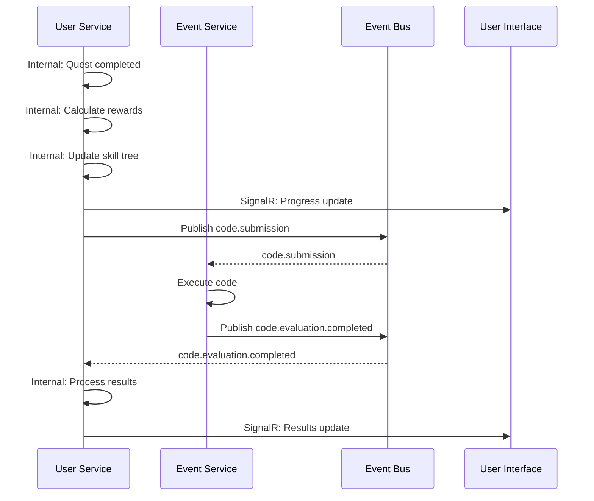

# **Backend Architecture**

### **Service Architecture**

*   **Pattern:** **Clean Architecture** will be strictly followed in all .NET services.
*   **Function Organization:** Services will be deployed as standard ASP.NET Core Web API projects to Azure Container Apps.

### **Consolidated Service Overview**

The backend consists of the following services:

#### **Core .NET Service**
*   **User Service** (`roguelearn-user-service`) - Consolidated service that manages:
    *   User profiles, preferences, and authentication
    *   Syllabus, quests, skill trees, and game session logic
    *   Parties, guilds, social interactions, and real-time duels
    *   Party meetings, scheduling, and collaboration features
    *   Secure gateway for Gemini API communications

#### **Specialized Go Service**
*   **Event Service** (`roguelearn-event-service`) - Compiles, executes, and scores user-submitted code in secure sandboxes

### **Service Communication Patterns**

#### **Synchronous Communication**
*   **API Gateway Pattern:** All external requests route through Azure API Management
*   **Service-to-Service:** Direct HTTP calls between User Service and Event Service for code evaluation
*   **Authentication:** JWT tokens validated at gateway level, propagated to services

#### **Asynchronous Communication**
*   **Real-time Features:** SignalR hubs for live updates (duels, meetings, code battles)
*   **Event-Driven:** Internal event handling within the User Service for cross-domain operations
*   **Background Processing:** Async operations for AI processing and code evaluation coordination

### **Consolidated User Service Architecture**

The User Service now handles all business domains using .NET:

```csharp
// User Service Domain Models - User Management
public class UserProfile
{
    public Guid AuthUserId { get; set; }
    public string Username { get; set; }
    public string Email { get; set; }
    public string FirstName { get; set; }
    public string LastName { get; set; }
    public Guid? ClassId { get; set; }
}

// User Service Domain Models - Quest Management
public class Quest
{
    public Guid Id { get; set; }
    public string Title { get; set; }
    public string Description { get; set; }
    public QuestType Type { get; set; }
    public QuestStatus Status { get; set; }
    public List<QuestDependency> Dependencies { get; set; }
}

// User Service Domain Models - Social Features
public class Party
{
    public Guid Id { get; set; }
    public string Name { get; set; }
    public string Description { get; set; }
    public PartyType Type { get; set; }
    public PartyJoinType JoinType { get; set; }
    public List<PartyMember> Members { get; set; }
}

// User Service Domain Models - Meeting Management
public class Meeting
{
    public Guid Id { get; set; }
    public Guid PartyId { get; set; }
    public string Title { get; set; }
    public MeetingStatus Status { get; set; }
    public DateTime ScheduledStartTime { get; set; }
    public List<MeetingParticipant> Participants { get; set; }
}

// User Service Repository Pattern
public interface IUserRepository
{
    Task<UserProfile?> GetByIdAsync(Guid authUserId);
    Task<UserProfile?> GetByUsernameAsync(string username);
    Task AddAsync(UserProfile user);
    Task UpdateAsync(UserProfile user);
}

public interface IQuestRepository
{
    Task<Quest?> GetByIdAsync(Guid id);
    Task<IEnumerable<Quest>> GetByQuestLineIdAsync(Guid questLineId);
    Task AddAsync(Quest quest);
    Task UpdateAsync(Quest quest);
}

public interface IPartyRepository
{
    Task<Party?> GetByIdAsync(Guid id);
    Task<IEnumerable<Party>> GetByUserIdAsync(Guid userId);
    Task AddAsync(Party party);
    Task UpdateAsync(Party party);
}

public interface IMeetingRepository
{
    Task<Meeting?> GetByIdAsync(Guid id);
    Task<IEnumerable<Meeting>> GetByPartyIdAsync(Guid partyId);
    Task AddAsync(Meeting meeting);
    Task UpdateAsync(Meeting meeting);
}
```

### **Event Service Architecture**

The Event Service uses Go for performance-critical code execution:

```go
// Event Service Core Types
type Submission struct {
    ID           uuid.UUID `json:"id"`
    EventID      uuid.UUID `json:"eventId"`
    ProblemID    uuid.UUID `json:"problemId"`
    UserID       uuid.UUID `json:"userId"`
    LanguageID   uuid.UUID `json:"languageId"`
    SourceCode   string    `json:"sourceCode"`
    Status       string    `json:"status"`
    Score        *int      `json:"score,omitempty"`
    ExecutionTime *int     `json:"executionTime,omitempty"`
}

// Judge Service Interface
type JudgeService interface {
    EvaluateSubmission(ctx context.Context, submission *Submission) (*EvaluationResult, error)
    GetSupportedLanguages() []Language
}
```

#### **Code Execution Security**
*   **Sandboxing:** Docker containers with resource limits
*   **Time Limits:** Configurable execution timeouts
*   **Memory Limits:** Restricted memory allocation per submission
*   **Network Isolation:** No external network access during execution

### **Shared Libraries and Common Code**

*   **Repository:** **`roguelearn-buildingblocks`** - A shared repository containing common libraries, utilities, and code used across the User Service and Event Service.
*   **Purpose:** Promotes code reuse, consistency, and maintainability across services.
*   **Contents:**
    *   Common domain models and DTOs
    *   Shared authentication and authorization utilities
    *   Database connection and configuration helpers
    *   Logging and monitoring abstractions
    *   Common validation attributes and extensions
    *   Shared exception handling middleware
    *   API response standardization utilities
    *   Real-time communication abstractions (SignalR)
    *   Cross-domain shared models and utilities

### **Database Architecture**

*   **User Service Database:** **Entity Framework Core (EF Core)** will be used as the ORM for the consolidated User Service database.
*   **Data Access Layer:** The **Repository Pattern** will be used to abstract all data access logic across all domains.
*   **Event Service Database:** Uses `database/sql` with PostgreSQL drivers for direct database access to its isolated database.

```csharp
// Example: Enhanced Repository Pattern for Consolidated Service
public interface IQuestRepository
{
    Task<Quest?> GetByIdAsync(Guid id);
    Task<IEnumerable<Quest>> GetByQuestLineIdAsync(Guid questLineId);
    Task<IEnumerable<Quest>> GetByUserIdAsync(Guid userId);
    Task AddAsync(Quest quest);
    Task UpdateAsync(Quest quest);
    Task DeleteAsync(Guid id);
}

public interface IPartyRepository
{
    Task<Party?> GetByIdAsync(Guid id);
    Task<IEnumerable<Party>> GetByUserIdAsync(Guid userId);
    Task<IEnumerable<Party>> GetPublicPartiesAsync();
    Task AddAsync(Party party);
    Task UpdateAsync(Party party);
    Task DeleteAsync(Guid id);
}
```

### **Real-time Communication Architecture**

#### **SignalR Hubs (User Service)**
*   **Social Hub:** Handles duels, party notifications, guild events, and social interactions
*   **Quest Hub:** Provides real-time quest progress updates and achievement notifications
*   **Meeting Hub:** Manages real-time meeting collaboration and communication
*   **Code Battle Hub:** Provides live updates during coding competitions
*   **Verification Hub:** Streams verification status updates to admin and users
*   **Rewards Hub:** Pushes reward unlocks and XP changes in real time

```csharp
// Consolidated Social Hub Example (SignalR for User Service)
public class SocialHub : Hub
{
    public async Task JoinPartyRoom(string partyId)
    {
        await Groups.AddToGroupAsync(Context.ConnectionId, $"party-{partyId}");
    }
    
    public async Task JoinGuildRoom(string guildId)
    {
        await Groups.AddToGroupAsync(Context.ConnectionId, $"guild-{guildId}");
    }
    
    public async Task JoinMeetingRoom(string meetingId)
    {
        await Groups.AddToGroupAsync(Context.ConnectionId, $"meeting-{meetingId}");
    }
}

// Quest Hub for real-time quest updates
public class QuestHub : Hub
{
    public async Task JoinQuestRoom(string questId)
    {
        await Groups.AddToGroupAsync(Context.ConnectionId, $"quest-{questId}");
    }
    
    public async Task JoinUserProgressRoom(string userId)
    {
        await Groups.AddToGroupAsync(Context.ConnectionId, $"user-progress-{userId}");
    }
}
```

### **Event Bus & Orchestration**

*   **Internal Event Handling:** The consolidated User Service uses internal event handling for cross-domain operations within the service.
*   **External Event Bus:** Azure Service Bus topics are used for communication between User Service and Event Service.
*   **Key Topics:** `code.submission`, `code.evaluation.completed`, `user.achievement.unlocked`.
*   **Event Flow:**
    *   User Service publishes `code.submission` events to Event Service
    *   Event Service publishes `code.evaluation.completed` events back to User Service
    *   User Service handles internal events for quest completion, skill tree updates, and reward calculations



### **Authentication and Authorization**

*   **Authentication:** The API Gateway will validate JWTs issued by **Supabase**.
*   **Authorization:** The User Service implements comprehensive authorization logic using .NET's `[Authorize]` attributes and custom policies across all domains.
*   **Service-to-Service:** Communication between User Service and Event Service uses service accounts and API keys for secure communication.

### **Deployment and Scaling**

#### **Container Strategy**
*   **Platform:** Azure Container Apps for auto-scaling and serverless deployment
*   **User Service:** Single consolidated container with horizontal scaling capabilities
*   **Event Service:** Separate container optimized for code execution workloads
*   **Images:** Multi-stage Docker builds for optimized container sizes
*   **Configuration:** Environment-based configuration with Azure Key Vault integration

#### **Scaling Considerations**
*   **User Service:** Scales based on API request volume and real-time connection count
*   **Event Service:** Scales based on code submission queue length and execution demand
*   **Database:** Azure Database for PostgreSQL with read replicas for improved performance
*   **Caching:** Redis cache for frequently accessed data and session management

#### **Scaling Patterns**
*   **Horizontal Scaling:** Auto-scaling based on CPU/memory metrics
*   **Database Scaling:** Read replicas for query-heavy operations
*   **Caching:** Redis for session state and frequently accessed data

