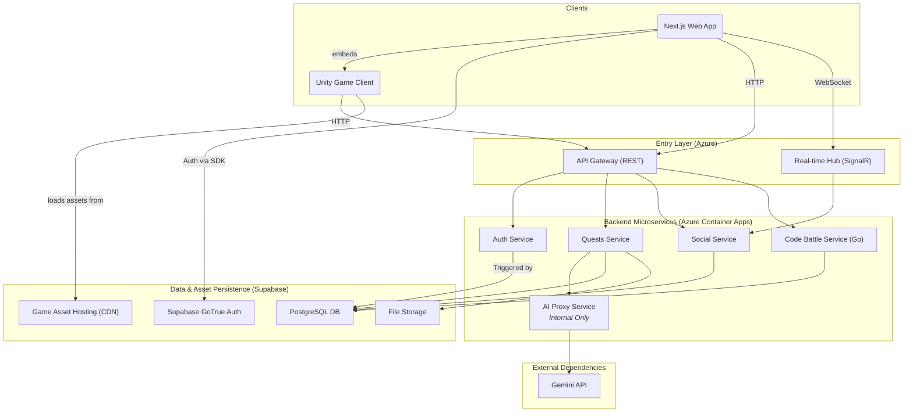

# **Components**

This section details the major logical components of the platform.

### **Frontend Application (`roguelearn-web`)**

*   **Responsibility:** Provides the entire user-facing experience, including embedding the Unity Game Client.
*   **Technology Stack:** Next.js, TypeScript, React, Tailwind CSS.

### **Unity Game Client (`roguelearn-unity-games`)**

*   **Responsibility:** Renders and manages the interactive "Boss Fight" experiences.
*   **Key Interfaces:** Communicates with the backend via the API Gateway to start sessions and submit results.
*   **Technology Stack:** Unity 2022.3 LTS, C#, WebGL.

### **Auth Service (`roguelearn-auth-service`)**

*   **Responsibility:** Manages user profile synchronization. It is triggered by new sign-ups in Supabase Auth to create a corresponding application profile in the `UserProfiles` table.
*   **Technology Stack:** .NET 8, C#.

### **Quests Service (`roguelearn-quests-service`)**

*   **Responsibility:** Owns the core learning loop, including Courses, Quests, SkillTrees, and **Game Sessions**.
*   **Technology Stack:** .NET 8, C#.

### **Social Service (`roguelearn-social-service`)**

*   **Responsibility:** Manages all multi-user features like Parties, Guilds, Events, and real-time Duels.
*   **Technology Stack:** .NET 8, C#, SignalR.

### **AI Proxy Service (`roguelearn-ai-proxy-service`)**

*   **Responsibility:** Acts as a secure, internal gateway for all communications with the Gemini API.
*   **Technology Stack:** .NET 8, C#.

### **Code Battle Service (`roguelearn-code-battle-service`)**

*   **Responsibility:** Compiles and scores user-submitted code in a secure sandbox.
*   **Technology Stack:** Go, Docker.

### **Component Interaction Diagram**

This diagram shows how the components interact.


