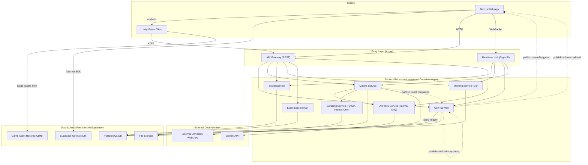

# **Components**

This section details the major logical components of the platform.

### **Frontend Application (`roguelearn-web`)**

*   **Responsibility:** Provides the entire user-facing experience, including embedding the Unity Game Client.
*   **Technology Stack:** Next.js, TypeScript, React, Tailwind CSS.

### **Unity Game Client (`roguelearn-unity-games`)**

*   **Responsibility:** Renders and manages the interactive "Boss Fight" experiences.
*   **Key Interfaces:** Communicates with the backend via the API Gateway to start sessions and submit results.
*   **Technology Stack:** Unity 2022.3 LTS, C#, WebGL.

### **User Service (`roguelearn-user-service`)**

*   **Responsibility:** Manages user profiles, preferences, and user-related operations. Handles profile synchronization with Supabase Auth and manages user data across the platform. Owns Verification workflows.
*   **Technology Stack:** .NET 9, C#.

#### **User Service Modules**

*   **Verification:** Lecturer verification workflows, document validation, admin review; emits `verification.updated` events.
*   **Rewards:** Listens to domain events (quest completion, verification changes), computes reward cascades (XP, achievements, badges); emits `reward.triggered` to clients.
*   **Skill Tree (Knowledge Graph):** Owns the user's current skill tree; updates nodes and relationships based on quest outcomes and verification signals; emits `skilltree.updated`.

### **Quests Service (`roguelearn-quests-service`)**

*   **Responsibility:** Owns the core learning loop, including Academic Management (Syllabuses, Enrollments), Quests, SkillTrees, and **Game Sessions**. Orchestrates the curriculum ingestion pipeline.
*   **Technology Stack:** .NET 9, C#.

### **Social Service (`roguelearn-social-service`)**

*   **Responsibility:** Manages all multi-user features like Parties, Guilds, Events, and real-time Duels.
*   **Technology Stack:** .NET 9, C#, SignalR.

### **Meeting Service (`roguelearn-meeting-service`)**

*   **Responsibility:** Manages party meetings, scheduling, collaboration features, and real-time meeting interactions. Handles meeting agendas, participant management, note-taking, and meeting status tracking.
*   **Technology Stack:** Go, WebSocket support for real-time features.

### **AI Proxy Service (`roguelearn-ai-proxy-service`)**

*   **Responsibility:** Acts as a secure, internal gateway for all communications with the Gemini API. Facilitates complex data structuring and analysis tasks.
*   **Technology Stack:** .NET 9, C#.

### **Event Service (`roguelearn-event-service`)**

*   **Responsibility:** Manages competitive programming features including code compilation, execution, and scoring in secure sandboxed environments.
*   **Technology Stack:** Go, Docker (for sandboxing), WebSocket support for real-time features.

### **Scraping Service (`RogueLearn.Scraper`)**

*   **Responsibility:** A specialized service dedicated to extracting raw HTML content from external URLs using web scraping libraries that are difficult to block. It contains no business logic.
*   **Technology Stack:** Python, FastAPI, Botasaurus.

<!-- Folded into User Service as modules above -->

### **Component Interaction Diagram**

This diagram shows how the components interact.

