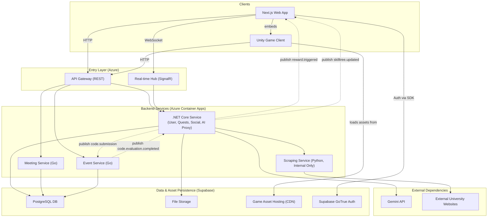

# **Components**

This section details the major logical components of the platform, reflecting the consolidated backend architecture.

### **Frontend Application (`roguelearn-web`)**

*   **Responsibility:** Provides the entire user-facing experience, including embedding the Unity Game Client.
*   **Technology Stack:** Next.js, TypeScript, React, Tailwind CSS.

### **Unity Game Client (`roguelearn-unity-games`)**

*   **Responsibility:** Renders and manages the interactive "Boss Fight" experiences.
*   **Technology Stack:** Unity 2022.3 LTS, C#, WebGL.

### **Core Service (`RogueLearn.UserService`)**

*   **Responsibility:** A consolidated .NET service that manages the core business logic for the platform. This service is organized internally into the following logical domains:
    *   **User Domain:** Manages user profiles, preferences, roles, verification, achievements, and the personal "Arsenal" of notes. It is the authority for user identity.
    *   **Quests Domain:** Owns the core learning loop, including academic management (Syllabuses, Enrollments), Quests, Skill Trees, and Game Sessions.
    *   **Social Domain:** Manages all multi-user features like Parties, Guilds, and real-time social interactions.
    *   **AI Proxy:** Acts as a secure, internal gateway for all communications with the Gemini API.
*   **Technology Stack:** .NET 9, C#, SignalR.

### **Event Service (`RogueLearn.EventService`)**

*   **Responsibility:** An isolated microservice that manages competitive programming features including code compilation, execution, and scoring in secure sandboxed environments.
*   **Technology Stack:** Go, Docker (for sandboxing).

### **Meeting Service (`roguelearn-meeting-service`)**

*   **Responsibility:** An isolated microservice that manages party meetings, scheduling, and real-time collaboration features.
*   **Technology Stack:** .NET, WebSocket support.

### **Scraping Service (`RogueLearn.Scraper`)**

*   **Responsibility:** A specialized, internal-only service for extracting raw HTML from external URLs. It contains no business logic.
*   **Technology Stack:** Python, FastAPI, Botasaurus.

### **Component Interaction Diagram**

This diagram shows how the consolidated components interact.

