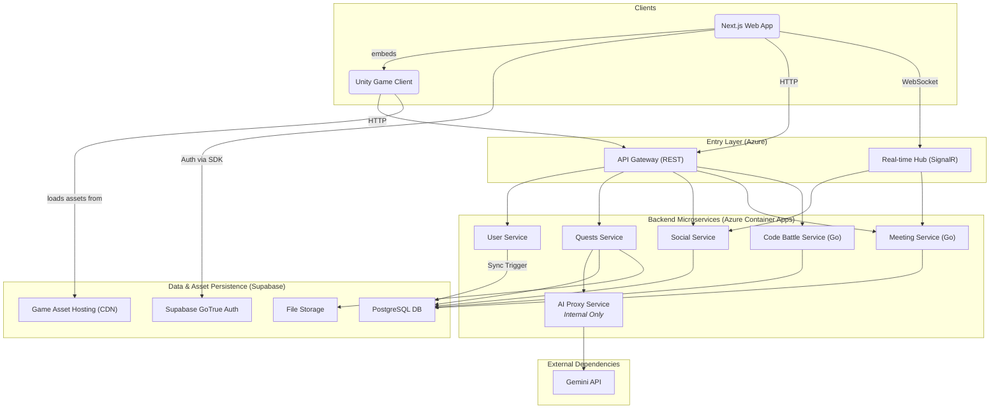

# **Components**

This section details the major logical components of the platform.

### **Frontend Application (`roguelearn-web`)**

*   **Responsibility:** Provides the entire user-facing experience, including embedding the Unity Game Client.
*   **Technology Stack:** Next.js, TypeScript, React, Tailwind CSS.

### **Unity Game Client (`roguelearn-unity-games`)**

*   **Responsibility:** Renders and manages the interactive "Boss Fight" experiences.
*   **Key Interfaces:** Communicates with the backend via the API Gateway to start sessions and submit results.
*   **Technology Stack:** Unity 2022.3 LTS, C#, WebGL.

### **User Service (`roguelearn-user-service`)**

*   **Responsibility:** Manages user profiles, preferences, and user-related operations. Handles profile synchronization with Supabase Auth and manages user data across the platform.
*   **Technology Stack:** .NET 8, C#.

### **Quests Service (`roguelearn-quests-service`)**

*   **Responsibility:** Owns the core learning loop, including Academic Management (Syllabuses, Enrollments), Quests, SkillTrees, and **Game Sessions**.
*   **Technology Stack:** .NET 8, C#.

### **Social Service (`roguelearn-social-service`)**

*   **Responsibility:** Manages all multi-user features like Parties, Guilds, Events, and real-time Duels.
*   **Technology Stack:** .NET 8, C#, SignalR.

### **Meeting Service (`roguelearn-meeting-service`)**

*   **Responsibility:** Manages party meetings, scheduling, collaboration features, and real-time meeting interactions. Handles meeting agendas, participant management, note-taking, and meeting status tracking.
*   **Key Features:**
    *   Meeting scheduling and lifecycle management
    *   Real-time participant collaboration
    *   Meeting agenda and note management
    *   Integration with party system for seamless collaboration
*   **Technology Stack:** Go, WebSocket support for real-time features.

### **AI Proxy Service (`roguelearn-ai-proxy-service`)**

*   **Responsibility:** Acts as a secure, internal gateway for all communications with the Gemini API.
*   **Technology Stack:** .NET 8, C#.

### **Code Battle Service (`roguelearn-code-battle-service`)**

*   **Responsibility:** Manages competitive programming features including code compilation, execution, and scoring in secure sandboxed environments. Handles real-time code battle rooms, language support, and submission evaluation.
*   **Key Features:**
    *   Secure code compilation and execution
    *   Real-time battle room management
    *   Multi-language support and evaluation
    *   Performance metrics and scoring algorithms
    *   Integration with events system for competitions
*   **Technology Stack:** Go, Docker (for sandboxing), WebSocket support for real-time features.

### **Component Interaction Diagram**

This diagram shows how the components interact.

