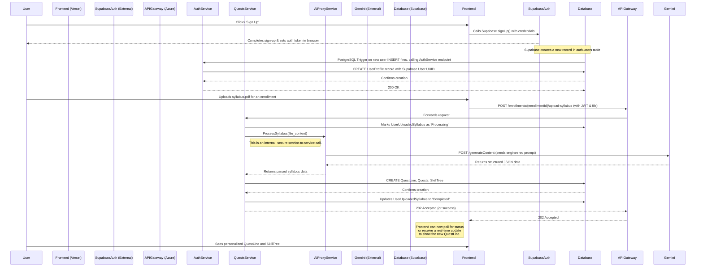
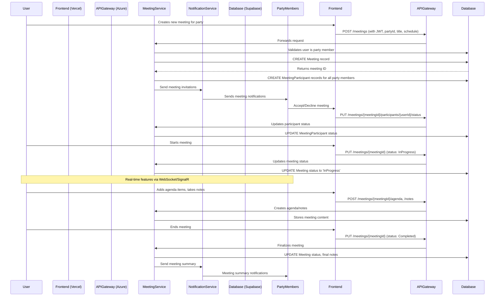
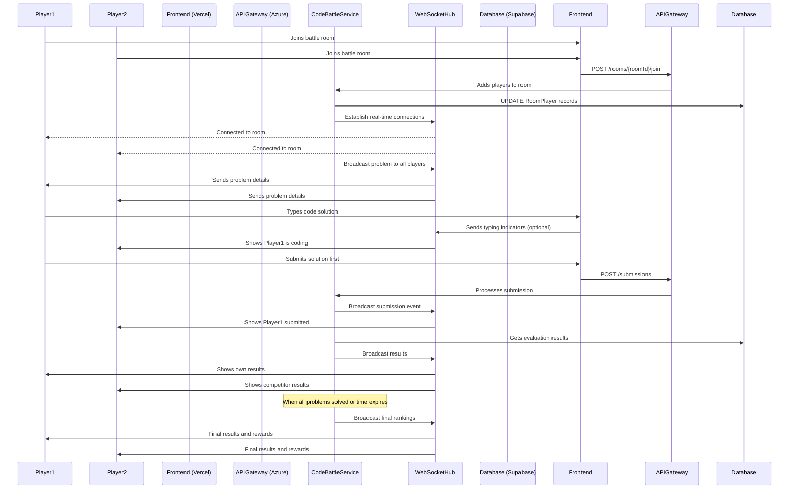

# **Core Workflows**

### **Workflow 1: New User Onboarding & First QuestLine Generation**



### **Workflow 2: Meeting Scheduling & Management**



### **Workflow 3: Code Battle Event Participation**

```mermaid
sequenceDiagram
    participant User
    participant Frontend (Vercel)
    participant APIGateway (Azure)
    participant CodeBattleService
    parameter JudgeService
    participant Database (Supabase)
    participant EventParticipants

    %% Step 1: User joins code battle event %%
    User->>Frontend: Joins code battle event
    Frontend->>APIGateway: POST /events/{eventId}/rooms (creates/joins room)
    APIGateway->>CodeBattleService: Forwards request
    
    %% Step 2: Room management %%
    CodeBattleService->>Database: CREATE/UPDATE Room, RoomPlayer records
    CodeBattleService->>Database: Fetch event problems and test cases
    Database-->>CodeBattleService: Returns room and problem data
    
    %% Step 3: Real-time battle begins %%
    Note over User, EventParticipants: Real-time features via WebSocket/SignalR
    CodeBattleService->>Frontend: Sends problem details to all participants
    Frontend-->>User: Displays coding problem and editor
    
    %% Step 4: User submits solution %%
    User->>Frontend: Writes and submits code
    Frontend->>APIGateway: POST /submissions (eventId, problemId, code)
    APIGateway->>CodeBattleService: Forwards submission
    
    %% Step 5: Code evaluation %%
    CodeBattleService->>Database: CREATE Submission record (status: Pending)
    CodeBattleService->>JudgeService: Evaluate code against test cases
    JudgeService->>Database: Fetch test cases for problem
    
    %% Step 6: Judge service processes submission %%
    Note over JudgeService: Compiles and runs code<br/>against all test cases
    JudgeService->>Database: UPDATE Submission with results
    JudgeService-->>CodeBattleService: Returns evaluation results
    
    %% Step 7: Real-time results and leaderboard %%
    CodeBattleService->>Database: UPDATE LeaderboardEntry scores
    CodeBattleService->>EventParticipants: Broadcasts results via WebSocket
    Frontend-->>User: Shows submission results and updated leaderboard
    
    %% Step 8: Event completion %%
    Note over CodeBattleService: When event time expires
    CodeBattleService->>Database: Finalize all submissions and rankings
    CodeBattleService->>EventParticipants: Sends final results and rewards
```

### **Workflow 4: Real-time Code Battle Room Management**



