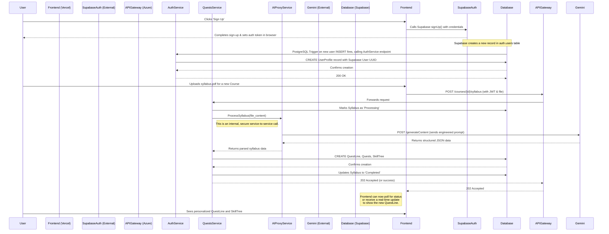

# **Core Workflows**

### **Workflow 1: New User Onboarding & First QuestLine Generation**

```mermaid
sequenceDiagram
    participant User
    participant Frontend (Vercel)
    participant SupabaseAuth (External)
    participant APIGateway (Azure)
    participant AuthService
    participant QuestsService
    participant AIProxyService
    participant Gemini (External)
    participant Database (Supabase)

    %% Step 1: User Registration via Supabase SDK %%
    User->>Frontend: Clicks 'Sign Up'
    Frontend->>SupabaseAuth: Calls Supabase signUp() with credentials
    SupabaseAuth-->>User: Completes sign-up & sets auth token in browser
    
    %% Step 2: Supabase Trigger notifies our backend of the new user %%
    Note over SupabaseAuth, Database: Supabase creates a new record in auth.users table
    Database->>AuthService: PostgreSQL Trigger on new user INSERT fires, calling AuthService endpoint
    AuthService->>Database: CREATE UserProfile record with Supabase User UUID
    Database-->>AuthService: Confirms creation
    AuthService-->>Database: 200 OK
    
    %% Step 3: User is back on our app and uploads syllabus %%
    User->>Frontend: Uploads syllabus.pdf for a new Course
    Frontend->>APIGateway: POST /courses/{id}/syllabus (with JWT & file)
    APIGateway->>QuestsService: Forwards request
    
    %% Step 4: QuestsService orchestrates AI processing %%
    QuestsService->>Database: Marks Syllabus as 'Processing'
    QuestsService->>AIProxyService: ProcessSyllabus(file_content)
    Note right of QuestsService: This is an internal, secure service-to-service call.

    %% Step 5: AI Proxy handles the LLM interaction %%
    AIProxyService->>Gemini: POST /generateContent (sends engineered prompt)
    Gemini-->>AIProxyService: Returns structured JSON data
    AIProxyService-->>QuestsService: Returns parsed syllabus data
    
    %% Step 6: QuestsService creates the gamified content %%
    QuestsService->>Database: CREATE QuestLine, Quests, SkillTree
    Database-->>QuestsService: Confirms creation
    QuestsService->>Database: Updates Syllabus to 'Completed'
    
    %% Step 7: Frontend is notified of completion %%
    QuestsService-->>APIGateway: 202 Accepted (or success)
    APIGateway-->>Frontend: 202 Accepted
    Note left of Frontend: Frontend can now poll for status<br/>or receive a real-time update<br/>to show the new QuestLine.
    User->>Frontend: Sees personalized QuestLine and SkillTree
```

