# **High Level Architecture**

### **Technical Summary**

RogueLearn will be implemented as a cloud-native, multi-repository application. It features a decoupled frontend built with Next.js, interactive "Boss Fights" built with **Unity WebGL**, and a microservices-based backend using **.NET 8** and **Go**. The system is deployed on Vercel and Azure Container Apps. Communication is handled by a RESTful API Gateway and a real-time SignalR hub for interactive features. The architecture supports AI-powered quest generation, social collaboration, competitive Duels, and code-grading battles. Data is persisted in a Supabase PostgreSQL database, with authentication managed by Clerk.

### **Platform and Infrastructure Choice**

To best support our technology stack and scalability goals, I recommend the following platform configuration:

*   **Platform:** A hybrid-cloud approach leveraging best-in-class services.
    *   **Frontend Hosting:** **Vercel**. It is purpose-built for Next.js, providing seamless deployments, global CDN, and serverless functions out-of-the-box.
    *   **Backend Hosting:** **Azure Container Apps**. This is a serverless container platform that is ideal for running our .NET and Go microservices.
    *   **Database & Storage:** **Supabase**. Provides a managed PostgreSQL instance, real-time capabilities, and file storage which will be used for both user documents and hosting Unity game assets.
*   **Key Services:**
    *   **Vercel:** Next.js Hosting, Edge Network (CDN)
    *   **Azure:** Container Apps, API Management (for the API Gateway)
    *   **Supabase:** PostgreSQL Database, Storage (for documents and game assets)
    *   **Clerk:** External Authentication Service
    *   **Internal AI Proxy Service:** A dedicated backend service to securely manage communication with the Gemini API.

### **Repository Structure**

As established, we will use a **Multi-Repo Strategy**. This provides the best separation of concerns and allows for independent development lifecycles. The initial repository structure will be:

*   **`roguelearn-web`**: The Next.js frontend application.
*   **`roguelearn-unity-games`**: The Unity project containing the "Boss Fight" game client.
*   **`roguelearn-auth-service`**: .NET microservice for user identity, profiles, and Clerk integration.
*   **`roguelearn-quests-service`**: .NET microservice for syllabi, quests, skill trees, and game session logic.
*   **`roguelearn-social-service`**: .NET microservice for Parties, Guilds, Events, and real-time features like Duels.
*   **`roguelearn-code-battle-service`**: **Go** microservice for compiling, running, and scoring user-submitted code.
*   **`roguelearn-shared-types`**: A private NPM package for shared TypeScript interfaces.

### **High Level Architecture Diagram**

This diagram illustrates the primary components and data flow of the RogueLearn platform, now including the Unity game client.

```mermaid
graph TD
    subgraph "User Layer"
        User[👩‍🎓 Student]
        BrowserExtension[Chrome Extension]
    end

    subgraph "Presentation Layer (Vercel)"
        Frontend[Next.js Web App]
        UnityClient[Unity Game Client]
        Frontend --> UnityClient
    end

    subgraph "External Services"
        Clerk[Clerk Authentication]
        Gemini[Gemini API]
    end

    subgraph "Backend Layer (Azure)"
        APIGateway[API Gateway REST]
        RealtimeHub[Real-time Hub WebSockets]
        
        subgraph "Microservices"
            AuthService[.NET Auth Service]
            QuestService[.NET Quests Service]
            SocialService[.NET Social Service]
            CodeBattleService[Go Code Battle Service]
            AIProxyService[.NET AI Proxy Service]
        end
    end

    subgraph "Data & Asset Layer (Supabase)"
        Database[PostgreSQL Database]
        FileStorage[File Storage for Docs]
        GameAssetHosting[Game Asset Hosting]
    end

    User --> Frontend
    BrowserExtension --> APIGateway

    Frontend --> APIGateway
    Frontend -.-> RealtimeHub
    UnityClient --> GameAssetHosting
    UnityClient --> APIGateway
    
    APIGateway --> AuthService
    APIGateway --> QuestService
    APIGateway --> SocialService
    APIGateway --> CodeBattleService
    APIGateway --> AIProxyService
    
    RealtimeHub --> SocialService

    AuthService --> Clerk
    AuthService --> Database

    QuestService --> Database
    QuestService --> FileStorage
    
    SocialService --> Database
    
    CodeBattleService --> Database
    
    AIProxyService --> Gemini
    AIProxyService --> Database

    Database <--> FileStorage
```

### **Architectural and Design Patterns**

*   **Microservices Architecture:** The backend will be composed of small, independent services. *Rationale:* This allows for independent development, deployment, and scaling.
*   **API Gateway:** A single entry point for synchronous requests. *Rationale:* Simplifies the client, centralizes cross-cutting concerns like auth and rate limiting.
*   **Clean Architecture (.NET):** Each microservice will separate domain logic, application logic, and infrastructure. *Rationale:* Produces highly testable and maintainable services.
*   **Component-Based UI (Next.js):** The frontend will be built as a collection of reusable components. *Rationale:* Promotes reusability and faster development.
*   **Repository Pattern (.NET):** Data access within each microservice will be abstracted. *Rationale:* Decouples business logic from data access implementation.

