# **High Level Architecture**

### **Technical Summary**

RogueLearn will be implemented as a cloud-native, multi-repository application. It features a decoupled frontend built with Next.js, interactive "Boss Fights" built with **Unity WebGL**, and a microservices-based backend using **.NET 9** and **Go**. The system is deployed on Vercel and Azure Container Apps. Communication is handled by a RESTful API Gateway and a real-time SignalR hub for interactive features. The architecture supports AI-powered quest generation, social collaboration, competitive Duels, and code-grading battles. Data, storage, and authentication are consolidated and managed within a **Supabase** project.

### **Platform and Infrastructure Choice**

To best support our technology stack and scalability goals, I recommend the following platform configuration:

*   **Platform:** A hybrid-cloud approach leveraging best-in-class services.
    *   **Frontend Hosting:** **Vercel**. It is purpose-built for Next.js, providing seamless deployments, global CDN, and serverless functions out-of-the-box.
    *   **Backend Hosting:** **Azure Container Apps**. This is a serverless container platform that is ideal for running our .NET and Go microservices.
    *   **Database, Storage & Auth:** **Supabase**. Provides a managed PostgreSQL instance, user authentication, real-time capabilities, and file storage which will be used for both user documents and hosting Unity game assets.
*   **Key Services:**
    *   **Vercel:** Next.js Hosting, Edge Network (CDN)
    *   **Azure:** Container Apps, API Management (for the API Gateway)
    *   **Supabase:** PostgreSQL Database, Storage (for documents and game assets), **Authentication**
    *   **Internal AI Proxy Service:** A dedicated backend service to securely manage communication with the Gemini API.

### **Repository Structure**

As established, we will use a **Multi-Repo Strategy**. This provides the best separation of concerns and allows for independent development lifecycles. The repository structure is as follows:

*   **`RogueLearn.Frontend`**: The Next.js frontend application.
*   **`RogueLearn.BMAD.Documentation`**: The source of truth documentation for the entire project development.
*   **`roguelearn-unity-games`**: The Unity project containing the "Boss Fight" game client.
*   **`RogueLearn.User`**: .NET microservice consolidating user profiles, preferences, syllabus, quests, skill trees, social features (parties, guilds), meeting management, and AI proxy functionality.
*   **`RogueLearn.CodeBattle`**: Go microservice for compiling, running, and scoring user-submitted code in competitive events.
*   **`RogueLearn.Protos`**: A centralized repository for Protocol Buffer (Protobuf) definitions to facilitate gRPC or other schema-based inter-service communication.
*   **`RogueLearn.Kubernetes`**: The GitOps repository containing Kubernetes manifests and ArgoCD configurations for deploying all services.
*   **`RogueLearn.CleanArchitecture`**: A template repository containing the standard Clean Architecture setup for all .NET microservices, ensuring consistency.

### **High Level Architecture Diagram**

This diagram illustrates the primary components and data flow of the RogueLearn platform, updated to integrate Verification into the User Service and move Rewards and Skill Tree (formerly Knowledge Graph) into the Quests Service, with an Event Bus for asynchronous orchestration.

```mermaid
graph TD
    subgraph "User Layer"
        User[👩‍🎓 Student]
        BrowserExtension[Chrome Extension]
    end

    subgraph "Presentation Layer (Vercel)"
        Frontend[Next.js Web App]
        UnityClient[Unity Game Client]
        Frontend --> UnityClient
    end

    subgraph "External Services"
        Gemini[Gemini API]
    end

    subgraph "Backend Layer (Azure)"
        APIGateway[API Gateway REST]
        RealtimeHub[Real-time Hub WebSockets]
        
        subgraph "Microservices"
            UserService[.NET User Service<br/>Consolidated: Profiles, Academic, Quests,<br/>Social, Meeting, AI Proxy]
            CodeBattleService[Go Event Service<br/>Code Battles & Competitions]
        end
    end

    subgraph "Event Bus (Azure Service Bus)"
        TopicCodeSubmission[topic: code.submission]
        TopicCodeEvaluation[topic: code.evaluation.completed]
        TopicUserAchievement[topic: user.achievement.unlocked]
    end

    subgraph "Data & Asset Layer (Supabase)"
        Database[PostgreSQL Database]
        FileStorage[File Storage for Docs]
        GameAssetHosting[Game Asset Hosting]
        SupabaseAuth[Supabase GoTrue Auth]
    end

    User --> Frontend

    BrowserExtension --> APIGateway

    Frontend -- Auth via SDK --> SupabaseAuth
    Frontend --> APIGateway
    Frontend -.-> RealtimeHub

    UnityClient --> GameAssetHosting
    UnityClient --> APIGateway
    
    APIGateway --> UserService
    APIGateway --> CodeBattleService
    
    RealtimeHub --> UserService

    UserService -- Sync Trigger --> Database
    UserService --> FileStorage
    
    CodeBattleService --> Database
    
    AIProxyService --> Gemini
    UserService --> Database

    Database <--> FileStorage
    SupabaseAuth <--> Database

    %% Event Bus interactions
    UserService -- publish --> TopicCodeSubmission
    CodeBattleService -- subscribe --> TopicCodeSubmission
    CodeBattleService -- publish --> TopicCodeEvaluation
    UserService -- subscribe --> TopicCodeEvaluation
    UserService -- publish --> TopicUserAchievement
```

### **Architectural and Design Patterns**

*   **Consolidated Microservices Architecture:** The backend consists of a consolidated User Service handling most business logic and a specialized Event Service for code evaluation. *Rationale:* This reduces complexity while maintaining separation of concerns for specialized functionality.
*   **API Gateway:** A single entry point for synchronous requests. *Rationale:* Simplifies the client, centralizes cross-cutting concerns like auth and rate limiting.
*   **Event-Driven Communication:** Cross-service workflows coordinated via an Event Bus (Azure Service Bus). *Rationale:* Decouples services and enables scalable, resilient processing.
*   **Clean Architecture (.NET):** The User Service separates domain logic, application logic, and infrastructure. *Rationale:* Produces highly testable and maintainable services.
*   **Component-Based UI (Next.js):** The frontend will be built as a collection of reusable components. *Rationale:* Promotes reusability and faster development.
*   **Repository Pattern (.NET):** Data access within the User Service will be abstracted. *Rationale:* Decouples business logic from data access implementation.
*   **Database Triggers:** A PostgreSQL trigger will be used to sync new users from Supabase's `auth.users` table to our application's `UserProfiles` table. *Rationale:* Provides a reliable, event-driven way to create user profiles without webhooks.
