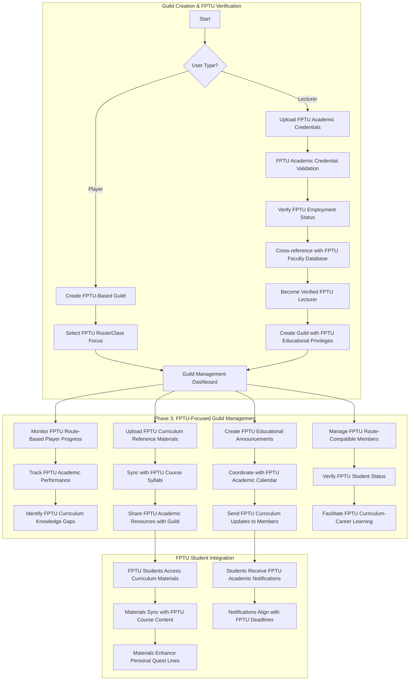
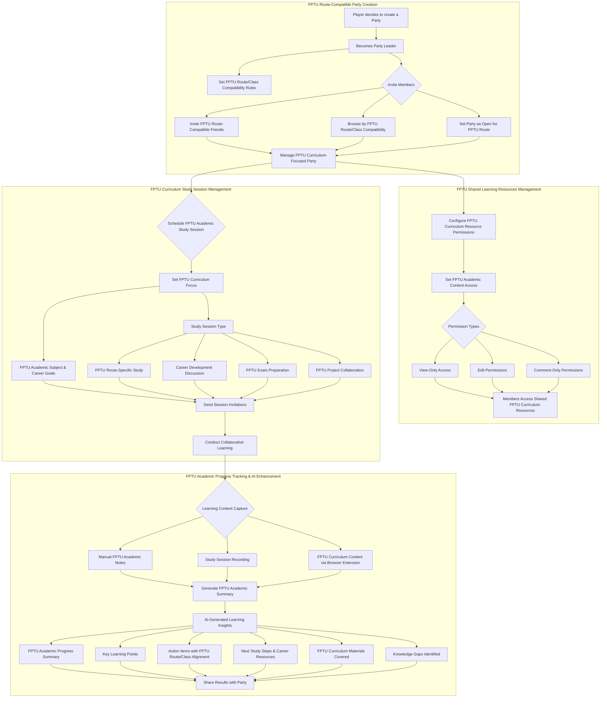

# User Interaction Flows

This document visualizes the primary interaction flows for each user role within the RogueLearn platform using Mermaid diagrams.

## Player Flow

```mermaid
graph TD
    subgraph "Phase 1: FPTU Student Verification & Onboarding"
        A[Start] --> B{New User?};
        B -- Yes --> C[Create Account via In-App Form];
        B -- No --> F[View Dashboard / Character Sheet];
        C --> C1[Supabase Auth SDK handles registration];
        C1 --> C2[DB Trigger syncs new user to create profile];
        C2 --> FPTU1[FPTU Student Verification Required];
        FPTU1 --> FPTU2[Upload Student ID & Academic Documents];
        FPTU2 --> FPTU3[Browser Extension: FPTU Portal Integration];
        FPTU3 --> FPTU4[Verify Enrollment Status & Academic Standing];
        FPTU4 --> FPTU5{Verification Successful?};
        FPTU5 -- No --> FPTU6[Manual Verification Process];
        FPTU6 --> FPTU7[Academic Advisor Review];
        FPTU7 --> FPTU5;
        FPTU5 -- Yes --> D[Select Route (Academic Curriculum)];
        D --> D1[Select Class (Career Specialization)];
        D1 --> AI1[AI Gap Analysis: Curriculum vs Career];
        AI1 --> QUEST1{Student Status Check};
        QUEST1 -- First Time --> AI2[Generate Fresh Quest Line from Curriculum];
        QUEST1 -- Returning --> AI2A[Load Quest History & Performance Patterns];
        QUEST1 -- Failed Previous --> AI2B[Generate Recovery & Remediation Quests];
        AI2 --> AI3[Add Career Enhancement Quests from roadmap.sh];
        AI2A --> AI3A[Adapt Quests Based on Previous Performance];
        AI2B --> AI3B[Focus on Failed Course Recovery];
        AI3 --> AI4[Create Integrated Skill Tree];
        AI3A --> AI4;
        AI3B --> AI4;
        AI4 --> E{Optional: Upload Additional Documents for Enhancement};
        E -- Yes --> E1[Upload Academic Achievement Documents];
        E -- No --> F;
        E1 --> AI5[Enhance Skill Tree Visualization];
        AI5 --> AI6[Organize Documents in Arsenal];
        AI6 --> F;
        F --> G{Engage with Features};
    end

    subgraph "Core Learning Loop with FPTU Integration"
        G --> H[View FPTU-Synchronized Quest Line];
        H --> H1[Real-time FPTU Calendar Integration];
        H1 --> H2[Automatic Quest Deadline Adjustment];
        H2 --> I[Complete Academic & Career Quests];
        I --> I1[Track FPTU Assignment Completion];
        I1 --> I2[Monitor Academic Performance];
        I2 --> J[Face Curriculum-Career Boss Fights];
        J --> J1[Academic Knowledge Assessment];
        J1 --> J2[Career Readiness Evaluation];
        J2 --> K[Update Dual Progress Tracking];
        K --> K1[Sync with FPTU Grade Postings];
        K1 --> K2[Update Academic Standing Status];
        K2 --> L[View Route/Class Leaderboards];
        G --> M{Manage Enhanced Arsenal with FPTU Content};
        M --> M1[FPTU Course Material Organization];
        M1 --> M2[Link Notes to Skill Tree Nodes];
        M2 --> M3[Career Development Resources];
        M3 --> M4[Automatic FPTU Syllabus Integration];
        G --> N{View Integrated Skill Tree};
        N --> N1[Curriculum-Based Skill Visualization];
        N1 --> N2[Career Specialization Nodes];
        N2 --> N3[Gap Analysis Progress Tracking];
        N3 --> N4[Quest Contributions to Both Tracks];
        N4 --> N5[FPTU Performance Impact Visualization];
    end

    subgraph "Phase 2: Collaborative Learning & FPTU Enhancement"
        G --> O{Social Features};
        O --> P[Create/Join FPTU-Compatible Party];
        P --> P1[Invite FPTU Students from Same Courses];
        P --> P2[Browse by FPTU Route/Class Compatibility];
        P --> P3[Set Party as Open for FPTU Route];
        P1 --> Q[Access Shared FPTU Curriculum Resources];
        P2 --> Q;
        P3 --> Q;
        Q --> R[Schedule FPTU-Aligned Study Sessions];
        R --> R1[Set Academic Focus & FPTU Career Goals];
        R1 --> R2[Conduct Collaborative Learning];
        R2 --> R3[Generate AI Study Summary];
        R3 --> R4[Share Progress & Action Items];
        O --> S[Join/Create FPTU-Based Guilds];
        S --> S1[Access Guild FPTU Materials];
        G --> T{Enhanced Browser Extension for FPTU};
        T --> T1[Real-time FPTU Portal Monitoring];
        T1 --> T2[Extract Course Updates & Deadlines];
        T2 --> T3[Sync Academic Calendar Changes];
        T3 --> T4[Auto-update Quest Priorities];
        T --> T5[Highlight FPTU Educational Content];
        T5 --> T6[View FPTU-Relevant Notes & Quest Actions];
    end

    subgraph "FPTU-Specific Notifications & AI Enhancement"
        AI2 --> U[FPTU-Synchronized Quest Updates];
        AI2A --> U1[Performance-Based Quest Adjustments];
        AI2B --> U2[Recovery Quest Notifications];
        AI3 --> V[Career Enhancement Suggestions];
        U --> W[Monitor FPTU Academic Progress];
        U1 --> W;
        U2 --> W;
        V --> W;
        W --> W1[FPTU Milestone Notifications];
        W --> W2[Academic Standing Alerts];
        W --> W3[Failed Course Recovery Prompts];
        W --> W4[Email & Push Notifications];
        M1 --> X[AI Scans FPTU Content];
        X --> Y[Proactive Academic & Career Suggestions];
        FPTU4 --> Z[Continuous FPTU Status Monitoring];
        Z --> Z1[Semester Transition Handling];
        Z1 --> Z2[Academic Calendar Synchronization];
        Z2 --> Z3[Quest Memory System Updates];
    end
```
```

## Guild Master Flow (Player or Verified FPTU Lecturer)



## Party Leader Flow



## Game Master (Admin) Flow

```mermaid
graph TD
    A[Start] --> B[Access Game Master Dashboard];

    subgraph "FPTU Curriculum-Career Analytics & Monitoring"
        B --> C{View FPTU Educational Analytics};
        C --> D[FPTU Player Engagement Metrics];
        D --> D1[FPTU Route Completion Rates];
        D --> D2[Career Quest Progress];
        D --> D3[FPTU Curriculum-Career Party Formation];
        D --> D4[FPTU Academic Retention Rates];
        D --> D5[FPTU Student Verification Success Rates];
        C --> E[Platform Performance];
        E --> E1[AI Gap Analysis Performance];
        E --> E2[FPTU Curriculum Quest Generation Speed];
        E --> E3[System Uptime & Error Rates];
        E --> E4[FPTU Portal Integration Performance];
        C --> F[FPTU Educational Quality Metrics];
        F --> F1[FPTU Route & Class Popularity];
        F --> F2[FPTU Curriculum-Career Boss Fight Performance];
        F --> F3[FPTU Academic Skill Tree Progression];
        F --> F4[FPTU Student Academic Performance Correlation];
    end

    subgraph "FPTU Educational Platform Management"
        B --> G{FPTU Curriculum System Configuration};
        G --> H[Manage FPTU Academic Notification Settings];
        G --> I[Configure FPTU Curriculum Quest Parameters];
        G --> J[Monitor AI Gap Analysis Performance];
        G --> K[Manage FPTU Educational User Authentication];
        G --> L[FPTU Academic Database & Storage Management];
        G --> M[FPTU Portal Integration Settings];
        G --> N[FPTU Academic Calendar Synchronization];
    end

    subgraph "FPTU Educational Content & User Management"
        B --> O{FPTU Academic Content Moderation};
        O --> P[Review FPTU Curriculum-Generated Content];
        O --> Q[Manage FPTU Educational Guild Verification];
        O --> R[Monitor FPTU Academic Credential Validation];
        O --> S{FPTU Educational User Management};
        S --> T[FPTU Route/Class-Based Access Control];
        S --> U[FPTU Player Data Privacy & GDPR Compliance];
        S --> V[FPTU Academic Data Retention Policies];
        S --> W[FPTU Student Status Monitoring];
    end

    subgraph "FPTU Educational Integration & Operations"
        B --> X{FPTU Academic System Integrations};
        X --> Y[Monitor FPTU Curriculum Progress Channels];
        X --> Z[Unity WebGL Assessment Performance];
        X --> AA[FPTU Academic Browser Extension Analytics];
        X --> BB[Roadmap.sh Integration Health Checks];
        X --> CC[FPTU Portal API Monitoring];
    end
```


