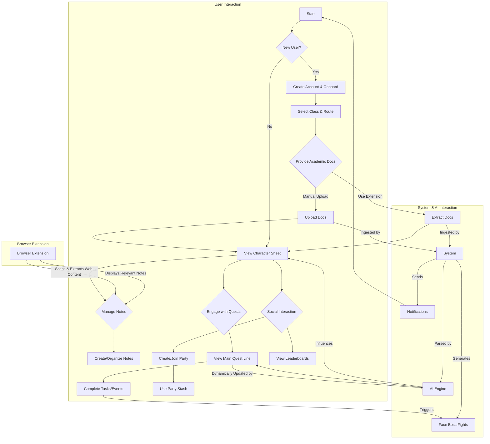
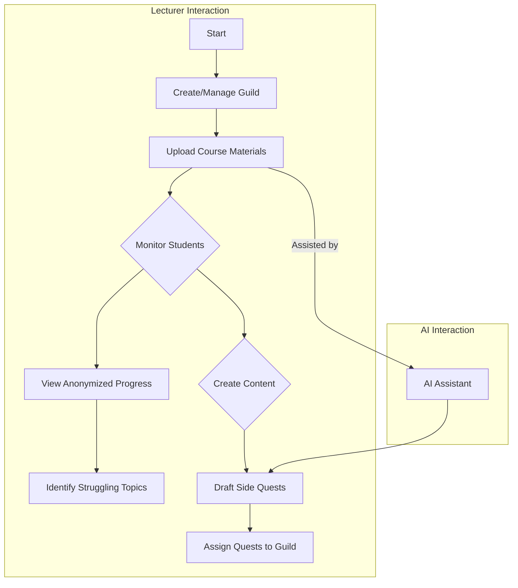
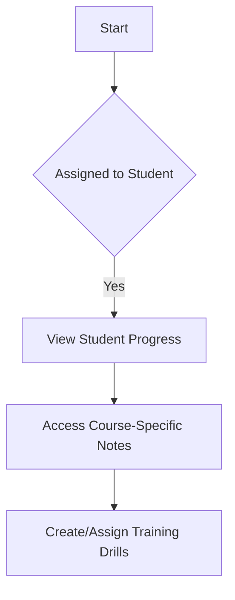
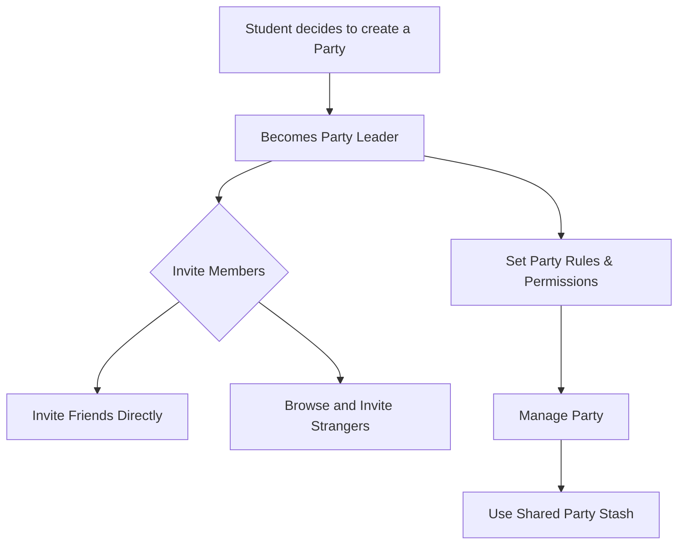
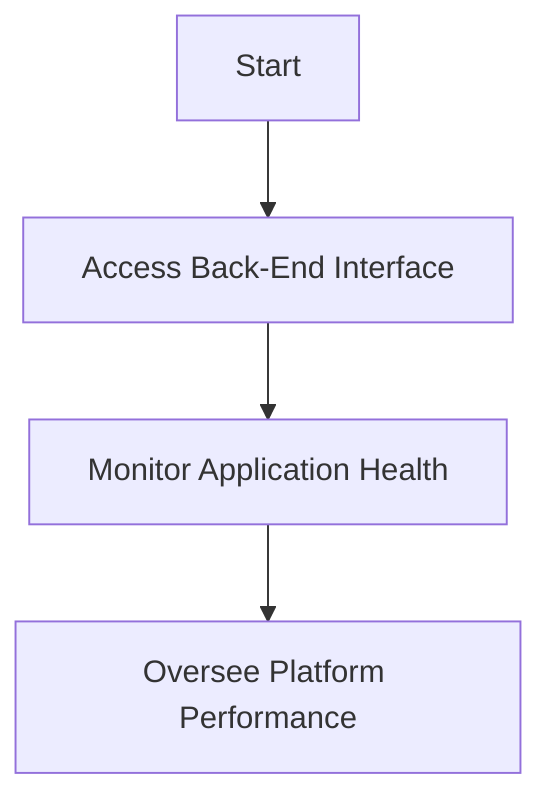

# User Interaction Flows

This document visualizes the primary interaction flows for each user role within the QuestLearn platform using Mermaid diagrams.

## Student (Player) Flow

## Lecturer (Guild Master) Flow

## Tutor (The Guide) Flow

## Party Leader Flow

## System Admin (The Game Master) Flow

