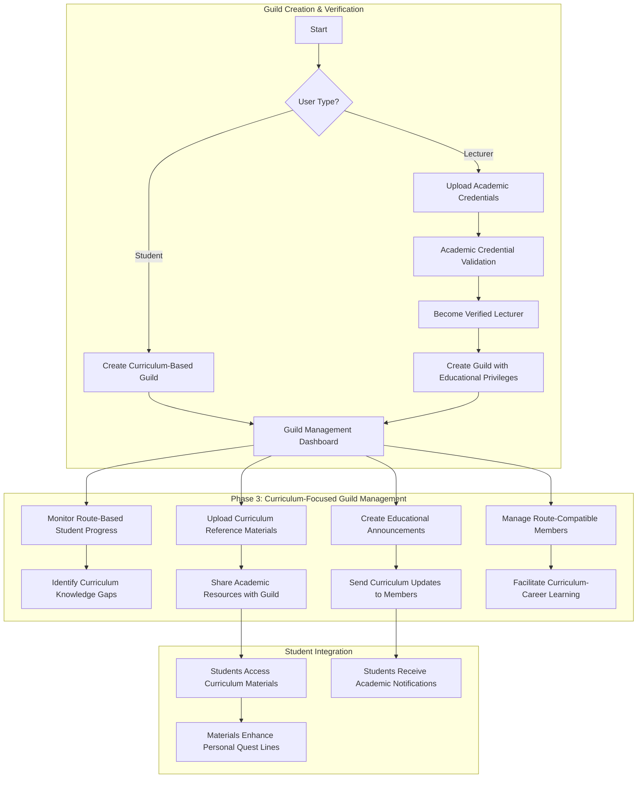
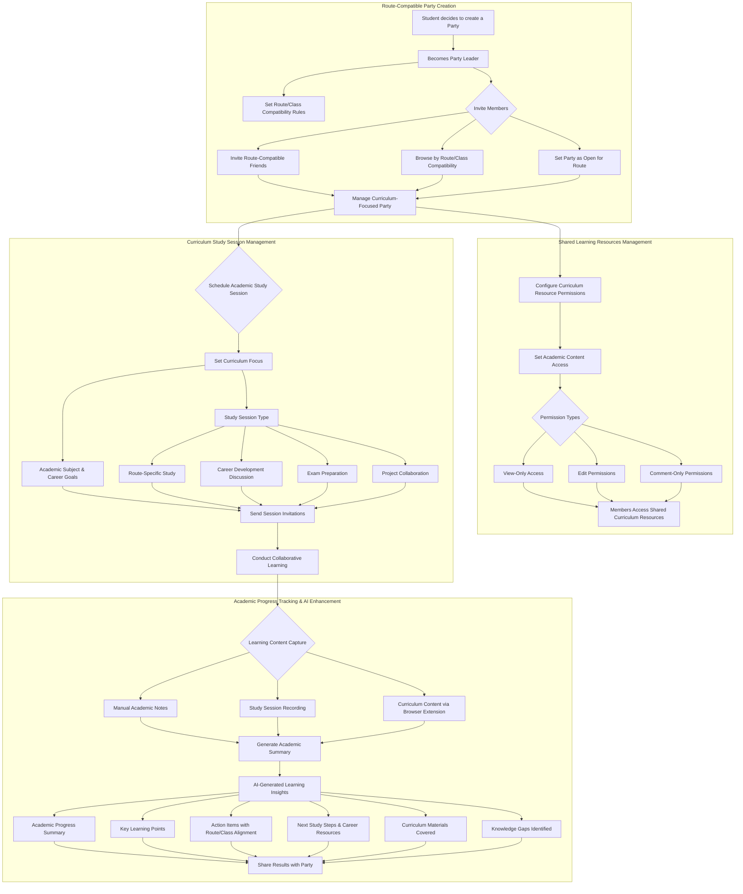

# User Interaction Flows

This document visualizes the primary interaction flows for each user role within the RogueLearn platform using Mermaid diagrams.

## Student (Player) Flow

```mermaid
graph TD
    subgraph "Phase 1: Curriculum-Career Onboarding"
        A[Start] --> B{New User?};
        B -- Yes --> C[Create Account via In-App Form];
        B -- No --> F[View Dashboard / Character Sheet];
        C --> C1[Supabase Auth SDK handles registration];
        C1 --> C2[DB Trigger syncs new user to create profile];
        C2 --> D[Select Route (Academic Curriculum)];
        D --> D1[Select Class (Career Specialization)];
        D1 --> AI1[AI Gap Analysis: Curriculum vs Career];
        AI1 --> AI2[Generate Curriculum-Based Quest Line];
        AI2 --> AI3[Add Career Enhancement Quests from roadmap.sh];
        AI3 --> AI4[Create Integrated Skill Tree];
        AI4 --> E{Optional: Upload Documents for Enhancement};
        E -- Yes --> E1[Upload Academic Documents];
        E -- No --> F;
        E1 --> AI5[Enhance Skill Tree Visualization];
        AI5 --> AI6[Organize Documents in Arsenal];
        AI6 --> F;
        F --> G{Engage with Features};
    end

    subgraph "Core Learning Loop"
        G --> H[View Curriculum-Based Quest Line];
        H --> I[Complete Academic & Career Quests];
        I --> J[Face Curriculum-Career Boss Fights];
        J --> J1[Academic Knowledge Assessment];
        J1 --> J2[Career Readiness Evaluation];
        J2 --> K[Update Dual Progress Tracking];
        K --> L[View Route/Class Leaderboards];
        G --> M{Manage Enhanced Arsenal};
        M --> M1[Curriculum-Focused Note Organization];
        M1 --> M2[Link Notes to Skill Tree Nodes];
        M2 --> M3[Career Development Resources];
        G --> N{View Integrated Skill Tree};
        N --> N1[Curriculum-Based Skill Visualization];
        N1 --> N2[Career Specialization Nodes];
        N2 --> N3[Gap Analysis Progress Tracking];
        N3 --> N4[Quest Contributions to Both Tracks];
    end

    subgraph "Phase 2: Collaborative Learning & Enhancement"
        G --> O{Social Features};
        O --> P[Create/Join Route-Compatible Party];
        P --> P1[Invite Route-Compatible Students];
        P --> P2[Browse by Route/Class Compatibility];
        P --> P3[Set Party as Open for Route];
        P1 --> Q[Access Shared Curriculum Resources];
        P2 --> Q;
        P3 --> Q;
        Q --> R[Schedule Curriculum Study Sessions];
        R --> R1[Set Academic Focus & Career Goals];
        R1 --> R2[Conduct Collaborative Learning];
        R2 --> R3[Generate AI Study Summary];
        R3 --> R4[Share Progress & Action Items];
        O --> S[Join/Create Curriculum-Based Guilds];
        S --> S1[Access Guild Curriculum Materials];
        G --> T{Browser Extension for Academic Content};
        T --> T1[Extract from University Portals];
        T1 --> T2[Organize Academic Content in Arsenal];
        T --> T3[Highlight Educational Content];
        T3 --> T4[View Curriculum-Relevant Notes];
    end

    subgraph "Notifications & AI Enhancement"
        AI2 --> U[Curriculum Quest Updates];
        AI3 --> V[Career Enhancement Suggestions];
        U --> W[Monitor Academic Progress];
        V --> W;
        W --> W1[Route Milestone Notifications];
        W --> W2[Class Skill Gap Alerts];
        W --> W3[Email & Push Notifications];
        M1 --> X[AI Scans Curriculum Content];
        X --> Y[Proactive Academic & Career Suggestions];
    end
```

## Guild Master Flow (Student or Verified Lecturer)



## Party Leader Flow



## System Admin Flow

```mermaid
graph TD
    A[Start] --> B[Access Admin Dashboard];

    subgraph "Curriculum-Career Analytics & Monitoring"
        B --> C{View Educational Analytics};
        C --> D[Student Engagement Metrics];
        D --> D1[Route Completion Rates];
        D --> D2[Career Quest Progress];
        D --> D3[Curriculum-Career Party Formation];
        D --> D4[Academic Retention Rates];
        C --> E[Platform Performance];
        E --> E1[AI Gap Analysis Performance];
        E --> E2[Curriculum Quest Generation Speed];
        E --> E3[System Uptime & Error Rates];
        C --> F[Educational Quality Metrics];
        F --> F1[Route & Class Popularity];
        F --> F2[Curriculum-Career Boss Fight Performance];
        F --> F3[Academic Skill Tree Progression];
    end

    subgraph "Educational Platform Management"
        B --> G{Curriculum System Configuration};
        G --> H[Manage Academic Notification Settings];
        G --> I[Configure Curriculum Quest Parameters];
        G --> J[Monitor AI Gap Analysis Performance];
        G --> K[Manage Educational User Authentication];
        G --> L[Academic Database & Storage Management];
    end

    subgraph "Educational Content & User Management"
        B --> M{Academic Content Moderation};
        M --> N[Review Curriculum-Generated Content];
        M --> O[Manage Educational Guild Verification];
        M --> P[Monitor Academic Credential Validation];
        M --> Q{Educational User Management};
        Q --> R[Route/Class-Based Access Control];
        Q --> S[Student Data Privacy & GDPR Compliance];
        Q --> T[Academic Data Retention Policies];
    end

    subgraph "Educational Integration & Operations"
        B --> U{Academic System Integrations};
        U --> V[Monitor Curriculum Progress Channels];
        U --> W[Unity WebGL Assessment Performance];
        U --> X[Academic Browser Extension Analytics];
        U --> Y[Roadmap.sh Integration Health Checks];
    end
```


