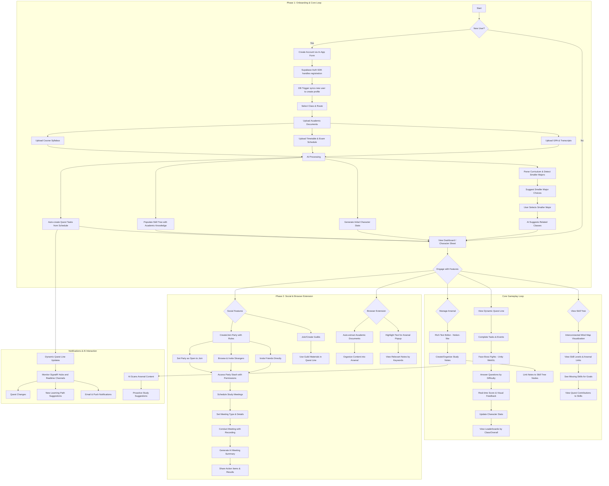
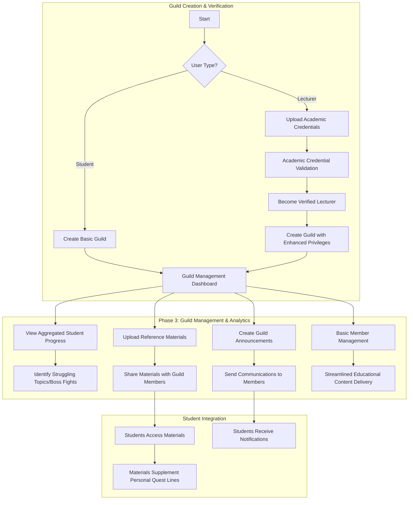
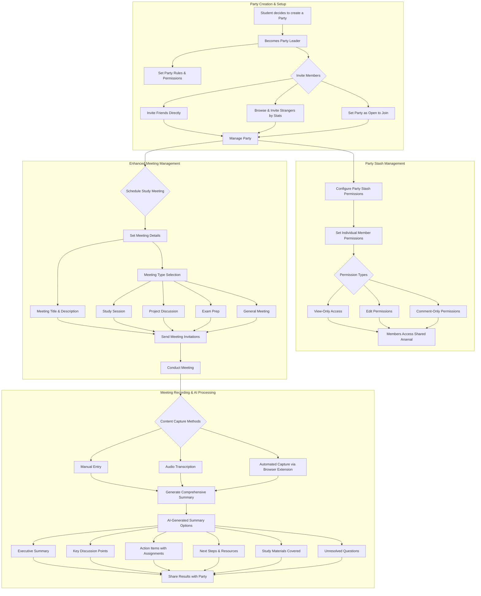

# User Interaction Flows

This document visualizes the primary interaction flows for each user role within the RogueLearn platform using Mermaid diagrams.

## Student (Player) Flow

## Guild Master Flow (Student or Verified Lecturer)

## Party Leader Flow

## System Admin Flow

```mermaid
graph TD
    A[Start] --> B[Access Admin Dashboard];

    subgraph "System Analytics & Monitoring"
        B --> C{View Analytics};
        C --> D[User Engagement Metrics];
        D --> D1[Weekly Active Users];
        D --> D2[Quest Completion Rates];
        D --> D3[Party Creation Rates];
        D --> D4[User Retention Rates];
        C --> E[Platform Performance];
        E --> E1[API Response Times];
        E --> E2[System Uptime Monitoring];
        E --> E3[Error Rate Analysis];
        C --> F[Educational Analytics];
        F --> F1[Class & Route Popularity];
        F --> F2[Boss Fight Performance];
        F --> F3[Skill Tree Progression];
    end

    subgraph "Platform Management"
        B --> G{System Configuration};
        G --> H[Manage Notification Settings];
        G --> I[Configure Quest Generation Parameters];
        G --> J[Monitor AI Processing Performance];
        G --> K[Manage User Authentication - Supabase];
        G --> L[Database & Storage Management - Supabase];
    end

    subgraph "Content & User Management"
        B --> M{Content Moderation};
        M --> N[Review User-Generated Content];
        M --> O[Manage Guild Verification Requests];
        M --> P[Monitor Academic Credential Validation];
        M --> Q{User Management};
        Q --> R[Role-Based Access Control];
        Q --> S[Data Privacy & GDPR Compliance];
        Q --> T[User Data Retention Policies];
    end

    subgraph "Integration & Technical Operations"
        B --> U{System Integrations};
        U --> V[Monitor SignalR Hubs and Realtime Channels];
        U --> W[Unity WebGL Performance Monitoring];
        U --> X[Browser Extension Analytics];
        U --> Y[Third-party API Health Checks];
    end
```

