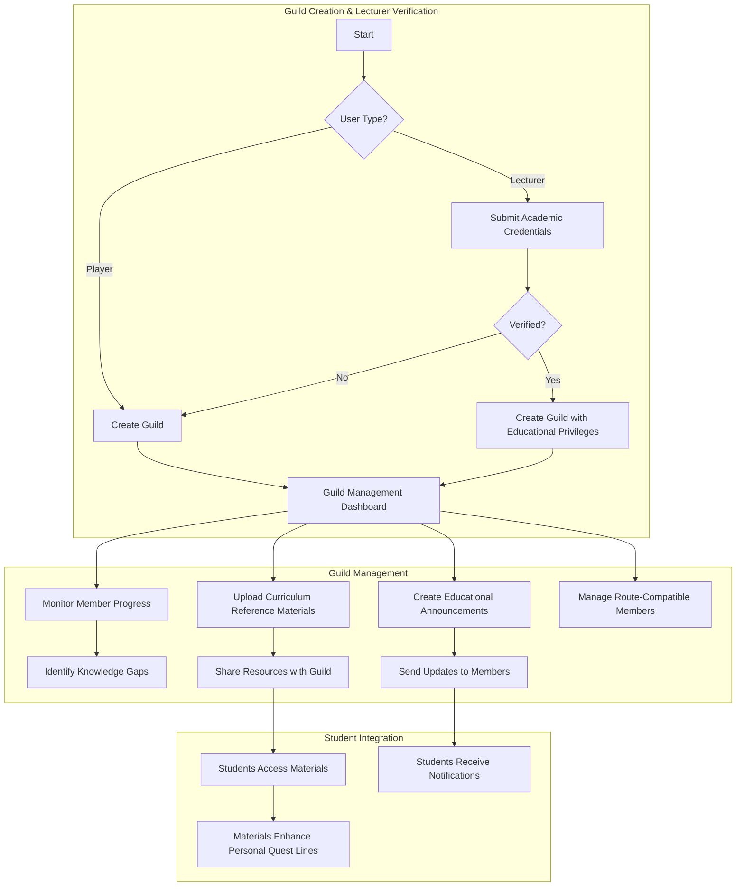
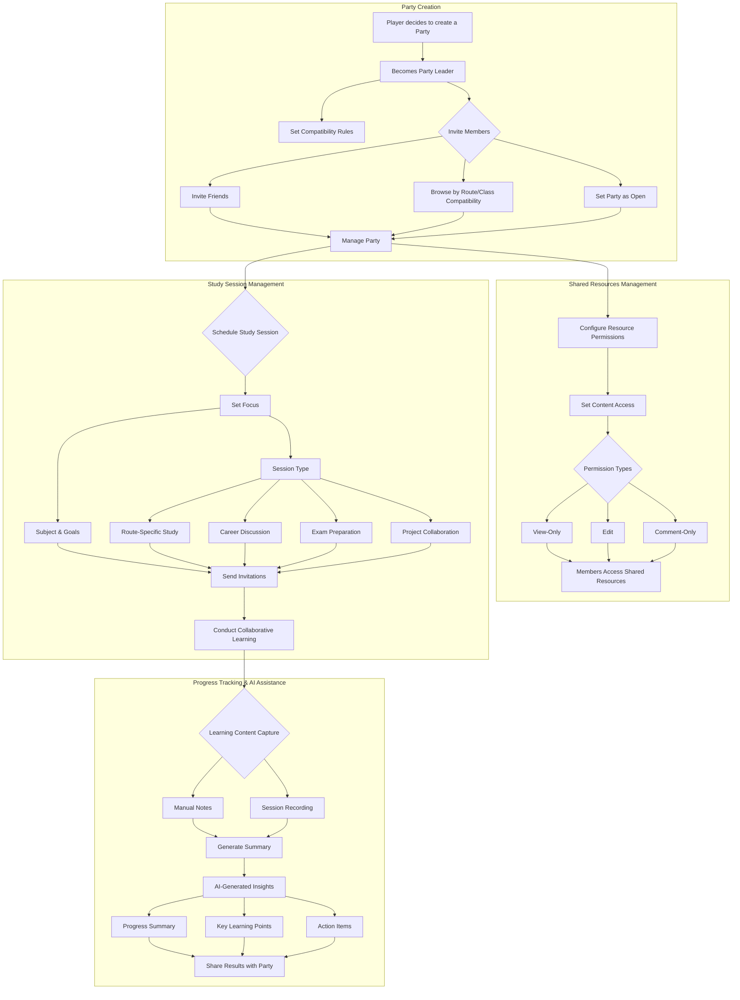
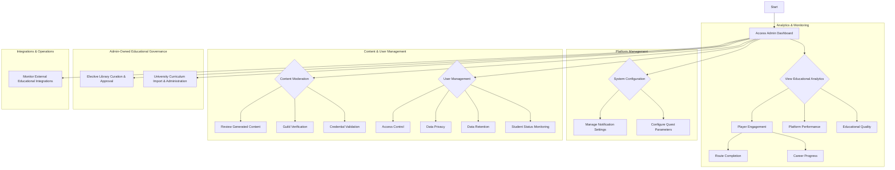

# User Interaction Flows

This document visualizes primary interaction flows using high-level business logic. Technical implementation details (SDKs, database triggers, specific vendors) are intentionally omitted.

## Player Flow

```mermaid
graph TD
    subgraph "Phase 1: Onboarding & Optional Student Verification"
        A[Start] --> B{New User?}
        B -- Yes --> C[Create Account]
        B -- No --> F[View Dashboard]
        C --> D[Optional: Verify Student Status]
        D --> D1{Verified?}
        D1 -- Yes --> E[Unlock University-Aligned Features]
        D1 -- No --> E
        E --> R[Select Route (Curriculum)]
        R --> S[Select Class (Career Focus)]
        S --> T[AI Gap Analysis]
        T --> U[Generate Quest Line]
        U --> V[Create Integrated Skill Tree]
        V --> W{Optional: Upload Supporting Documents}
        W --> X[Enhance Visualization & Notes]
        X --> Y[Proceed]
        Y --> Z{Engage with Platform Features}
    end

    subgraph "Core Learning Loop"
        Z --> H[View Quest Line]
        H --> I[Complete Academic & Career Quests]
        I --> J[Boss Challenges & Assessments]
        J --> K[Update Progress]
        K --> L[View Leaderboards]
        Z --> M[Manage Notes & Resources]
        M --> N[Link Notes to Skill Tree]
        Z --> O[View Integrated Skill Tree]
        O --> P[Track Gap Analysis]
    end

    subgraph "Phase 2: Collaboration"
        Z --> Q[Create/Join Party]
        Q --> Q1[Invite Compatible Members]
        Q --> Q2[Access Shared Resources]
        Q2 --> Q3[Schedule Study Sessions]
        Q3 --> Q4[Conduct Collaborative Learning]
        Q4 --> Q5[Share Summary & Action Items]
        Z --> S[Join/Create Guilds]
        S --> S1[Access Guild Materials]
    end

    subgraph "Notifications & AI Assistance"
        U --> N1[Quest Updates]
        T --> N2[Performance-Based Adjustments]
        Q3 --> N3[Session Reminders]
        N1 --> N4[Email & Push Notifications]
        N2 --> N4
        N3 --> N4
    end
```

## Guild Master Flow



## Party Leader Flow



## Game Master (Admin) Flow


