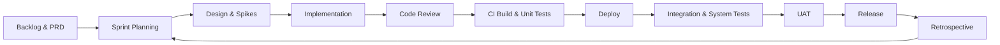

# Project Management Plan

## Overview

This plan outlines the management strategy, scope, schedule, quality goals, risks, responsibilities, and communication approach for the RogueLearn project. It is designed to guide the team from initiation to release using an iterative, quality-driven process that aligns with the existing PRD, front-end specifications, and full-stack architecture documentation in this repository.

## Scope & Estimation

Aligned to the current Epic List (docs/prd/epic-list.md), this scope includes all epics. To fit a 10-week duration, work will be executed in parallel streams (Core Player, Competitive & Events, Governance & Academic Integration). Estimates are in man-days (MD) and include design, implementation, and validation for each epic/capability.

Epic-driven Functional Scope

| ID | Epic (FR coverage) | Complexity | Est. Effort (MD) | Notes |
|----|---------------------|------------|------------------|-------|
| E1 | Onboarding & Academic Data (FR1–FR3) | Medium | 10 | Account creation; Route/Class selection; optional academic data intake |
| E2 | AI Curriculum & Career Alignment (FR4–FR4A) | Complex | 14 | AI analyzes curriculum; gap analysis with roadmap.sh; generates quest line |
| E3 | Skill & Stats Foundation (FR5–FR9) | Complex | 12 | Skill points, initial stats, skill tree population, quest chaptering |
| E4 | Dashboard, Skill Tree & Arsenal (FR10–FR15) | Complex | 14 | Character dashboard; interactive skill tree; Arsenal notes linking |
| E5 | Boss Fights & Leaderboards (FR16–FR19) | Complex | 16 | Gamified mock exams; scoring; difficulty levels; leaderboards |
| E6 | Dynamic Quest & Notifications (FR20–FR21) | Medium | 9 | Adaptive quest updates; in-app/email notifications |
| E7 | Browser Extension Integration (FPTU & Arsenal) | Medium | 8 | Baseline extension linking to FPTU/Arsenal features |
| E8 | Code Battle & Competitive Events v1 (FR43–FR45) | Complex | 16 | Real-time battles; scoring; leaderboards; guild events basics |
| E9 | Event Management & Administration Platform (FR46–FR47) | Medium | 10 | Event creation/scheduling; approval workflows |
| E10 | Academic Integration (FPTU, Quest Memory & Recovery) (FR48, FR49, FR51) | Complex | 12 | Verification; cross-semester quest memory; recovery pathways |
| E11 | Admin-Owned Educational Governance (FR52–FR53) | Medium | 10 | Elective library curation; curriculum import/admin |
| E12 | Objective System, Knowledge Graph & Rewards (FR54–FR60) | Complex | 14 | Objectives; automated project verification; knowledge graph; rewards |
| E13 | Enhanced Browser Extension Integration (FR50) | Medium | 8 | Enhanced portal integration, synchronization |
| E14 | Marketplace & Economy (Future – discovery only) | Simple | 6 | Discovery, backlog shaping, feasibility study |

Platform & Quality Infrastructure

| ID | Capability | Complexity | Est. Effort (MD) | Notes |
|----|------------|------------|------------------|-------|
| P1 | CI/CD Pipeline & Infrastructure | Medium | 6 | GitHub Actions; staging/prod environments; secrets management |
| P2 | Observability & Monitoring | Simple | 4 | Logging, metrics, alerts (App Insights/Sentry) |
| P3 | Test Automation & QA Framework | Medium | 12 | Unit, integration, end-to-end scaffolding; coverage thresholds |
| P4 | Security Hardening (OWASP baseline) | Medium | 3 | Secure defaults; dependency checks; basic threat model |
| P5 | Release Management & Documentation | Simple | 4 | Semantic versioning, release notes, docs updates |

Total Estimated Effort: 188 MD

## Project Objectives

Overall Objective: Deliver a functional RogueLearn MVP that enables student onboarding, quest progression, and competitive learning (code battles), with essential social and administrative capabilities, achieving high reliability and usability within the defined schedule and budget.

Quality Objectives and Targets

| # | Testing Stage      | Test Coverage Target | Target Defects Found (count) | % of Total Defects | Notes |
|---|--------------------|----------------------|------------------------------|--------------------|-------|
| 1 | Reviewing          | N/A                  | 24                           | 20%               | PR-based code reviews, checklists, static analysis |
| 2 | Unit Test          | ≥ 70% lines/branches | 42                           | 35%               | .NET unit tests + React component tests |
| 3 | Integration Test   | Key paths ≥ 60%      | 30                           | 25%               | API + DB + services; Postman/newman suites |
| 4 | System Test        | ≥ 80% critical flows | 18                           | 15%               | End-to-end user journeys in staging |
| 5 | Acceptance Test    | 100% of AC covered   | 6                            | 5%                | UAT against PRD acceptance criteria |

Milestone Timeliness Target: ≥ 90% on-time milestone completion

Allocated Effort (188 MD)

- Requirements & Analysis: 23 MD (~12%)
- Architecture & Design: 19 MD (~10%)
- Implementation (Coding): 97 MD (~52%)
- Testing & QA: 38 MD (~20%)
- Project Management: 11 MD (~6%)

## Project Risks

| # | Risk Description | Impact | Possibility | Response Plans |
|---|------------------|--------|-------------|----------------|
| R1 | Requirements churn or unclear acceptance criteria | High | Medium | Maintain PRD traceability; change control board; refine AC before sprint commit |
| R2 | Skill gaps in ASP.NET Core/React/EF Core | High | Medium | Targeted training plan; pair programming; code reviews; spikes |
| R3 | Integration dependencies (OAuth, payment, email) delayed | Medium | Medium | Mock services; feature flags; decouple integration behind interfaces |
| R4 | Performance/scalability issues in code battle module | High | Medium | Early load testing; profiling; optimize algorithms; caching |
| R5 | Data model misalignment with curriculum import | Medium | Medium | Schema reviews; sample imports; migration scripts |
| R6 | Environment instability (CI/CD, staging/prod) | Medium | Medium | IaC scripts; environment parity; health checks |
| R7 | Security vulnerabilities (auth, data privacy) | High | Low | Security reviews; OWASP checks; secure defaults; secrets management |
| R8 | Test data management and flaky tests | Medium | Medium | Deterministic fixtures; in-memory DB for repository tests; CI test isolation |
| R9 | Schedule risk due to scope creep | High | Medium | Strict MVP scope; backlog grooming; timeboxing; communicate trade-offs |
| R10 | Team availability constraints | Medium | Low | Cross-training; buffer; reassign tasks quickly |

## Management Approach

We will use an agile, sprint-based approach (Scrum-like) with one-week sprints, continuous integration, and incremental releases to staging. Planning emphasizes MVP scope, measurable milestones, and quality gates.

- Iterations: 10 sprints (1 week each)
- Parallel workstreams: Core Player, Competitive & Events, Governance & Academic Integration
- Backlog management: PRD-derived stories prioritized by value and risk
- Definition of Ready: Clear AC, dependencies identified, designs prepared
- Definition of Done: Code + tests + review + CI green + docs updated + staging verified
- Governance: Weekly steering meeting; change control for scope changes

## Project Process

Process Model: Iterative development with continuous integration and staged testing.

Key Practices

- Branching: trunk-based with short-lived feature branches; PR required
- Reviews: mandatory reviewers; linting and static analysis in CI
- Automated checks: build, unit tests, integration tests, coverage thresholds
- Releases: tagged, semantic versioning; release notes linked to PRD stories

## Quality Management

Approach to achieve quality objectives:

- Defect Prevention: design reviews, coding standards, static analysis, secure defaults
- Reviewing: PR templates, checklists, mandatory code review for all changes
- Unit Testing: .NET xUnit/NUnit, React Testing Library, minimum coverage ≥ 70%
- Integration Testing: API + DB tests using in-memory or test containers; Postman collections
- System Testing: end-to-end flows in staging; cross-browser checks; performance smoke tests
- Test Data & Environments: deterministic fixtures, seeded data, environment parity between staging and prod

## Training Plan

Training activities planned to close skill gaps and ensure team readiness.

| Training Area | Participants | When, Duration | Waiver Criteria |
|---------------|-------------|----------------|-----------------|
| ASP.NET Core & EF Core | KhanhNTHE03579, ThuyVT04278 | Weeks 1–2, 8h | Prior .NET project experience |
| React & TypeScript | VanNTTHE04680, HuyenDTHE04671 | Weeks 1–2, 8h | Built ≥ 2 React apps |
| Git & GitHub (Branching, PRs) | All | Week 1, 4h | Demonstrated PR workflow mastery |
| CI/CD with GitHub Actions | ThuyVT04278, KhanhNTHE03579 | Week 2, 4h | Prior CI/CD pipelines delivered |
| Azure Fundamentals (or chosen cloud) | ThuyVT04278 | Week 3, 4h | Deployed ≥ 1 app to cloud |
| Security & OWASP Top 10 | All | Week 3, 4h | Completed security training |
| Test Automation (xUnit/RTL) | PhuongDTHE03246, VanNTTHE04680 | Weeks 2–3, 6h | Prior automation setups |

## Project Deliverables

High-level schedule with target dates (dd/MM/yyyy). Adjust as needed by steering committee.

| # | Deliverable | Due Date | Notes |
|---|-------------|----------|-------|
| 1 | Charter & PMP finalized; ADRs baseline; backlog established; CI/CD baseline | Week 1 | Foundations for parallel workstreams in place |
| 2 | Onboarding & Academic Data v1; Security baseline; Observability baseline | Week 2 | Route/Class selection; academic data intake; OWASP baseline |
| 3 | AI Curriculum & Career Alignment v1; Skill & Stats Foundation v1; Test automation baseline | Week 3 | Curriculum analysis; quest generation; scoring/XP engine |
| 4 | Dashboard & Arsenal v1; Dynamic Quest & Notifications v0.5; Browser Extension Integration (FPTU & Arsenal) v0.5 | Week 4 | Interactive skill tree; initial notifications; extension scaffolding |
| 5 | Boss Fights & Leaderboards v1; Enhanced Browser Extension Integration (FR50) stub | Week 5 | Mock exams, scoring; portal sync groundwork |
| 6 | Code Battle & Competitive Events v0.5; Event Management & Admin Platform v0.5 | Week 6 | Matchmaking stub; event creation/scheduling skeleton |
| 7 | Code Battle & Competitive Events v1; Event Management & Admin Platform v1 | Week 7 | Scoring, leaderboards; approval workflows complete |
| 8 | Academic Integration v1 (FPTU verification, Quest Memory & Recovery); Admin-Owned Governance v1 | Week 8 | Verification & continuity; electives/curriculum admin |
| 9 | Objective System, Knowledge Graph & Rewards v1; Performance smoke tests; Release management | Week 9 | Objectives, project verification, rewards; versioning and notes |
| 10 | System/Integration tests complete; UAT sign-off; Final release & documentation; Marketplace & Economy discovery pack | Week 10 | Cross-epic integration; RC release; discovery artifacts for future phase |

## Responsibility Assignments (RACI)

D = Do, R = Review, S = Support, I = Informed

| Responsibility | KhanhNTHE03579 | VanNTTHE04680 | PhuongDTHE03246 | HuyenDTHE04671 | ThuyVT04278 |
|----------------|-----------------|---------------|-----------------|----------------|-------------|
| Project Planning & Tracking | D | R | S | S | R |
| Prepare Project Introduction Document | R | S | S | D | I |
| Prepare SRS Document (Overview Part) | D | R | S | S | R |
| Prepare SRS Document (User Requirements) | D | R | S | S | R |
| Front-end Specifications & Wireframes | I | D | R | R | S |
| Fullstack Architecture & API Spec | D | S | R | I | R |
| Test Plan & Test Cases | I | S | D | R | S |
| CI/CD & Infrastructure | R | I | S | I | D |
| Release Management | D | R | S | I | R |
| Documentation & Knowledge Base | R | S | S | D | I |

## Project Communications

- Daily: Stand-up (15 min), async updates in team-log and Slack/Discord channel
- Weekly: Sprint planning, demo, retrospective; steering sync for risks and scope changes
- Artifacts: GitHub Issues/Projects, PRD docs, ADRs, task board, team-log entries
- Reporting: Weekly progress report with velocity, burn-down, quality metrics

## Configuration Management

### Document Management

- Repository structure within docs/ with clear subfolders (prd, front-end-spec, fullstack-architecture, project-management)
- Versioning via Git; change history through PRs; release notes for major milestones
- Templates and checklists maintained in .bmad-core and used consistently

### Source Code Management

- Branching: trunk-based; feature branches with PRs; protected main branch
- Versioning: semantic versioning (MAJOR.MINOR.PATCH)
- Commit convention: Conventional Commits (feat, fix, docs, chore, refactor, test)
- Code Reviews: 1–2 mandatory reviewers; CI must pass before merge
- CI/CD: GitHub Actions for build/test/deploy; environments staged → production

### Tools & Infrastructures

- VCS & Hosting: GitHub
- CI/CD: GitHub Actions; environment secrets via GitHub/Key Vault
- Cloud: Azure Web App/API + Azure SQL (or PostgreSQL), Storage
- Observability: Azure App Insights or Sentry, structured logging
- Testing: xUnit/NUnit, React Testing Library, Postman/newman, Playwright for E2E
- Work Tracking: GitHub Projects/Issues; documentation within this repo

---

Notes: Dates and estimates are planning baselines and should be revisited after Sprint 1 based on observed velocity and risk. This plan is intended to be living documentation; changes must be tracked via PRs and visible in weekly steering notes.