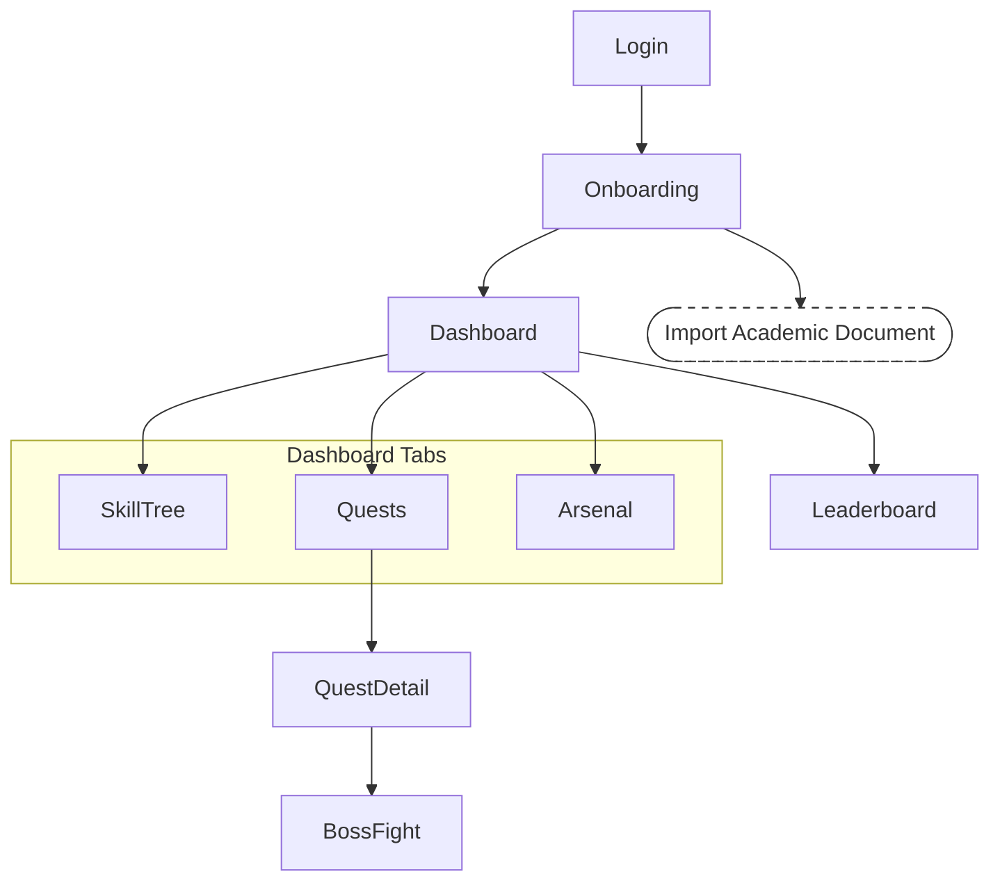
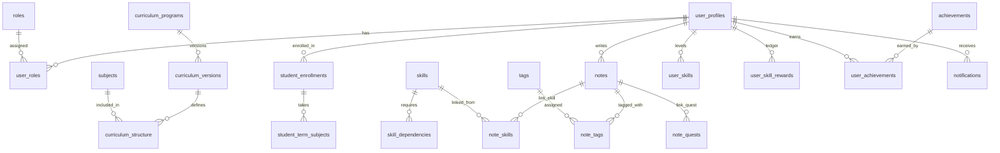
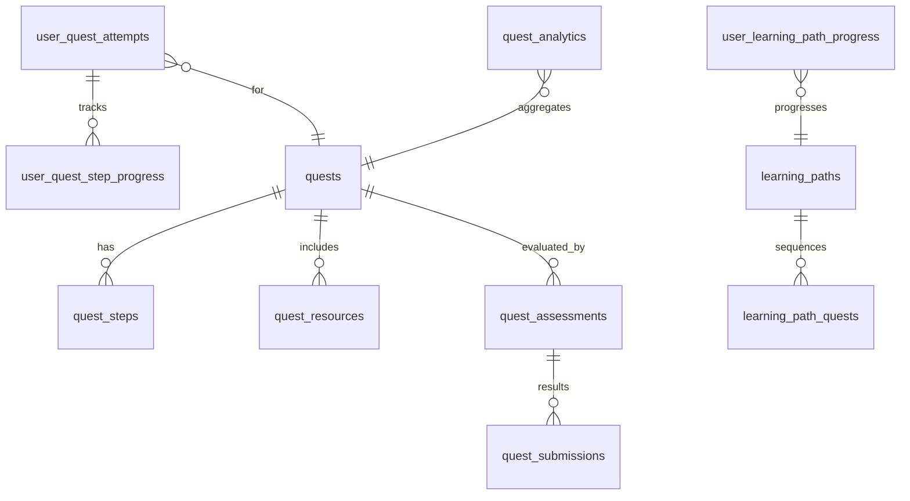
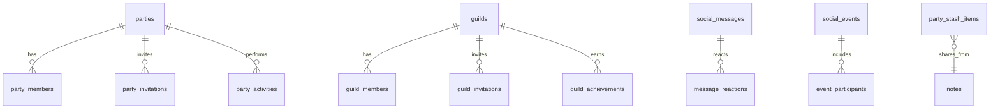

# 3. Functional Requirements

> Provide functionality overview of software system: screen flow, screen descriptions, system user roles, screen authorization, non-screen functions, ERD.

## 3.1 System Functional Overview

### 3.1.1 Screens Flow
> Shows the system screens and relationships among screens. Include notation for pop-ups or tabbed screens.

### 3.1.2 Screen Descriptions
> Provide descriptions for the screens in the Screens Flow above.

| # | Feature | Screen | Description |
|---|---------|--------|-------------|
| 1 | Onboarding & Academic Data | Onboarding | 3-step character creation to establish curriculum, specialization, and roadmap. |
| 2 | Onboarding & Academic Data | Import Academic Document | Pop-up to upload transcripts/schedules/IDs to influence stats and verification. |
| 3 | Dashboard | Dashboard | Overview of progress, stats, active quests, and quick links to features. |
| 4 | Skill Tree | Skill Tree | Visual interconnected skill graph showing levels, prerequisites, and links to notes. |
| 5 | Quests | Quest Detail | Semester-organized quest detail with objectives derived from syllabus. |
| 6 | Boss Fights | Boss Fight | WebGL mock exam experience with scoring and XP conversion. |
| 7 | Social & Rankings | Leaderboard | Rankings by class/major/guild with scoring breakdowns. |
| 8 | Notes | Arsenal | Notion-like rich text workspace for study materials and references. |

### 3.1.3 Screen Authorization
> Provide system roles authorization to features.

| Screen / Activity | Student (Player) | Party Leader | Guild Master | Verified Lecturer | Instructor/Advisor | Game Master (Admin) |
|-------------------|:----------------:|:------------:|:------------:|:-----------------:|:------------------:|:-------------------:|
| Onboarding | X |  |  |  |  |  |
| Import Academic Document | X |  |  |  |  | X |
| Dashboard | X | X | X | X | X | X |
| Skill Tree | X | X | X | X | X | X |
| Quest Detail | X | X | X | X | X | X |
| Boss Fight | X |  |  |  |  |  |
| Leaderboard | X | X | X | X | X | X |
| Arsenal | X |  |  |  |  |  |
| Query All Data |  |  |  |  |  | X |
| Query Own Data | X | X | X | X | X | X |
| Query Managed Data |  | X | X | X | X | X |
| Add New Data |  |  |  |  |  | X |
| Update All Data |  |  |  |  |  | X |
| Update Own Data | X | X | X | X | X | X |
| Update Managed Data |  | X | X | X | X | X |
| Delete Data |  |  |  |  |  | X |

### 3.1.4 Non-Screen Functions
> Describe non-screen system functions (batch/cron job, services, APIs).

| # | Feature | System Function | Description |
|---|---------|-----------------|-------------|
| 1 | Calendar Sync | AcademicCalendarSync (cron) | Nightly import of academic calendar and schedule changes from FPTU portal. |
| 2 | Quest Generation | QuestGeneratorService | AI service that converts syllabus and calendar into semester-organized quests. |
| 3 | Verification | StudentVerificationAPI | Endpoint to validate FPTU status based on uploaded documents. |
| 4 | Leaderboard | LeaderboardAggregator (batch) | Weekly recalculation and seasonal reset of rankings. |

### 3.1.5 Entity Relationship Diagram
> Provide ERD and entity descriptions.

ERD (Mermaid)

#### User Service Data Model (authoritative user, academic, skills, notes)

#### Quests Service Data Model (quest definitions, attempts, learning paths)

#### Social Service Data Model (party, guild, messaging, events)

Entities Description

- User Service (docs/fullstack-architecture/service-databases/user-service-database.md)
  - user_profiles: Core profile linked to auth.users; includes class_id (roadmap specialization) and route_id (curriculum).
  - roles, user_roles: RBAC assignments (Player, Party Leader, Guild Master, Game Master), Verified Lecturer via verification workflow.
  - curriculum_programs, curriculum_versions, subjects, curriculum_structure: University curriculum and syllabus ownership; versioned and activations.
  - student_enrollments, student_term_subjects: Enrollment lifecycle and per-term subjects with status/grades.
  - skills, skill_dependencies: Skill Tree catalog and relationships.
  - notes, tags, note_tags, note_skills, note_quests: Arsenal ownership and linkage to skills and quests.
  - user_skills, user_skill_rewards: Authoritative skill progression and rewards ledger (per PRD FR58).
  - achievements, user_achievements; notifications: Achievement catalog and user notifications.

- Quests Service (docs/fullstack-architecture/service-databases/quests-service-database.md)
  - quests, quest_steps, quest_resources: Quest definitions and structured steps/resources.
  - user_quest_attempts, user_quest_step_progress: Attempt and step-level progression.
  - learning_paths, learning_path_quests, user_learning_path_progress: Sequenced paths and per-user progress.
  - quest_assessments, quest_submissions: Assessment configuration and submissions.
  - quest_analytics: Aggregated performance and engagement metrics.
  - External references: subjects/curriculum (User Service) and skills catalog consumed; reward events published to User Service.

- Social Service (docs/fullstack-architecture/service-databases/social-service-database.md)
  - parties, party_members, party_invitations, party_activities: Study groups, membership and collaborative activities.
  - guilds, guild_members, guild_invitations, guild_achievements: Large communities and achievements.
  - friendships, user_social_stats: Social graph and stats.
  - social_messages, message_reactions: Messaging system.
  - social_events, event_participants: Events organization; meeting integration.
  - party_stash_items: Shared snapshots referencing User Service notes (Arsenal).

Cross-service notes:
- user_profiles.auth_user_id is referenced by Quests and Social domains for attempts, memberships, and submissions.
- The authoritative XP/skill ledger resides in User Service (`user_skill_rewards`, `user_skills`) per PRD FR58.
- Quests and Social Services publish Reward Cascade events; User Service ingests and persists.

## 3.2 Onboarding & Academic Data

### 3.2.1 Character Creation Flow
> A function can be a screen or a non-screen function. Provide: trigger, description, layout, and details.

- Function trigger: Navigates via Login → Onboarding; may be re-entered from Profile settings.
- Function description: Student selects Curriculum, Specialization (roadmap.sh), and generates Skill-based Roadmap; optionally uploads academic documents to adjust stats and verification.
- Screen layout: Three steps with progress indicator; document upload pop-up; summary confirmation.
- Function details: 
  - Validation: Required selection per step; file type checks (PDF, PNG/JPG); max 10MB per file.
  - Business rules: Curriculum-first quest generation; verified FPTU status unlocks university-specific flows.
  - Normal cases: Successful selections generate default quest line; uploaded docs adjust stats immediately.
  - Abnormal cases: Upload failures show retry and error messaging; incomplete steps prevent progression.

## 3.3 AI Curriculum & Career Alignment

- Function trigger: After onboarding step completion or when changing specialization.
- Function description: AI analyzes curriculum vs roadmap.sh to identify gaps and generate supplementary quests.
- Function details: Confidence thresholds; quarterly refresh; integrates into semester schedule respecting load.