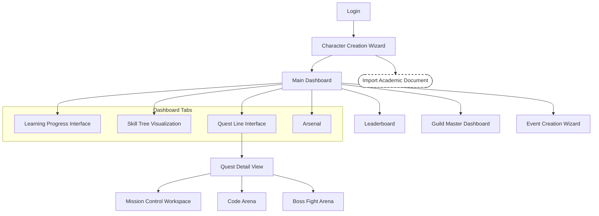
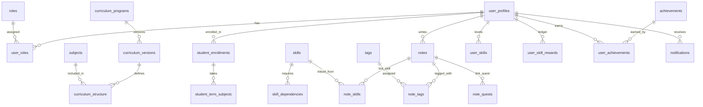
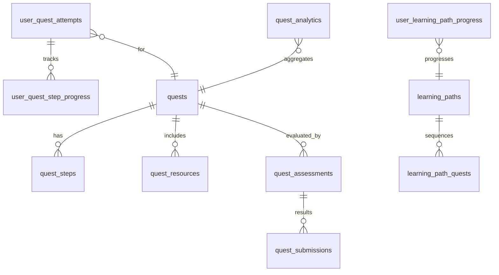
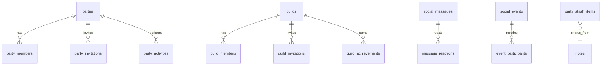

# 3. Functional Requirements

> Provide functionality overview of software system: screen flow, screen descriptions, system user roles, screen authorization, non-screen functions, ERD.

## 3.1 System Functional Overview

### 3.1.1 Screens Flow
> Shows the system screens and relationships among screens. Include notation for pop-ups or tabbed screens.

### 3.1.2 Screen Descriptions
> Provide descriptions for the screens in the Screens Flow above.

| # | Feature | Screen | Description | Source PRD |
|---|---------|--------|-------------|------------|
| 1 | Onboarding & Academic Data | Character Creation Wizard | Guided 3-step onboarding to select curriculum, specialization (roadmap.sh), and generate the initial skill-based roadmap. | [Onboarding & Academic Data](../prd/requirements.md#onboarding--academic-data) |
| 2 | Onboarding & Academic Data | Import Academic Document | Pop-up to upload transcripts/schedules/IDs to influence stats, verification (FPTU), and semester planning. | [Onboarding & Academic Data](../prd/requirements.md#onboarding--academic-data) |
| 3 | Dashboard | Main Dashboard | Central hub showing progress, stats (STR/DEX/INT, XP), active quests, upcoming events, and quick navigation to tabs. | [Dashboard, Skill Tree & Arsenal](../prd/requirements.md#dashboard-skill-tree--arsenal) |
| 4 | Learning Progress | Learning Progress Interface | Module/semester view of quest completion, grades, deadlines, and workload indicators with filters and responsive layout. | [Dashboard, Skill Tree & Arsenal](../prd/requirements.md#dashboard-skill-tree--arsenal) |
| 5 | Skill Tree | Skill Tree Visualization | Interactive graph with nodes, prerequisites, levels, and links to related notes and quests; supports zoom/pan and contextual unlocks. | [Dashboard, Skill Tree & Arsenal](../prd/requirements.md#dashboard-skill-tree--arsenal) |
| 6 | Quests | Quest Line Interface | Chapter/semester-oriented quest line with states (Completed, In Progress, Available, Locked); shows dependency chains and rewards. | [AI Curriculum & Career Alignment](../prd/requirements.md#ai-curriculum--career-alignment), [Dynamic Quest & Notifications](../prd/requirements.md#dynamic-quest--notifications) |
| 7 | Quests | Quest Detail View | Detailed objectives, resources, micro-objectives (via knowledge graph), attempt history, and actions: Start/Pause/Submit. | [AI Curriculum & Career Alignment](../prd/requirements.md#ai-curriculum--career-alignment) |
| 8 | Assessments | Boss Fight Arena | WebGL assessment arena with timer, scoring, feedback, and XP/skill reward cascade; supports practice/exam modes. | [Boss Fights & Leaderboards](../prd/requirements.md#boss-fights--leaderboards) |
| 9 | Workspace | Mission Control (Local Project) | Workspace for code/project objectives with repository links, checklists, and automated verification hooks. | [Objective System, Knowledge Graph & Rewards](../prd/requirements.md#objective-system-knowledge-graph--rewards) |
| 10 | Coding Arena | Code Arena | In-browser coding interface with problem statements, test cases, and real-time feedback; supports solo and event modes. | [Event Platform (Code Arena & Guild Events)](../prd/requirements.md#event-platform-code-arena--guild-events) |
| 11 | Social & Management | Guild Master Dashboard | Manage guild members, invitations, activity tracking, and learning path oversight with analytics. | [Basic Guild Management (Verified Lecturer Gated)](../prd/epic-list.md#basic-guild-management-verified-lecturer-gated) |
| 12 | Events | Event Creation Wizard | Multi-step wizard to create sessions/competitions (single, multi-day, recurring), schedule, scoring rules, and registration. | [Event Platform (Code Arena & Guild Events)](../prd/requirements.md#event-platform-code-arena--guild-events) |
| 13 | Social & Rankings | Leaderboard | Rankings by class/major/guild with filters and seasonal resets; shows score composition and recent achievements. | [Boss Fights & Leaderboards](../prd/requirements.md#boss-fights--leaderboards) |
| 14 | Notes | Arsenal | Rich text and media notes, document processing, tagging, and linkage to skills/quests; supports party stash sharing. | [Dashboard, Skill Tree & Arsenal](../prd/requirements.md#dashboard-skill-tree--arsenal), [Browser Extension Integration](../prd/requirements.md#browser-extension-integration-fptu--arsenal) |

### 3.1.3 Screen Authorization
> Provide system roles authorization to features.

| Screen / Activity | Student (Player) | Party Leader | Guild Master | Verified Lecturer | Game Master (Admin) |
|-------------------|:----------------:|:------------:|:------------:|:-----------------:|:-------------------:|
| **Character Creation Wizard** | X |  |  |  |  |
| - Select curriculum | X |  |  |  |  |
| - Choose specialization | X |  |  |  |  |
| - Generate skill roadmap | X |  |  |  |  |
| **Import Academic Document** | X |  |  |  | X |
| - Upload transcripts/schedules | X |  |  |  | X |
| - Verify FPTU status | X |  |  |  | X |
| **Main Dashboard** | X | X | X | X | X |
| - View progress stats | X | X | X | X | X |
| - Navigate to tabs | X | X | X | X | X |
| - View active quests | X | X | X | X | X |
| **Learning Progress Interface** | X | X | X | X | X |
| - View quest completion | X | X | X | X | X |
| - Filter by module/semester | X | X | X | X | X |
| - Check deadlines | X | X | X | X | X |
| **Skill Tree Visualization** | X | X | X | X | X |
| - Navigate skill nodes | X | X | X | X | X |
| - View prerequisites | X | X | X | X | X |
| - Link to notes/quests | X | X | X | X | X |
| **Quest Line Interface** | X | X | X | X | X |
| - View quest states | X | X | X | X | X |
| - Check dependency chains | X | X | X | X | X |
| - View rewards | X | X | X | X | X |
| **Quest Detail View** | X | X | X | X | X |
| - View objectives | X | X | X | X | X |
| - Access resources | X | X | X | X | X |
| - Start/Pause/Submit quest | X | X | X | X | X |
| **Boss Fight Arena** | X |  |  |  |  |
| - Take assessments | X |  |  |  |  |
| - View scoring/feedback | X |  |  |  |  |
| - Practice mode | X |  |  |  |  |
| **Mission Control Workspace** | X |  |  |  |  |
| - Manage project objectives | X |  |  |  |  |
| - Link repositories | X |  |  |  |  |
| - Track checklists | X |  |  |  |  |
| **Code Arena** | X |  |  |  |  |
| - Solve coding problems | X |  |  |  |  |
| - Run test cases | X |  |  |  |  |
| - Participate in events | X |  |  |  |  |
| **Guild Master Dashboard** |  |  | X | X | X |
| - Manage guild members |  |  | X | X | X |
| - Send invitations |  |  | X | X | X |
| - Track member activity |  |  | X | X | X |
| **Event Creation Wizard** |  |  |  | X | X |
| - Create sessions/competitions |  |  |  | X | X |
| - Set scheduling |  |  |  | X | X |
| - Configure scoring rules |  |  |  | X | X |
| **Leaderboard** | X | X | X | X | X |
| - View rankings | X | X | X | X | X |
| - Filter by class/major/guild | X | X | X | X | X |
| - Check achievements | X | X | X | X | X |
| **Arsenal** | X |  |  |  |  |
| - Create/edit notes | X |  |  |  |  |
| - Tag and organize | X |  |  |  |  |
| - Link to skills/quests | X |  |  |  |  |

### 3.1.4 Non-Screen Functions
> Describe non-screen system functions (batch/cron job, services, APIs).

| # | Feature | System Function | Description |
|---|---------|-----------------|-------------|
| 1 | Quest Generation | QuestGeneratorService | AI service that converts syllabus and calendar into semester-organized quests. |
| 2 | Verification | StudentVerificationAPI | Endpoint to validate FPTU status based on uploaded documents. |
| 3 | Leaderboard | LeaderboardAggregator (batch) | Weekly recalculation and seasonal reset of rankings. |

### 3.1.5 Entity Relationship Diagram
> Provide ERD and entity descriptions.

ERD (Mermaid)

#### User Service Data Model (authoritative user, academic, skills, notes)

#### Quests Service Data Model (quest definitions, attempts, learning paths)

#### Social Service Data Model (party, guild, messaging, events)

Entities Description

- User Service (docs/fullstack-architecture/service-databases/user-service-database.md)
  - user_profiles: Core profile linked to auth.users; includes class_id (roadmap specialization) and route_id (curriculum).
  - roles, user_roles: RBAC assignments (Player, Party Leader, Guild Master, Game Master), Verified Lecturer via verification workflow.
  - curriculum_programs, curriculum_versions, subjects, curriculum_structure: University curriculum and syllabus ownership; versioned and activations.
  - student_enrollments, student_term_subjects: Enrollment lifecycle and per-term subjects with status/grades.
  - skills, skill_dependencies: Skill Tree catalog and relationships.
  - notes, tags, note_tags, note_skills, note_quests: Arsenal ownership and linkage to skills and quests.
  - user_skills, user_skill_rewards: Authoritative skill progression and rewards ledger (per PRD FR58).
  - achievements, user_achievements; notifications: Achievement catalog and user notifications.

- Quests Service (docs/fullstack-architecture/service-databases/quests-service-database.md)
  - quests, quest_steps, quest_resources: Quest definitions and structured steps/resources.
  - user_quest_attempts, user_quest_step_progress: Attempt and step-level progression.
  - learning_paths, learning_path_quests, user_learning_path_progress: Sequenced paths and per-user progress.
  - quest_assessments, quest_submissions: Assessment configuration and submissions.
  - quest_analytics: Aggregated performance and engagement metrics.
  - External references: subjects/curriculum (User Service) and skills catalog consumed; reward events published to User Service.

- Social Service (docs/fullstack-architecture/service-databases/social-service-database.md)
  - parties, party_members, party_invitations, party_activities: Study groups, membership and collaborative activities.
  - guilds, guild_members, guild_invitations, guild_achievements: Large communities and achievements.
  - friendships, user_social_stats: Social graph and stats.
  - social_messages, message_reactions: Messaging system.
  - social_events, event_participants: Events organization; meeting integration.
  - party_stash_items: Shared snapshots referencing User Service notes (Arsenal).

Cross-service notes:
- user_profiles.auth_user_id is referenced by Quests and Social domains for attempts, memberships, and submissions.
- The authoritative XP/skill ledger resides in User Service (`user_skill_rewards`, `user_skills`) per PRD FR58.
- Quests and Social Services publish Reward Cascade events; User Service ingests and persists.

## 3.2 Onboarding & Academic Data

### 3.2.1 Character Creation Flow
> A function can be a screen or a non-screen function. Provide: trigger, description, layout, and details.

- Function trigger: Navigates via Login → Onboarding; may be re-entered from Profile settings.
- Function description: Student selects Curriculum, Specialization (roadmap.sh), and generates Skill-based Roadmap; optionally uploads academic documents to adjust stats and verification.
- Screen layout: Three steps with progress indicator; document upload pop-up; summary confirmation.
- Function details: 
  - Validation: Required selection per step; file type checks (PDF, PNG/JPG); max 10MB per file.
  - Business rules: Curriculum-first quest generation; verified FPTU status unlocks university-specific flows.
  - Normal cases: Successful selections generate default quest line; uploaded docs adjust stats immediately.
  - Abnormal cases: Upload failures show retry and error messaging; incomplete steps prevent progression.

## 3.3 AI Curriculum & Career Alignment

- Function trigger: After onboarding step completion or when changing specialization.
- Function description: AI analyzes curriculum vs roadmap.sh to identify gaps and generate supplementary quests.
- Function details: Confidence thresholds; quarterly refresh; integrates into semester schedule respecting load.