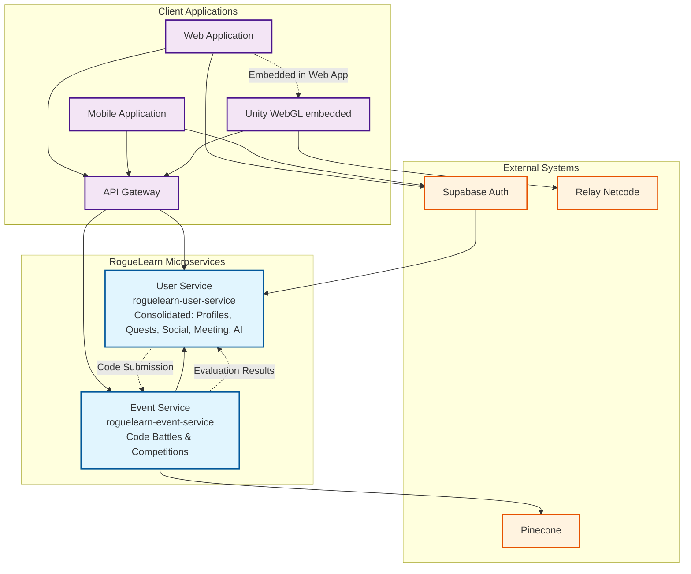

# RogueLearn Services Ecosystem

## Service Architecture Overview



## Service Responsibilities & Boundaries

### **User Service** (`roguelearn-user-service`)
**Primary Domain**: Consolidated Business Logic - Identity, Academic, Quests, Social, Meeting, AI Integration

**Core Responsibilities**:
- User authentication integration with Supabase Auth
- User profile and role management
- Academic structure (Classes, Curriculum Programs, Student Enrollments)
- Quest and quest line management with skill trees
- User progress monitoring and analytics
- Game session management and experience tracking
- Achievement system and user achievement tracking
- Party system for small group collaboration
- Guild system for larger community organization
- Meeting management, scheduling, and analytics
- Notes system for learning context and collaboration
- AI-assisted quest generation and secure Gemini API integration
- Real-time features via SignalR (duels, meetings, social interactions)

**Key Entities**: `UserProfiles`, `Roles`, `Classes`, `CurriculumPrograms`, `StudentEnrollments`, `QuestLines`, `Quests`, `SkillTrees`, `Skills`, `UserSkill`, `GameSessions`, `Notes`, `Parties`, `PartyMemberships`, `Guilds`, `GuildMemberships`, `Meetings`, `MeetingParticipants`, `Achievements`, `UserAchievements`

**External Dependencies**: 
- Supabase Auth for authentication
- Gemini API for AI-powered features (via internal AI proxy)
- Event Service for code evaluation

---

### **Event Service** (`roguelearn-event-service`)
**Primary Domain**: Code Execution, Competition Management

**Core Responsibilities**:
- Code problem management and storage
- Real-time competitive coding battles
- Code compilation and execution
- Submission tracking and evaluation
- Programming language support management

**Key Entities**: `CodeProblems`, `Submissions`, `Languages`, `Rooms`, `RoomPlayers`, `TestCases`

**Service Dependencies**:
- User Service: User profiles
- Social Service: Event context for competitions

**External Dependencies**:
- Pinecone: Vector embeddings for problem similarity

---

## Data Flow Patterns

### **Authentication & User Context Flow**
```
Supabase Auth → User Service → Event Service
```
- Centralized authentication through Supabase Auth
- User Service maintains consolidated business logic and provides context to Event Service
- All services reference users through `AuthUserId` from Supabase Auth

### **Code Evaluation Flow**
```
User Service → Event Service (Code Submission)
Event Service → User Service (Evaluation Results)
```
- User Service publishes code submissions to Event Service
- Event Service returns evaluation results and updates achievements

## Integration Architecture

### **API Gateway Pattern**
- Centralized API Gateway routes requests to appropriate services
- Handles authentication, rate limiting, and request routing
- Provides unified API interface for client applications

### **Event-Driven Communication**
- Services communicate through Azure Service Bus for loose coupling
- Code submission, evaluation results, and achievement triggers flow through events
- Ensures eventual consistency across service boundaries

### **Consolidated Data Access**
- User Service uses direct database access for all consolidated business logic
- Event Service maintains isolated database for specialized code execution
- Cross-service references handled via API calls with soft references

### **External System Integration**
- **Supabase Auth**: Centralized authentication and user management
- **Pinecone**: Vector database for AI-powered features in Event Service
- **Gemini API**: AI integration handled securely within User Service

## Scalability & Performance Considerations

### **Service Consolidation Benefits**
- Reduced inter-service communication overhead
- Simplified transaction management within User Service
- Efficient data access patterns for related business operations

### **Specialized Service Isolation**
- Event Service handles compute-intensive code execution operations
- Isolated database ensures performance isolation for code evaluation
- Independent scaling based on code submission volume

### **Caching Strategy**
- User context consolidated within single service reduces caching complexity
- Event Service caches frequently accessed code problems and test cases
- API Gateway level caching for cross-service communication

This consolidated ecosystem design provides a streamlined, maintainable architecture for the RogueLearn platform, with clear separation between core business logic and specialized code execution functionality.