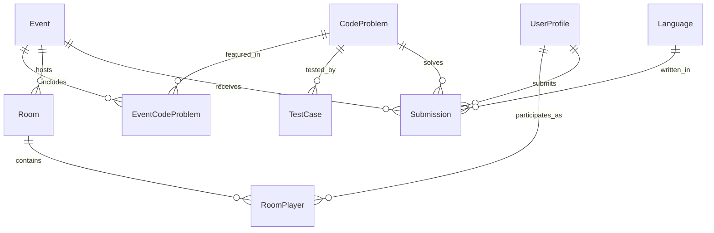

# Code Battle Service ERD

## Entity Relationship Diagram

## Key Features

### Problem Management
- **CodeProblems**: Core problem definitions with statements
- **EventCodeProblems**: Association between events and available problems
- **TestCases**: Input/output test cases with performance constraints
- **Problem Templates**: Stored in ChromaDB for vector similarity matching

### Language Support
- **Languages**: Supported programming languages with execution configurations
- **Compilation**: Flexible compile command configuration per language
- **Execution**: Runtime command and timeout management
- **Extensibility**: Easy addition of new programming languages

### Real-Time Battle System
- **Rooms**: Battle rooms within events for competitive coding
- **RoomPlayers**: Player participation with scoring and state tracking
- **Live Competition**: Real-time player state and disconnection handling
- **Ranking System**: Dynamic scoring and placement calculation

### Advanced Submission System
- **Submissions**: Comprehensive submission tracking with detailed execution results
- **Judge Integration**: External judge service integration (Judge0 compatible)
- **Performance Metrics**: Detailed time, memory, and resource usage tracking
- **Resource Limits**: Configurable execution constraints per submission

### Execution Pipeline
1. **Submission**: User submits code for a problem in a specific language
2. **Queuing**: Submission enters queue with unique token for tracking
3. **Compilation**: Code compiled using language-specific commands
4. **Execution**: Code executed against test cases with resource limits
5. **Scoring**: Results evaluated and performance metrics recorded
6. **Callback**: Results returned via callback URL for real-time updates

### ChromaDB Integration
- **code_embeddings**: Vector embeddings of code submissions for similarity analysis
- **problem_embeddings**: Vector embeddings of problem statements for matching
- **solution_patterns**: Common solution pattern embeddings for automated scoring

### Business Rules
- Submissions are immutable once created (audit trail)
- Language deletion is restricted if submissions exist
- Test cases define problem correctness criteria
- Room players can disconnect and reconnect during battles
- Execution hosts are tracked for performance monitoring
- Resource limits prevent system abuse and ensure fair competition

### Performance Considerations
- Unique token indexing for fast judge callback lookups
- Composite indexing on user-event submissions for leaderboards
- Separate execution tracking for system monitoring
- Asynchronous processing pipeline for scalability