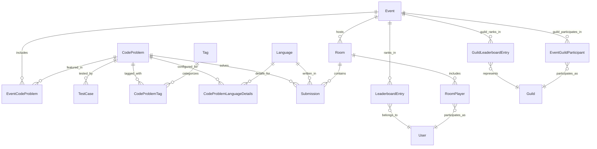

# Code Battle Service ERD

## Entity Relationship Diagram

## Key Features

### Problem Management
- **CodeProblems**: Core problem definitions with statements and difficulty levels
- **EventCodeProblems**: Association between events and available problems
- **TestCases**: Input/output test cases with performance constraints per language
- **Tags**: Categorization system for problems (algorithms, data structures, etc.)
- **CodeProblemTags**: Many-to-many relationship between problems and tags
- **CodeProblemLanguageDetails**: Language-specific configurations for problems

### Language Support
- **Languages**: Supported programming languages with execution configurations
- **Compilation**: Flexible compile command configuration per language
- **Execution**: Runtime command and timeout management
- **Extensibility**: Easy addition of new programming languages
- **Language-Specific Details**: Per-problem language configurations and constraints

### Room-Based Competition System
- **Rooms**: Competition environments hosted within events
- **RoomPlayers**: Player participation tracking with scores and states
- **Real-time Battles**: Support for live coding competitions
- **Player Management**: Track player status, scores, and disconnections
- **Room Isolation**: Separate competition spaces within events

### Submission System
- **Submissions**: Code submissions linked to rooms, problems, and languages
- **Room Integration**: All submissions must be associated with a room
- **Execution Tracking**: Monitor execution time and submission status
- **Multi-Language Support**: Support for various programming languages per submission

### Leaderboard System
- **LeaderboardEntries**: Individual user rankings and scores for events
- **GuildLeaderboardEntries**: Guild-based rankings and total scores
- **Event-Based**: Rankings tied to specific events with snapshot dates
- **Score Tracking**: Numerical scoring system with rank calculation
- **Guild Competition**: Support for team-based competitions and rankings
- **Temporal Tracking**: Snapshot dates for historical leaderboard analysis

### Guild Participation
- **EventGuildParticipants**: Track guild participation in events
- **Guild Competition**: Enable team-based coding competitions
- **Participation Tracking**: Monitor when guilds join events
- **Team Dynamics**: Support for collaborative coding challenges

### Execution Pipeline
1. **Room Creation**: Event hosts create competition rooms
2. **Player Registration**: Users join rooms as participants
3. **Submission**: Players submit code for problems within rooms
4. **Validation**: Code validated against problem constraints and test cases
5. **Execution**: Code executed with language-specific limits and timing
6. **Scoring**: Results evaluated and room/event leaderboards updated
7. **Guild Ranking**: Guild scores calculated from member performances
8. **Feedback**: Results returned with performance metrics and rankings

### Qdrant Integration
- **code_embeddings**: Vector embeddings of code submissions for similarity analysis
- **problem_embeddings**: Vector embeddings of problem statements for matching
- **solution_patterns**: Common solution pattern embeddings for automated scoring

### Business Rules
- Submissions are immutable once created (audit trail)
- Language deletion is restricted if submissions exist
- Test cases define problem correctness criteria with language-specific constraints
- Problems can be tagged for better categorization and discovery
- Language-specific details allow fine-tuned problem configurations
- Leaderboard entries track user performance across events

### Performance Considerations
- Indexed relationships for fast problem discovery by tags
- Language-specific indexing for optimized test case retrieval
- User-based indexing for quick submission history access
- Event-based leaderboard indexing for competition rankings
- Simplified schema reduces join complexity and improves query performance