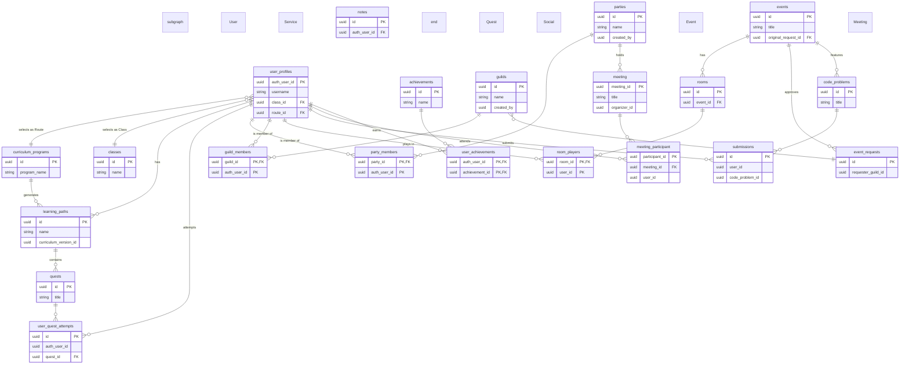

# RogueLearn System Overview ERD

## Entity Relationship Diagram

## System Architecture Overview

### Service Boundaries & Responsibilities

#### **User Service** (`roguelearn-user-service`)
- **Primary Responsibility**: User identity, profiles, roles, academic structure, and achievement tracking. Owns the "Arsenal" of notes.
- **Key Entities**: `user_profiles`, `roles`, `classes`, `curriculum_programs`, `student_enrollments`, `achievements`, `notes`.

#### **Quests Service** (`roguelearn-quests-service`)
- **Primary Responsibility**: Learning content, gamification, and progress tracking. Transforms academic blueprints into playable content.
- **Key Entities**: `learning_paths`, `quests`, `quest_steps`, `user_quest_attempts`.

#### **Social Service** (`roguelearn-social-service`)
- **Primary Responsibility**: Community features (Parties, Guilds, Friends).
- **Key Entities**: `parties`, `guilds`, `party_members`, `guild_members`, `friendships`.

#### **Event Service** (`roguelearn-event-service`)
- **Primary Responsibility**: Creation, management, and execution of all competitive and social events. Owns the code problem catalog and submission engine.
- **Key Entities**: `events`, `event_requests`, `rooms`, `code_problems`, `submissions`, `leaderboard_entries`.

#### **Meeting Service** (`roguelearn-meeting-service`)
- **Primary Responsibility**: Real-time collaborative meetings for Parties and Guilds.
- **Key Entities**: `meeting`, `meeting_participant`.

### Data Flow & Relationships (Soft References)
-   All services reference `user_profiles` in the **User Service** via `auth_user_id` for user context.
-   The **Social Service** (`guilds`) is referenced by the **Event Service** (`event_requests`) when a Guild Master requests an event.
-   The **Event Service** (`code_problems`) provides the catalog of challenges for code battle events.
-   The **User Service** (`notes`) are referenced by the **Social Service** (`party_stash_items`) for collaborative sharing.
-   The **Quest Service** (`quests`) are referenced by the **User Service** (`note_quests`) to link notes to specific learning objectives.