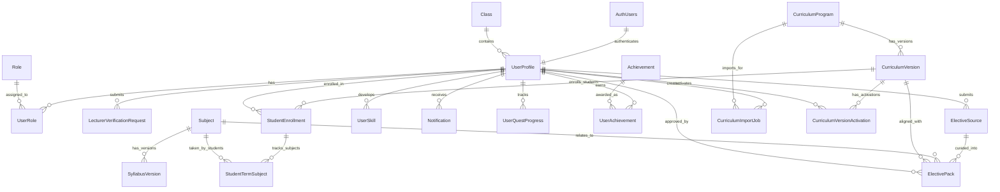

# User Service ERD

## Entity Relationship Diagram

## Key Features

### Core User Management
- **UserProfiles**: Central user data linked to Supabase Auth
- **Roles & UserRoles**: Role-based access control (RBAC)
- **LecturerVerificationRequests**: Lecturer verification workflow

### Academic Structure

#### Enhanced Curriculum Management (Current)
- **CurriculumPrograms**: Abstract program definitions (e.g., "B.S. in Software Engineering")
- **CurriculumVersions**: Versioned curriculum snapshots (e.g., "K18A", "K18B")
- **Subjects**: Master list of all subjects with codes and credits
- **StudentEnrollments**: Links students to specific curriculum versions
- **StudentTermSubjects**: Tracks actual subject enrollment per academic term
- **SyllabusVersions**: Versioned syllabus for each subject

### Student Progress Tracking
- **StudentTermSubjects**: Comprehensive tracking of student academic journey
  - Handles retakes, failures, and deviations from prescribed curriculum
  - Tracks status: 'Enrolled', 'Completed', 'Failed', 'Withdrawn'
  - Supports flexible academic term definitions

### User Progression
- **UserSkills**: User skill progression tracking
- **UserQuestProgress**: Summary of user progress on quests for quick reference
- **Achievements**: Central catalog of all possible achievements
- **UserAchievements**: Links users to earned achievements with context
- **Notifications**: User notification system

### Data Integrity
- All user-related data cascades on user deletion
- Role deletions are restricted to prevent orphaned assignments
- Unique constraints on usernames and emails
- Foreign key relationships maintain referential integrity
- Enhanced curriculum structure supports versioning and academic flexibility

### Admin-Owned Educational Governance
- **ElectiveSource**: Faculty/community submissions proposed for elective content library
- **ElectivePack**: Versioned elective collections aligned to subjects or curriculum versions
- **CurriculumImportJob**: Administrative job to import curriculum catalogs (file/API) per program
- **CurriculumVersionActivation**: Scheduled activation records with audit for curriculum version changes