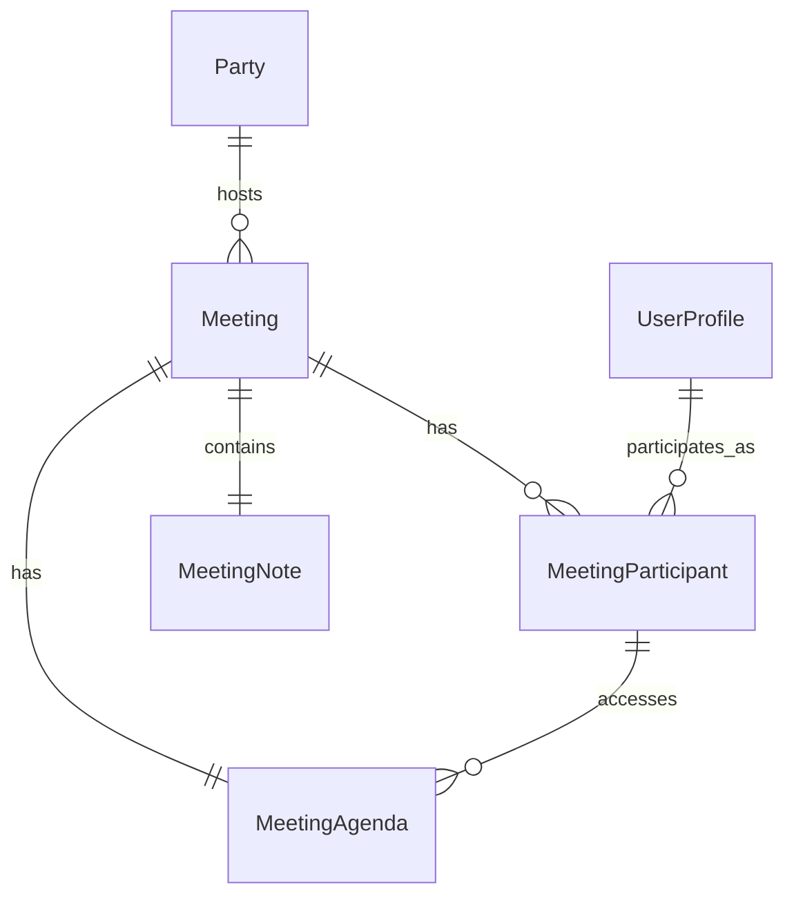

# Meeting Service ERD

## Entity Relationship Diagram

## Key Features

### Meeting Management
- **Meetings**: Core meeting entities linked to parties
- **Scheduling**: Start and end time management with timezone support
- **Status Tracking**: Meeting lifecycle management (Scheduled, InProgress, Completed, Cancelled)
- **Party Integration**: Meetings are organized within party contexts

### Participant Management
- **MeetingParticipants**: Invitation and attendance tracking
- **Participant Status**: Comprehensive status tracking (Invited, Accepted, Declined, Attended)
- **RSVP System**: Participants can respond to meeting invitations
- **Attendance Tracking**: Record actual meeting attendance

### Agenda System
- **MeetingAgenda**: Structured meeting agenda items
- **Sequencing**: Ordered agenda items for meeting flow
- **Presenter Assignment**: Designated presenters for agenda items
- **Time Management**: Duration estimates for agenda planning

### Note-Taking System
- **MeetingNotes**: Collaborative note-taking during meetings
- **Agenda Linking**: Notes can be linked to specific agenda items
- **Rich Content**: JSONB content support for formatted notes
- **Version Control**: Created and updated timestamps for note history

### Meeting Workflow
1. **Planning**: Party members create meetings with agendas
2. **Invitation**: Participants are invited and can RSVP
3. **Execution**: Meetings progress through agenda items
4. **Documentation**: Notes are taken and linked to agenda items
5. **Follow-up**: Meeting status updated and notes preserved

### Business Rules
- Only party members can create meetings for their parties
- Meeting creators can manage agendas and participants
- Participants must be party members
- Notes can be created by any meeting participant
- Agenda items are sequenced for structured meeting flow
- Meeting status reflects current lifecycle stage

### Integration Points
- **Social Service**: Meetings are organized within party contexts
- **User Service**: All participants and creators are validated users
- **Notification System**: Meeting invitations and updates trigger notifications