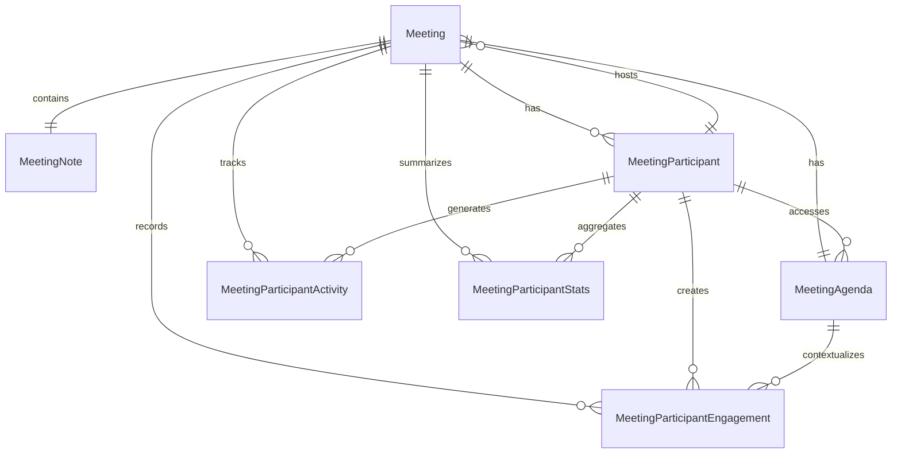

# Meeting Service ERD

## Entity Relationship Diagram

## Key Features

### Meeting Management
- **Meetings**: Core meeting entities that can be created in multiple contexts (parties or guilds)
- **Context Flexibility**: Meetings support both party and guild contexts through generic ContextId and ContextType fields
- **Scheduling**: Start and end time management with timezone support
- **Status Tracking**: Meeting lifecycle management (Scheduled, InProgress, Completed, Cancelled)
- **Multi-Context Integration**: Meetings can be organized within both party and guild contexts

### Participant Management
- **MeetingParticipants**: Invitation and attendance tracking
- **Participant Status**: Comprehensive status tracking (Invited, Accepted, Declined, Attended)
- **RSVP System**: Participants can respond to meeting invitations
- **Attendance Tracking**: Record actual meeting attendance
- **Activity Monitoring**: Detailed check-in/check-out time tracking with device and connection information
- **Engagement Analytics**: Real-time tracking of participant interactions and contributions
- **Performance Statistics**: Aggregated metrics for participant engagement and meeting effectiveness

### Agenda System
- **MeetingAgenda**: Structured meeting agenda items
- **Sequencing**: Ordered agenda items for meeting flow
- **Presenter Assignment**: Designated presenters for agenda items
- **Time Management**: Duration estimates for agenda planning

### Note-Taking System
- **MeetingNotes**: Collaborative note-taking during meetings
- **Agenda Linking**: Notes can be linked to specific agenda items
- **Rich Content**: JSONB content support for formatted notes
- **Version Control**: Created and updated timestamps for note history

### Meeting Workflow
1. **Planning**: Party members create meetings with agendas
2. **Invitation**: Participants are invited and can RSVP
3. **Execution**: Meetings progress through agenda items with real-time activity tracking
4. **Monitoring**: Participant check-in/check-out times and engagement metrics are recorded
5. **Documentation**: Notes are taken and linked to agenda items
6. **Analytics**: Meeting statistics and participant performance data are aggregated
7. **Follow-up**: Meeting status updated and comprehensive activity reports are available

### Business Rules
- Party members can create meetings for their parties, guild members can create meetings for their guilds
- Meeting creators can manage agendas and participants
- Participants must be members of the respective party or guild context
- Notes can be created by any meeting participant
- Agenda items are sequenced for structured meeting flow
- Meeting status reflects current lifecycle stage
- Activity tracking is automatically enabled for all meetings
- Engagement metrics are calculated in real-time during meetings
- Participant statistics are aggregated and updated continuously
- Check-in/check-out times are recorded with timezone accuracy

### Integration Points
- **Social Service**: Meetings can be organized within both party and guild contexts
- **User Service**: All participants and creators are validated users
- **Notification System**: Meeting invitations and updates trigger notifications