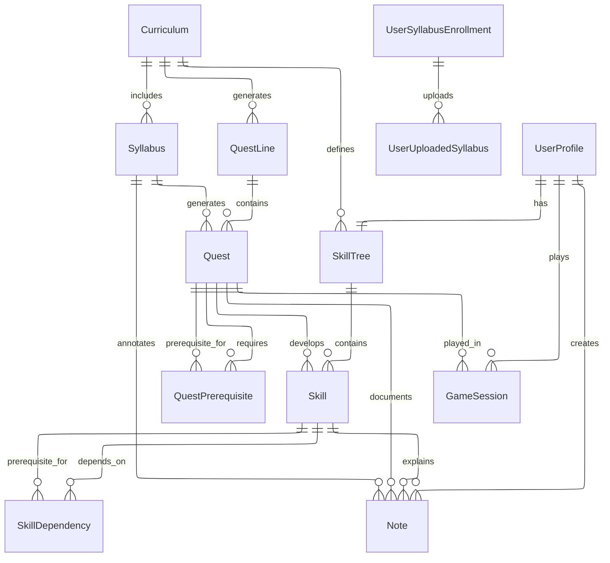

# Quests Service ERD

## Entity Relationship Diagram

## Key Features

### Syllabus Management
- **Syllabuses**: Course syllabi linked to curriculums
- **UserUploadedSyllabuses**: User-uploaded syllabus files with processing status
- **Processing Pipeline**: Handles syllabus file processing and structured content extraction

### Quest System
- **QuestLines**: Quest containers organized by syllabus
- **Quests**: Individual quest definitions with types (Main, Side, Daily, Assignment, Exam, BossFight)
- **QuestPrerequisites**: Quest dependency management for progression control

### Skill System
- **SkillTrees**: Skill tree structures per curriculum
- **Skills**: Individual skill definitions with positioning for UI display
- **SkillDependencies**: Skill prerequisite relationships for progression paths

### Game Mechanics
- **GameSessions**: Active game session tracking with progress data
- **Notes**: User notes system linked to quests, skills, and syllabi

### Data Flow
1. Users upload syllabi → Processing → Structured content extraction
2. Syllabi generate quest lines → Individual quests with dependencies
3. Curriculums define skill trees → Skills with dependencies
4. Users engage with quests through game sessions
5. Progress tracked across quests, skills, and user profiles

### Business Rules
- Quest prerequisites enforce learning progression
- Skill dependencies create structured learning paths
- Game sessions track user engagement and progress
- Notes provide contextual learning support