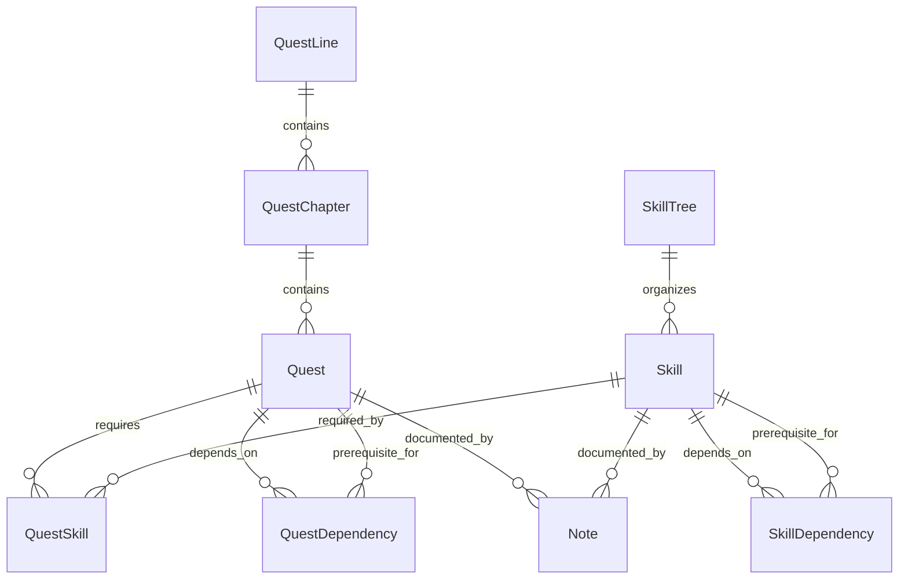

# Quests Service ERD

## Entity Relationship Diagram



## Key Features

### Quest System
- **QuestLines**: Organized sequences of learning objectives for entire academic journeys
- **QuestChapters**: Time-boxed containers representing weeks or major milestones (e.g., "Week 5", "Midterm Prep")
- **Quests**: Individual learning tasks within chapters with rewards and metadata
- **QuestDependencies**: Define prerequisite relationships between quests
- **Quest Types**: Support for different quest formats (Reading, Assignment, Project, etc.)
- **Progress Tracking**: Comprehensive quest completion monitoring at both chapter and individual quest levels

### Skill System
- **SkillTrees**: Organized skill hierarchies for different domains
- **Skills**: Individual competencies with experience requirements
- **SkillDependencies**: Define prerequisite relationships between skills
- **QuestSkill Integration**: Link quests to skill development
- **Progressive Mastery**: Track skill advancement through experience points

### User Progress Tracking
- **UserQuestProgress**: Individual quest completion status and progress
- **UserSkill**: Personal skill development and experience accumulation
- **Achievement Integration**: Connect progress to achievement unlocks
- **Performance Analytics**: Track learning velocity and engagement patterns

### Gamification & Analytics
- **GameSessions**: Track user engagement sessions
- **SessionEvents**: Detailed interaction logging for analytics
- **Experience System**: Reward-based progression mechanics
- **Performance Metrics**: Learning analytics and progress insights

### Content Management
- **Notes**: User-generated content linked to quests and skills
- **Metadata Support**: Flexible content structure through JSONB fields
- **External Integration**: References to User Service entities for context

## Data Flow

### Quest Generation Flow
1. **External Trigger**: Curriculum data from User Service triggers quest generation
2. **Quest Creation**: AI processes academic content to create structured quests
3. **Skill Mapping**: Quests are linked to relevant skills in skill trees
4. **Dependency Setup**: Prerequisites and learning paths are established

### User Progress Flow
1. **Quest Assignment**: Users receive quests based on their curriculum enrollment
2. **Progress Tracking**: Real-time updates as users complete quest objectives
3. **Skill Development**: Quest completion contributes to skill experience
4. **Achievement Unlocks**: Progress milestones trigger achievement rewards

### Analytics Flow
1. **Session Tracking**: User interactions logged as session events
2. **Progress Analysis**: Learning patterns and performance metrics calculated
3. **Adaptive Content**: Quest difficulty and pacing adjusted based on analytics
4. **Reporting**: Progress summaries provided to User Service for academic tracking

## Business Rules

### Quest Management
- Quests can only be completed if all prerequisite quests are finished
- Quest experience rewards are fixed at creation time
- Quest metadata supports flexible content types and assessment criteria
- QuestLines provide thematic organization of related learning objectives

### Skill Development
- Skills require specific experience thresholds for level advancement
- Skill dependencies must be satisfied before skill can be developed
- Multiple quests can contribute to the same skill development
- Skill trees organize related competencies in logical hierarchies

### Progress Integrity
- User progress is immutable once recorded (audit trail preservation)
- Quest completion timestamps ensure chronological learning tracking
- Skill experience accumulation is additive and persistent
- Session data provides detailed interaction history for analytics

## Entity Definitions

### Quest System

#### QuestLine
```sql
QuestLine {
    UUID Id PK
    UUID AuthUserId FK "References UserProfile"
    UUID ClassId FK "References Classes"
    UUID CurriculumVersionId FK "References CurriculumVersions"
    UUID SubjectId FK "References Subjects"
    string Title
    text Description
    timestamp CreatedAt
    timestamp UpdatedAt
}
```

#### QuestChapter
```sql
QuestChapter {
    UUID Id PK
    UUID QuestLineId FK
    string Title "e.g., Semester 3: Week 5, Finals Week"
    int Sequence "1, 2, 3... to order chapters linearly"
    QuestStatus Status "Not Started, In Progress, Completed"
    date StartDate
    date EndDate
    timestamp CreatedAt
    timestamp UpdatedAt
}
```

#### Quest
```sql
Quest {
    UUID Id PK
    UUID QuestChapterId FK
    UUID SyllabusId FK "References Syllabuses"
    UUID SubjectId FK "References Subjects"
    string Title
    text Description
    QuestType Type
    QuestStatus Status
    timestamp DueDate
    int ExperiencePoints
    timestamp CreatedAt
    timestamp UpdatedAt
}
```

#### QuestDependency
```sql
QuestDependency {
    UUID QuestId FK
    UUID PrerequisiteQuestId FK
}
```

### Skill System

#### SkillTree
```sql
SkillTree {
    UUID Id PK
    string Name
    text Description
    UUID CreatedBy FK "References UserProfile"
    timestamp CreatedAt
    timestamp UpdatedAt
}
```

#### Skill
```sql
Skill {
    UUID Id PK
    UUID SkillTreeId FK
    string Name
    text Description
    SkillLevel Level
    int ExperienceRequired
    timestamp CreatedAt
    timestamp UpdatedAt
}
```

#### SkillDependency
```sql
SkillDependency {
    UUID SkillId FK
    UUID PrerequisiteSkillId FK
}
```

#### QuestSkill
```sql
QuestSkill {
    UUID QuestId FK
    UUID SkillId FK
    int ExperienceGained
}
```

### User Progress (External References)

#### UserQuestProgress
```sql
UserQuestProgress {
    UUID Id PK
    UUID UserProfileId FK "External: User Service"
    UUID QuestId FK
    QuestStatus Status
    int ProgressPercentage
    timestamp StartedAt
    timestamp CompletedAt
    timestamp UpdatedAt
}
```

#### UserSkill
```sql
UserSkill {
    UUID Id PK
    UUID UserProfileId FK "External: User Service"
    UUID SkillId FK
    int CurrentExperience
    SkillLevel CurrentLevel
    timestamp FirstAcquiredAt
    timestamp LastUpdatedAt
}
```

### Game Sessions & Analytics

#### GameSession
```sql
GameSession {
    UUID Id PK
    UUID UserProfileId FK "External: User Service"
    timestamp StartTime
    timestamp EndTime
    int TotalExperienceGained
    jsonb SessionMetadata
}
```

#### SessionEvent
```sql
SessionEvent {
    UUID Id PK
    UUID GameSessionId FK
    string EventType
    jsonb EventData
    timestamp EventTime
}
```

### Notes System

#### Note
```sql
Note {
    UUID Id PK
    UUID UserProfileId FK "External: User Service"
    string Title
    text Content
    UUID QuestId FK "Optional"
    UUID SkillId FK "Optional"
    timestamp CreatedAt
    timestamp UpdatedAt
}
```

## Service Boundaries

### Quests Service Responsibilities
- **Quest Management**: Creation, organization, and lifecycle management of learning quests
- **Skill System**: Skill trees, dependencies, and progression tracking
- **Progress Tracking**: User quest completion and skill development monitoring
- **Gamification**: Game sessions, experience points, and engagement analytics
- **Content Support**: Notes and metadata management for learning context

### External Dependencies
- **User Service**: Provides user profiles, curriculum enrollment data, and academic structure
- **AI Service**: Assists with quest generation and content analysis
- **Achievement System**: Integrates with User Service for reward management

### Data Ownership
- **Owned by Quests Service**: Quests, Skills, GameSessions, Notes, Progress tracking
- **Referenced from User Service**: UserProfiles, Curriculum data, Student enrollments
- **Shared Responsibility**: Achievement triggers and progress summaries
