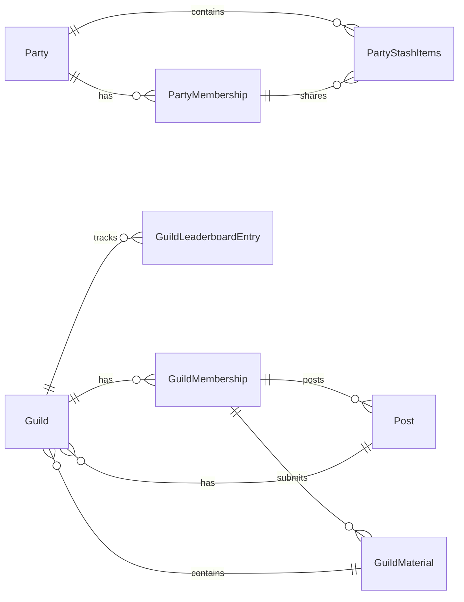

# Social Service ERD

## Entity Relationship Diagram

## Key Features

### Party System

- **Parties**: Group formations with configurable join types
- **PartyMemberships**: Membership tracking with join timestamps
- **PartyStashItems**: Shared note repository for party collaboration
- **Leadership**: Party leaders have special privileges and responsibilities
- **Join Types**: Support for "Invite Only" and "Open" party configurations
- **Knowledge Sharing**: Party members can share notes to the party stash for collaborative learning

### Guild System

- **Guilds**: Larger community organizations with verification status
- **GuildMemberships**: Guild membership tracking
- **Guild Masters**: Guild leadership with administrative privileges
- **Verification**: Verified guilds have enhanced features and credibility

### Event Management

- **Events**: Competitive events organized by guilds
- **Event Types**: Support for Quiz, CodeBattle, Tournament, and Duel events
- **Scheduling**: Start and end date management for events
- **Guild Association**: Events are organized and hosted by guilds

### Leaderboard System

- **LeaderboardEntries**: Individual user rankings per event
- **GuildLeaderboardEntries**: Guild-based competitive rankings
- **Snapshot System**: Historical leaderboard data with date tracking
- **Scoring**: Flexible scoring system supporting various competition formats

### Social Dynamics

- **Hierarchical Structure**: Users → Parties → Guilds → Events
- **Competition Framework**: Individual and guild-based competitions
- **Community Building**: Social features to encourage engagement
- **Achievement Tracking**: Performance tracking across events and time

### Business Rules

- Party leaders cannot leave their parties (must transfer leadership first)
- Only party members can share notes to the party stash
- Party stash items are duplicates of original user notes, maintaining independence
- Shared notes in party stash remain accessible even if original note is deleted
- Guild masters have administrative control over guild events
- Leaderboard entries are immutable snapshots for historical integrity
- Events can be guild-specific or open competitions
- Verification status affects guild privileges and event hosting capabilities
