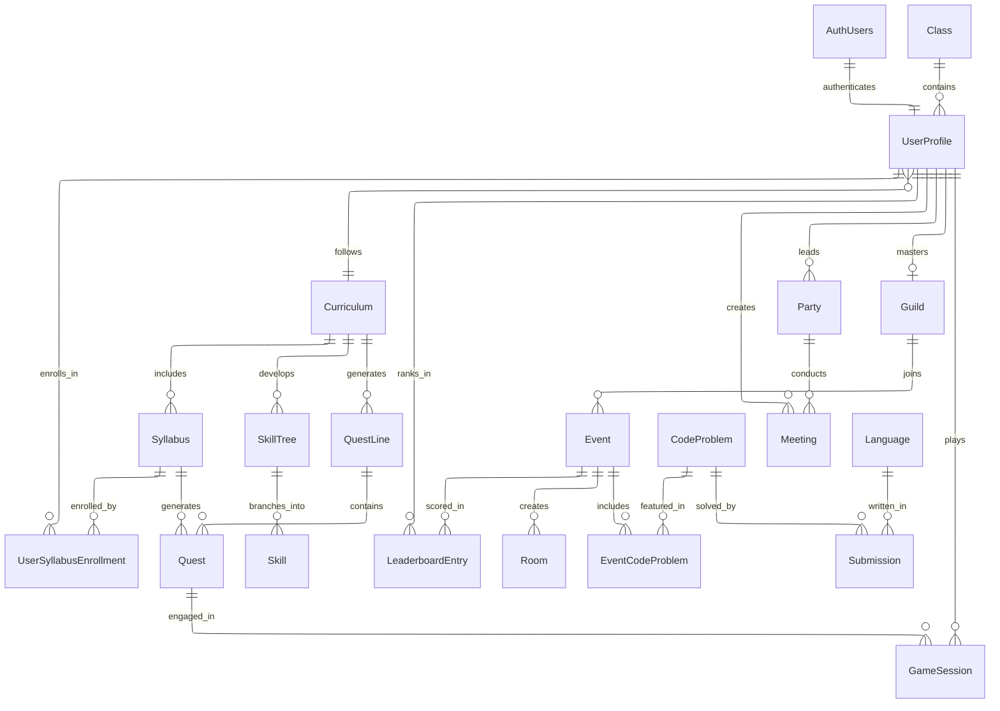

# RogueLearn System Overview ERD

## Entity Relationship Diagram

## System Architecture Overview

### Service Boundaries & Responsibilities

#### **User Service** (`roguelearn-user-service`)
- **Primary Responsibility**: User identity, profiles, roles, and academic structure
- **Key Entities**: UserProfiles, Roles, Classes, Curriculums, UserSyllabusEnrollments
- **External Integration**: Supabase Auth for authentication
- **Cross-Service Impact**: Provides user context to all other services

#### **Quests Service** (`roguelearn-quests-service`)
- **Primary Responsibility**: Learning content, gamification, and progress tracking
- **Key Entities**: Syllabuses, Quests, Skills, GameSessions
- **Dependencies**: User Service (UserProfiles), Academic structure (Curriculums)
- **Cross-Service Impact**: Drives user engagement and learning progression

#### **Social Service** (`roguelearn-social-service`)
- **Primary Responsibility**: Community features, events, and competition
- **Key Entities**: Parties, Guilds, Events, LeaderboardEntries
- **Dependencies**: User Service (UserProfiles)
- **Cross-Service Impact**: Enables collaborative learning and competition

#### **Meeting Service** (`roguelearn-meeting-service`)
- **Primary Responsibility**: Party collaboration and meeting management
- **Key Entities**: Meetings, MeetingParticipants, MeetingAgenda, MeetingNotes
- **Dependencies**: Social Service (Parties), User Service (UserProfiles)
- **Cross-Service Impact**: Facilitates team collaboration and study groups

#### **Code Battle Service** (`roguelearn-code-battle-service`)
- **Primary Responsibility**: Code compilation, execution, and competitive programming
- **Key Entities**: CodeProblems, Submissions, Languages, Rooms
- **Dependencies**: Social Service (Events), User Service (UserProfiles)
- **External Integration**: ChromaDB for vector embeddings, Judge0 for code execution

### Data Flow Patterns

#### **User Journey Flow**
1. **Authentication**: Supabase Auth → User Service (UserProfiles)
2. **Onboarding**: User Service → Academic assignment (Classes, Curriculums)
3. **Learning**: Quests Service → Content delivery and progress tracking
4. **Social**: Social Service → Community engagement and events
5. **Collaboration**: Meeting Service → Team study sessions
6. **Competition**: Code Battle Service → Competitive programming challenges

#### **Cross-Service Data Dependencies**
- **UserProfiles**: Referenced by all services for user context
- **Events**: Bridge between Social Service and Code Battle Service
- **Curriculums**: Shared between User Service and Quests Service
- **Parties**: Bridge between Social Service and Meeting Service

### Scalability Considerations

#### **Service Independence**
- Each service manages its own primary data
- Cross-service references use UUIDs for loose coupling
- Services can scale independently based on usage patterns

#### **Data Consistency**
- Foreign key relationships maintain referential integrity
- Cascade deletes ensure data cleanup
- Event-driven synchronization for cross-service updates

#### **Performance Optimization**
- Indexed foreign keys for cross-service queries
- Read replicas for analytics and reporting
- Caching layers for frequently accessed user data

### Integration Points

#### **External Systems**
- **Supabase Auth**: User authentication and session management
- **ChromaDB**: Vector embeddings for code similarity and problem matching
- **Judge0**: Code compilation and execution service

#### **Internal APIs**
- RESTful APIs for synchronous operations
- Event streaming for asynchronous updates
- GraphQL federation for unified data access

This system design enables a comprehensive gamified learning platform with strong separation of concerns, scalable architecture, and rich feature integration across all learning aspects.