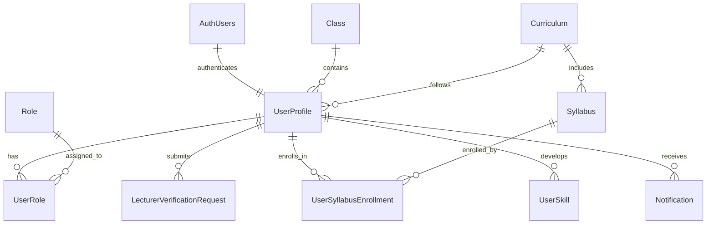

# User Service ERD

## Entity Relationship Diagram

## Key Features

### Core User Management
- **UserProfiles**: Central user data linked to Supabase Auth
- **Roles & UserRoles**: Role-based access control (RBAC)
- **LecturerVerificationRequests**: Lecturer verification workflow

### Academic Structure
- **Classes**: Academic class definitions
- **Curriculums**: Curriculum definitions
- **Syllabuses**: Course syllabi linked to curriculums
- **UserSyllabusEnrollments**: User enrollment tracking

### User Progression
- **UserSkills**: User skill progression tracking
- **Notifications**: User notification system

### Data Integrity
- All user-related data cascades on user deletion
- Role deletions are restricted to prevent orphaned assignments
- Unique constraints on usernames and emails
- Foreign key relationships maintain referential integrity