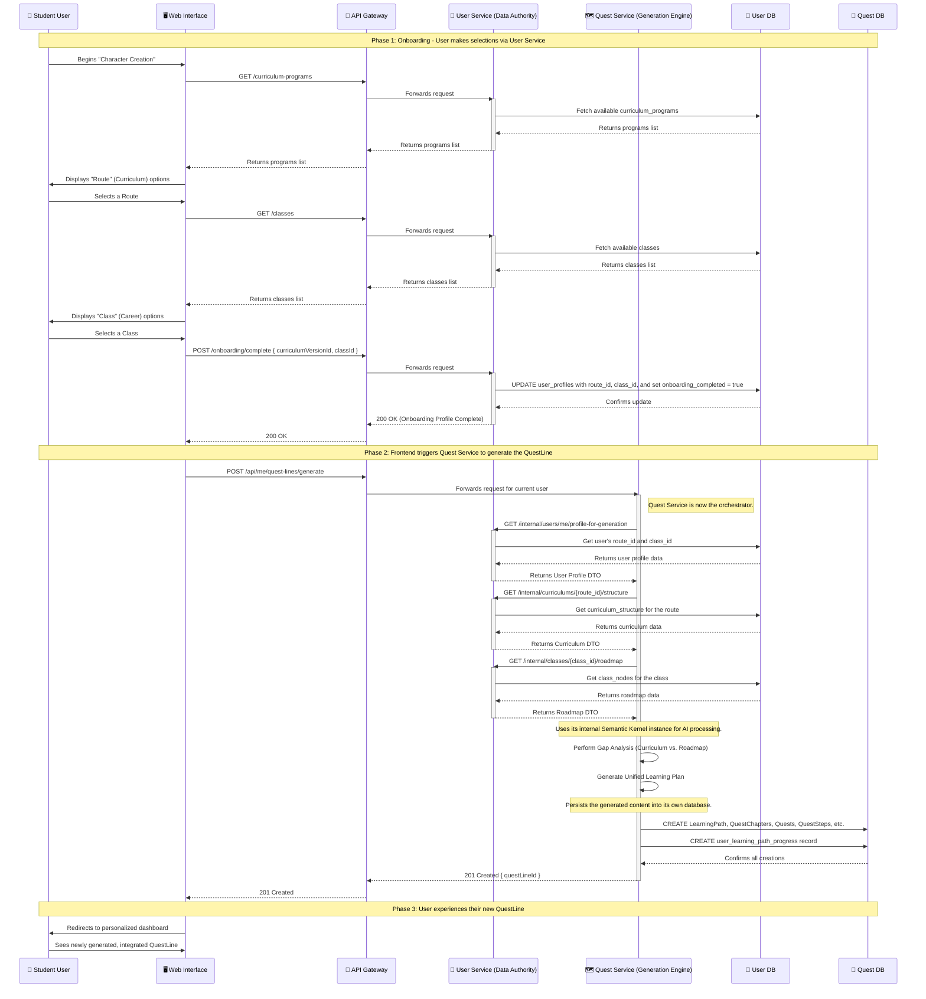

# Student Onboarding & Quest Generation Flow (Corrected)

## Overview
This corrected diagram shows the definitive flow. The User Service manages the user's profile and academic/career choices. The Quest Service is the engine responsible for orchestrating the AI-driven generation of the personalized questline by fetching the necessary data from the User Service.

## Sequence Diagram
