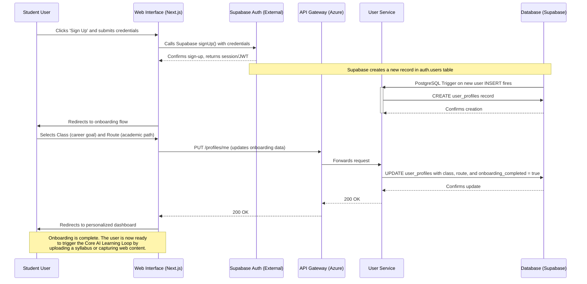

# Student Onboarding & Character Creation Flow

```mermaid
sequenceDiagram
    participant U as Student User
    participant UI as Web Interface (Next.js)
    participant SupabaseAuth as Supabase Auth (External)
    participant APIGateway as API Gateway (Azure)
    participant UserService as User Service
    participant Database as Database (Supabase)

    %% Step 1: User Registration via Supabase SDK %%
    U->>UI: Clicks 'Sign Up' and submits credentials
    UI->>SupabaseAuth: Calls Supabase signUp() with credentials
    SupabaseAuth-->>UI: Confirms sign-up, returns session/JWT

    %% Step 2: Backend Profile Creation via DB Trigger %%
    Note over SupabaseAuth, Database: Supabase creates a new record in auth.users table
    Database->>UserService: PostgreSQL Trigger on new user INSERT fires
    activate UserService
    UserService->>Database: CREATE user_profiles record
    Database-->>UserService: Confirms creation
    deactivate UserService
    
    %% Step 3: User is redirected to complete the onboarding wizard %%
    UI->>U: Redirects to onboarding flow
    U->>UI: Selects Class (career goal) and Route (academic path)
    UI->>APIGateway: PUT /profiles/me (updates onboarding data)
    APIGateway->>UserService: Forwards request
    UserService->>Database: UPDATE user_profiles with class, route, and onboarding_completed = true
    Database-->>UserService: Confirms update
    UserService-->>APIGateway: 200 OK
    APIGateway-->>UI: 200 OK

    %% Step 4: User lands on the dashboard %%
    UI->>U: Redirects to personalized dashboard
    Note over U, UI: Onboarding is complete. The user is now ready<br/>to trigger the Core AI Learning Loop by<br/>uploading a syllabus or capturing web content.
```