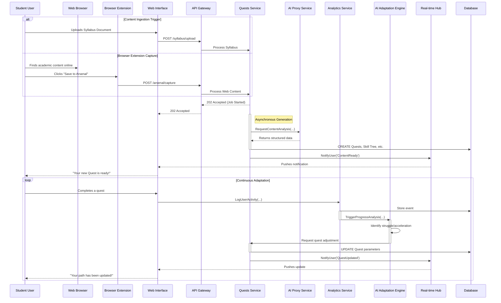

# The Core AI Learning Loop: Ingestion, Generation & Adaptation

```mermaid
sequenceDiagram
    participant U as Student User
    participant Browser as Web Browser
    participant Extension as Browser Extension
    participant UI as Web Interface
    participant APIGateway as API Gateway
    participant QuestsService as Quests Service
    participant AIProxyService as AI Proxy Service
    participant AnalyticsService as Analytics Service
    participant AI_Engine as AI Adaptation Engine
    participant RealtimeHub as Real-time Hub
    participant Database as Database

    alt Content Ingestion Trigger
        U->>UI: Uploads Syllabus Document
        UI->>APIGateway: POST /syllabus/upload
        APIGateway->>QuestsService: Process Syllabus
    else Browser Extension Capture
        U->>Browser: Finds academic content online
        U->>Extension: Clicks "Save to Arsenal"
        Extension->>APIGateway: POST /arsenal/capture
        APIGateway->>QuestsService: Process Web Content
    end
    
    QuestsService-->>APIGateway: 202 Accepted (Job Started)
    APIGateway-->>UI: 202 Accepted
    
    activate QuestsService
    Note right of QuestsService: Asynchronous Generation
    QuestsService->>AIProxyService: RequestContentAnalysis(...)
    AIProxyService-->>QuestsService: Returns structured data
    QuestsService->>Database: CREATE Quests, Skill Tree, etc.
    deactivate QuestsService
    
    QuestsService->>RealtimeHub: NotifyUser('ContentReady')
    RealtimeHub-->>UI: Pushes notification
    UI-->>U: "Your new Quest is ready!"

    %% --- Continuous Adaptation Loop Begins After User Interaction ---

    loop Continuous Adaptation
        U->>UI: Completes a quest
        UI->>AnalyticsService: LogUserActivity(...)
        AnalyticsService->>Database: Store event

        activate AnalyticsService
        AnalyticsService->>AI_Engine: TriggerProgressAnalysis(...)
        deactivate AnalyticsService
        
        activate AI_Engine
        AI_Engine->>AI_Engine: Identify struggle/acceleration
        AI_Engine->>QuestsService: Request quest adjustment
        deactivate AI_Engine

        activate QuestsService
        QuestsService->>Database: UPDATE Quest parameters
        deactivate QuestsService
        
        QuestsService->>RealtimeHub: NotifyUser('QuestUpdated')
        RealtimeHub-->>UI: Pushes update
        UI-->>U: "Your path has been updated!"
    end
```
