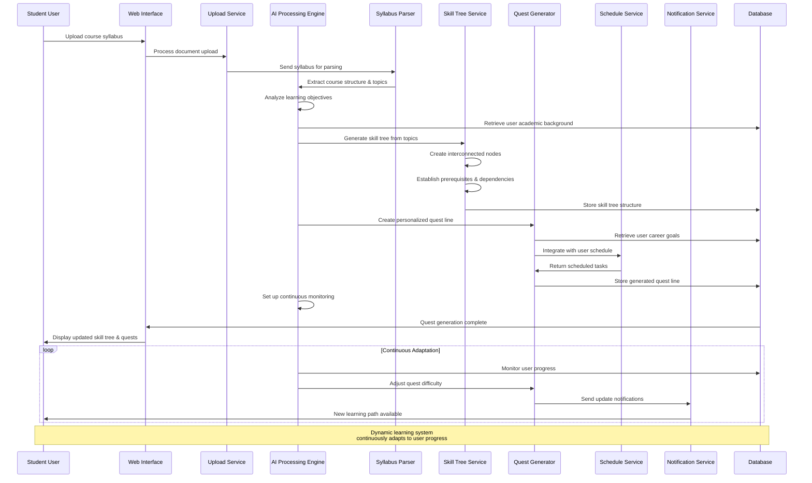

# AI-Powered Quest Generation & Learning Path Creation Flow

```mermaid
sequenceDiagram
    participant U as Student User
    participant UI as Web Interface
    participant Upload as Upload Service
    participant AI as AI Processing Engine
    participant Parser as Syllabus Parser
    participant STree as Skill Tree Service
    participant Quest as Quest Generator
    participant Schedule as Schedule Service
    participant Notify as Notification Service
    participant DB as Database

    U->>UI: Upload course syllabus
    UI->>Upload: Process document upload
    Upload->>Parser: Send syllabus for parsing
    
    Parser->>AI: Extract course structure & topics
    AI->>AI: Analyze learning objectives
    AI->>DB: Retrieve user academic background
    
    AI->>STree: Generate skill tree from topics
    STree->>STree: Create interconnected nodes
    STree->>STree: Establish prerequisites & dependencies
    STree->>DB: Store skill tree structure
    
    AI->>Quest: Create personalized quest line
    Quest->>DB: Retrieve user career goals
    Quest->>Schedule: Integrate with user schedule
    Schedule->>Quest: Return scheduled tasks
    
    Quest->>DB: Store generated quest line
    AI->>AI: Set up continuous monitoring
    
    DB->>UI: Quest generation complete
    UI->>U: Display updated skill tree & quests
    
    loop Continuous Adaptation
        AI->>DB: Monitor user progress
        AI->>Quest: Adjust quest difficulty
        Quest->>Notify: Send update notifications
        Notify->>U: New learning path available
    end
    
    Note over U,DB: Dynamic learning system<br/>continuously adapts to user progress
```