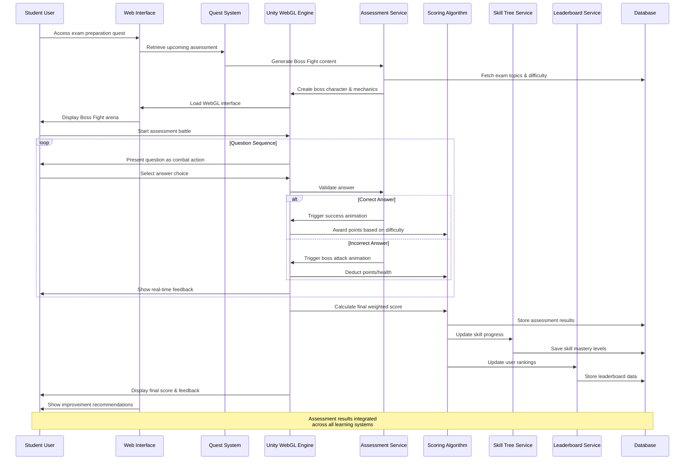

# Gamified Assessment & Boss Fight Experience Flow

```mermaid
sequenceDiagram
    participant U as Student User
    participant UI as Web Interface
    participant Quest as Quest System
    participant Unity as Unity WebGL Engine
    participant Assessment as Assessment Service
    participant Scoring as Scoring Algorithm
    participant STree as Skill Tree Service
    participant Leaderboard as Leaderboard Service
    participant DB as Database

    U->>UI: Access exam preparation quest
    UI->>Quest: Retrieve upcoming assessment
    Quest->>Assessment: Generate Boss Fight content
    
    Assessment->>DB: Fetch exam topics & difficulty
    Assessment->>Unity: Create boss character & mechanics
    Unity->>UI: Load WebGL interface
    
    UI->>U: Display Boss Fight arena
    U->>Unity: Start assessment battle
    
    loop Question Sequence
        Unity->>U: Present question as combat action
        U->>Unity: Select answer choice
        Unity->>Assessment: Validate answer
        
        alt Correct Answer
            Assessment->>Unity: Trigger success animation
            Unity->>Scoring: Award points based on difficulty
        else Incorrect Answer
            Assessment->>Unity: Trigger boss attack animation
            Unity->>Scoring: Deduct points/health
        end
        
        Unity->>U: Show real-time feedback
    end
    
    Unity->>Scoring: Calculate final weighted score
    Scoring->>DB: Store assessment results
    Scoring->>STree: Update skill progress
    STree->>DB: Save skill mastery levels
    
    Scoring->>Leaderboard: Update user rankings
    Leaderboard->>DB: Store leaderboard data
    
    Unity->>U: Display final score & feedback
    UI->>U: Show improvement recommendations
    
    Note over U,DB: Assessment results integrated<br/>across all learning systems
```